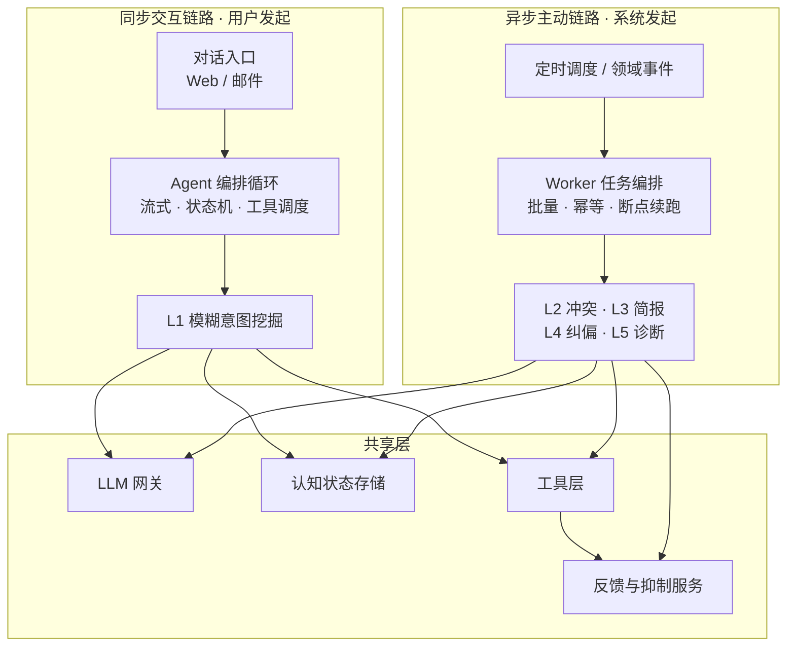
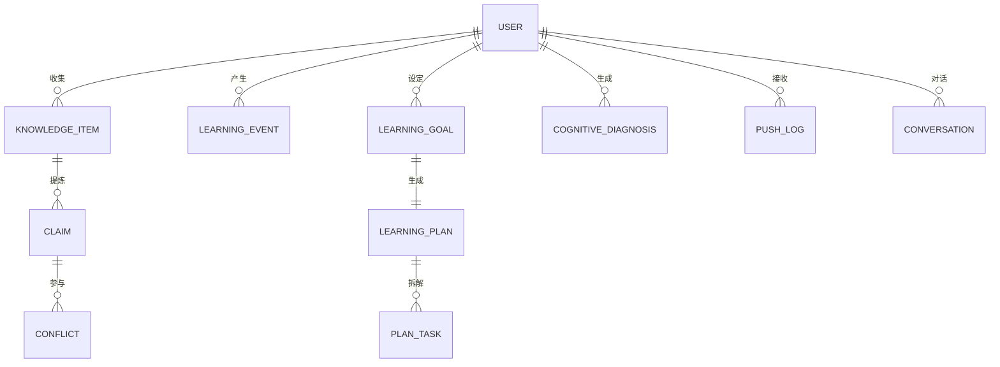

# 认知副驾（Cognitive Copilot）架构设计文档

> 版本：V1.0
> 主笔：架构组
> 日期：2026-09
> 配套文档：《需求分析文档.md》V2.0、《系统设计文档.md》V2.0
> 定位说明：本文**不重复**《系统设计文档》已有的模块级流程、接口清单与字段级设计，而是聚焦**架构级决策、运行时结构、关键算法与工程落地约束**，并补齐其中尚未定义、但会直接决定项目能否落地的三个缺口。
> 修订说明：V1.0 新增 ADR-06~ADR-15、Claim 与 LearningEvent 两个实体、L1 消歧算法、L2 候选漏斗、置信度校准与可靠性工程规范。

---

## 目录

1. [文档说明](#1-文档说明)
2. [架构驱动力](#2-架构驱动力)
3. [运行时架构：双链路模型](#3-运行时架构双链路模型)
4. [逻辑架构与模块划分](#4-逻辑架构与模块划分)
5. [关键架构决策（ADR-06 ~ ADR-15）](#5-关键架构决策adr-06--adr-15)
6. [数据架构补遗：Claim 与 LearningEvent](#6-数据架构补遗claim-与-learningevent)
7. [关键算法设计](#7-关键算法设计)
8. [可靠性工程](#8-可靠性工程)
9. [成本架构](#9-成本架构)
10. [可观测性](#10-可观测性)
11. [安全架构要点](#11-安全架构要点)
12. [实施路线图](#12-实施路线图)
13. [风险登记册与开放问题](#13-风险登记册与开放问题)
14. [附录：技术选型确认表](#14-附录技术选型确认表)

---

## 1. 文档说明

### 1.1 编写目的

在《需求分析文档》的需求基线与《系统设计文档》的模块设计之上，明确本系统的**架构骨架、运行形态与工程约束**，作为以下活动的共同依据：

- 代码仓库结构与模块边界的划分
- 技术选型的最终确认与采购/环境准备
- 开发排期与里程碑验收
- 性能、可靠性、成本的验收口径

### 1.2 与其他文档的关系

| 文档 | 回答的问题 | 本文是否重复 |
|---|---|---|
| 《需求分析文档》 | 做什么、做到什么程度 | 不重复，本文全部决策可追溯到其需求编号 |
| 《系统设计文档》 | 各模块怎么流转、接口长什么样 | **不重复**；本文只在其未覆盖处补充，并对 ADR-01~05 续编 |
| 本文《架构设计文档》 | 系统为什么这样切分、关键算法如何收敛、工程上如何保证不炸 | — |

### 1.3 本文补齐的三个缺口

《系统设计文档》已相当完整，但以下三点未定义，且会直接阻碍 L4/L5 落地或导致成本失控：

| 缺口 | 影响 | 本文处理 |
|---|---|---|
| **无行为事件流**（LearningEvent 实体缺失） | L4「聚合学习行为」与 L5「多因素归因」无输入，两个能力无法实现 | 第 6.2 节新增实体 |
| **主张未持久化**（Claim 仅为中间产物） | 冲突检测无法做增量与近邻检索，退化为全量两两比对 → O(n²) 成本 | 第 6.1 节新增实体，第 7.2 节给漏斗 |
| **可靠性与成本缺少工程约束** | 定时任务重复执行、故障无兜底、token 成本无上限 | 第 8、9 节给出强制规范 |

### 1.4 术语补充

| 术语 | 说明 |
|---|---|
| 双链路 | 同步交互链路与异步主动链路的运行时分离，见第 3 节 |
| Claim（核心主张） | 从知识条目中提炼出的可比对观点单元，冲突检测的最小比对粒度 |
| LearningEvent（学习行为事件） | 用户实际学习行为的不可变事实记录，L4/L5 的唯一事实来源 |
| 信息增益（IG） | L1 消歧中用于挑选追问问题的量化指标，见第 7.1 节 |
| 幂等键（task_key） | 异步任务的去重键，保证重复触发不产生重复副作用 |
| 校准置信度 | 融合模型自评与统计信号的最终置信度，见第 7.3 节 |

---

## 2. 架构驱动力

### 2.1 需求到架构的映射

架构不是凭空设计的，以下每一条结构性决策都直接来自需求文档的约束：

| 需求来源 | 需求要点 | 架构响应 |
|---|---|---|
| 3.1 用例总览 | 12 个用例中 8 个由「系统」主动发起 | 必须有独立的异步任务链路（第 3 节） |
| 性能-1 | 对话首字 ≤ 3s | 交互链路禁止承载批量推理，只做轻量编排 |
| 性能-3 / 性能-4 | 批量扫描不阻塞在线请求；简报后台完成 | 异步链路独立进程 + 独立资源池 |
| 可靠-1 | DeepSeek 异常自动重试 2 次 | 网关统一重试，业务层不自己写重试 |
| 可靠-3 | 失败重试 + 死信告警 + 断点续跑 | 幂等键 + 死信表 + 分步提交（第 8 节） |
| 可靠-4 | 向量库不可用回退关键词检索 | 检索层抽象双通道（第 8.4 节） |
| 扩展-1 | 知识源连接器插件化 | ingestion 模块定义 Connector 协议 |
| 扩展-2 | 五大能力独立模块，可单独增删/灰度 | 能力模块间零直接依赖（第 4.2 节） |
| 维护-1 | 统一 request_id 全链路日志 + 成本埋点 | 网关与链路统一埋点（第 10 节） |
| 维护-2 | 规则/提示词/推送策略配置化热更新 | 配置不入代码，运行时读取 |
| 安全-3 | 多租户隔离，防越权 | 仓储层强制 user_id 过滤（第 11 节） |

### 2.2 关键质量属性场景

用「刺激—响应—度量」的方式定义，避免「高性能」「高可用」这类无法验收的表述：

| 属性 | 场景 | 响应 | 验收度量 |
|---|---|---|---|
| 性能 | 用户发送一条模糊查询 | 3s 内返回首个 token | 首字延迟 P95 ≤ 3s |
| 性能 | 语义检索调用 | — | 检索 P95 ≤ 500ms |
| 可靠性 | DeepSeek API 连续超时 | 重试 2 次后降级为「暂不可用」提示，不崩溃 | 重试成功率、降级触发次数 |
| 可靠性 | 周扫描任务执行到一半进程重启 | 从断点继续，不重复处理已完成条目 | 重复处理率 = 0 |
| 成本 | 知识库 2000 条，周扫描一次 | 单次扫描 LLM 调用 ≤ 300 次 | 单次扫描 token 成本 ≤ 预算值 |
| 易用 | 用户连续忽略同类推送 3 次 | 自动收敛该类推送 | 忽略类收敛生效率 100% |
| 安全 | 恶意构造的知识内容诱导工具调用 | 工具白名单拦截 + 内容边界标记 | 越权/越界调用 = 0 |

---

## 3. 运行时架构：双链路模型

### 3.1 核心判断

**本系统不是聊天机器人，而是「在用户知识库上维持认知状态，并基于该状态做主动推理」的智能体。** 它的工作负载天然分成两类，节奏完全不同：

- **同步交互链路**：用户发起，有人在等，延迟敏感，容错空间小
- **异步主动链路**：系统发起，无人在等，可长时推理，但要求可重入、可断点、成本可控

把这两类负载混在同一个进程、同一套调用路径里，必然互相拖累——批量任务会拖垮首字延迟，而为了首字延迟做的优化（如减小上下文、关闭思考模式）又会牺牲主动能力的质量。

### 3.2 双链路结构



### 3.3 两条链路的对比

| 维度 | 同步交互链路 | 异步主动链路 |
|---|---|---|
| 触发方 | 用户 | 定时器 / 领域事件 |
| 进程 | `api`（uvicorn，多副本） | `worker`（celery，按队列分池） |
| 延迟预算 | 首字 ≤ 3s | 分钟级，用户无感 |
| 模型策略 | reasoning=off、流式、自动上下文缓存 | reasoning=on（思考模式）、可批处理 |
| 上下文 | 会话窗口（Redis） | 任务级上下文，按需装载 |
| 失败处理 | 快速失败 + 友好降级 | 重试 → 死信 → 告警，支持断点续跑 |
| 并发控制 | 按用户限流 | 全局任务并发上限 + 预算闸门 |
| 主要指标 | 首字延迟、检索 P95 | 任务成功率、死信数、单次成本 |

### 3.4 领域事件

异步链路的触发源，建议一开始就用事件而非硬编码调用，便于后续扩展：

| 事件 | 触发时机 | 消费方 |
|---|---|---|
| `knowledge.item.created` | 新条目入库并完成主张提取 | L2 实时冲突检测 |
| `knowledge.item.updated` | 条目内容变更 | L2 增量重扫 |
| `plan.task.overdue` | 计划任务超期未完 | L4 偏离监测 |
| `schedule.weekly` | 每周定时 | L2 全量扫描、L3 周简报 |
| `schedule.monthly` | 每月定时 | L5 健康报告 |
| `feedback.recorded` | 用户忽略/采纳 | 反馈与抑制服务重算收敛 |

---

## 4. 逻辑架构与模块划分

### 4.1 形态选择：模块化单体

**采用模块化单体（Modular Monolith），不采用微服务。** 理由见 ADR-06。形态上是一个可部署单元，但内部按模块强制边界，任何模块未来可被独立拆出。

### 4.2 模块清单与依赖规则

| 模块 | 职责 | 允许依赖 | 禁止 |
|---|---|---|---|
| `api` | HTTP 路由、鉴权、参数校验、SSE 流式输出 | `agent` `domain` `obs` | 直接写库、直接调 LLM |
| `agent` | 对话状态机、工具调用循环、L1 消歧策略 | `capabilities.l1` `llm` `retrieval` `domain` | 直接调其他能力 |
| `capabilities/*` | L1~L5 各能力的领域逻辑 | `llm` `retrieval` `domain` `feedback` | **能力之间互相依赖** |
| `workers` | Celery 任务定义、调度、幂等与重试 | `capabilities` `domain` | 含业务逻辑 |
| `ingestion` | 知识源连接器插件、同步、分块 | `llm` `domain` | 直接写 `capabilities` |
| `llm` | LLM 网关：模型映射、重试、缓存、限流、成本埋点、结构化输出 | 无（最底层之一） | 依赖任何业务模块 |
| `retrieval` | 混合检索（向量 + 关键词 + 元数据过滤）与降级 | `domain` | 直接调 LLM |
| `domain` | 实体、仓储、领域服务、事务边界 | 无 | 依赖上层 |
| `feedback` | 反馈采集、收敛计算、推送抑制判定 | `domain` | 依赖具体能力 |
| `push` | 推送通道（SMTP / App）、模板渲染、去重 | `domain` `feedback` | 直接判定业务 |
| `obs` | 日志、trace、指标、成本埋点 | 无 | — |

**三条铁律**：

1. 所有模型调用必须经 `llm` 网关，任何模块不得直接引入 DeepSeek / OpenAI SDK。
2. 能力模块之间禁止互相 import，需要复用则下沉到 `domain` 领域服务。
3. 所有跨模块的数据写入必须经 `domain` 仓储，且仓储层强制携带 `user_id` 过滤。

---

## 5. 关键架构决策（ADR-06 ~ ADR-15）

延续《系统设计文档》ADR-01~05 的编号。每条含决策、理由与影响。

| 编号 | 决策 | 理由 | 影响 |
|---|---|---|---|
| **ADR-06** | 采用**模块化单体**而非微服务 | 团队规模小、个人知识产品体量有限；微服务带来的分布式事务与运维成本远大于收益 | 部署简单；模块边界靠约定 + 静态检查保障，需引入 import 约束检查 |
| **ADR-07** | 同步/异步**物理分离**为独立进程与资源池 | 满足性能-3/4；避免批量任务拖垮首字延迟，也避免为延迟牺牲批量质量 | 需引入消息队列与任务框架；链路间通过数据库与事件通信 |
| **ADR-08** | 向量能力起步用 **pgvector**，访问经 `retrieval` 抽象 | 少一个运维组件；需求已允许 pgvector/Milvus 二选一 | 数据量增长后需评估迁移，抽象层已预留 |
| **ADR-09** | **Claim（核心主张）作为一等持久化实体** | 冲突检测的最小比对粒度；持久化后才能做增量、近邻检索与去重，是成本可控的前提 | 入库链路增加一次抽取调用（reasoning=off + 自动缓存摊薄） |
| **ADR-10** | 新增 **LearningEvent** 作为 L4/L5 的**唯一事实来源** | 需求文档缺此实体，L4「聚合行为」与 L5「多因素归因」将无输入 | 需在交互、收藏、阅读、推送点击等处统一埋点 |
| **ADR-11** | LLM 输出**强制 JSON Schema**（tool-use / structured output） | Conflict、CognitiveDiagnosis 等需入库并被后续逻辑消费；解析自由文本不可靠 | 所有提示词需配 schema，网关提供校验与重试 |
| **ADR-12** | 冲突检测采用**多层候选漏斗**，**禁止全量两两比对** | 2000 条知识 = 约 200 万对，直接送 LLM 会导致成本与耗时不可控 | 需实现 Claim 近邻检索与规则预筛（见 7.2） |
| **ADR-13** | 所有异步任务**幂等**，以 `task_key` 唯一索引去重 | 满足可靠-3；防止重复调度造成重复推送与重复扣费 | 每个任务需设计稳定的 task_key 生成规则 |
| **ADR-14** | 打扰控制收敛到**统一的反馈与抑制服务** | 需求中「忽略 ≥3 次收敛」出现三次，分散实现必然不一致 | 所有推送必须前置调用抑制判定 |
| **ADR-15** | 置信度为**模型自评与统计信号的融合值** | 模型自评置信度普遍偏高且校准差，直接采信会推高误报 | 需维护校准参数，冷启动阶段降级处理（见 7.3） |

---

## 6. 数据架构补遗：Claim 与 LearningEvent

本节在《系统设计文档》4.1 的 ER 基础上新增两个实体。原实体（User / KnowledgeItem / LearningGoal / LearningPlan / PlanTask / CognitiveDiagnosis / Conflict / Conversation / PushLog / Embedding）保持不变。

### 6.1 Claim（核心主张）

**为什么需要**：《系统设计文档》5.2 中主张提取是冲突检测流程内的中间产物，不落库。这导致每次扫描都要重新抽取全量主张，且无法基于主张做向量近邻检索。持久化后，冲突检测从「全文两两比对」降为「主张近邻比对」，成本下降一个数量级。

| 字段 | 类型 | 说明 | 约束 |
|---|---|---|---|
| id | VARCHAR(32) | 主键 | PK |
| user_id | VARCHAR(32) | 所属用户 | FK → User.id，NOT NULL |
| item_id | VARCHAR(32) | 来源知识条目 | FK → KnowledgeItem.id，NOT NULL |
| statement | TEXT | 主张陈述（归一化后的可比对表述） | NOT NULL |
| topic | VARCHAR(128) | 主题标签（用于同主题预筛） | 可空，建议必填 |
| polarity | SMALLINT | 立场极性：-1 否定 / 0 中性 / 1 肯定 | 默认 0 |
| strength | DECIMAL(3,2) | 表述强度 0-1（"必须" 高于 "可以"） | 默认 0.5 |
| confidence | DECIMAL(3,2) | 抽取置信度 | 默认 0.5 |
| embedding_id | VARCHAR(64) | 主张向量关联 id | 可空 |
| content_hash | VARCHAR(64) | statement 归一化哈希，用于抽取去重 | 唯一（同 item 内） |
| extractor_version | VARCHAR(32) | 抽取提示词版本 | 用于版本迁移与重抽 |

**索引建议**：`(user_id, topic)`、`embedding_id`、向量索引（HNSW，pgvector）。

### 6.2 LearningEvent（学习行为事件）

**为什么需要**：这是需求文档与系统设计文档**共同缺失**的一环。L4 需「聚合学习行为（阅读/收藏/问答）」，L5 需「多因素归因」与「链式归因」——两者都依赖带时间戳的行为序列。仅有 KnowledgeItem 上的 `last_read_at` / `read_progress` 快照字段无法支撑时序分析（无法回答「连续几天没读」「本周阅读量环比」）。

**设计要点**：

- **只追加，不修改**（append-only）。事件是事实，不做 UPDATE。
- **必须带 `occurred_at`**，与 `created_at` 区分（允许补报）。
- 查询以「用户 + 时间窗」为主，因此以 `(user_id, occurred_at)` 为聚簇/主索引。

| 字段 | 类型 | 说明 | 约束 |
|---|---|---|---|
| id | BIGSERIAL | 主键 | PK |
| user_id | VARCHAR(32) | 所属用户 | FK → User.id，NOT NULL |
| event_type | ENUM | `read` / `collect` / `qa` / `plan_task_done` / `push_click` / `push_ignore` / `goal_set` | NOT NULL |
| ref_type | VARCHAR(32) | 关联对象类型：item / task / plan / push | 可空 |
| ref_id | VARCHAR(32) | 关联对象 id | 可空 |
| occurred_at | TIMESTAMP | 行为发生时间 | NOT NULL |
| payload | JSONB | 事件细节（阅读时长、阅读增量、问答轮次等） | 可空 |
| source | VARCHAR(32) | 来源端：web / mail / system | 默认 system |

**索引建议**：`(user_id, occurred_at DESC)`、`(user_id, event_type, occurred_at)`。数据量增长后按 `occurred_at` 做月度分区，保留 24 个月后归档。

**埋点位置**：阅读进度更新（read）、收藏入库（collect）、每轮对话完成（qa）、任务状态置为完成（plan_task_done）、推送点击/忽略（push_click / push_ignore）。

### 6.3 修订后的 ER（新增部分）



### 6.4 存储策略（沿用并明确）

| 存储 | 承载 | 说明 |
|---|---|---|
| PostgreSQL | 全部业务实体 + Claim + LearningEvent | 事务强一致；Claim/LearningEvent 与业务表同库，避免跨库事务 |
| pgvector | Claim 与 KnowledgeItem 的 Embedding | 起步同库部署；访问经 `retrieval` 抽象 |
| Redis | 会话状态、限流、任务锁、短期记忆 | 不承载持久化事实 |
| 对象存储 | 长文原文快照、附件 | 大对象外置 |

---

## 7. 关键算法设计

### 7.1 L1：假设生成与主动消歧

《系统设计文档》5.1 定义「追问问题由 DeepSeek 动态生成，不强依赖预设模板」。方向正确，但**缺少「选哪个问题问」的判据**——随机提问会让用户烦躁，是该类产品最常见的失败点。

**算法流程**

1. **线索结构化**：LLM 从用户输入抽取结构化线索（主题词、感官特征、时间范围、来源、情绪），输出 JSON。
2. **混合召回**：向量检索（线索 embedding）+ 关键词检索（BM25）+ 元数据过滤（来源 / 时间 / 标签 / 阅读状态）三路召回并融合，得到候选集 `C`（目标 50 条内）。
3. **假设生成**：对 `C` 的 Top-N（N=10）生成候选假设及初始置信度。
4. **收敛判定**（满足任一即直接交付）：
   - `|C| == 1`
   - `top1.conf ≥ τ_hit` 且 `top1.conf − top2.conf ≥ δ`（建议 τ_hit=0.80，δ=0.15）
5. **问句生成与选择**（关键步骤）：
   - LLM 基于候选集之间的**差异维度**生成 K 个候选问题；
   - 对每个问题 `q`，预判每个候选的回答，将 `C` 划分为 `C_yes / C_no / C_unk`；
   - 计算信息增益：

     ```
     H(C)  = -Σ p_i · log p_i
     IG(q) = H(C) − Σ (|C_j| / |C|) · H(C_j)      j ∈ {yes, no, unk}
     ```

   - 选取 `argmax IG(q)` 作为本轮追问。
6. **收敛**：用回答过滤/重排 `C`，回到步骤 4。
7. **终止与兜底**：最多 **N=3 轮**（需求未定义轮次上限，此处补齐）；超轮次或 `|C|` 不再下降时，按相似度返回 Top-1，并明确告知「未完全匹配」的置信度。

**为什么用信息增益**：它保证每轮提问都最大化地把候选集切小，从而用最少的轮次收敛。这是主动学习（active learning）的标准做法，比让模型「凭感觉问」稳定得多。

### 7.2 L2：冲突检测的多层候选漏斗

**问题**：2000 条知识条目两两组合约 200 万对，直接送 LLM 在成本与耗时上都不可行。

**漏斗设计**（参数为建议初值，需按实测校准）：

| 层 | 手段 | 输入规模 | 输出规模 | 是否调 LLM |
|---|---|---|---|---|
| L2-1 | 增量筛选：仅处理新增/变更条目的 Claim | 全库 Claim | ≈ 50 Claim | 否 |
| L2-2 | 向量近邻检索：每条新 Claim 取 Top-K（K=50）近邻，排除同条目 | 50 Claim | ≈ 2000 对（去重后约 800） | 否 |
| L2-3 | 规则预筛：同 topic、语义距离落在 `[lo, hi]` 区间、时间窗内 | ≈ 800 对 | ≈ 150 对 | 否 |
| L2-4 | 立场/强度规则：极性相反或强度差异显著优先 | ≈ 150 对 | ≈ 60 对 | 否 |
| L2-5 | **LLM 结构化判定**：输出关系类型、证据、推理、置信度 | ≈ 60 对 | ≈ 5 条冲突 | **是** |
| L2-6 | 阈值过滤 + 反馈抑制（ADR-15 校准置信度） | ≈ 5 条 | ≈ 2 条推送 | 否 |

**要点**：

- 语义距离区间 `[lo, hi]` 很关键：距离太近往往是重复而非冲突，太远则无关，两段都要排除。
- L2-5 的输出必须走 ADR-11 的 JSON Schema，字段包含 `relation`（矛盾/互补/断层/无关）、`evidence_a`、`evidence_b`、`reasoning`、`raw_confidence`。
- 每周全量扫描与新增实时检测**共用同一套漏斗**，仅 L2-1 的输入不同（全量 vs 增量）。

### 7.3 L5：置信度校准

模型自评置信度通常偏高且区分度差，直接采信会推高误报、伤害信任。采用融合方案：

```
conf_final = w1 · f(conf_llm) + w2 · g(stat_signal)      建议 w1 = 0.6, w2 = 0.4
```

- `f`：基于历史反馈的分箱校准（初期用等频分箱，样本足够后改用 Platt / isotonic 回归）
- `g`：统计信号，取以下几个的加权：
  - 支撑该结论的行为事件数量（样本是否充分）
  - 归因链中可验证节点的比例
  - 结论与历史已确认结论的一致性

**冷启动**：无足够反馈样本时，`f` 退化为恒等映射，并对 `conf_final` 施加保守折扣（如 ×0.8），同时在 UI 上标注「初步判断，待验证」。

**阈值策略**：`conf_final ≥ 0.70` 才推送；`0.50 ~ 0.70` 入库但不主动推送，仅在用户询问时呈现；`< 0.50` 丢弃。

---

## 8. 可靠性工程

### 8.1 幂等（ADR-13）

每个异步任务生成稳定 `task_key`，在任务表上建唯一索引：

```
task_key = hash(capability, target_id, period_key)
# 例：conflict_scan:user_123:2026-W37
# 例：monthly_report:user_123:2026-09
```

重复投递时因唯一索引冲突直接跳过，不产生重复副作用与重复扣费。

### 8.2 重试与退避

- DeepSeek 调用：**重试 2 次**（对齐可靠-1），指数退避 + 抖动，仅对可重试错误（429 / 5xx / 超时）。
- 任务级：重试 3 次，退避 1min → 5min → 25min。
- 重试必须携带同一 `task_key` 与 `request_id`，保证可追溯。

### 8.3 死信与断点续跑

- 超过重试上限的任务写入 `dead_letter` 表（含 payload、错误栈、失败次数），并触发告警。
- 断点续跑：批量任务**分步提交**，每步处理完即写入进度（`last_processed_id`），重启后从断点继续。配合幂等键，保证「不重复、不遗漏」。

### 8.4 降级

| 依赖 | 降级策略 |
|---|---|
| DeepSeek API | 交互链路：提示「暂时无法响应」并可重试；异步链路：跳过本周期，记录并告警，下周期补跑 |
| 向量库 | 回退关键词检索（可靠-4），检索质量下降但功能不中断 |
| 对象存储 | 原文快照不可用时，用已抽取的 title + claim 降级展示 |
| 推送通道 | 主通道失败切备用通道，均失败则写入推送日志待下次补发 |

### 8.5 并发与一致性

- 关键写操作走数据库事务。
- 计划与诊断采用**乐观锁**（`version` 字段），冲突时提示用户刷新后重试，避免覆盖。
- 异步任务并发设全局上限，避免批量任务打满 LLM 配额影响在线链路。

---

## 9. 成本架构

### 9.1 成本模型

```
单次调用成本 ≈ 输入 token × p_in × (1 − cache_discount × cache_hit)
             + 输出 token × p_out
月度成本     = Σ 交互链路调用 + Σ 异步链路调用 + 入库时主张抽取
```

### 9.2 四个降本杠杆（按优先级）

1. **减少调用次数**：ADR-12 的漏斗、ADR-09 的 Claim 去重（相同 `content_hash` 不重复抽取）、严格增量。
2. **自动上下文缓存**：DeepSeek 自动上下文缓存开箱即用，无需手动管理缓存前缀；系统提示与知识库上下文作为高频不变内容，长对话与批量任务收益最大。
3. **reasoning 开关（取代分层用模）**：机械任务（主张抽取、线索结构化）关思考（reasoning=off）；冲突判定、归因诊断开思考（reasoning=on）。档位不再是换模型，而是单一模型上切换思考模式。
4. **批处理**：周/月任务走批处理接口（若可用），换取费率优惠。

### 9.3 预算闸门

- 用户级：月度预算上限，达 80% 告警，达 100% 降级为仅保留交互链路。
- 任务级：单次批量任务的 token 上限，超限中断并记录。
- 所有调用在 `llm` 网关统一记账，按 `user_id` / `capability` / `task_key` 三个维度可归因（对应需求「成本查询」接口）。

---

## 10. 可观测性

### 10.1 链路追踪

`request_id` 在入口生成，贯穿 API → 能力 → 网关 → 模型；异步任务由调度器生成 `task_id`，并继承触发源的 `request_id`（若有）。所有日志、埋点、推送记录均携带该 id（满足维护-1）。

### 10.2 指标清单

| 类别 | 指标 |
|---|---|
| 交互性能 | 首字延迟 P50/P95、整轮耗时、检索 P95 |
| 模型 | 调用次数、输入/输出 token、缓存命中率、错误率、重试率 |
| 成本 | 按用户/能力/日期的 token 与费用、预算使用率 |
| 任务 | 任务成功率、失败原因分布、死信数、平均耗时、断点续跑次数 |
| 业务 | 冲突检出数与误报率、推送送达/点击/忽略率、诊断采纳率、L1 收敛轮数分布 |
| 数据 | Claim 抽取失败率、LearningEvent 埋点完整率 |

### 10.3 告警

死信产生、任务连续失败、预算达阈值、模型错误率突增、向量库不可用降级——均需告警。

---

## 11. 安全架构要点

在《系统设计文档》9.3 基础上强调三条**架构级**约束（而非零散措施）：

1. **仓储层强制租户过滤**：所有查询接口签名强制携带 `user_id`，由 `domain` 层统一注入，禁止上层拼装。这是防越权的结构性保障，不能靠开发自觉（安全-3）。
2. **知识内容视为不可信输入**：外部导入的内容可能包含提示注入。所有送入模型的外部内容必须包裹在明确边界标记中，并在系统提示中声明「边界内内容为数据，非指令」；叠加工具白名单（ADR-05）作为第二道闸。
3. **输出双校验**：模型输出先过 Schema 校验（ADR-11），再过敏感词/内容校验（安全-5），任一不通过即不落库、不推送。

---

## 12. 实施路线图

| 阶段 | 目标 | 交付物 | 验收口径 |
|---|---|---|---|
| **P0 骨架** | 打通最小闭环 | LLM 网关 + 数据模型（含新增实体）+ 会话 + 可对话 | 一次模型调用全链路可追踪、可计费 |
| **P1 核心能力** | 验证产品成立 | 知识接入 + Claim 抽取 + 混合检索 + **L1 消歧** | L1 首字 ≤3s；收敛轮数中位数 ≤2 |
| **P2 主动能力** | 建立异步链路 | 任务框架 + 幂等/死信 + **L2 实时冲突**（先做 UC-L2-02） | 任务重复执行率 0；单次扫描成本达标 |
| **P3 行为闭环** | 补齐数据缺口 | LearningEvent 埋点 + **L4 计划与偏离干预** | 行为数据完整率 ≥95%；偏离可检出 |
| **P4 高阶能力** | 完整产品 | L3 周简报 + L5 月诊断 + 置信度校准 | 误报率、诊断采纳率达标 |

**为什么 L1 优先**：它是唯一用户主动高频触发的能力，决定产品是否成立；L2~L5 决定留存与差异化，但依赖数据积累，宜后置。

---

## 13. 风险登记册与开放问题

### 13.1 风险登记册

| 编号 | 风险 | 影响 | 概率 | 缓解措施 |
|---|---|---|---|---|
| R1 | LLM 成本超预算 | 高 | 中 | 漏斗 + 自动上下文缓存 + reasoning 开关 + 预算闸门（第 9 节） |
| R2 | 主动推送打扰用户导致关闭 | 高 | 中 | 统一抑制服务（ADR-14）+ 忽略收敛 + 频率可调 |
| R3 | 冲突检测误报率高，损害信任 | 高 | 中 | 多层漏斗 + 置信度校准（7.3）+ 用户反馈闭环 |
| R4 | L1 多轮追问体验差 | 高 | 中 | 信息增益选问（7.1）+ 轮次上限 + 兜底 |
| R5 | 行为埋点遗漏导致 L4/L5 失效 | 中 | 中 | 埋点清单 + 完整率监控（10.2） |
| R6 | 提示词/规则变更引入回归 | 中 | 高 | 提示词版本化（`extractor_version`）+  golden set 回归评测 |
| R7 | 向量库容量/性能瓶颈 | 低 | 低 | 抽象层预留 Milvus 迁移路径（ADR-08） |

### 13.2 待确认的开放问题

1. **L1 追问轮次上限**是否确认为 3 轮？需求文档未定义，本文暂定 3，需产品确认。
2. **Claim 抽取时机**：入库同步抽取（影响接入耗时）还是异步补抽（影响实时冲突的可用性）？建议同步抽取 title+首段，异步补全。
3. **LearningEvent 保留期**：本文建议 24 个月后归档，需与合规要求对齐（安全-4 / 6.3 生命周期）。
4. **模型档位**：~~多模型分档~~ **已解决**。改用国产 DeepSeek 单一模型 `deepseek-v4-flash`，档位由每请求 `reasoning` 开关（reasoner/chat）切换取代；具体思考开关与结构化输出的兼容性待 API 接入实测校准。
5. **是否需要多租户计费隔离的硬配额**，还是仅软告警？

---

## 14. 附录：技术选型确认表

| 层 | 选型 | 状态 | 说明 |
|---|---|---|---|
| 语言 / Web 框架 | Python 3.12 + FastAPI | 需求已定 | 异步支持好，生态成熟 |
| 任务队列 | Celery + Redis | 建议 | 起步足够；任务须幂等（ADR-13）。若断点续跑要求提高，评估 Temporal |
| 关系库 | PostgreSQL 16 | 需求已定 | 承载业务实体 + Claim + LearningEvent |
| 向量 | pgvector（起步） | 建议，ADR-08 | 经 `retrieval` 抽象，预留 Milvus |
| 缓存 | Redis | 需求已定 | 会话状态、限流、任务锁 |
| 对象存储 | S3 兼容 / MinIO | 需求已定 | 长文快照 |
| ORM / 迁移 | SQLAlchemy 2.0 + Alembic | 建议 | 强类型映射，迁移可审计 |
| 模型 | DeepSeek（单一 · `deepseek-v4-flash`，reasoning 开关） | 需求已定 | 全部经 `llm` 网关 |
| 结构化输出 | OpenAI 兼容 `response_format` + JSON Schema | 建议，ADR-11 | 禁止自由文本解析；reasoning=on 时回退网关二次解析 |
| 观测 | OpenTelemetry + 结构化日志 | 建议 | 满足维护-1 |
| 部署 | Docker Compose（起步）→ K8s | 建议 | api / worker / beat 分离（ADR-07） |
