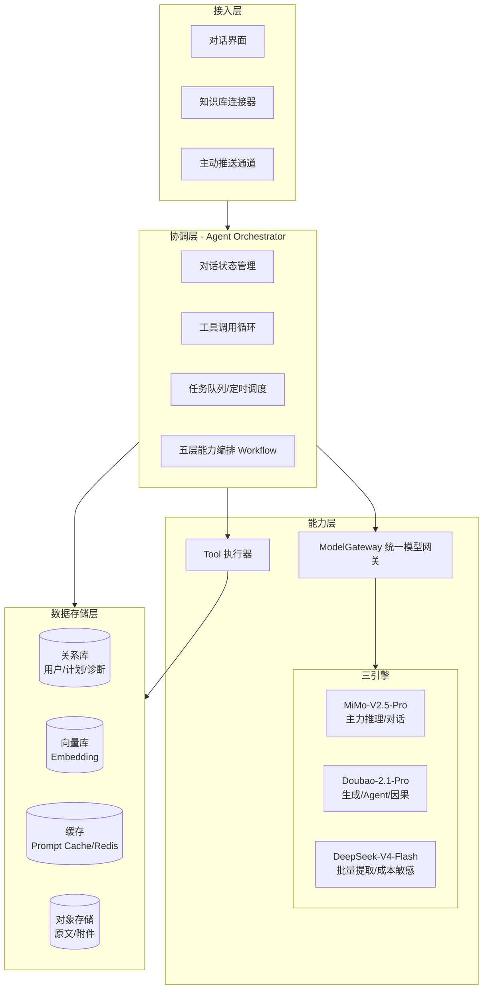
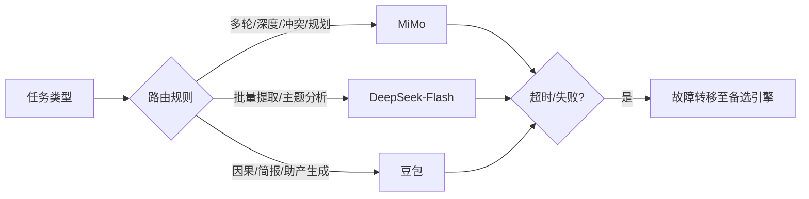
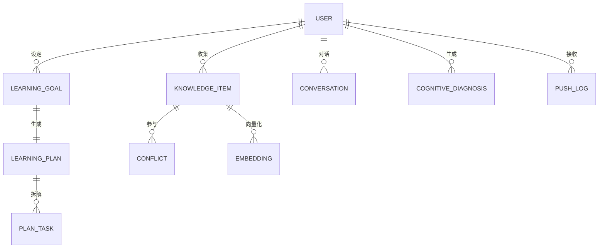
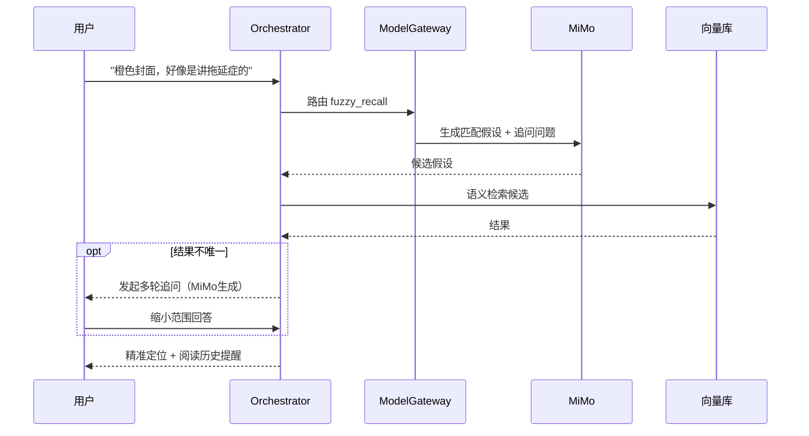
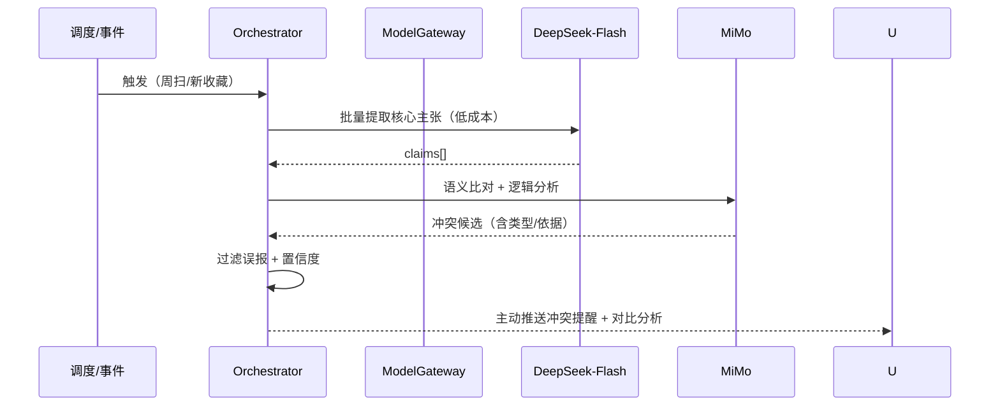
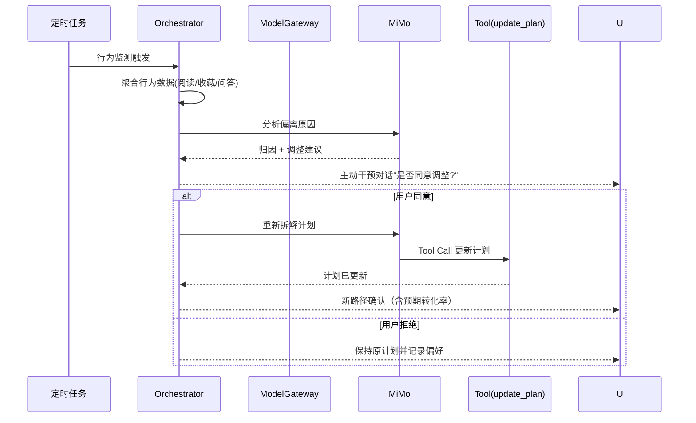
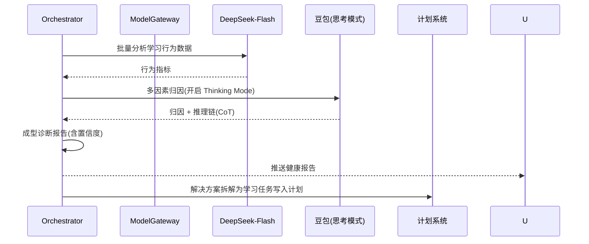
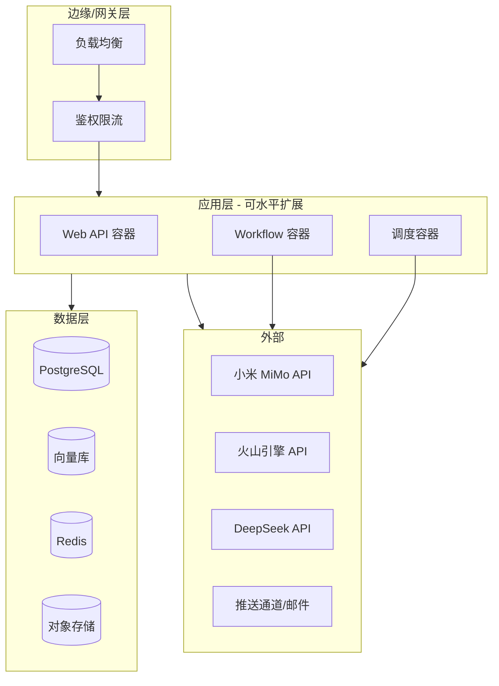

# 认知副驾（Cognitive Copilot）系统设计文档

> 版本：V1.1
> 主笔：系统设计组
> 日期：2026-09
> 参考文档：《智能体.docx》(需求分析说明书)、《认知副驾.md》(核心源码设计原型)
> 修订说明：V1.1 去除正文代码块，统一转换为字段表、规则表、接口表，与原型实现解耦，聚焦"应设计什么"。

---

## 目录

1. [文档说明](#1-文档说明)
2. [系统总体架构](#2-系统总体架构)
3. [核心技术架构](#3-核心技术架构)
4. [数据模型与存储设计](#4-数据模型与存储设计)
5. [模块详细设计（五大功能）](#5-模块详细设计五大功能)
6. [Agent 协调层与工具设计](#6-agent-协调层与工具设计)
7. [主动推送机制设计](#7-主动推送机制设计)
8. [接口设计](#8-接口设计)
9. [非功能性设计](#9-非功能性设计)
10. [部署架构设计](#10-部署架构设计)
11. [成本监控与优化设计](#11-成本监控与优化设计)
12. [风险与应对](#12-风险与应对)
13. [附录](#13-附录)

---

## 1. 文档说明

### 1.1 文档目的
本文档在《智能体.docx》需求分析基线上，将「认知副驾」的功能性、非功能性需求转化为可落地、可编码、可测试的系统实现方案，作为开发、测试、运维的统一设计基线。

### 1.2 设计原则
- **一套网关，三引擎调度**：所有模型调用由统一网关 `ModelGateway` 收敛，业务层不感知底层供应商差异。
- **大脑 + 双手 + 记忆**：LLM 负责推理（大脑），Tool Calls 负责执行（双手），向量库+Prompt 缓存负责记忆。
- **成本优先**：批量/成本敏感任务走 DeepSeek-Flash，生成任务走豆包，深度推理走 MiMo，降低 API 成本 91%+。
- **可观测、可回滚**：每次模型调用均有日志与成本埋点，支持路由规则热更新与故障转移。

### 1.3 术语表
| 术语 | 说明 |
|------|------|
| ModelGateway | 统一模型网关，根据任务类型路由到最优引擎 |
| Engine | 单个模型供应商封装（MiMo / 豆包 / DeepSeek） |
| Tool Call | 大模型的函数调用机制，用于执行外部动作 |
| Prompt Cache | 服务端 Prompt 缓存，命中时输入费用大幅降低 |
| KnowledgeItem | 知识条目，用户收藏/笔记的基本单位 |
| CognitiveDiagnosis | 认知诊断报告（偏误诊断输出） |
| Orchestrator | 协调层，负责意图解析、工作流编排、Agent 循环 |
| Tool Registry | 工具白名单注册表，统一校验与执行 |

---

## 2. 系统总体架构

### 2.1 逻辑分层架构

系统采用 **四层逻辑架构**，自上而下依次为：接入层、协调层（Agent Orchestrator）、能力层（统一模型网关 + 工具）、数据存储层。



各层职责与说明如下：

| 层级 | 关键组件 | 核心职责 | 说明 |
|---|---|---|---|
| 接入层 | 对话界面 / 知识库连接器 / 推送通道 | 与用户与外部源交互 | 三通道分别承接主动输入、知识导入、被动触达 |
| 协调层 | Orchestrator（状态机/循环/队列/工作流） | 意图解析、编排、Agent 循环 | 系统"大脑"，承载五大能力工作流 |
| 能力层 | ModelGateway + 三引擎 + Tool 执行器 | 模型调度与实际动作执行 | 引擎差异在网关内部收敛，业务无感知 |
| 数据存储层 | PG / 向量库 / 缓存 / 对象存储 | 状态、知识、成本等持久化 | 依赖第 4 章存储策略 |

### 2.2 技术选型初期清单

| 维度 | 选型 | 说明 |
|------|------|------|
| 服务端框架 | Python FastAPI | 异步、易集成三家 SDK |
| 统一模型网关 SDK | 自研 `ModelGateway` 封装 | 统一路由/成本/重试 |
| 向量库 | 兼容 Milvus / pgvector | 知识条目 Embedding 语义检索 |
| 关系库 | PostgreSQL | 用户、计划、诊断、配置事务数据 |
| 缓存 | Redis | 会话状态、限流、短期记忆 |
| 任务调度 | Celery / APScheduler | 定时触发周/月简报、行为监测 |
| 知识库接入 | 官方 API / SDK | Notion、Obsidian、飞书、浏览器书签等 |
| 主动推送 | App 内通知 / SMTP 邮件 | weekly / daily / quiet 三种频率 |

> 说明：具体选型需在原型评审后最终锁定，本文档遵循「先接口、后实现」原则，保证可替换性。

### 2.3 关键架构决策（ADR）

| 决策编号 | 决策 | 理由 |
|---|---|---|
| ADR-01 | 采用「统一网关 + 三引擎」而非单一模型 | 成本降低 91%+，质量与成本平衡 |
| ADR-02 | 特征任务静态路由 + 可配置规则 | 避免每次调用都做 LLM 路由带来的额外成本与延迟 |
| ADR-03 | 知识条目持久化 + 向量化分离存储 | 原文入关系库/对象存储，Embedding 入向量库，便于增量更新 |
| ADR-04 | 主动推送采用定时任务 + 用户配置驱动 | 可控、可审计，避免智能体过度打扰 |
| ADR-05 | 工具调用采用白名单 Tool 注册表 | 只暴露必要能力，降低模型误导调用风险 |

---

## 3. 核心技术架构

### 3.1 统一模型网关 `ModelGateway`

#### 3.1.1 引擎配置模型

沿需求原型中的三家引擎能力，完整参数如下：

| 属性 | MiMo-V2.5-Pro | Doubao-2.1-Pro | DeepSeek-V4-Flash |
|---|---|---|---|
| 供应商 | 小米 | 火山引擎 | DeepSeek |
| 上下文窗口 | 1M（统一计费）| 256K | 1M |
| 最大输出 | 128K | 128K | 384K |
| 输入单价（元/M）| 3（缓存命中 0.025）| 6（缓存命中 1.2）| 1（缓存命中 0.02）|
| 输出单价（元/M）| 6 | 30 | 2 |
| 能力标签 | 深度推理/对话/规划/Tool | 高质量生成/Agent/Coding/思考模式 | 批量处理/语义提取/成本敏感 |

> DeepSeek-V4-Pro 亦可作为批量任务的备选：缓存命中 0.025 / 未命中 3 / 输出 6。

#### 3.1.2 智能路由规则

网关按 **任务类型 → 目标引擎** 静态路由（配表驱动），任务类型即业务侧的语义标记，路由规则可配置热更新。缺省兜底为 MiMo。

| 任务类型 | 典型业务场景 | 目标引擎 | 选型理由 |
|---|---|---|---|
| multi_turn_dialogue | 多轮对话、追问澄清（L1/L3）| MiMo | 1M 上下文承载完整澄清轮次 |
| deep_reasoning | 逻辑分析、语义比对（L2/L5）| MiMo | 深度推理质量优先 |
| conflict_detection | 主张冲突判断（L2）| MiMo | 需因果/逻辑链推理 |
| plan_generation | 计划生成/重规划/路径修正（L4）| MiMo | 规划与 Tool 调用能力强 |
| causal_reasoning | 偏误因果归因（L5）| 豆包 | 思考模式下因果归因质量最优 |
| cognitive_brief | 认知简报/追问生成（L3）| 豆包 | 生成式任务质量领先 |
| batch_extraction | 批量核心主张提取（L2/L5前置）| DeepSeek-Flash | 输出单价最低，成本敏感 |
| topic_analysis | 主题分布/深度层级分析（L3）| DeepSeek-Flash | 批量计算，Flash 足以胜任 |

调度流程：



#### 3.1.3 网关核心职责

| 职责 | 说明 | 关键行为 |
|---|---|---|
| 路由 | 按任务类型匹配引擎 | 未命中任务类型返回兜底 `default_engine`（MiMo）|
| 成本估算与限额 | 调用前预算、调用后结算落账 | `estimate_cost` 贯穿全链路，超限熔断 |
| 重试与降级 | 单引擎失败自动切换 | 故障转移至备选引擎，请求不中断 |
| 安全 | 多租户隔离与合规 | key 隔离、额度配额、敏感词过滤 |

### 3.2 记忆与上下文管理

采用 **三级记忆** 体系：

| 记忆层级 | 载体 | 说明 |
|---|---|---|
| 短期记忆 | Redis / 会话上下文 | 当前多轮对话历史、工具调用中间态 |
| 中期记忆 | Prompt Cache | 知识库摘要、常用系统提示词，命中降本 |
| 长期记忆 | PostgreSQL + 向量库 | 知识条目、学习计划、历史诊断、用户画像 |

**Prompt Caching 策略**：系统提示词、知识库全量摘要等高频不变内容打上缓存标记，命中后输入费用降至缓存价（如 MiMo 0.025 元/M）。

---

## 4. 数据模型与存储设计

### 4.1 核心数据实体（ER 概念模型）



各实体核心字段如下（字段级设计，含通用字段说明；所有实体统一含 `id` 主键、`is_deleted` 软删除标记、`version` 乐观锁版本号、`created_at` / `updated_at` 时间戳，表内不再重复列出）。

**① User（用户）**

| 字段 | 类型 | 说明 | 约束 |
|---|---|---|---|
| nickname | VARCHAR(64) | 昵称 | NOT NULL |
| avatar_url | VARCHAR(255) | 头像地址 | - |
| push_preference | ENUM | 推送频率偏好：weekly / daily / quiet | 默认 weekly |
| api_key_enc | VARCHAR(255) | 加密后的租户 key | 敏感字段加密存储 |

**② KnowledgeItem（知识条目）**——收藏/笔记的基本单位

| 字段 | 类型 | 说明 | 约束 |
|---|---|---|---|
| user_id | VARCHAR(32) | 所属用户 | FK → User.id |
| title | VARCHAR(255) | 标题 | NOT NULL |
| content | TEXT | 正文/长文原文快照 | - |
| source | ENUM | 来源：浏览器书签/Notion/Obsidian/飞书 | NOT NULL |
| url | VARCHAR(255) | 原文链接 | 可空 |
| tags | TEXT[] | 标签列表 | - |
| collected_at | TIMESTAMP | 收藏时间 | 默认 now |
| last_read_at | TIMESTAMP | 最近阅读时间 | 可空 |
| read_progress | DECIMAL(3,2) | 阅读进度 0-1 | 默认 0 |
| embedding_id | VARCHAR(64) | 向量库关联 id | 可空 |
| claims | JSONB | 语义提取的核心主张缓存 | 由 DeepSeek 批量产出 |
| is_deleted | BOOLEAN | 软删除 | 见 4.4 |

**③ LearningGoal / LearningPlan / PlanTask（目标-计划-任务）**

LearningGoal（学习目标）：

| 字段 | 类型 | 说明 | 约束 |
|---|---|---|---|
| user_id | VARCHAR(32) | 所属用户 | FK → User.id |
| description | TEXT | 目标描述 | NOT NULL |
| target_date | TIMESTAMP | 目标期限 | NOT NULL |
| priority | SMALLINT | 优先级 1高/2中/3低 | 默认 2 |
| achieved | BOOLEAN | 是否达成 | 默认 false |

LearningPlan（学习计划）：

| 字段 | 类型 | 说明 | 约束 |
|---|---|---|---|
| user_id | VARCHAR(32) | 所属用户 | FK → User.id |
| goal_id | VARCHAR(32) | 关联目标 | FK → LearningGoal.id |
| schedule | JSONB | 结构化计划内容 | 计划整体以 JSON 存储 |
| created_at / updated_at | TIMESTAMP | 创建/更新时间 | - |

PlanTask（计划任务）：

| 字段 | 类型 | 说明 | 约束 |
|---|---|---|---|
| plan_id | VARCHAR(32) | 所属计划 | FK → LearningPlan.id |
| week | SMALLINT | 对应周次 | NOT NULL |
| topic | VARCHAR(255) | 任务主题 | NOT NULL |
| status | ENUM | pending/in_progress/done/abandoned | 默认 pending |
| source_items | TEXT[] | 关联的知识条目 id 列表 | - |

**④ CognitiveDiagnosis（认知诊断报告）**——L5 偏误诊断输出

| 字段 | 类型 | 说明 | 约束 |
|---|---|---|---|
| user_id | VARCHAR(32) | 所属用户 | FK → User.id |
| pattern | VARCHAR(64) | 行为模式，如"高收藏低完成" | - |
| root_cause | TEXT | 归因诊断 | - |
| confidence | DECIMAL(4,3) | 置信度 0-1 | - |
| suggested_action | TEXT | 可执行方案 | - |
| reasoning_chain | JSONB | 简要推理链（CoT）| 增强可信度 |
| status | ENUM | pending/accepted/rejected | 默认 pending |

**⑤ Conflict（观点冲突）**——L2 冲突检测产物

| 字段 | 类型 | 说明 | 约束 |
|---|---|---|---|
| user_id | VARCHAR(32) | 所属用户 | FK → User.id |
| item_a_id | VARCHAR(32) | 冲突条目 A | FK → KnowledgeItem.id |
| item_b_id | VARCHAR(32) | 冲突条目 B | FK → KnowledgeItem.id |
| conflict_type | VARCHAR(32) | 冲突类型（逻辑矛盾/事实冲突等）| - |
| detail | TEXT | 冲突细节描述 | - |
| suggestion | TEXT | 建议动作 | - |
| confidence | DECIMAL(4,3) | 置信度 | 低于阈值不入库 |
| user_state | ENUM | unseen/ignored/accepted | 默认 unseen |

**⑥ Conversation（会话流）+ PushLog（推送日志）**

Conversation（会话状态）：

| 字段 | 类型 | 说明 | 约束 |
|---|---|---|---|
| user_id | VARCHAR(32) | 所属用户 | FK → User.id |
| state | ENUM | 当前状态机状态（见 6.3）| 默认 idle |
| context | JSONB | 会话上下文/中间态 | 短期记忆载体 |

PushLog（推送日志）：用于追溯与 A/B 调整（见 7.3）。

| 字段 | 类型 | 说明 | 约束 |
|---|---|---|---|
| user_id | VARCHAR(32) | 接收用户 | FK → User.id |
| push_type | VARCHAR(32) | conflict / question / brief / diagnosis | - |
| content_hash | VARCHAR(64) | 去重指纹 | 用于防骚扰去重 |
| channel | ENUM | app / email | - |
| sent_at | TIMESTAMP | 发送时间 | - |
| user_feedback | ENUM | 忽略/采纳/未响应 | 可空，收敛同类推荐 |

### 4.2 存储选型与分库策略

| 存储 | 数据 | 访问模式 |
|---|---|---|
| PostgreSQL | 用户、目标、计划、诊断、推送日志、配置 | 事务强一致，结构化查询 |
| 向量库（pgvector / Milvus）| KnowledgeItem 的 Embedding | 语义相似度检索 |
| Redis | 会话状态、限流计数、短期记忆 | 低延迟读写 |
| 对象存储（S3/MinIO）| 原文附件、长文原文快照 | 大文件持久化 |

### 4.3 向量化与语义检索

- 每新增/更新知识条目 → 生成 Embedding 写入向量库。
- 增量更新策略：仅对 content/claims 变更的条目重新向量化（时间戳增量批次）。
- 检索接口：`search_similar(query_vec, top_k, filters)`，支持按 tags / source / 时间范围过滤。
- 淘汰策略：冷条目定期归档（标记 `is_deleted`，不再参与检索，避免噪声）。

### 4.4 数据生命周期与软删除

全表采用软删除（`is_deleted` + `deleted_at`），避免误删不可恢复；提供定期物理清理任务（保留 N 天回收站后物理删除）。

| 阶段 | 触发 | 状态 | 说明 |
|---|---|---|---|
| 生效 | 创建 | is_deleted = false | 正常参与检索/计算 |
| 归档 | 长期未访问 | is_deleted = true | 不再参与检索，仍可恢复 |
| 物理清理 | 保留期到期 | 物理删除 | 定期任务删除，彻底擦除 |

---

## 5. 模块详细设计（五大功能）

五大功能按智能体主动性从低到高（L1→L5），每个功能采用统一的 **Agent 工作流五步范式：感知 → 推理 → 生成/规划 → 行动 → 交付**。

各功能概览：

| 功能 | 层级 | 主动性 | 触发方式 | 主导引擎 | 输出 |
|---|---|---|---|---|---|
| 认知挖掘 | L1 | 低（被动响应）| 用户输入模糊意图 | MiMo | 精准内容定位 |
| 冲突检测 | L2 | 中（主动扫描）| 周扫 / 新收藏 | DeepSeek + MiMo | 冲突提醒 + 对比 |
| 认知助产 | L3 | 中（主动追问）| 周简报 / 完成后 | DeepSeek + 豆包 | 深度追问问题 |
| 路径自我修正 | L4 | 高（主动干预）| 行为监测 / 用户请求 | MiMo + Tool | 调整后计划 |
| 偏误诊断 | L5 | 高（主动汇报）| 月度 / 用户询问 | DeepSeek + 豆包 | 健康报告 |

### 5.1 L1 模糊意图的"认知挖掘"

**目标**：用户在仅有碎片化线索时，通过多轮追问逐步澄清意图并定位内容。

**触发条件**

| 触发特征 | 示例 |
|---|---|
| 输入含模糊指代词 | "那个 / 之前看的 / 有一篇" |
| 输入缺乏精准关键词 | 口语化、零散描述 |
| 输入含感官描述 | 颜色、人物特征、场景 |

**Agent 工作流**



**技术要点**
- 用 MiMo-V2.5-Pro 的 1M 上下文承载完整多轮澄清对话。
- 向量语义相似度 + 关键词兜底双通道召回。
- 追问问题由 MiMo 动态生成，不强依赖预设模板。

### 5.2 L2 隐性认知"冲突检测"

**目标**：全量识别知识库中逻辑主张/核心观点的矛盾，主动提醒。

**触发条件**
- 主动：每周自动扫描新增内容
- 被动：用户收藏新文章时实时检测

**Agent 工作流**



**冲突输出结构**（对应 `Conflict` 实体）

| 字段 | 说明 |
|---|---|
| item_a | 冲突条目 A（如"长期主义者的决策框架"）|
| item_b | 冲突条目 B（如"敏捷思维：快速试错"）|
| conflict_type | 冲突类型（如"逻辑矛盾"）|
| detail | 冲突细节（如"A主张坚守至少3年，B主张每月掉头"）|
| suggestion | 建议动作（如"需要生成决策哲学对比表吗？"）|

**技术要点**
- 批量提取用 DeepSeek-Flash（输出 2 元/M）降本。
- 冲突判断用 MiMo 深度推理（质量优先）。
- Prompt Caching 缓存知识库摘要（命中 0.025 元/M）。
- 加入 **误报抑制**：低于置信度阈值或用户曾"忽略"同类型冲突时收敛推荐。

### 5.3 L3 苏格拉底式"认知助产"

**目标**：分析主题分布与认知深度，生成用户"该问但没问"的深度问题。

**触发条件**
- 主动：每周认知简报含 2-3 个生成式追问
- 被动：完成问答或收藏新内容后追加追问

**Agent 工作流**

| 步骤 | 动作 | 引擎 | 说明 |
|---|---|---|---|
| 1 感知 | 批量扫描知识库，识别主题分布与深度层级 | DeepSeek-Flash | 低成本盘点 |
| 2 分析 | 识别"大量存在 / 完全缺失"模式 | 豆包 | 如 15 篇"如何开始"类 vs 平台期内容缺失 |
| 3 生成 | 基于缺失项生成启发式深度问题 | 豆包 | 生成式任务质量最优 |
| 4 行动 | 推送问题 + 数据依据 | Orchestrator | - |
| 5 交付 | 提出解决方案建议 | Orchestrator | - |

**技术要点**：豆包在生成式任务质量最优；主题分析走 DeepSeek-Flash 控制成本；追问保留数据依据，增强信服力。

### 5.4 L4 动态"路径自我修正"

**目标**：监测计划执行情况，行为偏离时自主分析原因并提议调整。

**触发条件**

| 触发特征 | 示例 |
|---|---|
| 连续未按计划执行 | 连续 N 天（默认 3）未执行 |
| 行为模式显著变化 | 收藏 SQL 类内容激增 |
| 用户主动请求 | 用户要求调整计划 |

**Agent 工作流**



**技术要点**
- 计划以结构化 JSON 存储（PostgreSQL 的 jsonb）。
- 计划更新通过 `update_plan` 工具调用实现（规避直接改库，保证 Agent 动作受控）。
- 行为监测由应用层定时任务触发，不入模型主链路。

### 5.5 L5 归因式"学习偏误诊断"

**目标**：不仅展示行为统计，更链式推理出行为背后的认知病根，给可执行方案。

**触发条件**
- 主动：每月生成"学习健康报告"
- 被动：用户主动询问学习相关问题

**Agent 工作流**



**输出**：见 [4.1 节](#41-核心数据实体er-概念模型) `CognitiveDiagnosis` 实体，含 `reasoning_chain` 简要版以增强可信度。

**技术要点**：启用豆包/MiMo 思考模式（Thinking Mode）做因果推理；诊断结论建议主动询问是否采纳，采纳后回写计划系统形成闭环。

---

## 6. Agent 协调层与工具设计

### 6.1 "大脑 + 双手" Agent 架构

| 角色 | 承担者 | 职责 |
|---|---|---|
| 大脑 | Orchestrator + LLM | 意图解析、推理、规划、生成 |
| 双手 | Tool 执行器 | 通过 Tool Calls 执行持久化动作 |

### 6.2 工具注册表（白名单）

| 工具名 | 动作 | 权限 | 由谁调用 |
|---|---|---|---|
| `create_goal` | 创建学习目标 | 用户确认 | MiMo 规划 |
| `update_plan` | 更新学习计划 | 用户确认 | MiMo 规划 |
| `create_diagnosis` | 写入诊断报告 | 系统 | 豆包/Orchestrator |
| `mark_conflict` | 标记冲突（忽略/采纳）| 用户 | Orchestrator |
| `create_push_job` | 登记推送任务 | 系统 | Orchestrator |
| `search_knowledge` | 语义检索 | 只读 | 任意引擎 |

**工具调用循环**：

| 步骤 | 动作 | 说明 |
|---|---|---|
| 1 | 模型请求工具调用 | LLM 输出 tool_call |
| 2 | Orchestrator 校验白名单与参数 | 越权/非法参数拦截 |
| 3 | 执行工具 | 实际落地动作 |
| 4 | 结果回注上下文 | 作为下一步输入 |
| 5 | 循环直至任务结束 | 受最大轮数限制（默认 6）|

### 6.3 对话状态机

| 状态 | 含义 | 所属功能 | 可迁移到 |
|---|---|---|---|
| idle | 空闲等待输入 | - | listening |
| listening | 倾听输入 | 全部 | idle / clarifying / reasoning |
| clarifying | 多轮澄清 | L1 | reasoning / idle |
| reasoning | 深度推理 | L2/L5 | planning / delivering |
| planning | 计划调整 | L4 | waiting_user_confirm |
| waiting_user_confirm | 等待用户确认 | L4/L5 | idle / delivering |
| delivering | 推送/交付 | 全部 | idle |

状态迁移总览：

```
idle → listening(等待输入)
     → clarifying(多轮澄清, L1)
     → reasoning(深度推理, L2/L5)
     → planning(计划调整, L4)
     → waiting_user_confirm(等待确认, L4/L5)
     → delivering(推送/交付) → idle
```

超时策略：`waiting_user_confirm` 状态超过设定时间自动回 `idle` 并记录待办提醒。

### 6.4 任务队列与定时调度

| 任务 | 频率 | 触发方式 | 说明 |
|---|---|---|---|
| 冲突周扫 | 每周 | APScheduler | 遍历新增知识条目 |
| 认知简报 | 每周 | APScheduler | 汇总 L2+L3 结果推送 |
| 行为监测 | 每日 | APScheduler | 检查计划执行偏移 |
| 学习健康报告 | 每月 | APScheduler | 归因诊断 |
| 向量增量更新 | 事件驱动 / 定时 | 消息队列 | 新条目向量化 |

---

## 7. 主动推送机制设计

### 7.1 推送频率策略（沿用原型 `push_preference`）

| 频率 | 含义 | 推送内容 |
|---|---|---|
| `weekly`（默认）| 每周一推 | 认知简报：1 处冲突 + 2-3 个追问 |
| `daily` | 每日轻推 | 单条冲突 / 单条追问 |
| `quiet` | 免打扰 | 仅重大诊断时才推 |

### 7.2 推送模板

**周认知简报（原型摘录）**

| 区块 | 内容 |
|---|---|
| 标题 | 📰 认知简报 - 第{n}周 |
| 冲突检测 | ⚡ 检测到 {n} 处观点冲突 |
| 追问推荐 | 🤔 {n} 个值得思考的问题 |
| 本周活跃度 | 📊 新增 {n} 条知识 |

### 7.3 推送质量与防骚扰

| 机制 | 说明 |
|---|---|
| 内容去重 | 同类型内容按冲突对/问题 hash 去重 |
| 收敛推荐 | 用户忽略同一类型 ≥3 次 → 自动收敛该类推荐 |
| 全量追溯 | 推送写入 `PushLog`，支持 A/B 调整与审计 |

---

## 8. 接口设计

### 8.1 对外 REST API（示意）

| 方法 | 路径 | 说明 |
|---|---|---|
| POST | `/api/v1/chat` | 对话入口（自然语言） |
| POST | `/api/v1/knowledge` | 新增知识条目 |
| GET | `/api/v1/knowledge/{id}` | 查询条目 |
| POST | `/api/v1/knowledge/import` | 接入知识库源（Notion/Obsidian/书签）|
| POST | `/api/v1/goals` | 设定学习目标 |
| GET | `/api/v1/plan` | 查询学习计划 |
| POST | `/api/v1/plan/{id}/adjust` | 请求路径调整 |
| GET | `/api/v1/diagnosis/latest` | 最新诊断报告 |
| PUT | `/api/v1/preferences` | 更新推送频率/偏好 |
| GET | `/api/v1/costs` | 成本明细 |

**统一约定**

| 项 | 约定 |
|---|---|
| 请求格式 | `Content-Type: application/json` |
| 鉴权 | `Authorization: Bearer <token>` |
| 统一响应错误体 | `{code, message, request_id}` |
| 链路追踪 | 全链路贯穿 `request_id` |

**统一错误码（初步定义）**

| code | 含义 | 建议 HTTP 状态 |
|---|---|---|
| 0 | 成功 | 200 |
| 1001 | 参数校验失败 | 400 |
| 1002 | 未授权 / token 过期 | 401 |
| 1003 | 无权限访问 | 403 |
| 2001 | 资源不存在 | 404 |
| 3001 | 网关路由无匹配 / 引擎不可用 | 503 |
| 3002 | 成本限额熔断 | 429 |
| 5001 | 内部服务异常 | 500 |

### 8.2 内部核心接口（服务间）

| 接口 | 方向 | 说明 |
|---|---|---|
| `ModelGateway.route(task_type)` | Orchestrator→GW | 路由返回目标 Engine |
| `ModelGateway.estimate_cost(...)` | 全链路 | 成本预算 |
| `VectorStore.search_similar(...)` | Orchestrator→VDB | 语义检索 |
| `ToolRegistry.invoke(tool, args)` | Orchestrator→Tool | 工具执行 |
| `KnowledgeService.sync_from_source(...)` | 连接器→服务 | 知识库同步 |

### 8.3 模型抽象接口（三家统一封装）

三家供应商通过统一协议接入网关，上层仅面向协议编程，实现替换成本低。协议方法如下：

| 接口方法 | 入参 | 返回 | 说明 |
|---|---|---|---|
| `chat_complete` | messages、tools、thinking 等 | Completion | 对话/补全，支持工具调用与思考模式 |
| `embed` | texts | List[Embedding] | 文本向量化，供知识条目入库 |
| `set_cache_control` | messages、cacheable | Messages | 标记可缓存前缀，启用 Prompt Cache |

各引擎实现适配：

| 实现类 | 供应商 | 适配要点 |
|---|---|---|
| `MiMoProvider` | 小米 | 1M 上下文、深度推理 |
| `DoubaoProvider` | 火山引擎 | 思考模式、高质量生成 |
| `DeepSeekProvider` | DeepSeek | 批量低单价、大输出 384K |

---

## 9. 非功能性设计

### 9.1 性能需求

| 指标 | 目标 |
|---|---|
| 对话首字响应 | ≤ 3s（普通任务），深度推理请显示"思考中"占位 |
| 语义检索 P95 | ≤ 500ms |
| 批量提取吞吐 | DeepSeek-Flash 批量并行，按队列配额流控 |
| 周扫冲突检测 | 异步后台，不影响在线请求 |

### 9.2 可用性

| 维度 | 设计 |
|---|---|
| 故障转移 | 三引擎单引擎异常自动切备选，重试 2 次，切换期间不失败 |
| 无状态化 | Orchestrator 无状态、水平扩容，会话状态外置 Redis |
| 依赖降级 | 向量库不可用时回退关键词检索 |

### 9.3 安全与合规

| 项 | 要求 |
|---|---|
| 数据传输 | TLS 加密链路 |
| 存储加密 | 用户知识内容 AES-256 落库加密，最小化日志 |
| 多租户 | key/额度按租户隔离，防越权 |
| 数据使用 | 不做超越授权范围的使用；删除支持软删+合规可擦除 |
| 输出过滤 | 模型输出经敏感词/内容校验 |

### 9.4 可扩展性

| 方向 | 设计 |
|---|---|
| 引擎扩展 | ModelGateway 规则可配置热更新，新增引擎只需新增 Provider + 路由条目 |
| 能力扩展 | 五大能力以独立 Workflow 模块实现，便于增删 |
| 知识库扩展 | 连接器插件化，统一 `KnowledgeSource` 接口 |

### 9.5 可靠性

| 项 | 设计 |
|---|---|
| 事务 | 所有写操作走事务 |
| 并发 | 关键状态（计划/诊断）采用乐观锁版本号 |
| 队列 | 失败重试 + 死信告警 |
| 崩溃恢复 | 工作流支持断点续跑（记录已执行步骤）|

### 9.6 可维护性

| 项 | 设计 |
|---|---|
| 链路追踪 | 统一 `request_id` 贯穿 Workflow/网关/工具 |
| 成本埋点 | 调用与成本埋点齐全，支持审计与计费归因 |
| 配置化 | 路由规则、提示词模板、推送策略均配置化，支持灰度 |

---

## 10. 部署架构设计



| 组件 | 部署/扩展要点 |
|---|---|
| 网关层 | 负载均衡 + 鉴权限流，入口收敛 |
| 应用层 | Web / Workflow 按 CPU/队列弹性伸缩 |
| 调度层 | 单实例 + 分布式锁，保证定时任务不重复 |
| 数据层 | PostgreSQL 主备高可用；向量库多副本 |
| 配置 | 生产/测试隔离，密钥经密钥管理注入 |

---

## 11. 成本监控与优化设计

### 11.1 成本模型

沿原型 `estimate_monthly_cost`，按引擎使用比例估算月成本（预估 8.8 元/用户），较单一豆包方案（100.8 元/用户）降 91.3%。

| 引擎 | 占比 | 用途 |
|---|---|---|
| MiMo | 约 40% | 核心推理/对话 |
| 豆包 | 约 25% | 生成/因果任务 |
| DeepSeek | 约 35% | 批量处理 |

### 11.2 降本手段

| 手段 | 说明 |
|---|---|
| 智能路由 | 成本任务下沉 Flash，质量任务才上豆包 |
| Prompt Caching | 系统提示词、知识库摘要缓存，命中输入降 90%+ |
| 批量合并 | 冲突周扫、主题分析按批合并请求，摊薄固定开销 |
| 限额与告警 | 按任务类型设日限额，超限熔断并告警 |

### 11.3 成本可观测

每次调用上报如下指标（写入 `CostLog`，按用户/引擎/任务维度查询与分析）：

| 上报维度 | 说明 |
|---|---|
| engine | 使用引擎 |
| task_type | 任务类型 |
| input / output tokens | 输入 / 输出 token 数 |
| cache_hit | 是否命中缓存 |
| cost | 本次费用 |

---

## 12. 风险与应对

| 风险 | 影响 | 应对 |
|---|---|---|
| 供应商 API 变更/停服 | 功能不可用 | Provider 抽象 + 三引擎故障转移 |
| 模型假阳性（冲突误报）| 打扰用户、信任下降 | 置信度阈值 + 去重 + 用户反馈闭环 |
| Prompt Cache 命中率低 | 成本上升 | 优化提示词分隔策略，缓存稳定前缀 |
| 长文超窗口 | 截断误判 | 快打分块 + 摘要，按需展开 |
| 主动推送过多 | 用户流失 | 推送频率偏好 + 防骚扰策略 |
| 数据合规风险 | 法律风险 | 最小化收集、加密、可擦除 |

---

## 13. 附录

### 13.1 开发里程碑建议（MVP，3-4 个月）

| 阶段 | 周期 | 交付物 |
|---|---|---|
| P0 网关与数据底座 | 3 周 | ModelGateway、Provider 封装、存储与向量化 |
| P1 L1+L2 对话与冲突 | 3 周 | 多轮澄清、冲突检测闭环 |
| P2 L3+L4 助产与规划 | 2-3 周 | 认知助产、路径修正、Tool Calls |
| P3 L5 诊断与推送 | 2 周 | 偏误诊断、周/月简报、推送 |
| P4 加固与测试 | 2 周 | 安全、性能、成本埋点、灰度 |

### 13.2 参考文档
- 《docs/智能体.docx》——需求分析说明书
- 《认知副驾.md》——设计原型与核心数据/引擎配置代码