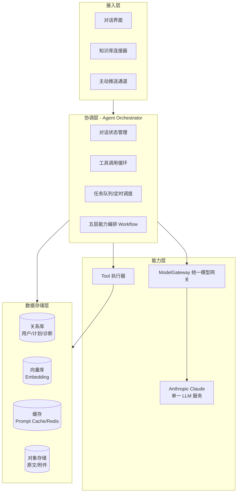
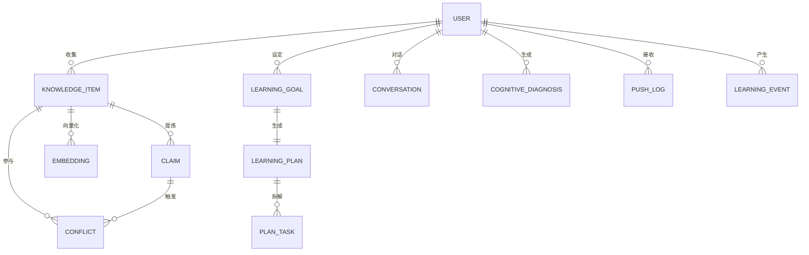
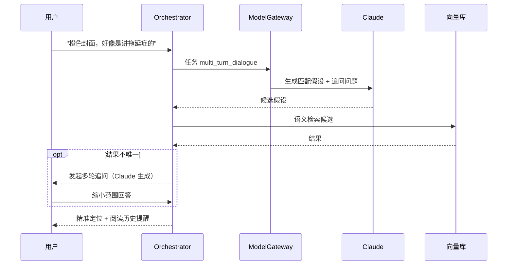
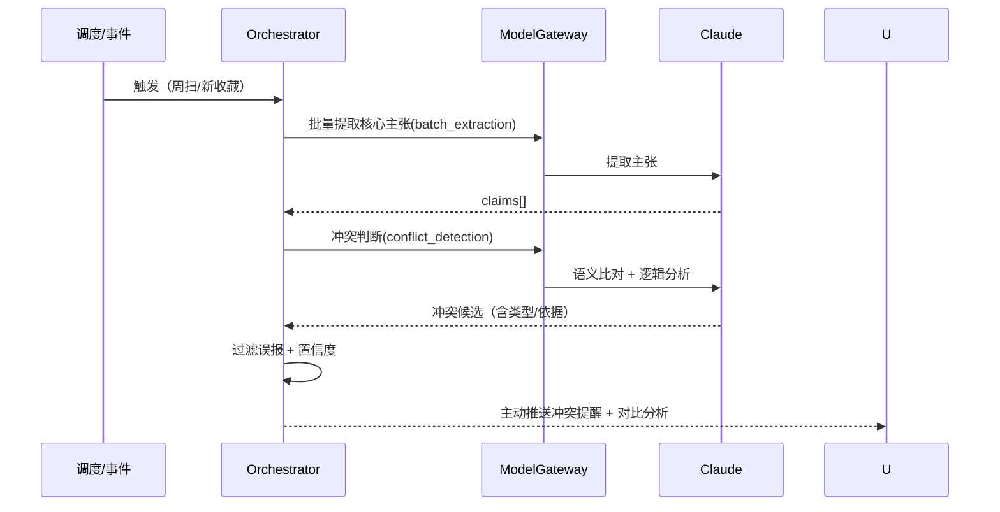
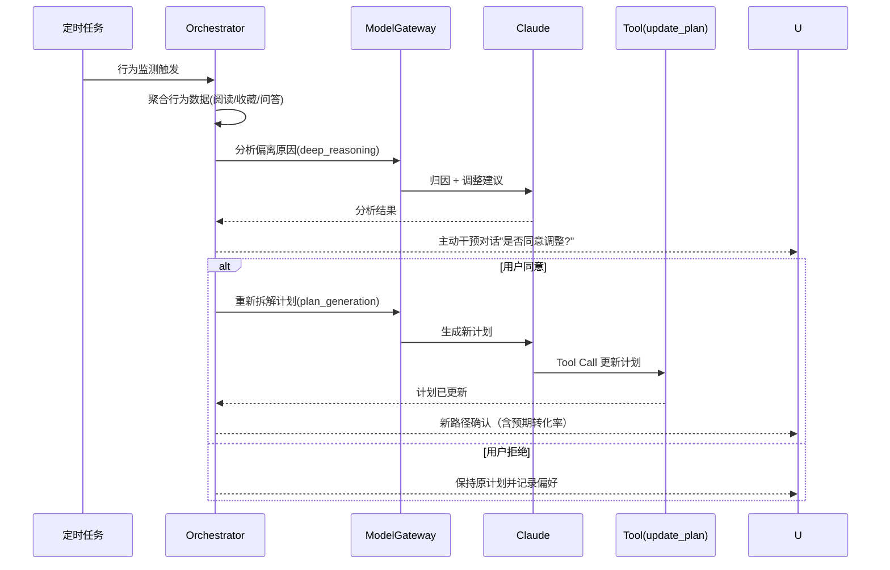
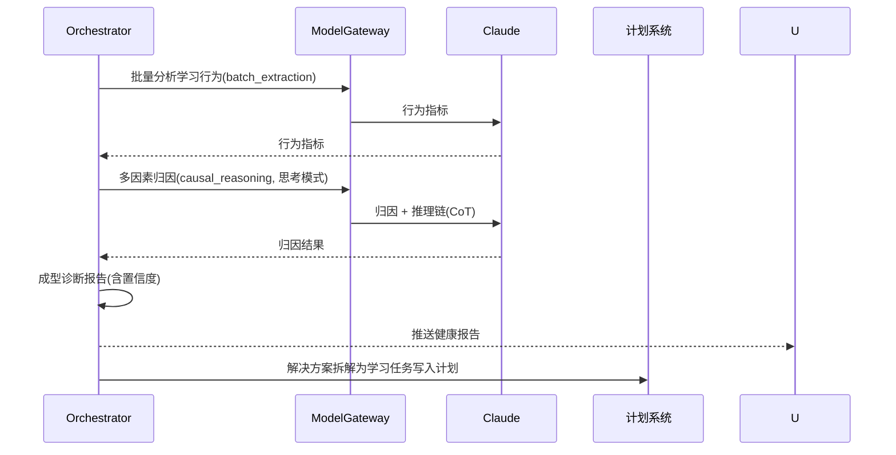
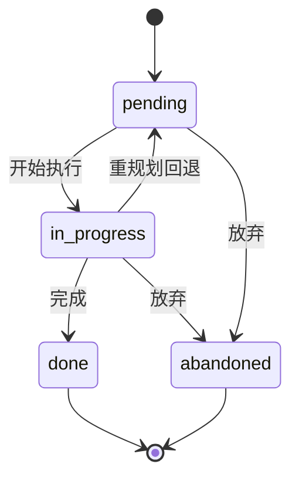
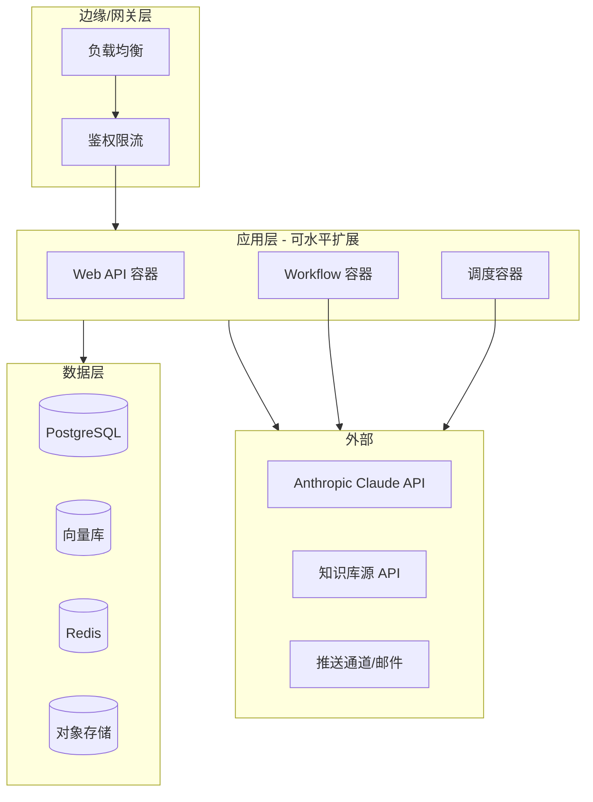

# 认知副驾（Cognitive Copilot）系统设计文档

> 版本：V2.1
> 主笔：系统设计组
> 日期：2026-09
> 参考文档：《需求分析文档.md》(需求分析说明书)、《认知副驾.md》(设计原型)、《架构设计文档.md》(架构决策 ADR-06~15)
> 参考标准：IEEE Std 1016（软件设计描述）、GB/T 8567（计算机软件文档编制规范）
> 修订说明：
> - V2.0 依据《需求分析文档》V2.0，将三引擎混合架构**简化为单一 LLM 服务（Anthropic Claude）**，业务层消除跨厂商路由。
> - **V2.1（本次）** 按软件工程行业标准补齐：新增运行设计（2.4）、状态设计（6.5）、系统出错处理设计（第 12 章）、
>   测试与验证策略（第 13 章）、需求追溯矩阵（第 15 章）；完善接口契约（8.1~8.5）、数据物理设计（4.5~4.7）、
>   安全设计（9.3）、部署与灾备（第 10 章）；新增 `Claim`、`LearningEvent` 实体，与《架构设计文档》ADR-09 / ADR-10 对齐。

---

## 目录

1. [文档说明](#1-文档说明)
2. [系统总体架构](#2-系统总体架构)
3. [核心技术架构](#3-核心技术架构)
4. [数据模型与存储设计](#4-数据模型与存储设计)
5. [模块详细设计（五大功能）](#5-模块详细设计五大功能)
6. [Agent 协调层与工具设计](#6-agent-协调层与工具设计)
7. [主动推送机制设计](#7-主动推送机制设计)
8. [接口设计](#8-接口设计)
9. [非功能性设计](#9-非功能性设计)
10. [部署架构设计](#10-部署架构设计)
11. [成本监控与优化设计](#11-成本监控与优化设计)
12. [系统出错处理设计](#12-系统出错处理设计)
13. [测试与验证策略](#13-测试与验证策略)
14. [风险与应对](#14-风险与应对)
15. [需求追溯矩阵](#15-需求追溯矩阵)
16. [附录](#16-附录)

---

## 1. 文档说明

### 1.1 文档目的
本文档在《需求分析文档》需求基线上，将「认知副驾」的功能性、非功能性需求转化为可落地、可编码、可测试的系统实现方案，作为开发、测试、运维的统一设计基线。

### 1.2 设计原则
- **一套网关，单一大模型**：所有模型调用由统一网关 `ModelGateway` 收敛，智能能力基于**单一 LLM 服务（Anthropic Claude）**，业务层不感知实现细节。
- **大脑 + 双手 + 记忆**：LLM 负责推理（大脑），Tool Calls 负责执行（双手），向量库+Prompt 缓存负责记忆。
- **能力分层调用**：在同一供应商内部，深度推理用高能力模型、批量/成本敏感任务用轻量模型，并充分启用 Prompt Caching，保持质量与成本的平衡。
- **可观测、可回滚**：每次模型调用均有日志与成本埋点，规则配置支持热更新；模型服务异常时统一重试与降级。

### 1.3 术语表
| 术语 | 说明 |
|---|---|
| ModelGateway | 统一模型网关，收敛全部模型调用，按任务类型映射调用策略 |
| LLM Provider | 单个模型服务封装（本期为 Anthropic Claude）|
| Tool Call | 大模型的函数调用机制，用于执行外部动作 |
| Prompt Cache | 服务端 Prompt 缓存，命中时输入费用大幅降低 |
| KnowledgeItem | 知识条目，用户收藏/笔记的基本单位 |
| CognitiveDiagnosis | 认知诊断报告（偏误诊断输出）|
| Orchestrator | 协调层，负责意图解析、工作流编排、Agent 循环 |
| Tool Registry | 工具白名单注册表，统一校验与执行 |

### 1.4 参考标准与规范

| 标准 / 文档 | 内容 | 本文档的落实方式 |
|---|---|---|
| IEEE Std 1016 | 软件设计描述（SDD）| 总体架构（第 2 章）、模块详细设计（第 5 章）、接口设计（第 8 章）、需求追溯矩阵（第 15 章）|
| GB/T 8567 | 计算机软件文档编制规范 | 运行设计（2.4）、系统出错处理设计（第 12 章）、安全保密设计（9.3）、维护设计（9.6、10.5）|
| 《需求分析文档》V2.0 | 功能性与非功能性需求基线 | 第 15 章追溯矩阵双向覆盖 |
| 《架构设计文档》V1.0 | ADR-06~15、关键算法、工程约束 | 本文 4.1（新实体）、2.4（运行设计）与其保持一致 |

### 1.5 读者对象与阅读建议

| 读者角色 | 重点关注章节 |
|---|---|
| 后端开发工程师 | 3、4、5、6、8 |
| 前端 / 客户端开发 | 8.1 接口契约、8.2 流式接口 |
| 测试工程师 | 13 测试与验证策略、15 需求追溯矩阵 |
| 运维 / SRE | 9 非功能性设计、10 部署架构、12 出错处理 |
| 产品与评审人员 | 1、2、15 |

### 1.6 文档约定

- 需求编号沿用《需求分析文档》：用例为 `UC-L1-01` 形式，非功能需求为 `性能-1`、`可靠-3`、`安全-2` 等形式。
- 架构决策编号：ADR-01~05 见 2.3，ADR-06~15 见《架构设计文档》，两处编号连续不冲突。
- 对外接口路径统一前缀 `/api/v1`，错误码见 8.4。
- 表述强度按 RFC 2119 语义：**必须**（MUST）、**应当**（SHOULD）、**建议**（MAY）。

---

## 2. 系统总体架构

### 2.1 逻辑分层架构

系统采用 **四层逻辑架构**，自上而下依次为：接入层、协调层（Agent Orchestrator）、能力层（统一模型网关 + 工具）、数据存储层。



各层职责与说明如下：

| 层级 | 关键组件 | 核心职责 | 说明 |
|---|---|---|---|
| 接入层 | 对话界面 / 知识库连接器 / 推送通道 | 与用户与外部源交互 | 三通道分别承接主动输入、知识导入、被动触达 |
| 协调层 | Orchestrator（状态机/循环/队列/工作流） | 意图解析、编排、Agent 循环 | 系统"大脑"，承载五大能力工作流 |
| 能力层 | ModelGateway + Claude + Tool 执行器 | 模型调用与实际动作执行 | 单一供应商，实现细节在网关内部收敛 |
| 数据存储层 | PG / 向量库 / 缓存 / 对象存储 | 状态、知识、成本等持久化 | 依赖第 4 章存储策略 |

### 2.2 技术选型初期清单

| 维度 | 选型 | 说明 |
|---|---|---|
| 服务端框架 | Python FastAPI | 异步，易集成 Anthropic SDK |
| 统一模型网关 SDK | 自研 `ModelGateway` 封装 | 统一调用参数/成本/重试/缓存 |
| 模型服务 | Anthropic Claude API | 单一 LLM 依赖，支持 Tool/Thinking/缓存 |
| 向量库 | 兼容 Milvus / pgvector | 知识条目 Embedding 语义检索 |
| 关系库 | PostgreSQL | 用户、计划、诊断、配置事务数据 |
| 缓存 | Redis | 会话状态、限流、短期记忆 |
| 任务调度 | Celery / APScheduler | 定时触发周/月简报、行为监测 |
| 知识库接入 | 官方 API / SDK | Notion、Obsidian、飞书、浏览器书签等 |
| 主动推送 | App 内通知 / SMTP 邮件 | weekly / daily / quiet 三种频率 |

> 说明：具体选型需在原型评审后最终锁定，本文档遵循「先接口、后实现」原则，保证可替换性。

### 2.3 关键架构决策（ADR）

| 决策编号 | 决策 | 理由 |
|---|---|---|
| ADR-01 | 采用「统一网关 + 单一 Claude」而非多厂商混合 | 简化架构与运维，聚焦产品能力；规避多供应商集成复杂度 |
| ADR-02 | 任务类型 → 调用策略静态映射（配表驱动） | 避免每次调用做在线路由的开销与不确定性 |
| ADR-03 | 知识条目持久化 + 向量化分离存储 | 原文入关系库/对象存储，Embedding 入向量库，便于增量更新 |
| ADR-04 | 主动推送采用定时任务 + 用户配置驱动 | 可控、可审计，避免智能体过度打扰 |
| ADR-05 | 工具调用采用白名单 Tool 注册表 | 只暴露必要能力，降低模型误导调用风险 |

### 2.4 运行设计

#### 2.4.1 运行模块组合（双链路）

系统按负载特性划分为两条独立运行的链路，**物理上分离为不同进程与资源池**（对应《架构设计文档》ADR-07）：

| 链路 | 运行进程 | 承载模块 | 触发方式 |
|---|---|---|---|
| 同步交互链路 | `api`（uvicorn 多副本）| 接入层、Orchestrator、L1 | 用户请求（HTTP / SSE）|
| 异步主动链路 | `worker`（Celery，按队列分池）+ `beat`（调度）| L2、L3、L4、L5、知识同步、向量化 | 定时调度 / 领域事件 |

> 说明：2.1 的四层是**逻辑分层**，本节是**运行时切分**，二者正交。同一能力模块的代码可能运行在两条链路上（例如 L2 的新内容实时检测由事件驱动、周扫描由定时驱动）。

#### 2.4.2 运行控制

| 控制项 | 设计 |
|---|---|
| 调度器 | `beat` 单实例 + Redis 分布式锁，保证定时任务不重复触发 |
| 队列划分 | 按能力分队列（`q_conflict` / `q_brief` / `q_plan` / `q_ingest`），各队列独立并发上限，避免批量任务互相挤占 |
| 并发控制 | 异步链路设全局并发上限；同一用户的同类任务串行，不并发 |
| 幂等 | 任务生成 `task_key = hash(capability, target_id, period_key)`，以唯一索引去重（详见 12.3）|
| 优先级 | 在线交互 > 实时冲突检测 > 周期任务 > 失败补跑 |
| 优雅停机 | 收到 `SIGTERM` 后停止接新任务，等待在途任务完成或超时（默认 5 分钟）后退出 |

#### 2.4.3 运行时间与资源占用

| 任务 | 频率 | 预期耗时 | 资源特征 |
|---|---|---|---|
| L1 多轮澄清 | 按需 | 秒级（首字 ≤ 3s）| CPU 低，I/O 密集（等待模型返回）|
| L2 新内容实时检测 | 事件驱动 | 秒级~十秒级 | CPU 低，I/O 密集 |
| L2 冲突周扫 | 每周 | 分钟级~十分钟级 | I/O 密集，批量模型调用 |
| L3 认知简报 | 每周 | 分钟级 | I/O 密集 |
| L4 行为监测 | 每日 | 秒级~分钟级 | CPU 中（聚合计算）+ I/O |
| L5 健康报告 | 每月 | 分钟级 | I/O 密集（思考模式耗时较长）|
| 知识同步与向量化 | 事件驱动 | 随条目量线性增长 | CPU 中（分块）+ I/O |

> **设计约束**：所有分钟级任务**必须**异步执行，禁止在 HTTP 请求线程内同步等待（对应需求 `性能-3`、`性能-4`）。

---

## 3. 核心技术架构

### 3.1 统一模型网关 `ModelGateway`

#### 3.1.1 模型服务配置

智能能力基于 **Anthropic Claude** 单一服务交付，网关按任务类型在供应商内部选择适当的模型尺寸与调用参数（全属同一供应商，不涉及跨厂商路由）。能力约束如下：

| 能力项 | 支持情况 | 用途 |
|---|---|---|
| 工具调用（Tool Calls）| 支持 | Agent 双手执行（计划更新、知识写入等）|
| 思考模式（Thinking）| 支持 | 深度因果推理（冲突判断、偏误归因）|
| 长上下文 | 支持 | 多轮澄清、长文上下文承载 |
| Prompt Caching | 支持 | 系统提示词/知识摘要缓存，命中降本 |
| 多尺寸模型 | 供应商内分层 | 深度任务用高性能型号，批量任务用轻量型号 |

> 成本预估：单一供应商在模型内型号分层 + Prompt Caching + 批量合并下沉轻量型号，具体单价以接入时为准（本文档不固锁价格，避免失真）。

#### 3.1.2 任务类型 → 调用策略

网关按任务类型静态映射**调用策略**（配表驱动，可热更新），各任务在同供应商内选择模型尺寸与关键参数。缺省策略为"默认对话模型"。

| 任务类型 | 典型业务场景 | 模型尺寸 | 关键参数 | 说明 |
|---|---|---|---|---|
| multi_turn_dialogue | 多轮对话、追问澄清（L1/L3）| 高性能模型 | 长上下文 | 承载完整澄清轮次 |
| deep_reasoning | 逻辑分析、语义比对（L2/L5）| 高性能模型 | 思考模式 | 深度推理质量优先 |
| conflict_detection | 主张冲突判断（L2）| 高性能模型 | 思考模式 | 需因果/逻辑链 |
| plan_generation | 计划生成/重规划（L4）| 高性能模型 | 启用工具调用（Tool Calls）| 规划与 Tool 能力 |
| causal_reasoning | 偏误因果归因（L5）| 高性能模型 | 思考模式 | 多因素归因 |
| cognitive_brief | 认知简报/追问生成（L3）| 高性能模型 | 提示词模板 | 生成式任务 |
| batch_extraction | 批量核心主张提取（L2/L5 前置）| 轻量模型 | 批量合并 + 缓存 | 成本敏感、键盘吞吐 |
| topic_analysis | 主题分布/深度分析（L3）| 轻量模型 | 批量合并 | 批量计算，轻量足够 |

调用流程：

```mermaid
flowchart LR
    Task[任务类型] --> P{策略映射}
    P -->|对话/深度/冲突/规划| H[Claude 高性能+各参数]
    P -->|简报/生成| H2[Claude 高性能+提示词模板]
    P -->|批量提取/主题分析| L[Claude 轻量型号+批量]
    H --> Fail{超时/失败?}
    H2 --> Fail
    L --> Fail
    Fail -->|是| Retry[统一重试(2次)/降级]
```

#### 3.1.3 网关核心职责

| 职责 | 说明 | 关键行为 |
|---|---|---|
| 任务→策略映射 | 按任务类型匹配调用参数 | 未命中返回缺省策略（默认对话模型）|
| 成本估算与限额 | 调用前预算、调用后结算落账 | 全链路成本埋点，超限熔断 |
| 重试与降级 | 单次请求失败统一处理 | 重试 2 次；向量库等依赖降级见 9.2 |
| 安全 | 多租户隔离与合规 | key 隔离、额度配额、敏感词过滤 |

### 3.2 记忆与上下文管理

采用 **三级记忆** 体系：

| 记忆层级 | 载体 | 说明 |
|---|---|---|
| 短期记忆 | Redis / 会话上下文 | 当前多轮对话历史、工具调用中间态 |
| 中期记忆 | Prompt Cache | 知识库摘要、常用系统提示词，命中降本 |
| 长期记忆 | PostgreSQL + 向量库 | 知识条目、学习计划、历史诊断、用户画像 |

**Prompt Caching 策略**：系统提示词、知识库全量摘要等高频不变内容打上缓存标记，命中后输入费用大幅降低（Anthropic Prompt Caching）。

---

## 4. 数据模型与存储设计

### 4.1 核心数据实体（ER 概念模型）



各实体核心字段如下（字段级设计；所有实体统一含 `id` 主键、`is_deleted` 软删除标记、`version` 乐观锁版本号、`created_at` / `updated_at` 时间戳，表内不再重复列出）。

**① User（用户）**

| 字段 | 类型 | 说明 | 约束 |
|---|---|---|---|
| nickname | VARCHAR(64) | 昵称 | NOT NULL |
| avatar_url | VARCHAR(255) | 头像地址 | - |
| push_preference | ENUM | 推送频率偏好：weekly / daily / quiet | 默认 weekly |
| api_key_enc | VARCHAR(255) | 加密后的租户 key | 敏感字段加密存储 |

**② KnowledgeItem（知识条目）**

| 字段 | 类型 | 说明 | 约束 |
|---|---|---|---|
| user_id | VARCHAR(32) | 所属用户 | FK → User.id |
| title | VARCHAR(255) | 标题 | NOT NULL |
| content | TEXT | 正文/长文原文快照 | - |
| source | ENUM | 来源：浏览器书签/Notion/Obsidian/飞书 | NOT NULL |
| url | VARCHAR(255) | 原文链接 | 可空 |
| tags | TEXT[] | 标签列表 | - |
| collected_at | TIMESTAMP | 收藏时间 | 默认 now |
| last_read_at | TIMESTAMP | 最近阅读时间 | 可空 |
| read_progress | DECIMAL(3,2) | 阅读进度 0-1 | 默认 0 |
| embedding_id | VARCHAR(64) | 向量库关联 id | 可空 |
| claims | JSONB | 语义提取的核心主张缓存 | 由批量提取任务产出 |
| is_deleted | BOOLEAN | 软删除 | 见 4.4 |

**③ LearningGoal / LearningPlan / PlanTask**

LearningGoal（学习目标）：

| 字段 | 类型 | 说明 | 约束 |
|---|---|---|---|
| user_id | VARCHAR(32) | 所属用户 | FK → User.id |
| description | TEXT | 目标描述 | NOT NULL |
| target_date | TIMESTAMP | 目标期限 | NOT NULL |
| priority | SMALLINT | 优先级 1高/2中/3低 | 默认 2 |
| achieved | BOOLEAN | 是否达成 | 默认 false |

LearningPlan（学习计划）：

| 字段 | 类型 | 说明 | 约束 |
|---|---|---|---|
| user_id | VARCHAR(32) | 所属用户 | FK → User.id |
| goal_id | VARCHAR(32) | 关联目标 | FK → LearningGoal.id |
| schedule | JSONB | 结构化计划内容 | 计划整体以 JSON 存储 |
| created_at / updated_at | TIMESTAMP | 创建/更新时间 | - |

PlanTask（计划任务）：

| 字段 | 类型 | 说明 | 约束 |
|---|---|---|---|
| plan_id | VARCHAR(32) | 所属计划 | FK → LearningPlan.id |
| week | SMALLINT | 对应周次 | NOT NULL |
| topic | VARCHAR(255) | 任务主题 | NOT NULL |
| status | ENUM | pending/in_progress/done/abandoned | 默认 pending |
| source_items | TEXT[] | 关联的知识条目 id 列表 | - |

**④ CognitiveDiagnosis（认知诊断报告）**

| 字段 | 类型 | 说明 | 约束 |
|---|---|---|---|
| user_id | VARCHAR(32) | 所属用户 | FK → User.id |
| pattern | VARCHAR(64) | 行为模式，如"高收藏低完成" | - |
| root_cause | TEXT | 归因诊断 | - |
| confidence | DECIMAL(4,3) | 置信度 0-1 | - |
| suggested_action | TEXT | 可执行方案 | - |
| reasoning_chain | JSONB | 简要推理链（CoT）| 增强可信度 |
| status | ENUM | pending/accepted/rejected | 默认 pending |

**⑤ Conflict（观点冲突）**

| 字段 | 类型 | 说明 | 约束 |
|---|---|---|---|
| user_id | VARCHAR(32) | 所属用户 | FK → User.id |
| item_a_id | VARCHAR(32) | 冲突条目 A | FK → KnowledgeItem.id |
| item_b_id | VARCHAR(32) | 冲突条目 B | FK → KnowledgeItem.id |
| conflict_type | VARCHAR(32) | 冲突类型（逻辑矛盾/事实冲突等）| - |
| detail | TEXT | 冲突细节描述 | - |
| suggestion | TEXT | 建议动作 | - |
| confidence | DECIMAL(4,3) | 置信度 | 低于阈值不入库 |
| user_state | ENUM | unseen/ignored/accepted | 默认 unseen |
| claim_a_id | VARCHAR(32) | 触发冲突的主张 A | FK → Claim.id，可空 |
| claim_b_id | VARCHAR(32) | 触发冲突的主张 B | FK → Claim.id，可空 |

> `claim_a_id` / `claim_b_id` 记录冲突判定的最小比对粒度，便于复盘与误报分析；`item_a_id` / `item_b_id` 保留条目级溯源。

**⑥ Claim（核心主张）** —— 新增实体，对应《架构设计文档》ADR-09

**定位**：冲突检测的最小比对粒度。V2.0 中主张仅作为 `KnowledgeItem.claims`（JSONB）缓存存在，无法做增量与近邻检索，导致冲突检测退化为全量两两比对。V2.1 将其提升为一等实体。

| 字段 | 类型 | 说明 | 约束 |
|---|---|---|---|
| user_id | VARCHAR(32) | 所属用户 | FK → User.id，NOT NULL |
| item_id | VARCHAR(32) | 来源知识条目 | FK → KnowledgeItem.id，NOT NULL |
| statement | TEXT | 归一化后的可比对主张陈述 | NOT NULL |
| topic | VARCHAR(128) | 主题标签（同主题预筛）| 建议必填 |
| polarity | SMALLINT | 立场极性：-1 否定 / 0 中性 / 1 肯定 | 默认 0 |
| strength | DECIMAL(3,2) | 表述强度 0-1 | 默认 0.5 |
| confidence | DECIMAL(3,2) | 抽取置信度 | 默认 0.5 |
| embedding_id | VARCHAR(64) | 主张向量关联 id | 可空 |
| content_hash | VARCHAR(64) | statement 归一化哈希 | 同 item 内唯一，抽取去重 |
| extractor_version | VARCHAR(32) | 抽取提示词版本 | 用于版本迁移与重抽 |

**⑦ LearningEvent（学习行为事件）** —— 新增实体，对应《架构设计文档》ADR-10

**定位**：L4（行为偏离监测）与 L5（多因素归因）的**唯一事实来源**。V2.0 仅有 `KnowledgeItem.last_read_at` / `read_progress` 等快照字段，无法支撑时序分析（无法回答「连续几天没读」「本周阅读量环比」），故补齐事件流。

| 字段 | 类型 | 说明 | 约束 |
|---|---|---|---|
| user_id | VARCHAR(32) | 所属用户 | FK → User.id，NOT NULL |
| event_type | ENUM | read / collect / qa / plan_task_done / push_click / push_ignore / goal_set | NOT NULL |
| ref_type | VARCHAR(32) | 关联对象类型：item / task / plan / push | 可空 |
| ref_id | VARCHAR(32) | 关联对象 id | 可空 |
| occurred_at | TIMESTAMP | 行为发生时间 | NOT NULL |
| payload | JSONB | 事件细节（阅读时长、增量、问答轮次等）| 可空 |
| source | VARCHAR(32) | 来源端：web / mail / system | 默认 system |

**设计约束**：
- **只追加、不修改**（append-only）。事件是既成事实，禁止 UPDATE；更正以新事件表达。
- `occurred_at` 与 `created_at` 分离，允许客户端补报。
- 埋点位置：阅读进度更新、收藏入库、每轮对话完成、任务置为完成、推送点击/忽略。

**⑧ Conversation（会话）+ PushLog（推送日志）**

Conversation（会话状态）：

| 字段 | 类型 | 说明 | 约束 |
|---|---|---|---|
| user_id | VARCHAR(32) | 所属用户 | FK → User.id |
| state | ENUM | 当前状态机状态（见 6.3）| 默认 idle |
| context | JSONB | 会话上下文/中间态 | 短期记忆载体 |

PushLog（推送日志）：用于追溯与 A/B 调整。

| 字段 | 类型 | 说明 | 约束 |
|---|---|---|---|
| user_id | VARCHAR(32) | 接收用户 | FK → User.id |
| push_type | VARCHAR(32) | conflict / question / brief / diagnosis | - |
| content_hash | VARCHAR(64) | 去重指纹 | 用于防骚扰去重 |
| channel | ENUM | app / email | - |
| sent_at | TIMESTAMP | 发送时间 | - |
| user_feedback | ENUM | 忽略/采纳/未响应 | 可空，收敛同类推荐 |

### 4.2 存储选型与分库策略

| 存储 | 数据 | 访问模式 |
|---|---|---|
| PostgreSQL | 用户、目标、计划、诊断、推送日志、配置 | 事务强一致，结构化查询 |
| 向量库（pgvector / Milvus）| KnowledgeItem 的 Embedding | 语义相似度检索 |
| Redis | 会话状态、限流计数、短期记忆 | 低延迟读写 |
| 对象存储（S3/MinIO）| 原文附件、长文原文快照 | 大文件持久化 |

### 4.3 向量化与语义检索

- 每新增/更新知识条目 → 生成 Embedding 写入向量库。
- 增量更新策略：仅对 content/claims 变更的条目重新向量化（时间戳增量批次）。
- 检索接口：`search_similar(query_vec, top_k, filters)`，支持按 tags / source / 时间范围过滤。
- 淘汰策略：冷条目定期归档（标记 `is_deleted`，不再参与检索，避免噪声）。

### 4.4 数据生命周期与软删除

全表采用软删除（`is_deleted` + `deleted_at`），避免误删不可恢复；提供定期物理清理任务。

| 阶段 | 触发 | 状态 | 说明 |
|---|---|---|---|
| 生效 | 创建 | is_deleted = false | 正常参与检索/计算 |
| 归档 | 长期未访问 | is_deleted = true | 不再参与检索，仍可恢复 |
| 物理清理 | 保留期到期 | 物理删除 | 定期任务删除，彻底擦除 |

### 4.5 物理设计与索引

| 表 | 索引 | 类型 | 说明 |
|---|---|---|---|
| knowledge_item | (user_id, is_deleted, collected_at DESC) | BTREE | 用户知识列表分页 |
| knowledge_item | (user_id, source) | BTREE | 按来源筛选 |
| knowledge_item | sync_state | BTREE | 同步任务扫描待处理条目 |
| knowledge_item | embedding | HNSW（pgvector）| 语义检索 |
| claim | (user_id, topic) | BTREE | 同主题预筛（冲突漏斗 L2-3）|
| claim | (item_id, content_hash) | UNIQUE | 主张抽取去重 |
| claim | embedding | HNSW（pgvector）| 主张近邻检索 |
| learning_event | (user_id, occurred_at DESC) | BTREE | 时间窗聚合（L4 / L5）|
| learning_event | (user_id, event_type, occurred_at) | BTREE | 按事件类型聚合 |
| conflict | (user_id, user_state) | BTREE | 待推送冲突查询 |
| push_log | (user_id, content_hash) | UNIQUE | 推送去重 |
| plan_task | (plan_id, week) | BTREE | 计划周次查询 |
| 各业务表 | (is_deleted) | 部分索引 | 软删除过滤 |

**分区策略**：`learning_event` 增长最快，按 `occurred_at` 做**月度范围分区**，保留 24 个月后归档转冷存。

### 4.6 容量估算

以单用户为基准估算（MVP 阶段按 1,000 活跃用户推算总量）：

| 对象 | 单用户规模 | 单条估算 | 小计 |
|---|---|---|---|
| KnowledgeItem | 2,000 条 | 正文 8 KB + 元数据 1 KB | ≈ 18 MB |
| Claim | 每条目 3 条 → 6,000 条 | 0.5 KB | ≈ 3 MB |
| Embedding | 8,000 条（条目 + 主张）| 1536 维 × 4 B ≈ 6 KB | ≈ 48 MB |
| LearningEvent | 50 条/天 × 730 天 | 0.2 KB | ≈ 7 MB |
| 计划 / 诊断 / 推送日志 | — | — | ≈ 2 MB |
| **单用户合计** | | | **≈ 78 MB** |
| **1,000 用户合计**（含索引与冗余）| | | **≈ 100 GB** |

> 向量数据占比约 60%，是容量规划的主要变量。若用户量或条目量显著超预期，优先评估向量库独立扩容（ADR-08 已预留 Milvus 迁移路径）。

### 4.7 跨存储一致性

系统同时写入关系库与向量库，无法用单一事务保证强一致，采用**最终一致 + 对账补偿**：

| 场景 | 处理策略 |
|---|---|
| 条目写入成功、向量化失败 | 条目保持 `sync_pending`，由补偿任务重试；该条目暂不可召回，不影响其他条目 |
| 向量写入成功、条目回滚 | 以关系库为准，补偿任务按 `embedding_id` 清理孤儿向量 |
| 条目软删 / 归档 | 同步任务将向量标记为不可召回；物理清理时一并删除向量 |
| 对账机制 | 每日对账任务比对 `embedding_id` 存在性与条目状态，差异入补偿队列并告警 |

**顺序约定**：**先写关系库（事实来源），再异步写向量库**。任何读取路径以关系库状态为准；向量库仅用于召回，不参与业务判定。

---

## 5. 模块详细设计（五大功能）

五大功能按智能体主动性从低到高（L1→L5），每个功能采用统一的 **Agent 工作流五步范式：感知 → 推理 → 生成/规划 → 行动 → 交付**。全部推理、生成由统一网关调用 **Claude** 完成。

各功能概览：

| 功能 | 层级 | 主动性 | 触发方式 | 调用策略 | 输出 |
|---|---|---|---|---|---|
| 认知挖掘 | L1 | 低（被动响应）| 用户输入模糊意图 | multi_turn_dialogue | 精准内容定位 |
| 冲突检测 | L2 | 中（主动扫描）| 周扫 / 新收藏 | batch_extraction + conflict_detection | 冲突提醒 + 对比 |
| 认知助产 | L3 | 中（主动追问）| 周简报 / 完成后 | topic_analysis + cognitive_brief | 深度追问问题 |
| 路径自我修正 | L4 | 高（主动干预）| 行为监测 / 用户请求 | plan_generation + Tool | 调整后计划 |
| 偏误诊断 | L5 | 高（主动汇报）| 月度 / 用户询问 | batch_extraction + causal_reasoning | 健康报告 |

### 5.1 L1 模糊意图的"认知挖掘"

**目标**：用户在仅有碎片化线索时，通过多轮追问逐步澄清意图并定位内容。

**触发条件**

| 触发特征 | 示例 |
|---|---|
| 输入含模糊指代词 | "那个 / 之前看的 / 有一篇" |
| 输入缺乏精准关键词 | 口语化、零散描述 |
| 输入含感官描述 | 颜色、人物特征、场景 |

**Agent 工作流**



**技术要点**
- 用 Claude 长上下文承载完整多轮澄清对话。
- 向量语义相似度 + 关键词兜底双通道召回。
- 追问问题由 Claude 动态生成，不强依赖预设模板。

### 5.2 L2 隐性认知"冲突检测"

**目标**：全量识别知识库中逻辑主张/核心观点的矛盾，主动提醒。

**触发条件**
- 主动：每周自动扫描新增内容
- 被动：用户收藏新文章时实时检测

**Agent 工作流**



**冲突输出结构**（对应 `Conflict` 实体）

| 字段 | 说明 |
|---|---|
| item_a | 冲突条目 A（如"长期主义者的决策框架"）|
| item_b | 冲突条目 B（如"敏捷思维：快速试错"）|
| conflict_type | 冲突类型（如"逻辑矛盾"）|
| detail | 冲突细节（如"A主张坚守至少3年，B主张每月掉头"）|
| suggestion | 建议动作（如"需要生成决策哲学对比表吗？"）|

**技术要点**
- 批量主张提取用轻量型号 + Prompt Caching 降本。
- 冲突判断用 Claude 思考模式做深度逻辑推理（质量优先）。
- 加入 **误报抑制**：低于置信度阈值或用户曾"忽略"同类型冲突时收敛推荐。

### 5.3 L3 苏格拉底式"认知助产"

**目标**：分析主题分布与认知深度，生成用户"该问但没问"的深度问题。

**触发条件**
- 主动：每周认知简报含 2-3 个生成式追问
- 被动：完成问答或收藏新内容后追加追问

**Agent 工作流**

| 步骤 | 动作 | 调用策略 | 说明 |
|---|---|---|---|
| 1 感知 | 批量扫描知识库，识别主题分布与深度层级 | topic_analysis | 轻量批量处理 |
| 2 分析 | 识别"大量存在 / 完全缺失"模式 | cognitive_brief | 如 15 篇"如何开始"类 vs 平台期缺失 |
| 3 生成 | 基于缺失项生成启发式深度问题 | cognitive_brief | 生成式任务，附数据依据 |
| 4 行动 | 推送问题 + 数据依据 | Orchestrator | - |
| 5 交付 | 提出解决方案建议 | Orchestrator | - |

**技术要点**：生成任务采用 Claude 高性能型号配提示词模板；主题分布分析用轻量型号控制成本；追问保留数据依据，增强信服力。

### 5.4 L4 动态"路径自我修正"

**目标**：监测计划执行情况，行为偏离时自主分析原因并提议调整。

**触发条件**

| 触发特征 | 示例 |
|---|---|
| 连续未按计划执行 | 连续 N 天（默认 3）未执行 |
| 行为模式显著变化 | 收藏 SQL 类内容激增 |
| 用户主动请求 | 用户要求调整计划 |

**Agent 工作流**



**技术要点**
- 计划以结构化 JSON 存储（PostgreSQL 的 jsonb）。
- 计划更新通过 `update_plan` 工具调用实现（规避直接改库，保证 Agent 动作受控）。
- 行为监测由应用层定时任务触发，不入模型主链路。

### 5.5 L5 归因式"学习偏误诊断"

**目标**：不仅展示行为统计，更链式推理出行为背后的认知病根，给可执行方案。

**触发条件**
- 主动：每月生成"学习健康报告"
- 被动：用户主动询问学习相关问题

**Agent 工作流**



**输出**：见 [4.1 节](#41-核心数据实体er-概念模型) `CognitiveDiagnosis` 实体，含 `reasoning_chain` 简要版以增强可信度。

**技术要点**：启用 Claude 思考模式（Thinking）做因果推理；诊断结论建议主动询问是否采纳，采纳后回写计划系统形成闭环。

---

## 6. Agent 协调层与工具设计

### 6.1 "大脑 + 双手" Agent 架构

| 角色 | 承担者 | 职责 |
|---|---|---|
| 大脑 | Orchestrator + LLM | 意图解析、推理、规划、生成 |
| 双手 | Tool 执行器 | 通过 Tool Calls 执行持久化动作 |

### 6.2 工具注册表（白名单）

| 工具名 | 动作 | 权限 | 由谁调用 |
|---|---|---|---|
| `create_goal` | 创建学习目标 | 用户确认 | Claude 规划 |
| `update_plan` | 更新学习计划 | 用户确认 | Claude 规划 |
| `create_diagnosis` | 写入诊断报告 | 系统 | Claude/Orchestrator |
| `mark_conflict` | 标记冲突（忽略/采纳）| 用户 | Orchestrator |
| `create_push_job` | 登记推送任务 | 系统 | Orchestrator |
| `search_knowledge` | 语义检索 | 只读 | 任意能力 |

**工具调用循环**：

| 步骤 | 动作 | 说明 |
|---|---|---|
| 1 | 模型请求工具调用 | Claude 输出 tool_call |
| 2 | Orchestrator 校验白名单与参数 | 越权/非法参数拦截 |
| 3 | 执行工具 | 实际落地动作 |
| 4 | 结果回注上下文 | 作为下一步输入 |
| 5 | 循环直至任务结束 | 受最大轮数限制（默认 6）|

### 6.3 对话状态机

| 状态 | 含义 | 所属功能 | 可迁移到 |
|---|---|---|---|
| idle | 空闲等待输入 | - | listening |
| listening | 倾听输入 | 全部 | idle / clarifying / reasoning |
| clarifying | 多轮澄清 | L1 | reasoning / idle |
| reasoning | 深度推理 | L2/L5 | planning / delivering |
| planning | 计划调整 | L4 | waiting_user_confirm |
| waiting_user_confirm | 等待用户确认 | L4/L5 | idle / delivering |
| delivering | 推送/交付 | 全部 | idle |

状态迁移总览：

```
idle → listening(等待输入)
     → clarifying(多轮澄清, L1)
     → reasoning(深度推理, L2/L5)
     → planning(计划调整, L4)
     → waiting_user_confirm(等待确认, L4/L5)
     → delivering(推送/交付) → idle
```

超时策略：`waiting_user_confirm` 状态超过设定时间自动回 `idle` 并记录待办提醒。

### 6.4 任务队列与定时调度

| 任务 | 频率 | 触发方式 | 说明 |
|---|---|---|---|
| 冲突周扫 | 每周 | APScheduler | 遍历新增知识条目 |
| 认知简报 | 每周 | APScheduler | 汇总 L2+L3 结果推送 |
| 行为监测 | 每日 | APScheduler | 检查计划执行偏移 |
| 学习健康报告 | 每月 | APScheduler | 归因诊断 |
| 向量增量更新 | 事件驱动 / 定时 | 消息队列 | 新条目向量化 |

### 6.5 关键对象状态设计

6.3 定义了会话状态机，本节补充其余关键业务对象的状态迁移。所有状态字段**必须**在数据库层以枚举约束，并记录状态变更时间戳与变更来源（用户 / 系统 / 任务）。

#### 6.5.1 PlanTask（计划任务）

| 状态 | 含义 | 可迁移到 | 触发者 |
|---|---|---|---|
| pending | 待开始 | in_progress / abandoned | 用户 / 系统 |
| in_progress | 进行中 | done / abandoned / pending | 用户 / 系统 |
| done | 已完成 | —（终态）| 用户确认 / 系统判定 |
| abandoned | 已放弃 | —（终态）| 用户 / 重规划 |



> 重规划时允许 `in_progress → pending` 回退，对应需求 UC-L4-02 步骤 5「系统重拆计划」。

#### 6.5.2 Conflict（观点冲突）

| 状态 | 含义 | 可迁移到 | 说明 |
|---|---|---|---|
| unseen | 未读 | ignored / accepted | 默认态，可被推送 |
| ignored | 用户忽略 | —（终态）| 计入同类收敛计数 |
| accepted | 用户采纳 | —（终态）| 作为后续推荐的正样本 |

> 收敛规则：同一用户在同一 `conflict_type` 下累计 `ignored ≥ 3`，该类冲突自动降低推送权重（需求 UC-L2-03 扩展 2a）。

#### 6.5.3 PushJob（推送任务）

| 状态 | 含义 | 可迁移到 |
|---|---|---|
| pending | 待发送 | sent / suppressed / failed |
| suppressed | 被抑制（去重 / 收敛 / 免打扰）| —（终态）|
| sent | 已发送 | delivered / failed |
| delivered | 已送达 | —（终态）|
| failed | 发送失败 | pending（重试）/ —（终态，入死信）|

#### 6.5.4 KnowledgeItem 同步状态

| 状态 | 含义 | 可迁移到 |
|---|---|---|
| sync_pending | 待同步 | syncing / sync_failed |
| syncing | 同步中 | embedded / sync_failed |
| embedded | 已向量化（可检索）| claimed / archived |
| claimed | 已提取核心主张 | archived |
| sync_failed | 同步失败 | sync_pending（重试）|

> `archived` 对应 4.4 的归档阶段（`is_deleted = true`），不再参与检索；`claimed` 状态依赖 4.1 新增的 `Claim` 实体。

---

## 7. 主动推送机制设计

### 7.1 推送频率策略

| 频率 | 含义 | 推送内容 |
|---|---|---|
| `weekly`（默认）| 每周一推 | 认知简报：1 处冲突 + 2-3 个追问 |
| `daily` | 每日轻推 | 单条冲突 / 单条追问 |
| `quiet` | 免打扰 | 仅重大诊断时才推 |

### 7.2 推送模板

**周认知简报**

| 区块 | 内容 |
|---|---|
| 标题 | 📰 认知简报 - 第{n}周 |
| 冲突检测 | ⚡ 检测到 {n} 处观点冲突 |
| 追问推荐 | 🤔 {n} 个值得思考的问题 |
| 本周活跃度 | 📊 新增 {n} 条知识 |

### 7.3 推送质量与防骚扰

| 机制 | 说明 |
|---|---|
| 内容去重 | 同类型内容按冲突对/问题 hash 去重 |
| 收敛推荐 | 用户忽略同一类型 ≥3 次 → 自动收敛该类推荐 |
| 全量追溯 | 推送写入 `PushLog`，支持 A/B 调整与审计 |

---

## 8. 接口设计

### 8.1 对外 REST API（示意）

| 方法 | 路径 | 说明 |
|---|---|---|
| POST | `/api/v1/chat` | 对话入口（自然语言） |
| POST | `/api/v1/knowledge` | 新增知识条目 |
| GET | `/api/v1/knowledge/{id}` | 查询条目 |
| POST | `/api/v1/knowledge/import` | 接入知识库源（Notion/Obsidian/书签）|
| POST | `/api/v1/goals` | 设定学习目标 |
| GET | `/api/v1/plan` | 查询学习计划 |
| POST | `/api/v1/plan/{id}/adjust` | 请求路径调整 |
| GET | `/api/v1/diagnosis/latest` | 最新诊断报告 |
| PUT | `/api/v1/preferences` | 更新推送频率/偏好 |
| GET | `/api/v1/costs` | 成本明细 |

**统一约定**

| 项 | 约定 |
|---|---|
| 请求格式 | `Content-Type: application/json` |
| 鉴权 | `Authorization: Bearer <token>` |
| 统一响应错误体 | `{code, message, request_id}` |
| 链路追踪 | 全链路贯穿 `request_id` |

### 8.2 通用约定

#### 8.2.1 请求与响应封装

所有接口使用统一响应包装：

```json
{
  "code": 0,
  "message": "ok",
  "data": { },
  "request_id": "req_01J8Z9K2M4"
}
```

- 成功时 `code = 0`；失败时 `code ≠ 0` 且 `data` 为 `null`。
- `request_id` 由网关生成并贯穿全链路，客户端**必须**在问题反馈时提供。

#### 8.2.2 分页

| 项 | 约定 |
|---|---|
| 入参 | `page`（从 1 开始，默认 1）、`page_size`（默认 20，最大 100）|
| 出参 | `data.items` + `data.pagination {page, page_size, total, has_more}` |
| 游标 | 时间序列表（知识条目、行为事件）额外支持 `cursor` 游标分页，避免深翻页性能退化 |

#### 8.2.3 幂等

| 方法 | 要求 |
|---|---|
| GET / PUT / DELETE | 天然幂等 |
| POST | **必须**支持 `Idempotency-Key` 请求头；服务端按 key 缓存首次响应 24 小时 |

> 涉及写入的 POST（新增知识、设定目标、调整计划）客户端**必须**携带 `Idempotency-Key`，避免网络重试产生重复数据。

#### 8.2.4 限流

| 层级 | 策略 |
|---|---|
| 用户级 | 令牌桶，默认 60 req/min；模型调用另按成本额度单独限制 |
| 接口级 | 写接口与模型相关接口单独限流，默认 10 req/min |
| 超限响应 | HTTP 429 + 错误码 `4001` / `4002`，响应头返回 `Retry-After` |

#### 8.2.5 版本管理

- 路径前缀 `/api/v1`；不兼容变更升主版本（`/api/v2`），兼容性的新增字段不升版。
- 服务端**应当**同时维护至多两个主版本，旧版本至少保留 6 个月，下线前 30 天公告。

### 8.3 核心接口契约

#### 8.3.1 POST `/api/v1/chat` —— 对话入口

请求：

```json
{
  "conversation_id": "conv_9f2a",
  "message": "橙色封面，好像是讲拖延症的",
  "stream": true
}
```

响应（非流式）：

```json
{
  "code": 0,
  "data": {
    "conversation_id": "conv_9f2a",
    "reply": "你说的是《拖延心理学》吗？我找到 3 个候选……",
    "state": "clarifying",
    "candidates": [
      {"item_id": "itm_001", "title": "拖延心理学", "score": 0.91}
    ]
  },
  "request_id": "req_01J8Z9K2M4"
}
```

> `state` 取自 6.3 对话状态机；`candidates` 仅在 L1 澄清态返回。

#### 8.3.2 POST `/api/v1/knowledge/import` —— 知识源接入

请求：

```json
{"source": "notion", "auth_token": "<用户授权凭证>", "since": "2026-01-01T00:00:00Z"}
```

响应 `202 Accepted`，返回 `job_id`；同步为异步任务，客户端轮询 `GET /api/v1/jobs/{job_id}`（对应 UC-G-01 扩展 2a「连接失败可重试，不阻塞已有数据」）。

#### 8.3.3 POST `/api/v1/plan/{id}/adjust` —— 计划调整

请求：

```json
{"reason": "连续3天未执行", "auto_apply": false}
```

响应返回新计划草案与预期收益，**需用户确认后**经 `update_plan` 工具落库（对应 UC-L4-02 步骤 5）。

#### 8.3.4 GET `/api/v1/diagnosis/latest` —— 最新诊断

响应含 `pattern`、`root_cause`、`confidence`、`reasoning_chain`、`status`。其中 `confidence` 为**校准后置信度**（模型自评与统计信号融合，见《架构设计文档》7.3），不是模型原始自评值。

### 8.4 流式接口（SSE）

模型输出首字延迟要求 ≤ 3s（需求 `性能-1`），对话接口**必须**支持 SSE 流式返回：

```
GET /api/v1/chat/stream?conversation_id=conv_9f2a
Accept: text/event-stream
```

事件类型：

| event | data 示例 | 说明 |
|---|---|---|
| `token` | `{"delta":"你说的是"}` | 增量文本 |
| `tool_call` | `{"tool":"update_plan","status":"pending_confirm"}` | 工具调用待用户确认 |
| `state` | `{"from":"clarifying","to":"reasoning"}` | 状态机迁移通知 |
| `error` | `{"code":3001,"message":"模型服务不可用"}` | 异常中断 |
| `done` | `{"finish_reason":"stop","cost":{"tokens":128}}` | 正常结束 |

**客户端要求**：断线后按 `Last-Event-ID` 重连；服务端保留最近 5 分钟事件用于续传。

### 8.5 错误码与异常模型

**错误分类**

| 分类 | 码段 | 处理策略 |
|---|---|---|
| 客户端错误 | 1xxx | 不重试，提示用户修正 |
| 资源错误 | 2xxx | 不重试 |
| 依赖错误 | 3xxx | 服务端重试，可降级 |
| 限流错误 | 4xxx | 客户端按 `Retry-After` 退避重试 |
| 服务端错误 | 5xxx | 服务端重试，失败入死信并告警 |

**错误码表**

| code | 含义 | HTTP | 可重试 |
|---|---|---|---|
| 0 | 成功 | 200 | — |
| 1001 | 参数校验失败 | 400 | 否 |
| 1002 | 未授权 / token 过期 | 401 | 否 |
| 1003 | 无权限访问 | 403 | 否 |
| 1004 | 请求体过大（长文超限）| 413 | 否 |
| 2001 | 资源不存在 | 404 | 否 |
| 2002 | 资源冲突（乐观锁版本不匹配）| 409 | 否（刷新后重试）|
| 3001 | 模型服务不可用 | 503 | 是 |
| 3002 | 向量库不可用（已降级关键词检索）| 200 | — |
| 3003 | 知识源连接失败 | 502 | 是 |
| 4001 | 用户级限流 | 429 | 是（退避）|
| 4002 | 接口级限流 | 429 | 是（退避）|
| 4003 | 成本限额熔断 | 429 | 否（额度恢复后自动解除）|
| 5001 | 内部服务异常 | 500 | 是 |
| 5002 | 任务执行失败（已入死信）| 500 | 否 |

### 8.6 内部核心接口（服务间）

| 接口 | 方向 | 说明 |
|---|---|---|
| `ModelGateway.invoke(task_type, payload)` | Orchestrator→GW | 按任务类型发起模型调用 |
| `ModelGateway.estimate_cost(...)` | 全链路 | 成本预算 |
| `VectorStore.search_similar(...)` | Orchestrator→VDB | 语义检索 |
| `ToolRegistry.invoke(tool, args)` | Orchestrator→Tool | 工具执行 |
| `KnowledgeService.sync_from_source(...)` | 连接器→服务 | 知识库同步 |

### 8.7 模型抽象接口

业务层仅面向抽象接口编程，本期实现为 `ClaudeProvider`，保留未来替换能力。协议方法如下：

| 接口方法 | 入参 | 返回 | 说明 |
|---|---|---|---|
| `chat_complete` | messages、tools、thinking 等 | Completion | 对话/补全，支持工具调用与思考模式 |
| `embed` | texts | List[Embedding] | 文本向量化，供知识条目入库 |
| `set_cache_control` | messages、cacheable | Messages | 标记可缓存前缀，启用 Prompt Caching |

接入实现：

| 实现类 | 供应商 | 适配要点 |
|---|---|---|
| `ClaudeProvider` | Anthropic | Tool/Thinking/长上下文/Prompt Caching |

---

## 9. 非功能性设计

### 9.1 性能需求

| 指标 | 目标 |
|---|---|
| 对话首字响应 | ≤ 3s（普通任务），深度推理请显示"思考中"占位 |
| 语义检索 P95 | ≤ 500ms |
| 批量提取吞吐 | 轻量型号批量并行，按队列配额流控 |
| 周扫冲突检测 | 异步后台，不影响在线请求 |

### 9.2 可用性

| 维度 | 设计 |
|---|---|
| 模型服务容错 | Claude API 异常统一重试（重试 2 次），请求不中断 |
| 无状态化 | Orchestrator 无状态、水平扩容，会话状态外置 Redis |
| 依赖降级 | 向量库不可用时回退关键词检索 |

### 9.3 安全与合规

#### 9.3.1 认证与授权

| 项 | 设计 |
|---|---|
| 认证方式 | Bearer Token（JWT）；Access Token 有效期 2 小时，Refresh Token 7 天 |
| 令牌校验 | 网关统一校验，通过后注入 `user_id` 至请求上下文，下游不再重复认证 |
| 授权模型 | 本期为单用户数据域隔离（每用户仅可访问自身数据），预留角色扩展 |
| 越权防护 | 仓储层强制 `user_id` 过滤（见 16.2 工程约定），**结构性**防越权，不依赖开发自觉 |
| 知识源凭证 | 用户授权令牌（Notion / Obsidian 等）AES-256 加密存储，仅使用时解密，**禁止**写入日志 |

#### 9.3.2 数据安全

| 项 | 要求 |
|---|---|
| 传输 | 全链路 TLS 1.2+，内部服务间通信亦启用 |
| 存储 | 用户知识内容与知识源凭证 AES-256 落库加密；`api_key_enc` 等敏感字段单独加密 |
| 日志 | 最小化记录；**禁止**记录正文、凭证、完整提示词，必要字段脱敏 |
| 数据使用 | 不做超越授权范围的使用，不用于模型训练 |
| 删除 | 软删除（`is_deleted` + `deleted_at`）+ 保留期到期物理清除，支持合规可擦除 |

#### 9.3.3 模型安全

| 威胁 | 防护措施 |
|---|---|
| 提示注入（Prompt Injection）| 外部知识内容视为**不可信输入**，送入模型前包裹明确边界标记，系统提示声明「边界内为数据、非指令」|
| 工具滥用 | 工具白名单（ADR-05）；涉及写操作与用户数据的工具需用户确认后才执行 |
| 越权调用 | Orchestrator 校验工具参数与 `user_id` 归属，越权直接拦截 |
| 输出风险 | 输出先过 Schema 校验（ADR-11），再过敏感词 / 内容校验；任一不通过则不落库、不推送 |
| 数据外泄 | 禁止模型调用携带其他用户数据；跨用户检索在检索层即完成过滤 |

#### 9.3.4 审计

- **审计事件**：登录、知识源授权与解除、数据删除、计划变更、诊断采纳、配置变更、成本限额调整。
- 审计日志独立存储，保留 ≥ 180 天，仅管理员可读，追加写、禁止篡改。

#### 9.3.5 合规对照

| 要求 | 落实方式 |
|---|---|
| 最小化收集 | 仅收集实现功能所必需的数据 |
| 用户授权 | 知识源接入需显式授权，可随时解除 |
| 可删除 | 软删 + 物理清除，向量与原文快照一并清理（见 4.7）|
| 可追溯 | `request_id` 全链路 + 审计日志 |
| 保密性 | 传输与存储加密、日志脱敏、密钥集中管理 |

### 9.4 可扩展性

| 方向 | 设计 |
|---|---|
| 引擎扩展 | 模型抽象接口保留，未来可替换/新增服务商（本期仅 Claude）|
| 能力扩展 | 五大能力以独立 Workflow 模块实现，便于增删 |
| 知识库扩展 | 连接器插件化，统一 `KnowledgeSource` 接口 |

### 9.5 可靠性

| 项 | 设计 |
|---|---|
| 事务 | 所有写操作走事务 |
| 并发 | 关键状态（计划/诊断）采用乐观锁版本号 |
| 队列 | 失败重试 + 死信告警 |
| 崩溃恢复 | 工作流支持断点续跑（记录已执行步骤）|

### 9.6 可维护性

| 项 | 设计 |
|---|---|
| 链路追踪 | 统一 `request_id` 贯穿 Workflow/网关/工具 |
| 成本埋点 | 调用与成本埋点齐全，支持审计与计费归因 |
| 配置化 | 任务→策略映射、提示词模板、推送策略均配置化，支持灰度 |

### 9.7 服务等级目标（SLO）

为把「高性能」「高可用」转化为可验收口径，定义如下目标（MVP 阶段建议值）：

| 指标 | 目标 | 观测窗口 | 对应需求 |
|---|---|---|---|
| 对话接口可用性 | ≥ 99.5% | 30 天滚动 | 可靠-1 |
| 对话首字延迟 P95 | ≤ 3s | 5 分钟聚合 | 性能-1 |
| 语义检索 P95 | ≤ 500ms | 5 分钟聚合 | 性能-2 |
| 异步任务成功率 | ≥ 99%（不含依赖故障）| 24 小时 | 可靠-3 |
| 任务重复执行率 | = 0 | 7 天 | 可靠-3 |
| 死信数量 | ≤ 5 条 / 天 / 千用户 | 24 小时 | 可靠-3 |
| 成本预算达成率 | ≤ 100% | 月度 | 11.2 限额与告警 |

**错误预算**：可用性未达标时冻结非必要发布，优先投入稳定性修复。

---

## 10. 部署架构设计



| 组件 | 部署/扩展要点 |
|---|---|
| 网关层 | 负载均衡 + 鉴权限流，入口收敛 |
| 应用层 | Web / Workflow 按 CPU/队列弹性伸缩 |
| 调度层 | 单实例 + 分布式锁，保证定时任务不重复 |
| 数据层 | PostgreSQL 主备高可用；向量库多副本 |
| 配置 | 生产/测试隔离，密钥经密钥管理注入 |

### 10.1 环境划分

| 环境 | 用途 | 数据 | 模型调用 |
|---|---|---|---|
| local | 本地开发 | 种子数据 | Mock Provider（**禁止**真实调用）|
| dev | 开发联调 | 脱敏数据 | Mock Provider |
| staging | 预发验证 | 脱敏数据 | 真实模型（低额度）|
| prod | 生产 | 真实数据 | 真实模型 |

> 任何非生产环境**禁止**使用生产数据的明文副本；staging 如需真实数据须脱敏并经审批。

### 10.2 发布与灰度

| 项 | 设计 |
|---|---|
| 发布方式 | 容器镜像 + 滚动更新；数据库迁移（Alembic）与代码发布分离，**先迁库后发码** |
| 迁移兼容性 | 迁移**必须**向后兼容（加字段 → 发码 → 删旧字段），支持回滚 |
| 灰度维度 | 按用户 ID 哈希分批：1% → 10% → 50% → 100%，每档观察 ≥ 24 小时 |
| 灰度对象 | 提示词模板、模型档位、策略配置、新能力模块（对应需求 `扩展-2`）|
| 回滚 | 配置类变更秒级回滚（热更新）；代码类变更回滚至上一镜像版本 |
| 发布门禁 | CI 全绿 + Golden Set 评测不下降（见 13.2）+ SLO 无异常 |

### 10.3 灾备与备份

| 项 | 目标 / 策略 |
|---|---|
| RTO（恢复时间目标）| ≤ 2 小时 |
| RPO（恢复点目标）| ≤ 15 分钟 |
| 数据库 | PostgreSQL 主备（同步复制）+ 每日全量备份 + WAL 归档（PITR），备份保留 30 天 |
| 向量库 | 可由关系库重建，备份优先级低；保留最近一次快照 |
| 对象存储 | 开启版本控制或跨区域副本，防误删 |
| Redis | 仅缓存与会话状态，允许丢失；重启后由数据库重建 |
| 演练 | 每季度进行一次恢复演练，验证 RTO / RPO 达标 |

### 10.4 监控与告警

| 类别 | 关键指标 | 告警条件 |
|---|---|---|
| 基础设施 | CPU / 内存 / 磁盘 / 队列长度 | 持续 5 分钟超阈值 |
| 应用性能 | 首字延迟 P95、检索 P95、接口错误率 | 超 SLO 阈值（见 9.7）|
| 模型 | 调用错误率、超时率、重试率、限流次数 | 错误率 > 5% 或连续限流 |
| 成本 | 日 / 月累计费用、预算使用率、单用户成本异常 | 预算使用 > 80% |
| 任务 | 成功率、死信数、积压量、断点续跑次数 | 死信产生 / 积压持续增长 |
| 业务 | 冲突检出数与误报率、推送点击率、诊断采纳率 | 显著偏离基线 |

**告警分级**：P0（服务不可用，立即响应）、P1（核心指标超 SLO，2 小时内）、P2（一般异常，次日处理）。

---

## 11. 成本监控与优化设计

### 11.1 成本模型

单一供应商（Claude）下，按 **供应商内模型分层 + Prompt Caching + 批量合并** 控制成本。占比示意如下：

| 使用类型 | 概览 |
|---|---|
| 对话/推理 | 在线交互调用，走高性能/默认模型 |
| 生成/简报 | 周期与页面生成，配提示词模板 |
| 批量提取/主题分析 | 后台批量，下沉轻量型号 + 缓存 |

> 具体成本预估在接入 Claude 并实测后回填，本文档不固锁单一价格数字。

### 11.2 降本手段

| 手段 | 说明 |
|---|---|
| 供应商内分层 | 深度任务用高性能型号，批量任务用轻量型号 |
| Prompt Caching | 系统提示词、知识库摘要缓存，命中输入成本大幅下降 |
| 批量合并 | 冲突周扫、主题分析按批合并请求，摊薄固定开销 |
| 限额与告警 | 按任务类型设日限额，超限熔断并告警 |

### 11.3 成本可观测

每次调用上报如下指标（写入 `CostLog`，按用户/任务维度查询与分析）：

| 上报维度 | 说明 |
|---|---|
| engine | 模型服务与型号 |
| task_type | 任务类型 |
| input / output tokens | 输入 / 输出 token 数 |
| cache_hit | 是否命中缓存 |
| cost | 本次费用 |

---

## 12. 系统出错处理设计

### 12.1 错误分类与处理原则

| 类别 | 典型场景 | 处理原则 |
|---|---|---|
| 用户输入错误 | 参数非法、超长文本、空查询 | 快速失败，返回明确提示，不消耗模型调用 |
| 依赖故障 | Claude API 超时/限流、向量库不可用、知识源连接失败 | 重试 → 降级 → 告警，不中断整体服务 |
| 业务规则冲突 | 乐观锁冲突、重复提交、资源不存在 | 拒绝并返回可操作提示 |
| 系统内部错误 | 未捕获异常、数据不一致、任务崩溃 | 记录上下文、入死信、告警，支持补偿 |
| 模型输出异常 | 结构化输出不符合 Schema、含敏感内容 | 校验失败重试一次，仍失败则不落库、不推送 |

**三条处理原则**：

1. **不吞错**：所有异常**必须**记录 `request_id`、错误栈与上下文。
2. **不扩散**：单个能力失败不影响其他能力（能力间隔离，对应需求 `扩展-2`）。
3. **可恢复**：所有写操作可补偿或可重放。

### 12.2 降级矩阵

| 依赖 | 降级策略 | 用户可感知程度 |
|---|---|---|
| Claude API | 交互链路：提示「暂时无法响应，请稍后重试」；异步链路：跳过本周期并记录，下周期补跑 | 低 |
| 向量库 | 回退关键词检索（BM25），检索质量下降但功能可用（需求 `可靠-4`）| 低 |
| 对象存储 | 以 `title` + `Claim` 降级展示，原文快照暂不可用 | 中 |
| 知识源 API | 单源失败仅影响该源，已同步数据不受影响；提示用户可重试 | 低 |
| 推送通道 | 主通道失败切备用；均失败则记录待下次补发 | 低 |
| Redis | 会话状态降级为数据库存储（性能下降）；限流降级为本地计数 | 中 |

### 12.3 幂等与重试

- **幂等键**：`task_key = hash(capability, target_id, period_key)`，任务表唯一索引；重复投递直接跳过。
- **重试策略**：模型调用重试 2 次（需求 `可靠-1`），指数退避 + 抖动；任务级重试 3 次（1min → 5min → 25min）。
- **仅对可重试错误重试**：429 / 5xx / 网络超时；4xx 参数类错误不重试。
- 重试**必须**携带同一 `task_key` 与 `request_id`，保证可追溯且计费可去重。

### 12.4 死信与补偿

| 机制 | 设计 |
|---|---|
| 死信队列 | 超过重试上限的任务写入 `dead_letter` 表（payload、错误栈、失败次数、首次失败时间）|
| 告警 | 死信产生即告警；同类死信 1 小时内 ≥ 10 条升级为严重告警 |
| 断点续跑 | 批量任务分步提交并记录 `last_processed_id`；重启后从断点继续，配合幂等键保证「不重复、不遗漏」（需求 `可靠-3`）|
| 补偿任务 | 每日对账（见 4.7）+ 孤儿向量清理 + 超时未完成任务状态修正 |
| 人工介入 | 死信支持管理后台手动重放，或修正参数后重放 |

### 12.5 出错信息规范

- **面向用户**：仅返回友好提示 + `code` + `request_id`，**禁止**暴露堆栈、内部路径、模型原始错误。
- **面向运维**：结构化日志记录 `{request_id, user_id, capability, task_key, error_type, error_code, stack, context}`，敏感字段脱敏。
- **日志级别**：`ERROR`（需人工介入）、`WARN`（已降级 / 已重试）、`INFO`（关键状态迁移）、`DEBUG`（仅非生产环境）。

---

## 13. 测试与验证策略

### 13.1 测试分层

| 层级 | 范围 | 建议工具 | 覆盖率目标 |
|---|---|---|---|
| 单元测试 | 领域服务、策略映射、状态机、工具函数 | pytest | 核心模块 ≥ 80% |
| 集成测试 | 数据库访问、向量检索、外部连接器（Mock）| pytest + testcontainers | 关键链路 100% |
| 接口测试 | REST / SSE 契约、错误码、限流、幂等 | pytest + httpx | 全部接口 100% |
| 端到端测试 | L1~L5 主流程与关键扩展流 | pytest + Mock LLM | 12 个用例全覆盖 |
| 能力评测（Eval）| 五大能力输出质量 | Golden Set 离线评测 | 见 13.2 |

### 13.2 AI 能力评测（Golden Set）

模型输出具有不确定性，传统断言无法覆盖，须建立**评测集 + 回归基线**：

| 能力 | 评测集内容 | 初始规模 | 核心指标 |
|---|---|---|---|
| L1 模糊检索 | 模糊描述 → 期望条目；含感官 / 指代 / 缺关键词三类 | 50 组 | 一次命中率、平均收敛轮数 |
| L2 冲突检测 | 人工标注的冲突 / 非冲突条目对 | 30 组（正:负 ≈ 1:2）| 精确率、召回率、误报率 |
| L3 认知助产 | 主题分布 → 期望追问方向 | 20 组 | 相关性人工评分 ≥ 4/5 |
| L4 路径修正 | 偏离场景 → 期望调整建议 | 20 组 | 建议采纳率、合理性评分 |
| L5 偏误诊断 | 行为序列 → 期望归因 | 20 组 | 归因一致性、置信度校准误差（ECE）|

**回归门禁**：提示词、模型档位、策略配置变更**必须**跑全量评测；指标较基线下降超过阈值（默认 5%）则阻断发布。

### 13.3 非功能验证

| 项 | 方法 | 通过标准 |
|---|---|---|
| 性能 | 模拟并发对话与检索 | 首字延迟 P95 ≤ 3s；语义检索 P95 ≤ 500ms |
| 成本 | 单用户全能力跑一轮，统计 token 与费用 | 不超预算上限 |
| 可靠性 | 混沌演练：杀 worker、断向量库、模拟 Claude 5xx | 数据不丢失、任务可续跑、降级生效 |
| 安全 | 越权访问、提示注入样本、敏感词输出 | 无越权、注入被拦截、敏感内容零输出 |
| 幂等 | 同一 `task_key` 重复投递 3 次 | 副作用仅发生一次 |

### 13.4 测试数据与模型 Mock

- 测试环境**禁止**调用真实 Claude API，使用 Mock Provider 返回固定响应，保证测试确定性且零成本。
- Mock **必须**覆盖七种情形：正常响应、工具调用、结构化输出、超时、5xx、限流、Schema 不符。
- 评测集（Golden Set）在独立环境使用真实模型运行，与 CI 单元测试解耦。

---

## 14. 风险与应对

按软件工程实践升级为**风险登记册**（含概率、影响、触发信号，便于持续跟踪）：

| 编号 | 风险 | 类别 | 概率 | 影响 | 应对 | 触发信号 |
|---|---|---|---|---|---|---|
| R-01 | 单一供应商依赖（API 变更 / 停服 / 限流）| 技术 | 中 | 高 | 抽象接口保留替换能力 + 统一重试降级 + 服务健康监控 | 模型错误率 > 5% |
| R-02 | 模型假阳性（冲突 / 诊断误报）| 质量 | 中 | 高 | 置信度阈值 + 去重 + 用户反馈闭环 + 置信度校准 | 误报率超基线 |
| R-03 | 主动推送过多导致用户流失 | 产品 | 中 | 高 | 推送频率偏好 + 内容去重 + 忽略收敛（ADR-14）| 推送点击率持续下降 |
| R-04 | 成本超预算 | 成本 | 中 | 高 | 候选漏斗 + Prompt Caching + 分层用模 + 预算闸门 | 预算使用 > 80% |
| R-05 | Prompt Cache 命中率低 | 成本 | 中 | 中 | 优化提示词分隔策略，稳定前缀优先 | 缓存命中率 < 40% |
| R-06 | 长文超窗口导致截断误判 | 质量 | 低 | 中 | 快打分块 + 摘要 + 按需展开 | 长条目处理标记 |
| R-07 | 提示注入导致工具越权 | 安全 | 低 | 高 | 不可信输入边界标记 + 工具白名单 + 参数归属校验 | 越权拦截告警 |
| R-08 | 数据合规风险 | 合规 | 低 | 高 | 最小化收集 + 加密 + 软删与可擦除 + 审计日志 | 合规审计项 |
| R-09 | 行为埋点缺失致 L4 / L5 失效 | 质量 | 中 | 高 | LearningEvent 统一埋点 + 埋点完整率监控 | 完整率 < 95% |
| R-10 | 提示词 / 配置变更引入回归 | 质量 | 高 | 中 | 提示词版本化 + Golden Set 回归门禁（13.2）| 评测指标下降 > 5% |

**风险管理节奏**：每两周评审一次登记册，新增风险即时登记；P0/P1 级风险需指定责任人与缓解截止时间。

---

## 15. 需求追溯矩阵

### 15.1 功能需求追溯

| 需求（用例） | 设计章节 | 实现模块 | 验收方式 |
|---|---|---|---|
| UC-G-01 知识库接入 | 4.1②、6.5.4、8.3.2 | `ingestion` | 集成测试 + 接口测试 |
| UC-G-02 主动推送偏好管理 | 4.1①、7.1、8.1 | `push` + `feedback` | 接口测试 |
| UC-L1-01 模糊意图挖掘定位 | 5.1、6.3、8.3.1、8.4 | `agent` + `capabilities.l1` | E2E + L1 评测集 |
| UC-L2-01 知识冲突主动扫描 | 5.2、6.4、4.1⑥ | `capabilities.l2` + `workers` | E2E + L2 评测集 |
| UC-L2-02 新内容实时冲突检测 | 5.2、2.4.1 | `capabilities.l2` | E2E |
| UC-L2-03 冲突反馈（忽略/采纳）| 4.1⑤、6.5.2、7.3 | `feedback` | 接口测试 + 收敛验证 |
| UC-L3-01 周认知简报生成 | 5.3、6.4、7.2 | `capabilities.l3` + `workers` | E2E + L3 评测集 |
| UC-L3-02 深度追问生成 | 5.3 | `capabilities.l3` | L3 评测集 |
| UC-L4-01 学习计划制定与重规划 | 5.4、6.5.1、6.2 | `capabilities.l4` + Tool | E2E + L4 评测集 |
| UC-L4-02 行为偏离监测与干预 | 5.4、4.1⑦、6.4 | `capabilities.l4` + `workers` | E2E |
| UC-L5-01 月学习健康报告 | 5.5、4.1④、6.4 | `capabilities.l5` | E2E + L5 评测集 |
| UC-L5-02 学习归因诊断 | 5.5、8.3.4 | `capabilities.l5` | L5 评测集 |

### 15.2 非功能需求追溯

| 需求编号 | 需求要点 | 设计章节 | 验证方式 |
|---|---|---|---|
| 性能-1 | 对话首字 ≤ 3s | 8.4 流式接口、9.1 | 压测 P95 |
| 性能-2 | 语义检索 P95 ≤ 500ms | 4.3 向量化、4.5 索引 | 压测 P95 |
| 性能-3 | 批量扫描不阻塞在线请求 | 2.4 双链路、9.1 | 混沌演练 |
| 性能-4 | 周/月简报后台完成 | 2.4.1、6.4 调度 | 任务监控 |
| 易用-1 | 纯自然语言交互 | 5.1、6.3 状态机 | E2E |
| 易用-2 | 一次授权接入 | 8.3.2 | 集成测试 |
| 易用-3 | 推送可设频率与免打扰 | 7.1、7.3 | 接口测试 |
| 可靠-1 | 模型异常自动重试 2 次 | 3.1.3、12.3 | 故障注入 |
| 可靠-2 | 关键写走事务、乐观锁 | 4.1、9.5 | 并发测试 |
| 可靠-3 | 重试 + 死信 + 断点续跑 | 12.3、12.4 | 混沌演练 |
| 可靠-4 | 向量库降级关键词检索 | 9.2、12.2 | 故障注入 |
| 安全-1 | 全链路 TLS | 9.3、10 部署 | 配置审计 |
| 安全-2 | AES-256 落库加密、最小化日志 | 9.3、12.5 | 安全测试 |
| 安全-3 | 多租户隔离、防越权 | 9.3 | 越权测试 |
| 安全-4 | 软删 + 合规可擦除 | 4.4、9.3 | 合规审计 |
| 安全-5 | 模型输出校验过滤 | 9.3、12.1 | 敏感词测试 |
| 扩展-1 | 知识源连接器插件化 | 9.4 | 设计评审 |
| 扩展-2 | 五大能力独立模块可增删 | 2.1、9.4 | 架构评审 |
| 维护-1 | request_id 全链路 + 成本埋点 | 8.2.1、9.6、11.3 | 日志审计 |
| 维护-2 | 规则/提示词/推送策略热更新 | 9.6、16.3 | 配置变更测试 |

### 15.3 追溯完整性说明

- **正向覆盖**：《需求分析文档》12 个用例、19 条非功能需求，覆盖率 100%。
- **反向覆盖**：本文档每个模块与配置项均可回溯到至少一条需求，无「无源设计」。
- **维护要求**：需求或设计变更时**必须**同步更新本矩阵，评审时以本表作为完整性检查项。

---

## 16. 附录

### 16.1 开发里程碑建议（MVP，3-4 个月）

| 阶段 | 周期 | 交付物 | 阶段验收 |
|---|---|---|---|
| P0 网关与数据底座 | 3 周 | ModelGateway、ClaudeProvider、存储与向量化 | 一次模型调用全链路可追踪、可计费 |
| P1 L1+L2 对话与冲突 | 3 周 | 多轮澄清、冲突检测闭环 | 首字 ≤3s；L1 收敛轮数中位数 ≤2 |
| P2 L3+L4 助产与规划 | 2-3 周 | 认知助产、路径修正、Tool Calls | 任务重复执行率 0 |
| P3 L5 诊断与推送 | 2 周 | 偏误诊断、周/月简报、推送 | 误报率、采纳率达标 |
| P4 加固与测试 | 2 周 | 安全、性能、成本埋点、灰度 | 13.3 非功能验证全通过 |

### 16.2 工程约定

| 项 | 约定 |
|---|---|
| 代码结构 | 模块化单体：`api` / `agent` / `capabilities` / `workers` / `ingestion` / `llm` / `retrieval` / `domain` / `feedback` / `push` / `obs` |
| 依赖规则 | 所有模型调用**必须**经 `llm` 网关；能力模块之间禁止互相 import，复用逻辑下沉至 `domain` |
| 租户隔离 | 仓储层强制携带 `user_id` 过滤，由 `domain` 统一注入，禁止上层拼装 |
| 分支策略 | 主干开发 + 短生命周期特性分支；PR 需评审且 CI 全绿 |
| 提交规范 | Conventional Commits，如 `feat(l2): ...`、`fix(gateway): ...`、`docs: ...` |
| 配置管理 | 配置不入代码，经环境变量 / 配置服务注入；密钥经密钥管理注入，**禁止**入库或写入日志 |
| 提示词管理 | 提示词版本化存储（对应 `extractor_version` 等字段），变更**必须**跑 Golden Set 回归 |

### 16.3 关键配置项清单

| 配置项 | 作用域 | 热更新 | 说明 |
|---|---|---|---|
| 任务 → 模型策略映射 | 全局 | 是 | ADR-02，配表驱动 |
| 提示词模板与版本 | 全局 / 能力 | 是 | 变更需回归评测 |
| 推送频率与免打扰时段 | 用户 | 是 | 需求 `易用-3` |
| 冲突 / 诊断置信度阈值 | 全局 | 是 | 见《架构设计文档》7.3 |
| 收敛阈值（忽略 ≥ 3 次）| 全局 | 是 | 需求 UC-L2-03、UC-G-02 |
| 成本限额（用户级 / 任务级）| 用户 / 任务 | 是 | 超限熔断 |
| 重试次数与退避策略 | 全局 | 是 | 默认模型 2 次、任务 3 次 |
| 工具白名单 | 全局 | 否（需发版）| ADR-05，安全相关 |

### 16.4 尚未解决的问题（Open Issues）

| 编号 | 问题 | 影响 | 建议处理 |
|---|---|---|---|
| OI-01 | L1 追问轮次上限未定义（需求仅写「无法回答 → 兜底」）| 体验与成本 | 暂定 3 轮，需产品确认 |
| OI-02 | Claim 抽取时机：入库同步抽取 vs 异步补抽 | 接入耗时 / 实时冲突可用性 | 建议同步抽 title + 首段，异步补全 |
| OI-03 | LearningEvent 保留期与合规要求未对齐 | 合规性 | 建议 24 个月后归档，需确认 |
| OI-04 | Claude 具体型号档位未锁定 | 成本与质量 | 原型阶段实测后回填 3.1.2 |
| OI-05 | 多租户计费为硬配额还是软告警 | 计费策略 | 待业务确认 |

### 16.5 参考文档

- 《docs/需求分析文档.md》——需求分析说明书 V2.0
- 《docs/架构设计文档.md》——架构决策（ADR-06~15）、关键算法、工程约束
- 《认知副驾.md》——设计原型