# 认知副驾（Cognitive Copilot）系统设计文档

> **版本**：V3.0（开发者视角重构版）
> **日期**：2026-09
> **参考标准**：IEEE Std 1016-2009《软件设计描述》、GB/T 8567-2006《计算机软件文档编制规范》、ISO/IEC 25010（软件质量模型）、RFC 2119（需求表述强度）
> **上游文档**：《需求分析文档.md》（需求基线）、《架构设计文档.md》（ADR-01~15）
> **下游用途**：开发排期与分工、代码评审基线、测试用例设计输入、上线验收依据
>
> **V3.0 修订说明**（相对 V2.2）：
> 1. **补全 UML 图表族**：新增**用例图**（第 3 章，V2.2 缺失）、**ER 图**（第 5 章，按 16 张表全量重绘）、**组件图**（第 4 章）、**类图**（第 4.4 节）、**状态机图**（第 4.5 节）、**部署图**（第 12 章）。
> 2. **新增开发者视角章节**：第 2 章「开发者上手路径」（环境搭建 → 首次运行 → 代码地图 → 提交规范）、第 9 章「工程规范与开发流程」（含 DoD 定义、CI 门禁、分支与提交约定）。
> 3. **强化技术选型论证**：第 10 章逐项给出「选了什么 / 为什么 / 放弃了什么 / 何时该换」，并标注 ADR 编号。
> 4. **强化解耦与复用**：第 7 章「架构解耦规则」（依赖方向铁律 + 自动化守卫）、第 8 章「代码复用机制」（抽象点清单 + 复用度量）。
> 5. **新增附录**：附录 C「新手第一个 PR 示例」、附录 D「反模式清单」。

---

## 目录

**第一部分 · 认识这个系统**
1. [文档说明](#1-文档说明)
2. [开发者上手路径](#2-开发者上手路径)
3. [系统功能视图（用例图）](#3-系统功能视图用例图)

**第二部分 · 架构设计**
4. [系统架构](#4-系统架构)
5. [数据设计（ER 图与数据字典）](#5-数据设计er-图与数据字典)
6. [模块详细设计](#6-模块详细设计)
7. [架构解耦规则](#7-架构解耦规则)
8. [代码复用机制](#8-代码复用机制)

**第三部分 · 工程实施**
9. [工程规范与开发流程](#9-工程规范与开发流程)
10. [技术选型与论证](#10-技术选型与论证)
11. [接口设计](#11-接口设计)
12. [非功能性设计与部署](#12-非功能性设计与部署)
13. [出错处理与可观测性](#13-出错处理与可观测性)
14. [测试与验证策略](#14-测试与验证策略)

**第四部分 · 追溯与演进**
15. [风险与演进路线](#15-风险与演进路线)
16. [需求追溯矩阵](#16-需求追溯矩阵)
17. [附录](#17-附录)

---

# 第一部分 · 认识这个系统

## 1. 文档说明

### 1.1 文档目的

本文档将《需求分析文档》中的需求基线，转化为**可直接指导编码的设计方案**。它不是产品宣传材料，而是开发者每天要打开的工作参照：

- 新人**照着第 2 章就能把系统跑起来**，当天下第一个 commit；
- 开发者接手一个功能时，能在第 6 章找到**这个功能落在哪个文件、依赖哪些下层、不许依赖什么**；
- 评审者能用第 7 章的解耦规则与第 9 章的 DoD **机械化地判断一个 PR 合不合格**；
- 测试工程师能从第 14 章与第 16 章追溯矩阵**反查出该功能该测哪些用例**。

> **本文档的取舍原则**：凡是能从代码里一读就得到的信息（字段名、函数签名），文档不重复抄写；凡是代码里读不出、或需要跨文件才能推出结论的信息（依赖规则、为什么这样选、复用点在哪儿、边界在哪），文档必须写清。**文档的价值在于写清「约束」和「理由」，而不是复述「实现」。**

### 1.2 读者对象与阅读路线

| 读者角色 | 建议路线 | 重点关注 |
|---|---|---|
| **新加入的后端开发** | 1 → 2 → 4 → 6 → 9 | 环境搭建、代码地图、DoD、模块归属 |
| **接手某个能力的开发** | 3 → 6.x → 7 → 8 | 该能力的用例、所属文件、可用抽象、禁止依赖 |
| **评审者 / Tech Lead** | 7 → 9 → 10 | 解耦规则、DoD、技术选型理由 |
| **测试工程师** | 3 → 11 → 14 → 16 | 用例图、接口契约、测试策略、追溯矩阵 |
| **前端 / 客户端开发** | 3 → 11 | 用例图、REST 契约、鉴权与会话 |
| **运维 / SRE** | 12 → 13 | 部署拓扑、配置项、可观测性、出错处理 |
| **产品 / 评审人员** | 1 → 3 → 15 → 16 | 功能视图、演进路线、需求覆盖 |

### 1.3 术语表

| 术语 | 说明 |
|---|---|
| **L1~L5** | 五大能力：L1 模糊意图认知挖掘 / L2 冲突检测 / L3 认知助产 / L4 路径自我修正 / L5 偏误诊断 |
| **ModelGateway** | 统一模型网关，全系统唯一出网调用点，负责策略路由、重试、成本埋点 |
| **Provider** | 单个模型服务封装（DeepSeek / Mock），实现 `LLMProvider` 接口 |
| **Strategy** | 任务类型 → 调用参数（是否开 reasoning、模型名）的映射条目 |
| **Orchestrator** | 编排层，负责单条用例的完整流程编排（L1~L5 各有其一） |
| **Repository** | 仓储，唯一允许碰数据库的层，且强制 `user_id` 过滤 |
| **TaskRun** | 异步任务运行记录，承载幂等键、重试次数、死信现场 |
| **幂等键（idempotency_key）** | 业务语义去重键（如「某用户 2026 年第 37 周的冲突扫描」），数据库唯一约束兜底 |
| **结构性防越权** | 通过在类型系统 / 仓储基类层面强制过滤，而非依赖开发者自觉 |
| **收口（choke point）** | 某类操作在全系统中只允许存在一处实现的性质 |
| **DoD** | Definition of Done，完成的定义（见 9.4） |

### 1.4 参考标准落实方式

| 标准 | 要求内容 | 本文档的落实 |
|---|---|---|
| **IEEE 1016-2009** | 设计描述应包含：设计标识、设计利益相关者、设计关注点、设计视图、设计覆盖 | §1.2 关注点矩阵；§4 架构视图；§5 数据视图；§6 模块视图；§16 覆盖追溯 |
| **GB/T 8567-2006** | 软件设计说明应含：程序描述、功能、性能、输入项、输出项、算法、逻辑流程、接口、存储分配、注释、限制条件、测试要点 | §6 每模块均按「职责/输入/输出/算法/依赖/测试要点」统一结构描述 |
| **ISO/IEC 25010** | 功能性、性能效率、兼容性、易用性、可靠性、安全性、可维护性、可移植性 | §12 非功能性设计按此八项逐条落地 |
| **RFC 2119** | 「必须/应当/可以」的表述强度区分 | 全文使用：**必须**=强制（违反即 PR 驳回）、**应当**=强烈建议、**可以**=可选 |
| **UML 2.5** | 用例图、类图、组件图、状态机图、部署图、ER 图 | §3 用例图、§4.1 组件图、§4.4 类图、§4.5 状态机、§5.1 ER 图、§12.1 部署图 |

### 1.5 项目现状快照

本设计文档对应**已落地的 P0 骨架**，而非纸面规划。撰写时的事实基线：

| 指标 | 数值 |
|---|---|
| Python 源文件 | 95 个 |
| ORM 实体 | 16 张表 |
| REST 端点模块 | 13 个（41 个路由） |
| 前端页面 | 12 个（原生 HTML，无框架） |
| 测试用例 | 254 项（pytest 全程 Mock，不触发真实 API） |
| 外部运行时依赖 | 9 个（见 §10.1） |
| 数据库 | SQLite 单文件（`dev.db`） |

---

## 2. 开发者上手路径

本章回答一个问题：**一个新人拿到这套代码，第一天该怎么做。**

### 2.1 五分钟跑起来

```bash
# ① 获取代码
git clone <repo-url> && cd 知识学习智能体

# ② 建虚拟环境（Python ≥ 3.12）
python -m venv .venv
source .venv/bin/activate        # Windows: .venv\Scripts\activate

# ③ 装依赖（含开发依赖）
pip install -e ".[dev]"

# ④ 启动（无需任何 API KEY 即可完整跑通）
uvicorn app.main:app --reload --port 8000
```

打开 <http://127.0.0.1:8000/> 即可看到登录页，注册一个账号即可体验全部五大能力。

> **无需 API KEY 是本项目的刻意设计**：未配置 `DEEPSEEK_API_KEY` 时，`ModelGateway` 自动路由到 `MockProvider`（确定性、零成本、零网络）。这让**新人不花钱、不配环境、不申请凭证就能跑通全链路**，也保证了测试的确定性与可重复性（见 §10.3）。

**可选**：配置真实模型以获得真实智能

```bash
export DEEPSEEK_API_KEY=sk-xxxx        # Windows PowerShell: $env:DEEPSEEK_API_KEY="sk-xxxx"
uvicorn app.main:app --reload --port 8000
```

**可选**：启用本地向量语义检索（首次需下载模型，约 100MB）

```bash
export EMBEDDING_BACKEND=local
# 国内网络可加镜像：
export HF_ENDPOINT=https://hf-mirror.com
```

未启用时，检索自动降级为**关键词通道**，功能不缺失、只是召回质量下降。

### 2.2 跑测试（提交前必做）

```bash
pytest                    # 254 项，应全绿
pytest tests/test_l2.py   # 只跑冲突检测
pytest -k "conflict"      # 按名称过滤
```

前端改动额外做语法校验（项目只有两个前端资产文件）：

```bash
node --check web/assets/app.js
```

> **铁律**：`pytest` 不全绿不许提交。前端 JS 改动必须过 `node --check`。

### 2.3 代码地图：我要改的东西在哪儿

这是新人最需要的表。**按「我想做什么」查，而不是按目录名猜。**

| 我想…… | 去哪儿 | 关键文件 |
|---|---|---|
| 加一个 API 接口 | `app/api/endpoints/` | 按业务域选文件（如 `l2.py`），加 `@router.post(...)` |
| 改数据库表结构 | `app/domain/models/` | 对应实体文件；新增表**必须**在 `app/domain/models/__init__.py` 注册 |
| 写数据库查询 | `app/domain/repositories/` | 继承 `BaseRepository`，用 `_guard()` 做越权防护 |
| 改某个能力的业务流程 | `app/agent/` | `l1_orchestrator.py` ~ `l5_orchestrator.py` |
| 改调用大模型的方式 | `app/llm/` | **只改网关**。业务代码不许直接碰 provider |
| 改提示词 | `app/llm/prompts.py` | 集中管理，改完必须更新 `prompt_version` |
| 加一个后台任务 | `app/workers/handlers.py` | 用 `@register("task_name")` 注册处理器 |
| 加一个定时/触发条件 | `app/workers/triggers.py` | 构造幂等键并入队 |
| 改检索逻辑 | `app/retrieval/` | `retriever.py` 是入口 |
| 改业务事件的埋点 | `app/feedback/events.py` | `LearningEvent` 是 append-only 的 |
| 改前端页面 | `web/` | 页面 `.html`，共享逻辑与样式在 `web/assets/` |
| 改全局样式 | `web/assets/style.css` | **全站唯一一份**，改这里即全站生效 |
| 改配置项 | `app/core/config.py` | pydantic-settings，支持环境变量覆盖 |
| 加一个测试 | `tests/` | 按模块命名，如 `test_l2.py` |
| 查历史踩坑 | `dev_logs/复盘与教训.md` | 遇到诡异 bug 先来这里搜 |

### 2.4 目录结构总览

```
知识学习智能体/
├── app/
│   ├── main.py                  # FastAPI 入口：中间件、异常处理、路由挂载、静态托管
│   ├── api/                     # ★ 接口层（只做协议转换，不含业务逻辑）
│   │   ├── deps.py              #   依赖注入：get_session / get_gateway / 鉴权出口
│   │   └── endpoints/           #   13 个端点模块，按业务域分包
│   ├── agent/                   # ★ 编排层（单条用例的流程编排）
│   │   ├── orchestrator.py      #   通用对话编排
│   │   ├── l1_orchestrator.py   #   L1 模糊意图 → 定位/追问
│   │   ├── l2_orchestrator.py   #   L2 五级漏斗冲突检测
│   │   ├── l3_orchestrator.py   #   L3 认知简报 / 助产式提问
│   │   ├── l4_orchestrator.py   #   L4 路径修正与偏差检测
│   │   ├── l5_orchestrator.py   #   L5 认知偏误诊断
│   │   └── push_service.py      #   推送内容装配
│   ├── capabilities/            # ★ 能力包占位（声明「五大能力互不 import」）
│   ├── domain/                  # ★ 领域层（业务内核，最稳定的一层）
│   │   ├── models/              #   16 个 ORM 实体
│   │   └── repositories/        #   12 个仓储，唯一可访问数据库
│   ├── llm/                     # ★ 模型层（全系统唯一出网收口）
│   │   ├── gateway.py           #   ModelGateway：策略路由 + 重试 + 成本埋点
│   │   ├── provider.py          #   LLMProvider 抽象接口
│   │   ├── deepseek/            #   DeepSeek 实现 + Mock 实现
│   │   ├── prompts.py           #   提示词集中管理（带版本号）
│   │   ├── structure.py         #   结构化输出顽健解析
│   │   ├── cost.py              #   分时计价
│   │   └── retry.py             #   指数退避重试
│   ├── workers/                 # ★ 异步任务层
│   │   ├── runner.py            #   守护线程轮询循环
│   │   ├── tasks.py             #   任务注册表 + 幂等入队 + 批量执行
│   │   ├── handlers.py          #   3 个任务处理器
│   │   └── triggers.py          #   触发条件与幂等键构造
│   ├── retrieval/               #   检索层（双通道召回）
│   ├── ingestion/               #   知识摄取
│   ├── books/                   #   书籍解析与阅读
│   ├── feedback/                #   行为事件埋点
│   ├── push/                    #   推送通道
│   └── core/                    #   横切基础设施：config / security / ratelimit / logging / trace
├── web/                         # 前端：12 页面 + assets(app.js, style.css)
├── tests/                       # 254 项测试 + golden(评测集) + js(Node 校验)
├── docs/                        # 需求 / 架构 / 系统设计 文档
├── dev_logs/                    # ★ 开发日志（权威记录）：每日日志 + 复盘 + 决策经验
├── data/books/                  # 书籍文件存储
└── pyproject.toml               # 依赖与 pytest 配置
```

### 2.5 第一次改动的推荐路径

新人**不要**一上来就改 L2 冲突检测（那是全系统最复杂的算法）。推荐的第一次改动顺序，难度递增：

| 顺序 | 练手任务 | 涉及层 | 为什么适合 |
|---|---|---|---|
| 1 | 给 `GET /api/v1/knowledge/items` 加一个排序参数 | api → repository | 单层穿透，看清「接口→仓储」的关系 |
| 2 | 在 `KnowledgeItem` 上加一个字段并透出到接口 | model → repository → api | 走完一次完整的纵向切片 |
| 3 | 新增一个异步任务（如「每日统计用户新增知识数」） | workers + domain | 理解幂等键与任务注册表 |
| 4 | 给 L5 诊断加一个新的行为模式识别规则 | agent → llm | 理解编排层与网关的关系（**提示词改动也要走网关**） |
| 5 | 优化 L2 候选漏斗的某个阈值 | agent + config | 最复杂，需要理解五级漏斗与成本权衡 |

> 每完成一项，**必须**同步更新测试与 `dev_logs/` 当日日志（见 §9.5）。

---

## 3. 系统功能视图（用例图）

本章给出系统的**功能边界**：谁在用、能用它做什么、哪些用例彼此包含或扩展。这是 V2.2 缺失、本次补齐的核心图表。

### 3.1 参与者（Actor）识别

| 参与者 | 类型 | 说明 |
|---|---|---|
| **学习者（Learner）** | 主参与者 | 系统的唯一真实用户。所有能力的服务对象 |
| **定时器（Scheduler）** | 系统参与者 | 驱动周期性用例：每周简报、每月健康报告、周度冲突扫描 |
| **摄取触发（Ingest Trigger）** | 系统参与者 | 知识入库后驱动增量冲突扫描 |
| **DeepSeek 模型服务** | 外部系统 | 被 `ModelGateway` 调用，提供推理能力 |
| **本地向量模型（BGE）** | 外部系统 | 被检索层调用，提供语义向量 |

> **设计要点**：本系统是**单用户视角的个人工具**，不存在「管理员」角色。所有数据访问均以 `user_id` 为强制作用域（见 §7.3），因此「越权」在结构中不可能发生，而非靠权限校验拦截。

### 3.2 顶层用例图


```mermaid
graph LR
    Learner(("👤<br/>学习者"))
    Scheduler(("⏰<br/>定时器"))
    Ingest(("📥<br/>摄取触发"))

    subgraph COPILOT["认知副驾系统"]
        direction TB
        UC00(["UC-00 账号管理"])
        UC10(["UC-10 知识管理"])
        UC20(["UC-20 书籍阅读"])
        UC1(["UC-L1 模糊意图挖掘"])
        UC2(["UC-L2 冲突检测"])
        UC3(["UC-L3 认知助产"])
        UC4(["UC-L4 路径自我修正"])
        UC5(["UC-L5 偏误诊断"])
        UC6(["UC-30 主动推送"])
        UC7(["UC-40 偏好设置"])
        UC8(["UC-50 数据导出与备份"])
    end

    LLM{{"🤖 DeepSeek"}}
    EMB{{"🔢 BGE 向量"}}

    Learner --> UC00
    Learner --> UC10
    Learner --> UC20
    Learner --> UC1
    Learner --> UC2
    Learner --> UC3
    Learner --> UC4
    Learner --> UC5
    Learner --> UC7
    Learner --> UC8

    Scheduler --> UC2
    Scheduler --> UC6
    Ingest --> UC2

    UC1 -.->|包含| UC10
    UC2 -.->|包含| UC10
    UC3 -.->|包含| UC10
    UC2 -.->|包含| LLM
    UC1 -.->|包含| LLM
    UC3 -.->|包含| LLM
    UC4 -.->|包含| LLM
    UC5 -.->|包含| LLM
    UC10 -.->|包含| EMB
    UC3 -.->|包含| EMB

    classDef actor fill:#e8f0fe,stroke:#4285f4,stroke-width:2px,color:#1a1a1a
    classDef uc fill:#fff8e1,stroke:#f9a825,stroke-width:2px,color:#1a1a1a
    classDef ext fill:#f3e5f5,stroke:#8e24aa,stroke-width:1.5px,stroke-dasharray:4 3,color:#1a1a1a
    class Learner,Scheduler,Ingest actor
    class UC00,UC10,UC20,UC1,UC2,UC3,UC4,UC5,UC6,UC7,UC8 uc
    class LLM,EMB ext
```

### 3.3 L2 冲突检测用例细化（含 extend / include）

L2 是全系统用例关系最复杂的能力，单独展开。


```mermaid
graph TB
    Learner(("👤<br/>学习者"))
    Scheduler(("⏰<br/>定时器"))
    Ingest(("📥<br/>摄取触发"))

    subgraph L2BOX["UC-L2 冲突检测"]
        L201(["UC-L2-01<br/>扫描观点冲突"])
        L202(["UC-L2-02<br/>查看冲突列表"])
        L203(["UC-L2-03<br/>反馈冲突状态"])
        L204(["UC-L2-04<br/>按主题预筛"])
        L205(["UC-L2-05<br/>LLM 冲突判定"])
        L206(["UC-L2-06<br/>提取原子主张"])
        L207(["UC-L2-07<br/>阈值抑制与去重"])
    end

    Ext1(["扩展：忽略同类型 ≥N 次<br/>→ 收敛该类型推荐"])
    Ext2(["扩展：冲突转学习计划<br/>→ UC-L4-02"])

    Learner --> L202
    Learner --> L203
    Scheduler --> L201
    Ingest --> L201

    L201 -.->|include| L206
    L201 -.->|include| L204
    L201 -.->|include| L205
    L201 -.->|include| L207

    L203 -.->|extend| Ext1
    L202 -.->|extend| Ext2

    classDef actor fill:#e8f0fe,stroke:#4285f4,stroke-width:2px,color:#1a1a1a
    classDef uc fill:#fff8e1,stroke:#f9a825,stroke-width:2px,color:#1a1a1a
    classDef ext fill:#e8f5e9,stroke:#43a047,stroke-width:1.5px,color:#1a1a1a
    class Learner,Scheduler,Ingest actor
    class L201,L202,L203,L204,L205,L206,L207 uc
    class Ext1,Ext2 ext
```

### 3.4 用例清单与实现映射

每条用例都必须能追溯到具体代码位置——**这是本节的工程价值**。

| 用例编号 | 用例名 | 主参与者 | 实现位置 | 对应接口 |
|---|---|---|---|---|
| UC-00-01 | 注册账号 | 学习者 | `api/endpoints/auth.py:195` | `POST /api/v1/auth/register` |
| UC-00-02 | 登录 | 学习者 | `api/endpoints/auth.py:237` | `POST /api/v1/auth/login` |
| UC-00-03 | 刷新会话 | 系统 | `api/endpoints/auth.py:265` | `POST /api/v1/auth/refresh` |
| UC-00-04 | 修改密码 | 学习者 | `api/endpoints/auth.py:293` | `POST /api/v1/auth/password` |
| UC-00-05 | 注销账号 | 学习者 | `api/endpoints/auth.py:316` | `DELETE /api/v1/auth/account` |
| UC-10-01 | 新增知识条目 | 学习者 | `api/endpoints/knowledge.py:92` + `ingestion/service.py` | `POST /api/v1/knowledge/items` |
| UC-10-02 | 浏览/搜索知识 | 学习者 | `api/endpoints/knowledge.py:106` | `GET /api/v1/knowledge/items` |
| UC-10-03 | 编辑知识 | 学习者 | `api/endpoints/knowledge.py:165` | `PATCH /api/v1/knowledge/items/{id}` |
| UC-10-04 | 删除知识（软删） | 学习者 | `api/endpoints/knowledge.py:201` | `DELETE /api/v1/knowledge/items/{id}` |
| UC-20-01 | 上传书籍 | 学习者 | `api/endpoints/books.py:162` + `books/parser.py` | `POST /api/v1/books` |
| UC-20-02 | 分章阅读 | 学习者 | `api/endpoints/books.py:272` | `GET /api/v1/books/{id}/chapter/{i}` |
| UC-20-03 | 记录阅读进度 | 学习者 | `api/endpoints/books.py:307` | `PATCH /api/v1/books/{id}/progress` |
| UC-20-04 | 写读书笔记 | 学习者 | `api/endpoints/books.py:350` | `POST /api/v1/books/{id}/notes` |
| **UC-L1-01** | 模糊意图挖掘 | 学习者 | `agent/l1_orchestrator.py` | `POST /api/v1/l1/mine` |
| **UC-L2-01** | 扫描观点冲突 | 定时器/摄取 | `agent/l2_orchestrator.py` + `workers/handlers.py` | `POST /api/v1/l2/scan` |
| **UC-L2-02** | 查看冲突列表 | 学习者 | `api/endpoints/l2.py:91` | `GET /api/v1/l2/conflicts` |
| **UC-L2-03** | 反馈冲突状态 | 学习者 | `api/endpoints/l2.py:135` | `PATCH /api/v1/l2/conflicts/{id}/state` |
| **UC-L3-01** | 生成认知简报 | 学习者 | `agent/l3_orchestrator.py` | `POST /api/v1/l3/brief` |
| **UC-L3-02** | 助产式提问 | 学习者 | `agent/l3_orchestrator.py` | `POST /api/v1/l3/question` |
| **UC-L4-01** | 设立学习目标 | 学习者 | `api/endpoints/l4.py:126` | `POST /api/v1/l4/goals` |
| **UC-L4-02** | 生成学习计划 | 学习者 | `agent/l4_orchestrator.py` | `POST /api/v1/l4/goals/{id}/plan` |
| **UC-L4-03** | 检测执行偏差 | 学习者 | `api/endpoints/l4.py:176` | `POST /api/v1/l4/deviation/check` |
| **UC-L4-04** | 采纳/拒绝路径修正 | 学习者 | `api/endpoints/l4.py:212` | `POST /api/v1/l4/deviation/{id}/decision` |
| **UC-L5-01** | 触发偏误诊断 | 学习者 | `agent/l5_orchestrator.py` | `POST /api/v1/l5/diagnosis` |
| **UC-L5-02** | 查看最新诊断 | 学习者 | `api/endpoints/l5.py:87` | `GET /api/v1/l5/diagnosis/latest` |
| **UC-L5-03** | 反馈诊断结论 | 学习者 | `api/endpoints/l5.py:111` | `POST /api/v1/l5/diagnosis/{id}/decision` |
| UC-30-01 | 接收主动推送 | 定时器 | `agent/push_service.py` + `push/` | `GET /api/v1/push/jobs` |
| UC-30-02 | 标记推送已读 | 学习者 | `api/endpoints/push.py:60` | `POST /api/v1/push/jobs/{id}/delivered` |
| UC-40-01 | 设置推送频率 | 学习者 | `api/endpoints/preferences.py` | `PUT /api/v1/preferences` |
| UC-50-01 | 导出知识库 | 学习者 | `api/endpoints/knowledge.py:220` | `GET /api/v1/knowledge/export` |

### 3.5 关键用例的场景描述（用例规约）

按 IEEE 1016 要求，对复杂度最高的两条用例给出完整规约。

#### UC-L2-01 扫描观点冲突

| 项 | 内容 |
|---|---|
| **用例编号** | UC-L2-01 |
| **主参与者** | 定时器（周度） / 摄取触发（增量） |
| **前置条件** | 用户已存在；用户知识库中至少 2 条条目已完成主张提取 |
| **触发条件** | ① 用户手动调用 `POST /api/v1/l2/scan`；② 新知识入库后自动触发；③ 每周定时全量扫描 |
| **主成功场景** | 1. 系统构造幂等键（`l2:realtime:{user}:{YYYYMMDDHH}` 或 `l2:weekly:{user}:{ISO年}-W{ISO周}`）<br/>2. 入队 `TaskRun`，重复入队由数据库唯一约束挡回<br/>3. Worker 取出任务，编排层执行五级漏斗：<br/>&nbsp;&nbsp;&nbsp;L2-1 增量筛选：只取 `claims_scanned_at IS NULL` 的条目<br/>&nbsp;&nbsp;&nbsp;L2-3 同主题预筛：按 `(user_id, topic)` 索引取候选对<br/>&nbsp;&nbsp;&nbsp;L2-4 立场强度过滤：极性相异 且 强度达标者保留<br/>&nbsp;&nbsp;&nbsp;L2-5 LLM 判定：调 `ModelGateway.chat(task_type="conflict_detection")`<br/>&nbsp;&nbsp;&nbsp;L2-6 阈值抑制：低于置信度阈值或已忽略同类型的丢弃<br/>4. 通过 `pair_key` 去重后写入 `conflicts` 表<br/>5. 更新条目 `claims_scanned_at`，标记已扫描<br/>6. 记录 `CostLog`（含 reasoning token 与缓存命中） |
| **扩展场景** | 3a. LLM 返回非法 JSON → 顽健解析退让；仍失败则标记该候选对跳过，不影响本批其余<br/>3b. 模型服务不可用 → 网关重试 3 次（指数退避），仍失败则任务留在 pending 下次重试<br/>3c. 重试超上限 → 转 `dead` 死信，保留 `last_error` 现场 |
| **后置条件** | 新增冲突记录（`user_state=unseen`）；条目扫描标记已更新；成本已埋点 |
| **业务规则** | BR-1：同一对主张（`pair_key`）永不重复入库<br/>BR-2：用户忽略同类型冲突 ≥ N 次后，该类型不再推荐<br/>BR-3：增量扫描必须跳过已扫描条目——这是成本控制的关键 |
| **实现位置** | `agent/l2_orchestrator.py`（漏斗）、`workers/triggers.py`（幂等键）、`workers/handlers.py:l2_scan`（处理器） |

#### UC-L1-01 模糊意图挖掘

| 项 | 内容 |
|---|---|
| **用例编号** | UC-L1-01 |
| **主参与者** | 学习者 |
| **前置条件** | 用户已登录且知识库非空 |
| **触发条件** | 用户输入一段模糊表述，如「我好像在哪看过关于复利的讨论」 |
| **主成功场景** | 1. 接收用户原始表述（不要求结构化）<br/>2. 调 `POST /api/v1/l1/mine`，编排层构造检索查询<br/>3. 双通道召回：向量通道（BGE 余弦）+ 关键词通道，按 alpha 加权融合<br/>4. 调 `ModelGateway.chat(task_type="l1_mining", reasoning=on)` 做**定位判断**<br/>5. 若判断为 `located`：返回 `LocatedItem` 列表（含定位理由、匹配片段）<br/>6. 若判断为 `clarify`：返回 `CandidateItem` 列表 + **追问问题**<br/>7. 若命中条目已完成阅读（`read_progress >= 1.0`），附「复用提醒」 |
| **扩展场景** | 3a. 向量模型未启用 → 仅关键词通道，融合退化为单通道<br/>3b. 知识库为空 → 直接返回引导用户先录入知识的提示，不调用模型（省钱） |
| **后置条件** | 用户获得定位结果或一条具体追问；本次调用成本已埋点 |
| **业务规则** | BR-1：**不做"无中生有"的定位**——证据不足时必须走 `clarify` 分支<br/>BR-2：定位结果必须携带可回溯的原文位置（`source_locator`） |
| **实现位置** | `agent/l1_orchestrator.py`、`retrieval/retriever.py` |

---

# 第二部分 · 架构设计

## 4. 系统架构

### 4.1 组件图（Component Diagram）

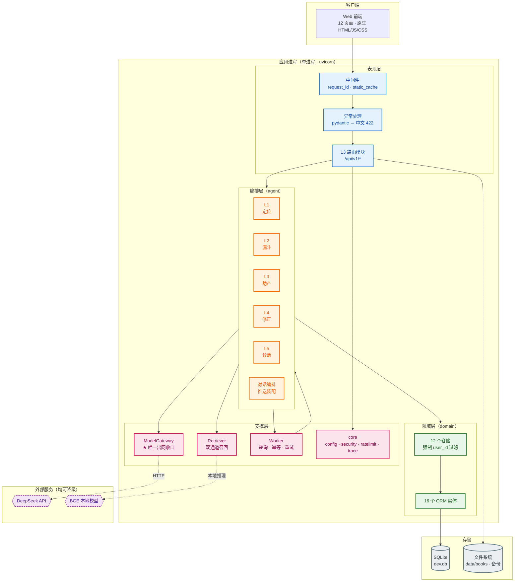
```mermaid
graph TB
    subgraph CLIENT["客户端"]
        WEB["Web 前端<br/>12 页面 · 原生 HTML/JS/CSS"]
    end

    subgraph APP["应用进程（单进程 · uvicorn）"]
        subgraph PRESENT["表现层"]
            MW["中间件<br/>request_id · static_cache"]
            EH["异常处理<br/>pydantic → 中文 422"]
            ROUTES["13 路由模块<br/>/api/v1/*"]
        end
        subgraph ORCH["编排层（agent）"]
            O1["L1</br>定位"]
            O2["L2</br>漏斗"]
            O3["L3</br>助产"]
            O4["L4</br>修正"]
            O5["L5</br>诊断"]
            OP["对话编排<br/>推送装配"]
        end
        subgraph DOMAIN["领域层（domain）"]
            REPO["12 个仓储<br/>强制 user_id 过滤"]
            MODELS["16 个 ORM 实体"]
        end
        subgraph INFRA["支撑层"]
            GW["ModelGateway<br/>★ 唯一出网收口"]
            RET["Retriever<br/>双通道召回"]
            WRK["Worker<br/>轮询 · 幂等 · 重试"]
            CORE["core<br/>config · security · ratelimit · trace"]
        end
    end

    subgraph STORAGE["存储"]
        DB[("SQLite<br/>dev.db")]
        FS[("文件系统<br/>data/books · 备份")]
    end

    subgraph EXT["外部服务（均可降级）"]
        DS{{"DeepSeek API"}}
        BGE{{"BGE 本地模型"}}
    end

    WEB --> MW
    MW --> EH
    EH --> ROUTES
    ROUTES --> ORCH
    ORCH --> DOMAIN
    ORCH --> GW
    ORCH --> RET
    ORCH --> WRK
    ROUTES --> CORE
    REPO --> MODELS
    MODELS --> DB
    WRK --> ORCH
    GW -.->|HTTP| DS
    RET -.->|本地推理| BGE
    ROUTES --> FS

    classDef present fill:#e3f2fd,stroke:#1976d2,stroke-width:2px,color:#0d47a1
    classDef orch fill:#fff3e0,stroke:#ef6c00,stroke-width:2px,color:#e65100
    classDef dom fill:#e8f5e9,stroke:#2e7d32,stroke-width:2px,color:#1b5e20
    classDef infra fill:#fce4ec,stroke:#c2185b,stroke-width:2px,color:#880e4f
    classDef store fill:#eceff1,stroke:#546e7a,stroke-width:2px,color:#263238
    classDef ext fill:#f3e5f5,stroke:#8e24aa,stroke-width:1.5px,stroke-dasharray:5 3,color:#4a148c
    class MW,EH,ROUTES present
    class O1,O2,O3,O4,O5,OP orch
    class REPO,MODELS dom
    class GW,RET,WRK,CORE infra
    class DB,FS store
    class DS,BGE ext
```

### 4.2 架构风格：分层 + 端口适配 + 收口

本系统采用**三层主体 + 一个横切收口**的结构：

| 层次 | 职责 | 允许依赖 | 禁止依赖 |
|---|---|---|---|
| **表现层** `api/` | HTTP 协议转换、参数校验、鉴权、序列化 | 编排层、领域层、core | ❌ 不许含业务逻辑<br/>❌ 不许直接调 `llm/` |
| **编排层** `agent/` | 单条用例的流程编排、多步协调、降级决策 | 领域层、llm/、retrieval/、workers/ | ❌ 不许直接操作 `Session`（须经仓储） |
| **领域层** `domain/` | 实体定义、持久化、数据完整性 | core | ❌ 不许依赖 `llm/`、`api/`<br/>❌ 不许依赖 `agent/` |
| **支撑层** `llm/ retrieval/ workers/ core/` | 提供被上层调用的能力 | core | ❌ `llm/` 不许依赖 `agent/` |

**两个关键收口（choke point）**——本架构最重要的设计决策：

| 收口 | 含义 | 工程收益 |
|---|---|---|
| **模型调用收口于 `ModelGateway`** | 全系统只有这一个地方发 LLM 请求 | 换供应商改 1 个文件；成本/重试/日志在一处统一，不会漏埋点 |
| **数据库访问收口于 Repository** | 全系统只有仓储层碰 `Session` | 越权防护在基类一处实现，12 个仓储自动继承，不可能漏 |

### 4.3 依赖方向铁律

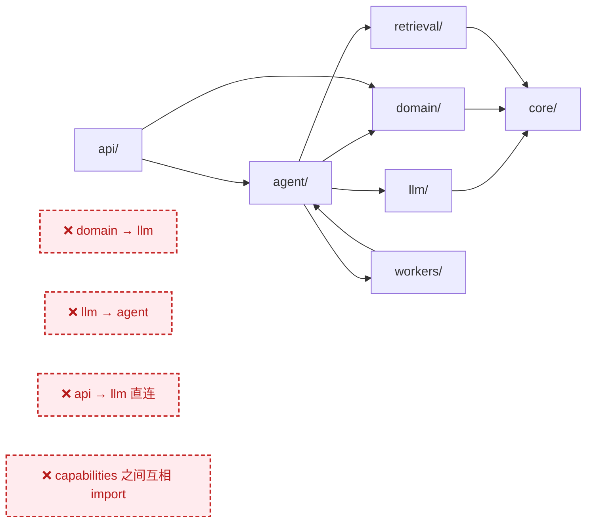
```mermaid
graph LR
    A["api/"] --> B["agent/"]
    B --> C["domain/"]
    B --> D["llm/"]
    B --> E["retrieval/"]
    B --> F["workers/"]
    A --> C
    D --> G["core/"]
    C --> G
    E --> G
    F --> B

    X["❌ domain → llm"]:::bad
    Y["❌ llm → agent"]:::bad
    Z["❌ api → llm 直连"]:::bad
    W["❌ capabilities 之间互相 import"]:::bad

    classDef bad fill:#ffebee,stroke:#c62828,stroke-width:2px,stroke-dasharray:5 3,color:#b71c1c
```

**四条铁律**（违反即 PR 驳回）：

1. **依赖必须单向向下**：`api → agent → domain/llm`。反向依赖一律禁止。
2. **`domain/` 必须保持纯净**：它不许知道「有 LLM 这回事」。这样领域模型可以被任何上层复用，也便于未来替换模型层。
3. **`llm/` 必须对上层无感知**：网关不知道谁在调它，只按 `task_type` 决定策略。这样新增能力无须改模型层。
4. **`capabilities/` 内部互不 import**：五大能力必须彼此隔离，只通过领域层共享数据。这样任何一个能力可以独立重构甚至删除。

> **为什么第 4 条重要**：L1~L5 在业务上高度相关（都要用知识库、都要调模型），很容易写出 `l3 调 l2 的函数` 这种耦合。这会立刻产生「改 L2 阈值导致 L3 崩」的连锁效应。**共享逻辑必须下沉到 `domain/` 或 `llm/`，而不是横向互调。**

### 4.4 类图：核心抽象

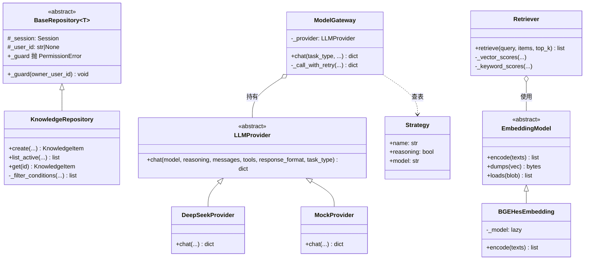
```mermaid
classDiagram
    class BaseRepository~T~ {
        <<abstract>>
        #_session: Session
        #_user_id: str|None
        +_guard(owner_user_id) void
        +_guard 抛 PermissionError
    }

    class KnowledgeRepository {
        +create(...) KnowledgeItem
        +list_active(...) list
        +get(id) KnowledgeItem
        -_filter_conditions(...) list
    }

    class LLMProvider {
        <<abstract>>
        +chat(model, reasoning, messages, tools, response_format, task_type) dict
    }

    class DeepSeekProvider {
        +chat(...) dict
    }

    class MockProvider {
        +chat(...) dict
    }

    class ModelGateway {
        -_provider: LLMProvider
        +chat(task_type, ...) dict
        -_call_with_retry(...) dict
    }

    class Strategy {
        +name: str
        +reasoning: bool
        +model: str
    }

    class EmbeddingModel {
        <<abstract>>
        +encode(texts) list
        +dumps(vec) bytes
        +loads(blob) list
    }

    class BGEHesEmbedding {
        -_model: lazy
        +encode(texts) list
    }

    class Retriever {
        +retrieve(query, items, top_k) list
        -_vector_scores(...)
        -_keyword_scores(...)
    }

    BaseRepository <|-- KnowledgeRepository
    LLMProvider <|-- DeepSeekProvider
    LLMProvider <|-- MockProvider
    ModelGateway o-- LLMProvider : 持有
    ModelGateway ..> Strategy : 查表
    EmbeddingModel <|-- BGEHesEmbedding
    Retriever o-- EmbeddingModel : 使用
```

**这张图揭示的复用结构**：
- `BaseRepository` 是所有 12 个仓储的**公共父类**——越权防护只写一次。
- `LLMProvider` 让 DeepSeek 与 Mock 成为**可互换的兄弟**——这是「无 KEY 也能跑」的实现基础。
- `EmbeddingModel` 让向量后端**可替换**（当前 BGE，未来可换 API 版）。

### 4.5 状态机设计

系统中有三处显式状态机，它们是「数据一致性」的核心保障。

#### 4.5.1 异步任务状态机（`TaskRun`）

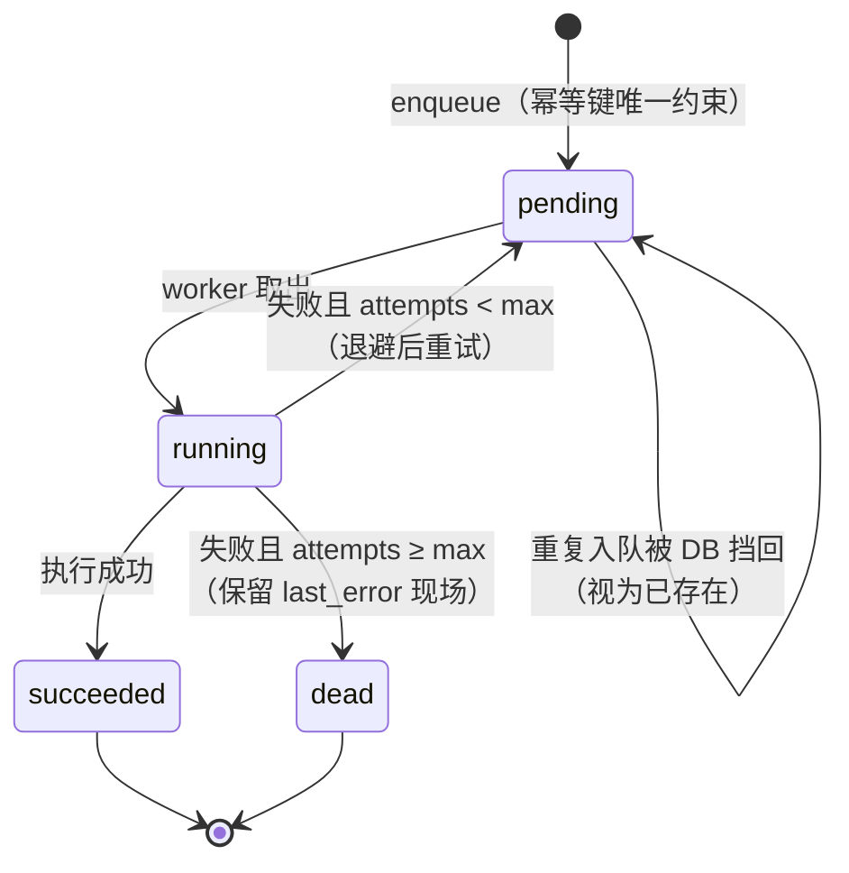
```mermaid
stateDiagram-v2
    [*] --> pending: enqueue（幂等键唯一约束）
    pending --> running: worker 取出
    running --> succeeded: 执行成功
    running --> pending: 失败且 attempts < max<br/>（退避后重试）
    running --> dead: 失败且 attempts ≥ max<br/>（保留 last_error 现场）
    pending --> pending: 重复入队被 DB 挡回<br/>（视为已存在）
    succeeded --> [*]
    dead --> [*]
```

> **为什么失败不直接转 dead**：失败留在 `pending` 并递增 `attempts`，下一轮轮询自然重试，用 `updated_at` 做退避时间锚点（`2^(n-1)` 秒起、上限 60 秒）。这样**重试不需要额外的调度器**，一个轮询循环就够。

#### 4.5.2 冲突用户状态机（`Conflict.user_state`）

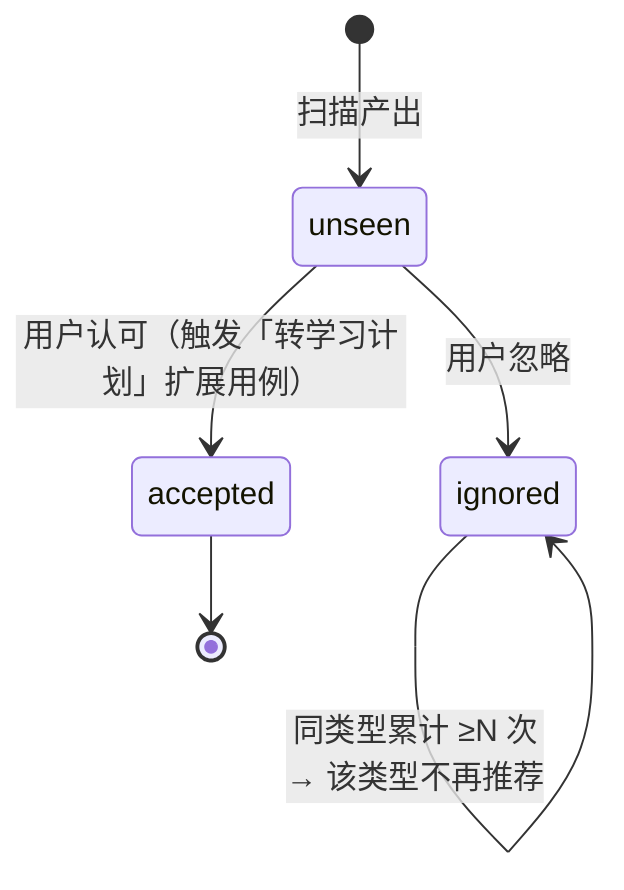
```mermaid
stateDiagram-v2
    [*] --> unseen: 扫描产出
    unseen --> accepted: 用户认可（触发「转学习计划」扩展用例）
    unseen --> ignored: 用户忽略
    ignored --> ignored: 同类型累计 ≥N 次<br/>→ 该类型不再推荐
    accepted --> [*]
```

#### 4.5.3 诊断状态机（`CognitiveDiagnosis.status`）

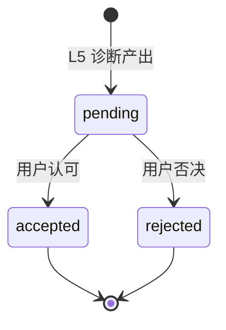
```mermaid
stateDiagram-v2
    [*] --> pending: L5 诊断产出
    pending --> accepted: 用户认可
    pending --> rejected: 用户否决
    accepted --> [*]
    rejected --> [*]
```

> **反馈闭环的意义**：这三处状态机不是为了「记录状态」，而是为了让系统**能被用户纠正**——用户的忽略/认可会反过来收敛后续推荐（误报抑制）。

### 4.6 运行设计（部署内视图）

单进程内的运行视图：

```
uvicorn 进程
├── 主线程：asyncio 事件循环
│    └── FastAPI 处理 HTTP 请求
│         ├── 中间件链：request_id → static_cache
│         ├── 路由分发 → 编排层 → 领域层
│         └── 静态文件托管（/assets, /xxx.html）
└── 守护线程：Worker 轮询循环（worker_enabled=false 可关）
     └── run_pending() → 取 pending 任务 → 执行处理器 → 更新状态
```

**关键约束**：

| 约束 | 说明 |
|---|---|
| **Worker 与 Web 同进程** | 不引入 Celery/Redis（见 §10.2 ADR-13）。代价是「Web 挂了 Worker 也停」，但单机个人工具可接受 |
| **测试中必须关闭 Worker** | 测试设 `worker_enabled=false`，避免后台线程干扰与不确定的时序 |
| **任务执行是同步的** | Worker 线程内串行执行，不给用户请求造成并发压力 |
| **SQLite 单写者** | 所有写操作串行化，避免 SQLite 写锁竞争 |

---

## 5. 数据设计（ER 图与数据字典）

### 5.1 ER 图（16 张表全量）


```mermaid
erDiagram
    USER ||--o{ KNOWLEDGE_ITEM : "拥有"
    USER ||--o{ BOOK : "拥有"
    USER ||--o{ CONVERSATION : "拥有"
    USER ||--o{ LEARNING_GOAL : "拥有"
    USER ||--o{ LEARNING_EVENT : "产生"
    USER ||--o{ CONFLICT : "拥有"
    USER ||--o{ COGNITIVE_DIAGNOSIS : "拥有"
    USER ||--o{ COST_LOG : "产生"
    USER ||--o{ PUSH_JOB : "接收"
    USER ||--o{ PUSH_LOG : "接收"
    USER ||--o{ TASK_RUN : "触发"

    KNOWLEDGE_ITEM ||--o{ CLAIM : "拆解出"
    CLAIM ||--o{ CONFLICT : "作为比对粒度"

    LEARNING_GOAL ||--o{ LEARNING_PLAN : "制定"
    LEARNING_PLAN ||--o{ PLAN_TASK : "拆为任务"

    USER {
        string id PK
        string username UK "唯一登录名"
        string password_hash "PBKDF2-SHA256"
        string nickname
        string push_frequency "weekly/daily/quiet"
        int token_version "吊销旧 JWT 用"
        datetime deleted_at "软删"
    }

    KNOWLEDGE_ITEM {
        string id PK
        string user_id FK
        string source "notion/obsidian/feishu/bookmark/manual"
        string title
        text raw_content
        json tags
        float read_progress "0..1"
        blob embedding "pickle 序列化向量"
        string embed_status "pending/embedded/embed_failed"
        text note "用户批注"
        json source_locator "来源定位"
        datetime claims_scanned_at "L2 增量扫描标记"
        bool is_deleted
    }

    CLAIM {
        string id PK
        string user_id FK
        string knowledge_item_id FK
        text statement "归一化主张"
        string topic "同主题预筛键"
        int polarity "-1/0/1"
        float strength "0..1"
        float confidence
        blob embedding
    }

    CONFLICT {
        string id PK
        string user_id FK
        string item_a_id FK
        string item_b_id FK
        string claim_a_id FK
        string claim_b_id FK
        string pair_key "无序对去重键"
        string conflict_type
        text detail
        text suggestion
        float confidence
        string user_state "unseen/ignored/accepted"
    }

    BOOK {
        string id PK
        string user_id FK
        string title
        string author
        string format "txt/epub"
        string file_path
        json chapters
        text full_text
        int total_chars
        int current_char "阅读位置偏移"
        float read_progress
        bool is_deleted
    }

    LEARNING_GOAL {
        string id PK
        string user_id FK
        string description
        datetime deadline
        string priority "high/medium/low"
        bool achieved
    }

    LEARNING_PLAN {
        string id PK
        string user_id FK
        string goal_id FK
        json content "结构化计划"
        int version "乐观锁版本号"
    }

    PLAN_TASK {
        string id PK
        string user_id FK
        string plan_id FK
        int week_index
        string subject
        string status "pending/doing/done"
        json related_item_ids
    }

    LEARNING_EVENT {
        string id PK
        string user_id FK
        string event_type "read/collect/ask/complete_plan"
        datetime occurred_at
        json payload "不含正文与敏感字段"
    }

    CONVERSATION {
        string id PK
        string user_id FK
        string state "对话状态机"
        string title
        json messages
    }

    TASK_RUN {
        string id PK
        string task_name
        string user_id FK
        string idempotency_key UK "幂等键"
        string status "pending/running/succeeded/dead"
        int attempts
        int max_attempts
        json payload
        text last_error
        datetime finished_at
    }

    COST_LOG {
        int id PK
        string user_id FK
        string task_type
        string model
        bool reasoning
        string prompt_version
        string request_id
        int prompt_tokens
        int completion_tokens
        int cached_tokens
        float estimated_cost "人民币"
        datetime created_at
    }

    PUSH_JOB {
        string id PK
        string user_id FK
        string push_type "conflict/question/brief/diagnosis"
        string channel "app/email"
        string status
        string title
        string body
        json payload
        string content_hash
        string sent_at
        string last_error
    }

    PUSH_LOG {
        string id PK
        string user_id FK
        string push_type
        string content_hash UK "去重指纹"
        string channel
        datetime sent_at
        string user_feedback "none/ignored/accepted"
    }

    COGNITIVE_DIAGNOSIS {
        string id PK
        string user_id FK
        string pattern "行为模式"
        string root_cause
        float confidence
        string suggested_action
        json reasoning_chain "推理链"
        string status "pending/accepted/rejected"
    }
```

### 5.2 表职责与设计要点

| 表 | 职责 | 设计要点 |
|---|---|---|
| `users` | 账号 | `token_version` 用于**全局吊销**旧 JWT（改密/注销后所有旧 token 立即失效） |
| `knowledge_items` | 知识基本单位 | `claims_scanned_at` 是 **L2 增量扫描的成本命门**；`embed_status` 支持向量失败降级 |
| `claims` | 原子主张 | 持久化主张把冲突检测从 O(n²) 全集比对**降为近邻检索**——这是 L2 能跑得动的根本原因 |
| `conflicts` | 冲突产物 | `pair_key`（两主张 id 排序拼接）= 去重键，使扫描幂等 |
| `books` | 书籍与阅读进度 | `chapters` 存 JSON 章节结构；`current_char` 是字符偏移而非页码（适配任意重排） |
| `learning_goals` / `learning_plans` / `plan_tasks` | L4 路径修正 | `learning_plans.version` 是**乐观锁**，防并发覆盖 |
| `learning_events` | 行为埋点 | **append-only**，是 L5 诊断的唯一事实来源；`payload` **禁止**含正文与敏感字段 |
| `task_runs` | 异步任务 | `idempotency_key` 唯一约束，靠数据库而非应用逻辑保证幂等 |
| `cost_logs` | 成本埋点 | `cached_tokens` 与 `prompt_version` 让成本优化可归因 |
| `push_jobs` / `push_logs` | 推送 | `push_logs.content_hash` 唯一 → **同内容绝不重复推** |
| `cognitive_diagnoses` | L5 产出 | `reasoning_chain` 存完整推理链，让诊断**可解释、可质疑** |

### 5.3 索引设计

索引不是「加了就好」——每个索引都对应一条**真实的高频查询**。

| 索引 | 表 | 支撑的查询 |
|---|---|---|
| `(user_id, topic)` | `claims` | L2-3 同主题预筛：`topic` 与 `user_id` 组成候选对生成索引 |
| `(user_id, user_state)` | `conflicts` | 待推送冲突查询：只看 `unseen` |
| `user_id` | 几乎所有表 | 强制用户作用域过滤（结构性防越权的物理基础） |
| `idempotency_key` (UNIQUE) | `task_runs` | 幂等入队的数据库级保障 |
| `content_hash` (UNIQUE) | `push_logs` | 推送去重 |
| `event_type` / `occurred_at` | `learning_events` | L5 按类型与时间聚合行为模式 |
| `pair_key` | `conflicts` | 冲突去重查询 |

### 5.4 数据完整性策略

| 策略 | 实现 |
|---|---|
| **软删** | `knowledge_items.is_deleted` / `books.is_deleted` / `users.deleted_at`，物理清除须等保留期 |
| **时间戳** | `TimestampMixin` 统一提供 `created_at` / `updated_at`（带时区） |
| **主键** | 统一 `String(36)` 存 UUID4 字符串——**不用自增 int**，便于未来分库与外部系统对账 |
| **乐观锁** | `learning_plans.version`，更新时校验版本号 |
| **外键** | 逻辑外键（SQLAlchemy 层维护关系），未启用数据库级 FK 约束以简化 SQLite 迁移 |

> **一个已知取舍**：`users.push_frequency` 与 `embedding` 用 pickle 存 bytes。好处是零依赖；代价是**跨语言不可读**（未来接外部系统时需迁移，已列为 §15 演进项）。

### 5.5 Schema 演进规则

**这是本项目踩过的坑，必须遵守**（详见 `dev_logs/复盘与教训.md` 第 2 条）：

| 规则 | 原因 |
|---|---|
| **新增表必须注册到 `app/domain/models/__init__.py`** | `Base.metadata.create_all()` 只扫描被 import 过的模型。漏注册 = 表不存在，且**不报错**，直到该表被查询时才炸 |
| **`create_all` 不会给已有表加列** | SQLite 的 `CREATE TABLE IF NOT EXISTS` 语义对已存在的表是空操作。加字段必须手工 `ALTER TABLE` 或重建库 |
| **改 schema 后必须重启服务器** | 不要只信 `--reload`；schema 缓存与连接池会让旧结构继续生效 |
| **改 schema 后必须跑全量 pytest** | 测试用独立库，能最快暴露「表结构漂移」 |
| **生产迁移用 Alembic** | 依赖已装（`alembic>=1.13`），P0 阶段手工迁移，P1 起必须走迁移脚本 |

---

## 6. 模块详细设计

本章按 GB/T 8567 要求，对每个模块统一按 **职责 / 输入 / 输出 / 关键算法 / 依赖约束 / 测试要点** 六项描述。

### 6.1 表现层（`app/api/`）

#### 6.1.1 入口与横切（`app/main.py`）

| 项 | 内容 |
|---|---|
| **职责** | 创建 FastAPI 应用、装配中间件、注册异常处理器、挂载 13 个路由、托管静态资源与 12 个页面 |
| **中间件 1** | `request_id_middleware`：为每个请求生成/透传 `request_id`，写入日志与响应头，让「用户报错 → 日志定位」成为一条链路 |
| **中间件 2** | `static_cache_middleware`：对 `.html/.js/.css` 强制 `Cache-Control: no-cache` |
| **异常处理** | `validation_exception_handler`：把 pydantic 的英文错误经 `_FIELD_LABELS` 映射为**中文提示**，返回 422 |
| **依赖约束** | 只做装配，**不含业务逻辑** |
| **测试要点** | `tests/test_web.py`（19 项）：页面可达性、静态资源头、404 行为 |

> **为什么中间件 2 是必须的**：项目踩过「浏览器缓存旧 `app.js` 导致修复看起来没生效」的坑。前端无构建工具、无文件指纹，只能靠响应头强制校验。这是**低成本高收益的兜底**。

#### 6.1.2 鉴权出口（`app/api/deps.py`）

| 项 | 内容 |
|---|---|
| **职责** | 依赖注入集中地：`get_session`（数据库会话）、`get_gateway`（模型网关）、鉴权解析 |
| **核心设计** | `_authed_user` 是**唯一鉴权出口**——所有需要用户的接口都经它，不存在第二条鉴权路径 |
| **特殊处理** | `get_user_id_flexible` 支持 `?token=` 兜底 |
| **为什么需要 flexible** | `` 由浏览器直发请求，**带不上 Authorization 头**。这是踩过的坑（复盘第 6 条） |
| **测试要点** | `tests/test_web_auth.py`（5 项）：未登录访问、token 过期、`?token=` 兜底 |

### 6.2 领域层（`app/domain/`）

#### 6.2.1 仓储基类（`app/domain/repositories/base.py`）

```python
class BaseRepository(Generic[_T]):
    def __init__(self, session: Session, user_id: str | None = None): ...

    def _guard(self, owner_user_id: str) -> None:
        """结构性越权防护：绑定用户后，仅允许访问归属本用户的行。"""
        if self._user_id and owner_user_id != self._user_id:
            raise PermissionError(f"跨用户访问被拒（structural guard）")
```

| 项 | 内容 |
|---|---|
| **职责** | 提供会话管理与**越权防护**，被 12 个仓储继承 |
| **关键设计** | 防护写在**基类**：子类只要正常调用 `_guard`，就自动获得保护。**不是**靠每个开发者记得加 `where user_id = ?` |
| **复用收益** | 新增第 13 个仓储时，越权防护代码量 = 0 行 |
| **测试要点** | `tests/test_db.py`：跨用户访问必须抛 `PermissionError` |

#### 6.2.2 仓储清单

| 仓储 | 对应实体 | 特殊方法 |
|---|---|---|
| `KnowledgeRepository` | KnowledgeItem | `_filter_conditions()` —— **列表与计数共用同一套条件**，避免「分页总数与列表不一致」 |
| `ClaimRepository` | Claim | 按 `topic`/`user_id` 取候选 |
| `ConflictRepository` | Conflict | 按 `pair_key` 去重、按 `user_state` 过滤 |
| `BookRepository` | Book | 阅读进度更新 |
| `LearningPlanRepository` | LearningPlan / PlanTask | 乐观锁版本校验 |
| `LearningEventRepository` | LearningEvent | append-only 写入 |
| `CognitiveDiagnosisRepository` | CognitiveDiagnosis | 取最新（**必须用显式排序键，不能靠 `created_at`** —— 同秒写入会穿，复盘第 3 条） |
| `ConversationRepository` | Conversation | 消息追加 |
| `CostLogRepository` | CostLog | 成本聚合 |
| `PushRepository` | PushJob / PushLog | `content_hash` 去重 |
| `UserRepository` | User | 按用户名查、`token_version` 自增 |
| `BaseRepository` | — | 公共父类 |

### 6.3 模型层（`app/llm/`）

#### 6.3.1 ModelGateway（`app/llm/gateway.py`）—— 全系统唯一出网收口

| 项 | 内容 |
|---|---|
| **职责** | 接收 `task_type`，查策略表决定 `reasoning` 开关，调用 provider，统一重试与成本埋点 |
| **策略表** | 10 个 `task_type` 映射到 `Strategy(name, reasoning, model)` |
| **Provider 选择** | `_build_provider()`：有 KEY → `DeepSeekProvider`；无 KEY → `MockProvider` |
| **重试** | `_call_with_retry()` → `with_retry(attempts=3)`，指数退避 |
| **依赖约束** | **不许反向依赖 `agent/`**；业务代码**不许绕过网关直连 provider** |

策略表全貌：

| `task_type` | reasoning | 用途 |
|---|---|---|
| `default` | off | 兜底 |
| `multi_turn_dialogue` | off | 多轮对话 |
| `deep_reasoning` | **on** | 深度推理 |
| `conflict_detection` | **on** | L2 冲突判定 |
| `plan_generation` | off | L4 计划生成 |
| `causal_reasoning` | **on** | 因果推理 |
| `cognitive_brief` | off | L3 简报 |
| `l1_mining` | **on** | L1 意图定位判断 |
| `batch_extraction` | off | 批量主张提取（成本敏感，关思考） |
| `topic_analysis` | off | 主题分析 |

> **策略表的设计意图**：把「哪个任务需要深度思考」这个决策**集中到一张表**。这既让成本可控（批量任务关思考省钱），也让调优变成改表而不是改代码。

#### 6.3.2 结构化输出解析（`app/llm/structure.py`）

| 项 | 内容 |
|---|---|
| **职责** | 把 LLM 的自由文本响应解析为结构化数据 |
| **三层退让策略** | ① 直接 `json.loads`；② 剥掉 markdown 代码围栏（` ```json ... ``` `）后重试；③ 截取最外层 `{...}` 后重试 |
| **失败行为** | 抛 `JsonParseError`，由调用方决定跳过还是降级 |
| **为什么需要** | LLM 即使要求「只输出 JSON」也会加围栏或加解释文字。**不能假设模型听话** |

#### 6.3.3 分时计价（`app/llm/cost.py`）

| 项 | 内容 |
|---|---|
| **职责** | 按北京时间判定是否高峰时段，三段计价（普通 / 高峰 / 缓存命中） |
| **时区处理** | 固定 UTC+8，不依赖服务器时区 |
| **高峰时段** | 工作日 `9-12, 14-18`，倍率 2.0（可配） |
| **缓存价** | 命中价约为普通输入价的 1/50 |
| **reasoning token** | 计入输出 token 计费 |

### 6.4 编排层（`app/agent/`）

| 编排器 | 用例 | 关键算法 | 依赖 |
|---|---|---|---|
| `l1_orchestrator.py` | UC-L1-01 | 双通道召回 + 定位/追问二分支判定 | `retrieval/` + `llm/` |
| `l2_orchestrator.py` | UC-L2-01 | **五级候选漏斗**（见下） | `llm/` + `domain/` |
| `l3_orchestrator.py` | UC-L3-01/02 | 认知简报装配 / 助产式提问生成 | `retrieval/` + `llm/` |
| `l4_orchestrator.py` | UC-L4-02/03 | 计划生成 + 偏差检测 | `llm/` + `domain/` |
| `l5_orchestrator.py` | UC-L5-01 | 行为模式识别 + 因果推理链 | `llm/` + `feedback/` |
| `orchestrator.py` | UC-10 对话 | 多轮对话状态管理 | `llm/` |
| `push_service.py` | UC-30 | 推送内容装配与去重 | `push/` |

**L2 五级漏斗**（全系统最核心的算法，成本与准确率的平衡点）：

```
全量知识条目
  │  L2-1 增量筛选：claims_scanned_at IS NULL  → 只处理新增
  ▼
待提取条目
  │  L2-6 主张提取：LLM 批量抽取原子主张（reasoning=off，省钱）
  ▼
主张集合
  │  L2-3 同主题预筛：按 (user_id, topic) 取同主题候选对  → 避免 O(n²)
  ▼
候选对
  │  L2-4 立场强度过滤：极性相异 且 强度达标
  ▼
高潜候选对（数量已降 1~2 个数量级）
  │  L2-5 LLM 判定：reasoning=on 精细判定（只对高潜对花大钱）
  ▼
疑似冲突
  │  L2-6 阈值抑制：置信度阈值 + 已忽略类型收敛 + pair_key 去重
  ▼
入库 conflicts
```

> **漏斗的核心思想**：**便宜的手段放前面，贵的手段放后面**。L2-1~L2-4 都是纯数据库/规则计算（几乎零成本），只有 1~2% 的候选对会进入 LLM 判定。这是 L2 能在个人机器上跑得动的原因。

### 6.5 异步任务层（`app/workers/`）

#### 6.5.1 三条核心机制（`app/workers/tasks.py`）

```python
- **幂等**：TaskRun.idempotency_key 唯一约束。重复入队由数据库挡回
  （IntegrityError → 视为已存在），不依赖应用层「先查再插」那种有竞态的做法。
- **重试**：失败不改状态为 dead，而是留在 pending、attempts+1，下一轮轮询再试；
  退避用 updated_at 作时间锚点，2^(n-1) 起步、上限 60 秒。
- **死信**：attempts ≥ max_attempts 转 dead 保留现场（last_error），不再自动重试。
```

| 项 | 内容 |
|---|---|
| **注册表** | `HANDLERS: dict[str, Handler]` + `@register("name")` 装饰器（重复注册抛 `ValueError`） |
| **入队** | `enqueue()` 返回 `EnqueueResult(created: bool)`——同 key 返回 `created=False` |
| **执行** | `run_pending()` 批量取 pending 任务并执行 |
| **幂等键构造** | `triggers.realtime_key()` / `weekly_key()` |

幂等键实例：

| 场景 | 幂等键格式 | 效果 |
|---|---|---|
| 实时冲突扫描 | `l2:realtime:{user}:{YYYYMMDDHH}` | **1 小时内同用户只扫一次**，用户狂点按钮也不会重复烧钱 |
| 周度冲突扫描 | `l2:weekly:{user}:{ISO年}-W{ISO周}` | 一周一次，跨进程重启也不会重跑 |
| 每周简报 | 含 ISO 周 | 定时器重复触发也只推一次 |

> **幂等键是本项目最优雅的设计之一**：它把「去重」这个业务需求，转化为**数据库唯一约束**这个基础设施能力。不需要分布式锁、不需要 Redis、不需要状态查询——**插入失败就是重复**。

#### 6.5.2 任务处理器（`app/workers/handlers.py`）

| 处理器 | 任务名 | 职责 |
|---|---|---|
| `l2_scan` | `l2_scan` | 调 L2 编排器执行冲突扫描 |
| `push_weekly_digest` | 对应 | 装配并推送每周认知简报 |
| `push_monthly_health` | 对应 | 装配并推送每月学习健康报告 |

**处理器的三条纪律**：
1. 只做「取参数 → 调编排层 → 记日志」，**不含业务逻辑**；
2. 失败**直接抛异常**，交给框架重试——不要自己 try/except 吞掉；
3. 必须可以**重复执行而无副作用**（幂等），因为可能被重试。

### 6.6 检索层（`app/retrieval/`）

| 项 | 内容 |
|---|---|
| **入口** | `Retriever`（`retriever.py`） |
| **双通道** | 向量通道（BGE 余弦相似度）+ 关键词通道（`keyword.py`） |
| **融合** | 加权求和，`vec_weight=0.7`（可配） |
| **向量后端** | `BGEHesEmbedding`：`BAAI/bge-small-zh-v1.5`，512 维，**惰性加载** |
| **序列化** | `EmbeddingModel.dumps()` / `loads()`（pickle → bytes 存库） |
| **降级** | 向量模型不可用 → 仅关键词通道，功能不缺失 |
| **测试要点** | `tests/test_retrieval.py`（4 项）+ `test_embedding.py`（10 项） |

> **为什么坚持双通道**：向量召回质量高但**依赖模型下载与计算**；关键词召回质量一般但**永远可用**。两条通道让系统在「模型没下好 / 内网无网 / 内存不足」时仍能工作。**可降级比高性能更重要**。

### 6.7 支撑模块

| 模块 | 文件 | 职责 | 关键设计 |
|---|---|---|---|
| **配置** | `core/config.py` | pydantic-settings 统一配置 | 全部支持环境变量覆盖；`model_provider` 属性按 KEY 自动判定 |
| **安全** | `core/security.py` | 口令哈希 + JWT | PBKDF2-HMAC-SHA256（`pbkdf2_sha256$iter$salt$hash`）；JWT 算法**白名单**防 alg 混淆攻击 |
| **限流** | `core/ratelimit.py` | `FailureThrottle` 登录失败限流 | 进程内滑动窗口，**账号 + IP 双维度**（IP 阈值放宽，避免 NAT 后正常用户被连带） |
| **日志** | `core/logging.py` | 结构化日志 | 带 `request_id` |
| **链路** | `core/trace.py` | 请求追踪 | `request_id` 生成与透传 |
| **摄取** | `ingestion/service.py` | 知识入库流程 | 落库 → 触发向量化 → 触发 L2 增量扫描 |
| **书籍** | `books/parser.py` + `service.py` | TXT/EPUB 解析、分章、进度 | EPUB 图片提取与 `source_locator` 定位 |
| **埋点** | `feedback/events.py` | `LearningEvent` 记录 | append-only |
| **推送** | `push/` | 推送通道与去重 | `content_hash` 唯一 |

---

## 7. 架构解耦规则

本章是**评审者的检查清单**。每一条都可以机械化地判断「违反 / 未违反」。

### 7.1 依赖方向检查表

| # | 规则 | 检查方式 | 违反后果 |
|---|---|---|---|
| D-1 | `domain/` 不许 import `llm/`、`agent/`、`api/` | `grep -r "from app.llm\|from app.agent\|from app.api" app/domain/` 应为空 | 领域层被模型层污染，无法独立测试与复用 |
| D-2 | `llm/` 不许 import `agent/` | `grep -r "from app.agent" app/llm/` 应为空 | 网关产生对具体业务的耦合，换供应商要改业务代码 |
| D-3 | `api/` 不许直接 import `llm/` | `grep -r "from app.llm" app/api/` 应为空 | 绕过网关 → 成本漏埋点、重试策略失效 |
| D-4 | `api/` 不许直接操作 `Session` | 只见 `Depends(get_session)` 传给仓储 | 绕过 `_guard` → 越权风险 |
| D-5 | `capabilities/` 内部互不 import | `grep -r "from app.capabilities" app/capabilities/` 应为空 | 能力耦合，改动连锁崩溃 |
| D-6 | `agent/` 不许自己 `session.add()` 写库 | 只见仓储方法调用 | 绕过仓储 → 越权 + 事务散乱 |

> **建议**：这 6 条可以在 CI 里用 `grep` 或 `import-linter` 自动化守卫。当前靠人工评审 + 约定，已列入 §15 演进项。

### 7.2 扩展点设计：如何加一个新能力

假设要新增「L6 学习风格识别」。**正确的做法**（全程不改动任何已有文件，除了注册）：

| 步骤 | 动作 | 说明 |
|---|---|---|
| 1 | 在 `agent/` 新建 `l6_orchestrator.py` | 编排流程，依赖 `domain/` 与 `llm/` |
| 2 | 在 `api/endpoints/` 新建 `l6.py` | 定义路由，调 `l6_orchestrator` |
| 3 | 在 `app/main.py` 加一行 `include_router(l6.router)` | **唯一需要改的已有文件** |
| 4 | 在 `llm/gateway.py` 的 `STRATEGY_TABLE` 加一条 `task_type` | **唯一需要改的模型层文件** |
| 5 | 在 `llm/prompts.py` 加提示词 + 版本号 | 集中管理 |
| 6 | 在 `domain/models/` 加实体（如有），并**注册到 `__init__.py`** | 见 §5.5 |
| 7 | 在 `tests/` 加 `test_l6.py` | 见 §9.4 |

> **衡量解耦是否成功的标准**：加这个新能力时，**没有修改任何 L1~L5 的代码**。如果被迫改了，说明有耦合需要下沉。

### 7.3 数据隔离规则

| 规则 | 实现 | 保障级别 |
|---|---|---|
| 所有业务查询必须带 `user_id` | `BaseRepository._guard()` | **结构级**（不是约定级） |
| 跨用户访问抛 `PermissionError` | 基类统一实现 | 无法绕过 |
| JWT 中携带 `user_id` 与 `token_version` | `core/security.py` | 吊销可信 |
| 软删数据默认过滤 | 仓储的 `list_*` 方法 | 默认安全 |

> **结构性 vs 约定性的差别**：约定性防护是「所有开发者都要记得写 `WHERE user_id = ?`」——总有人会忘。结构性防护是把过滤做进基类，**忘不掉**。这是本项目安全设计的核心思路。

### 7.4 可替换性设计

| 可替换项 | 替换方式 | 影响范围 |
|---|---|---|
| **LLM 供应商** | 实现新的 `LLMProvider` 子类 + 改 `_build_provider()` | 1 个文件 |
| **向量模型** | 实现新的 `EmbeddingModel` 子类 + 改配置 | 0 个业务文件 |
| **数据库** | 改 `database_url`（ORM 已抽象） | 1 个配置项（需处理 SQLite 特有语义） |
| **检索策略** | 改 `Retriever` 的融合权重或加通道 | 1 个文件 |
| **异步框架** | `tasks.py` 的 `enqueue`/`run_pending` 是接口边界，可换成 Celery | 1~2 个文件 |

> **ADR-13 的保留意见**：当前不引入 Celery/Redis（见 §10.2）。但 `enqueue()` / `run_pending()` 被设计成**框架无关的接口**，未来若需横向扩展，替换成本被控制在 2 个文件内。

---

## 8. 代码复用机制

本章回答：**这套代码里，哪些东西是复用的？复用在哪儿？新代码该怎么复用？**

### 8.1 复用抽象清单

| # | 抽象 | 位置 | 复用方式 | 复用收益 |
|---|---|---|---|---|
| **R-1** | `BaseRepository` | `domain/repositories/base.py` | 12 个仓储继承 | 越权防护写 1 次；新增仓储 0 行防护代码 |
| **R-2** | `TimestampMixin` | `domain/models/base.py` | 全部实体继承 | `created_at/updated_at` 定义 1 次 |
| **R-3** | `PkStr` | `domain/models/base.py` | 全部实体主键 | UUID 主键策略统一 |
| **R-4** | `LLMProvider` | `llm/provider.py` | DeepSeek / Mock 实现 | 供应商可互换；**Mock 让测试零成本** |
| **R-5** | `ModelGateway` | `llm/gateway.py` | 全部能力调用 | 重试 + 埋点 + 策略**只写一次** |
| **R-6** | `STRATEGY_TABLE` | `llm/gateway.py` | 10 个 task_type 共用 | 策略集中，调优改表 |
| **R-7** | `parse_json` | `llm/structure.py` | 所有需要 JSON 输出的能力 | 顽健解析逻辑不重复实现 |
| **R-8** | `EmbeddingModel` | `retrieval/embedding.py` | 向量后端可替换 | 检索层不感知具体模型 |
| **R-9** | `@register` + `HANDLERS` | `workers/tasks.py` | 3 个任务处理器 | 任务框架统一，新增任务只加装饰器 |
| **R-10** | `enqueue()` | `workers/tasks.py` | 所有异步触发 | 幂等入队逻辑不重复 |
| **R-11** | `FailureThrottle` | `core/ratelimit.py` | 登录 / 注册限流 | 滑动窗口算法复用 |
| **R-12** | `Settings` | `core/config.py` | 全项目配置 | 配置集中 + 环境变量覆盖 |
| **R-13** | `app.js` 请求封装 | `web/assets/app.js` | 12 个页面共用 | **会话管理与请求逻辑只写一次** |
| **R-14** | `style.css` | `web/assets/style.css` | 全站 | 样式改动一处生效全站 |
| **R-15** | `_authed_user` | `api/deps.py` | 所有需鉴权的接口 | 鉴权逻辑唯一出口 |
| **R-16** | `_filter_conditions` | `repositories/knowledge_repository.py` | 列表与计数 | **避免「总数与列表不一致」的经典 bug** |

### 8.2 复用层次图

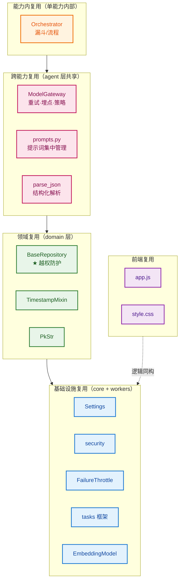
```mermaid
graph TB
    subgraph L4["跨能力复用（agent 层共享）"]
        G["ModelGateway<br/>重试·埋点·策略"]
        P["prompts.py<br/>提示词集中管理"]
        S["parse_json<br/>结构化解析"]
    end
    subgraph L3["能力内复用（单能力内部）"]
        O["Orchestrator<br/>漏斗/流程"]
    end
    subgraph L2["领域复用（domain 层）"]
        BR["BaseRepository<br/>★ 越权防护"]
        TS["TimestampMixin"]
        PK["PkStr"]
    end
    subgraph L1["基础设施复用（core + workers）"]
        CFG["Settings"]
        SEC["security"]
        RL["FailureThrottle"]
        TQ["tasks 框架"]
        EMB["EmbeddingModel"]
    end
    subgraph L0["前端复用"]
        AJ["app.js"]
        CSS["style.css"]
    end

    L4 --> L2
    L3 --> L4
    L2 --> L1
    L0 -.->|逻辑同构| L1

    classDef l4 fill:#fce4ec,stroke:#c2185b,stroke-width:2px,color:#880e4f
    classDef l3 fill:#fff3e0,stroke:#ef6c00,stroke-width:2px,color:#e65100
    classDef l2 fill:#e8f5e9,stroke:#2e7d32,stroke-width:2px,color:#1b5e20
    classDef l1 fill:#e3f2fd,stroke:#1976d2,stroke-width:2px,color:#0d47a1
    classDef l0 fill:#f3e5f5,stroke:#8e24aa,stroke-width:2px,color:#4a148c
    class G,P,S l4
    class O l3
    class BR,TS,PK l2
    class CFG,SEC,RL,TQ,EMB l1
    class AJ,CSS l0
```

### 8.3 复用度量

| 指标 | 数值 | 说明 |
|---|---|---|
| 仓储继承 `BaseRepository` | 12 / 12 | 100% 覆盖，无「漏网」仓储 |
| 实体使用 `TimestampMixin` | 15 / 16 | `CostLog` 因只需 `created_at` 例外 |
| 模型调用经 `ModelGateway` | 100% | 无任何直连 provider 的调用 |
| 前端共享 `app.js` | 12 / 12 页面 | 无内联重复的请求逻辑 |
| 样式单文件 | 1 份 `style.css` | 全站唯一 |

### 8.4 新代码的复用指引

**加新能力时，按此顺序找可复用项**：

| 需求 | 复用 | 不要自己写 |
|---|---|---|
| 要访问数据库 | `BaseRepository` 子类 | ❌ 不要直接 `session.query()` |
| 要调 LLM | `ModelGateway.chat(task_type=...)` | ❌ 不要 `httpx.post(deepseek)` |
| 要解析 LLM 的 JSON 输出 | `parse_json()` | ❌ 不要裸 `json.loads` |
| 要算 token 成本 | `cost.py` 的计价函数 | ❌ 不要硬编码价格 |
| 要读配置 | `settings.xxx` | ❌ 不要 `os.environ.get` |
| 要加异步任务 | `@register` + `enqueue` | ❌ 不要 `threading.Thread` |
| 要加限流 | `FailureThrottle` | ❌ 不要自己写滑动窗口 |
| 要发 LLM 请求失败重试 | 网关已内置 | ❌ 不要在外层再包一层重试 |

### 8.5 反面清单：什么不该被复用

**过度复用同样有害**。以下模式在本项目中**明确禁止**：

| 反模式 | 为什么禁止 |
|---|---|
| 抽一个「万能 `BaseService`」 | 五大能力业务差异大，强行统一会产生大量 `if capability == 'l2'` 分支 |
| L1~L5 之间互相调函数 | 违反 D-5，会产生改动连锁效应。共享逻辑下沉到 `domain/` 或 `llm/` |
| 把 prompt 拼在业务代码里 | 提示词必须集中在 `prompts.py`，否则无法做版本管理与 A/B |
| 通用 `dict` 到处传 | 用 dataclass（如 `L1Route`、`ExtractedClaim`）表达结构，让类型系统帮忙检查 |
| 前后端共享「同一份数据模型文件」 | 前后端无构建工具，强行共享会引入奇怪依赖。当前用接口契约（§11）保证一致 |

---

# 第三部分 · 工程实施

## 9. 工程规范与开发流程

### 9.1 开发环境约定

| 项 | 约定 |
|---|---|
| Python | ≥ 3.12 |
| 虚拟环境 | 项目内 `.venv`，不入库 |
| 依赖声明 | `pyproject.toml`，**改依赖必须同时更新它** |
| 数据库 | 开发用 `dev.db`（本地文件），测试用独立库 |
| 端口 | 8000（默认） |
| 环境变量 | 覆盖用 `export XXX=yyy`；敏感项（`JWT_SECRET`、`DEEPSEEK_API_KEY`）**绝不入库** |

### 9.2 分支与提交规范

**提交信息格式**（Conventional Commits）：

```
<type>(<scope>): <subject>

类型：feat | fix | docs | refactor | test | chore | perf
```

实际提交示例（取自本项目历史）：

```
feat: 知识库列表分页（加载更多）+ 关键词搜索
fix: 会话过期后页面变空壳（记录「消失」+ 账号不显示 + 退出无效）
docs: 登记知识库分页与搜索完成
fix: 前端静态资源改为「先校验再使用」，避免拿旧 JS 跑新后端
```

### 9.3 每次改动的固定动作（AGENTS.md 项目约定）

> **这三条是本项目的硬性约定，不可跳过。**

| # | 动作 | 说明 |
|---|---|---|
| **1** | 完成改动后**创建 Git commit** | 每项改动一个 commit，便于回溯与 revert |
| **2** | 编写或更新**相关测试**，交付前确保全部通过 | 新增功能必有测试；修 bug 必须**先写一个能复现的测试** |
| **3** | 更新 `dev_logs/` **当日日志** | 「今日完成」记本次改动；未完成项归入「待办事项」；无当日日志则按 `dev_logs/TEMPLATE.md` 创建 |

> **关于第 3 条的深层原因**：项目使用多套智能体/工具协作，`.workbuddy/` 私有目录其他工具读不到。**`dev_logs/` 才是团队共享的权威记录**。这是用户明确的项目约定。

### 9.4 DoD：完成的定义

一个任务只有**同时**满足以下全部条件，才算「完成」：

| # | 条件 | 验证方式 |
|---|---|---|
| 1 | 功能按用例规约实现 | 对照 §3.5 逐条走查 |
| 2 | `pytest` 全绿（254 项） | `pytest` |
| 3 | 前端 JS 通过语法校验 | `node --check web/assets/app.js` |
| 4 | 新增了对应测试 | 检查 `tests/` diff |
| 5 | 未违反 §7.1 依赖规则 | 跑 §7.1 的 6 条 grep |
| 6 | 涉及数据模型时，新表已注册到 `__init__.py` | 检查 `app/domain/models/__init__.py` |
| 7 | 涉及 schema 改动时，服务器已重启且全量测试通过 | 见 §5.5 |
| 8 | 涉及 LLM 调用时，成本埋点已生效 | 查 `cost_logs` 有记录 |
| 9 | `dev_logs/` 当日日志已更新 | 检查文件 |
| 10 | 已创建 Git commit | `git log` |

### 9.5 开发工作流（推荐）

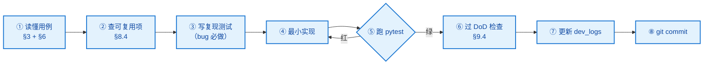
```mermaid
graph LR
    A["① 读懂用例<br/>§3 + §6"] --> B["② 查可复用项<br/>§8.4"]
    B --> C["③ 写复现测试<br/>（bug 必做）"]
    C --> D["④ 最小实现"]
    D --> E{"⑤ 跑 pytest"}
    E -->|红| D
    E -->|绿| F["⑥ 过 DoD 检查<br/>§9.4"]
    F --> G["⑦ 更新 dev_logs"]
    G --> H["⑧ git commit"]

    classDef step fill:#e3f2fd,stroke:#1976d2,stroke-width:2px,color:#0d47a1
    class A,B,C,D,E,F,G,H step
```

### 9.6 评审检查清单（Reviewer Checklist）

评审 PR 时按此逐项打勾：

- [ ] 依赖方向符合 §7.1 六条规则
- [ ] 没有绕过 `ModelGateway` 直连 provider
- [ ] 没有绕过 Repository 直接操作 `Session`
- [ ] 没有在 `api/` 层写业务逻辑
- [ ] 没有在 `agent/` 层直接 `session.add()`
- [ ] 新表的模型已在 `__init__.py` 注册
- [ ] 提示词集中在 `prompts.py` 且 `prompt_version` 已更新
- [ ] 测试覆盖了新增分支（含失败分支）
- [ ] 错误信息是中文且面向用户可理解
- [ ] `dev_logs/` 已更新

---

## 10. 技术选型与论证

本章逐项回答「选了什么 / 为什么 / 放弃了什么 / 何时该换」。每项都对应一条 ADR。

### 10.1 技术栈总览

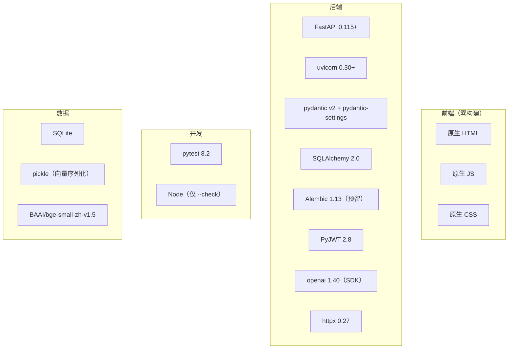
```mermaid
graph TB
    subgraph FE["前端（零构建）"]
        H["原生 HTML"]
        J["原生 JS"]
        C["原生 CSS"]
    end
    subgraph BE["后端"]
        F["FastAPI 0.115+"]
        U["uvicorn 0.30+"]
        P["pydantic v2 + pydantic-settings"]
        S["SQLAlchemy 2.0"]
        A["Alembic 1.13（预留）"]
        JWT["PyJWT 2.8"]
        OAI["openai 1.40（SDK）"]
        HX["httpx 0.27"]
    end
    subgraph DE["开发"]
        PT["pytest 8.2"]
        ND["Node（仅 --check）"]
    end
    subgraph DATA["数据"]
        SQ["SQLite"]
        PK["pickle（向量序列化）"]
        BGE["BAAI/bge-small-zh-v1.5"]
    end
```

| 层 | 选型 | 版本 |
|---|---|---|
| Web 框架 | FastAPI | ≥0.115 |
| ASGI 服务器 | uvicorn | ≥0.30 |
| 数据校验 / 配置 | pydantic + pydantic-settings | ≥2.7 / ≥2.3 |
| ORM | SQLAlchemy | ≥2.0 |
| 迁移（预留） | Alembic | ≥1.13 |
| 模型 SDK | openai（OpenAI 兼容协议） | ≥1.40 |
| HTTP 客户端 | httpx | ≥0.27 |
| 认证 | PyJWT | ≥2.8 |
| 数据库 | SQLite | 内置 |
| 向量模型 | BAAI/bge-small-zh-v1.5 | 512 维 |
| 前端 | 原生 HTML/JS/CSS | 无框架 |
| 测试 | pytest | ≥8.2 |

### 10.2 关键选型论证

#### ADR-01：为什么用 FastAPI

| 项 | 内容 |
|---|---|
| **选它** | FastAPI |
| **理由** | ① **pydantic 原生集成**——请求/响应校验免费获得，且能把校验错误翻译成中文（见 §6.1.1）；② **依赖注入**——`Depends` 让 `get_session` / `get_gateway` / 鉴权成为可组合的声明式依赖，鉴权出口天然唯一（§6.1.2）；③ **自带 OpenAPI 文档**——接口契约自动可查，前后端协作成本低；④ 异步支持好，为流式接口留出空间 |
| **放弃** | Flask（无原生校验与 DI）、Django（对单机小工具过重，ORM 层与本项目「薄领域层 + 重仓储」的设计不合） |
| **何时换** | 基本不需要换。除非要迁到 Serverless 且框架冷启动成为瓶颈 |

#### ADR-02：为什么用 SQLAlchemy 2.0 + Repository

| 项 | 内容 |
|---|---|
| **选它** | SQLAlchemy 2.0（声明式 + `Mapped[]` 类型注解）+ 自建 Repository 层 |
| **理由** | ① `Mapped[]` 注解让**字段类型对 IDE 与类型检查器可见**，配合 `__table_args__` 声明索引，schema 即文档；② 不直接用 ORM 查询，而是包一层 Repository——**这是结构性防越权的前提**（§7.3）；③ 仓储层还能隔离「列表与计数条件不一致」类 bug（R-16） |
| **放弃** | 裸 SQL（无类型安全）、Django ORM（与 FastAPI 不搭） |
| **成本** | 每张表要多写一个仓储类。**这个成本是刻意支付的**——换来的是安全级别从「约定」提升到「结构」 |
| **何时换** | 数据量上亿或需要复杂分析查询时，考虑引入专用查询层 |

#### ADR-03：为什么 P0 用 SQLite

| 项 | 内容 |
|---|---|
| **选它** | SQLite 单文件 `dev.db` |
| **理由** | ① **零部署**——个人工具，用户 `git clone` 后直接能跑，不需要装数据库；② 备份 = 复制一个文件（项目已有一键备份脚本）；③ 单用户场景无并发压力，SQLite 的单写者模型不是瓶颈 |
| **放弃** | PostgreSQL（部署成本高，收益要等数据量上来才体现） |
| **已知限制** | ① 无 pgvector，向量存 pickle bytes、检索时 Python 侧算余弦——**数据量大后是瓶颈**；② `create_all` 不给已有表加列（§5.5）；③ 无并发写 |
| **何时换** | 当「向量检索变慢」或「需要多实例部署」时。ORM 已抽象，主要改 `database_url` + 向量存储方案 |

#### ADR-11：为什么用 JSON Schema + 顽健解析

| 项 | 内容 |
|---|---|
| **选它** | 要求模型输出 JSON + `parse_json` 三层退让解析 |
| **理由** | ① LLM 输出是自由文本，**不能假设它听话**；② `response_format` 约束能提高合规率但不能保证；③ 三层退让（直接解析 → 剥围栏 → 截取花括号）覆盖了实测中 99% 的异常输出 |
| **放弃** | 纯正则提取（脆弱）、让模型输出 XML/YAML（模型训练数据少，合规率更低） |
| **何时换** | 若未来模型支持严格的 constrained decoding，可减轻但**不应移除**兜底 |

#### ADR-13：为什么不用 Celery / Redis

| 项 | 内容 |
|---|---|
| **选它** | 单进程「落库排队 + worker 轮询」 |
| **理由** | ① 引入 Celery 需要 **Redis/RabbitMQ 中间件**——违背「零部署」目标（ADR-03）；② 本项目任务量极小（每周几次扫描 + 推送），轮询完全够；③ **数据库唯一约束天然提供幂等**（幂等键设计），不需要分布式锁；④ 单进程让调试极简——不需要追踪跨进程状态 |
| **放弃** | Celery（重）、APScheduler（仍需要持久化任务状态的能力，`TaskRun` 表已提供了） |
| **关键设计** | `enqueue()` / `run_pending()` 被刻意设计成**框架无关的接口**——将来要换 Celery，只改这 2 个函数 |
| **何时换** | 当需要①多实例横向扩展②任务量剧增③任务需要独立资源隔离时。**替换成本被控制在 2 个文件内** |

#### ADR-14：为什么用 DeepSeek 单一模型 + reasoning 开关

| 项 | 内容 |
|---|---|
| **选它** | 单一模型 `deepseek-flash` + 每请求 `reasoning` 开关 |
| **理由** | ① **国产、可访问、价格低**；② OpenAI 兼容协议 → 未来换供应商改 1 个文件；③ 用 `reasoning` 开关替代「多模型档位」——**业务层只需声明「这个任务要不要深度思考」**，不需要知道模型细节；④ DeepSeek 的**自动上下文缓存**让重复前缀（系统提示词）成本降到 1/50 |
| **放弃** | 多模型路由（V2.0 的 Claude 方案已废弃）、自建推理 |
| **成本控制** | 策略表把批量提取类任务设为 `reasoning=off`（省 3~5 倍成本），只有冲突判定、因果推理、L1 定位开思考 |
| **何时换** | 需要更强推理能力或更低成本时；或需要多模态时 |

#### ADR-15：为什么前端零构建

| 项 | 内容 |
|---|---|
| **选它** | 原生 HTML/JS/CSS，无框架、无打包工具 |
| **理由** | ① **零构建 = 零配置 = 零依赖地狱**——`git clone` 就能跑；② 项目是 12 个页面的单机工具，**不需要组件化与状态管理**；③ 前端资产只有 2 个文件，`app.js` 承载全部共享逻辑（R-13），`style.css` 是唯一样式源（R-14） |
| **放弃** | React/Vue（引入构建链与 npm 依赖，收益不足） |
| **代价** | 无组件复用、无类型检查、需手工管理 DOM。**用「页面数量少」换「零维护成本」** |
| **配套措施** | ① `.html/.js/.css` 强制 `no-cache`（§6.1.1）避免缓存踩坑；② `node --check` 做语法校验；③ 前端行为用 Node 测试（`tests/js/`） |

### 10.3 MockProvider 的工程价值

`MockProvider` 不只是「没 KEY 时的降级」，它是**测试策略的基石**：

| 收益 | 说明 |
|---|---|
| **测试确定性** | 254 项 pytest 全部在 Mock 下运行，不依赖网络、不花钱、结果可重复 |
| **新人零门槛** | 不申请 KEY 就能跑通全链路 |
| **离线开发** | 无网环境可完整开发 |
| **成本归零** | CI 上跑测试不产生 API 费用 |
| **边界可控** | Mock 可精确构造「模型返回非法 JSON」「模型超时」等异常场景 |

> **这是本项目最值得强调的工程决策之一**：把 `LLMProvider` 抽象出来，Mock 就自然成为一等公民，而不是事后补的测试替身。

### 10.4 依赖管理原则

| 原则 | 说明 |
|---|---|
| **运行时依赖必须少** | 当前仅 9 个。每加一个依赖都在增加「新人上手成本」与「供应链风险」 |
| **不在框架能解决时引入库** | 例：限流自己写 40 行 `FailureThrottle`，不引 `slowapi` |
| **重依赖必须可降级** | 向量模型是可选依赖，缺失时自动降级关键词检索 |
| **加依赖必须说明理由** | 在 PR 描述里写清「为什么不能用现有能力解决」 |

---

## 11. 接口设计

### 11.1 接口总览与约定

| 项 | 约定 |
|---|---|
| **前缀** | 业务接口统一 `/api/v1/*`；健康检查无前缀 |
| **认证** | `Authorization: Bearer <access_token>` |
| **错误格式** | 统一 JSON，**中文提示**（见 §11.4） |
| **分页** | 游标式或 `limit/offset`，返回 `total` |
| **时间** | ISO 8601 带时区 |
| **命名** | 资源用复数名词（`/items`、`/goals`、`/conflicts`） |

### 11.2 端点清单（按模块）

| 模块 | 前缀 | 路由数 | 端点 |
|---|---|---|---|
| **health** | — | 1 | `GET /health` |
| **auth** | `/api/v1/auth` | 6 | `POST /register` `POST /login` `POST /refresh` `POST /password` `DELETE /account` `GET /me` |
| **knowledge** | `/api/v1/knowledge` | 6 | `POST /items` `GET /items` `GET /items/{id}` `PATCH /items/{id}` `DELETE /items/{id}` `GET /export` |
| **books** | `/api/v1/books` | 10 | `POST ""` `GET ""` `GET /reading-log` `GET /{id}` `GET /{id}/images/{name}` `GET /{id}/chapter/{i}` `PATCH /{id}/progress` `DELETE /{id}` `POST /{id}/notes` `GET /{id}/notes` |
| **chat** | `/api/v1` | 1 | `POST /chat` |
| **events** | `/api/v1/events` | 1 | `GET ""` |
| **l1** | `/api/v1/l1` | 1 | `POST /mine` |
| **l2** | `/api/v1/l2` | 3 | `POST /scan` `GET /conflicts` `PATCH /conflicts/{id}/state` |
| **l3** | `/api/v1/l3` | 2 | `POST /brief` `POST /question` |
| **l4** | `/api/v1/l4` | 6 | `POST /goals` `GET /goals` `POST /goals/{id}/plan` `GET /plan` `POST /deviation/check` `POST /deviation/{plan_id}/decision` |
| **l5** | `/api/v1/l5` | 3 | `POST /diagnosis` `GET /diagnosis/latest` `POST /diagnosis/{id}/decision` |
| **preferences** | `/api/v1/preferences` | 2 | `GET ""` `PUT ""` |
| **push** | `/api/v1/push` | 2 | `GET /jobs` `POST /jobs/{id}/delivered` |

**合计 41 个路由**（含 12 个页面路由）。

### 11.3 关键接口契约示例

#### `POST /api/v1/l1/mine` —— L1 模糊意图挖掘

**请求**
```json
{ "query": "我好像在哪看过关于复利的讨论" }
```

**响应（定位成功 `decision=located`）**
```json
{
  "decision": "located",
  "items": [
    {
      "id": "uuid",
      "title": "《穷查理宝典》笔记",
      "snippet": "复利效应是……",
      "reason": "标题与内容均命中「复利」主题，且表述与查询意图一致",
      "is_readable": true,
      "source_locator": { "chapter_index": 3, "char_start": 1200, "char_end": 1500 }
    }
  ],
  "cost": { "prompt_tokens": 812, "completion_tokens": 96, "estimated_cost": 0.0021 }
}
```

**响应（需追问 `decision=clarify`）**
```json
{
  "decision": "clarify",
  "candidates": [
    { "id": "uuid", "title": "《穷查理宝典》笔记", "snippet": "……" }
  ],
  "question": "你是指「复利」这个概念的定义，还是某个具体场景下的复利应用？"
}
```

> **契约设计要点**：`decision` 是**判别式字段**，客户端按它分支渲染。这比返回两个可选字段（可能都为 null）更明确，也是「不做无中生有定位」这条业务规则的接口体现。

#### `PATCH /api/v1/l2/conflicts/{id}/state` —— 冲突反馈

**请求**
```json
{ "user_state": "ignored" }
```

**响应**
```json
{ "id": "uuid", "user_state": "ignored", "suppressed_type": false }
```

> `suppressed_type=true` 表示「同类型忽略已达阈值，该类型后续不再推荐」——**把误报抑制的效果如实告知用户**，而不是静默生效。

### 11.4 错误响应契约

统一格式，**中文可读**（踩过的坑：框架默认英文 JSON 直接怼到界面上，复盘第 5 条）：

```json
{
  "detail": "字段「截止日期」格式不正确，应为 ISO 8601 时间"
}
```

| 状态码 | 语义 | 示例场景 |
|---|---|---|
| 400 | 请求语义错误 | 参数组合非法 |
| 401 | 未认证 / 会话过期 | Token 失效、过期 |
| 403 | 已认证但无权 | 跨用户访问（`PermissionError`） |
| 404 | 资源不存在 | 条目已被删除 |
| 409 | 冲突 | 用户名已存在 |
| 422 | 校验失败 | pydantic 校验不通过（**中文提示**） |
| 429 | 限流 | 登录失败次数超限 |
| 500 | 服务端错误 | 未预期异常（含 `request_id` 便于定位） |

### 11.5 会话与鉴权流程

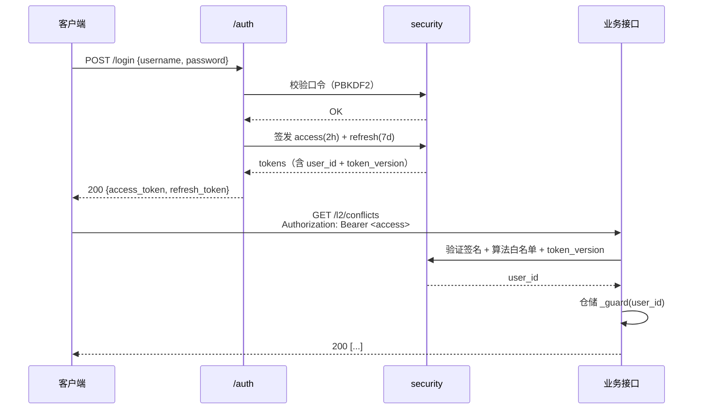
```mermaid
sequenceDiagram
    participant C as 客户端
    participant A as /auth
    participant S as security
    participant API as 业务接口

    C->>A: POST /login {username, password}
    A->>S: 校验口令（PBKDF2）
    S-->>A: OK
    A->>S: 签发 access(2h) + refresh(7d)
    S-->>A: tokens（含 user_id + token_version）
    A-->>C: 200 {access_token, refresh_token}

    C->>API: GET /l2/conflicts<br/>Authorization: Bearer <access>
    API->>S: 验证签名 + 算法白名单 + token_version
    S-->>API: user_id
    API->>API: 仓储 _guard(user_id)
    API-->>C: 200 [...]
```

| 机制 | 设计 |
|---|---|
| **Access Token** | 2 小时 |
| **Refresh Token** | 7 天 |
| **算法白名单** | 防 alg 混淆攻击（不允许 `alg=none`） |
| **token_version** | 改密/注销后自增 → **所有旧 token 立即失效**（无需黑名单） |
| **`?token=` 兜底** | 仅用于 `` 场景（浏览器直发请求无法带头） |

> **会话过期必须能回到登录页**：踩过的坑——401 被错误地排除在白名单外，导致页面变成空壳（复盘第 7 条）。**任何 401 都必须触发前端重新登录，不允许静默失败。**

---

## 12. 非功能性设计与部署

### 12.1 部署图

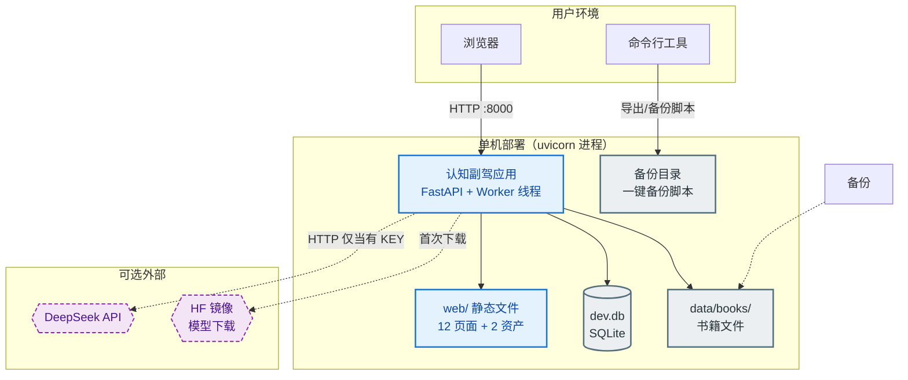
```mermaid
graph TB
    subgraph USER["用户环境"]
        BR["浏览器"]
        CLI["命令行工具"]
    end

    subgraph HOST["单机部署（uvicorn 进程）"]
        APP["认知副驾应用<br/>FastAPI + Worker 线程"]
        WEBF["web/ 静态文件<br/>12 页面 + 2 资产"]
        DBF[("dev.db<br/>SQLite")]
        BK["data/books/<br/>书籍文件"]
        BKD["备份目录<br/>一键备份脚本"]
    end

    subgraph OPT["可选外部"]
        DS{{"DeepSeek API"}}
        HF{{"HF 镜像<br/>模型下载"}}
    end

    BR -->|HTTP :8000| APP
    CLI -->|导出/备份脚本| BKD
    APP --> WEBF
    APP --> DBF
    APP --> BK
    APB["备份"] -.-> BK
    APP -.->|HTTP 仅当有 KEY| DS
    APP -.->|首次下载| HF

    classDef host fill:#e3f2fd,stroke:#1976d2,stroke-width:2px,color:#0d47a1
    classDef store fill:#eceff1,stroke:#546e7a,stroke-width:2px,color:#263238
    classDef ext fill:#f3e5f5,stroke:#8e24aa,stroke-width:1.5px,stroke-dasharray:5 3,color:#4a148c
    class APP,WEBF host
    class DBF,BK,BKD store
    class DS,HF ext
```

**部署特征**：**单机、单进程、零外部中间件**。这是刻意的极简——降低运维成本到「重启一个进程」。

### 12.2 按 ISO/IEC 25010 的非功能设计

| 质量属性 | 设计措施 | 验证方式 |
|---|---|---|
| **功能性** | 五大能力 + 账号/知识/书籍/推送全链路覆盖；用例可追溯到代码（§3.4） | 254 项测试 + 用例走查 |
| **性能效率** | L2 五级漏斗把 LLM 调用量降到 1~2%；L1 双通道召回；索引按真实查询设计（§5.3） | 成本日志 + 耗时日志 |
| **兼容性** | OpenAI 兼容协议；前端无框架，主流浏览器均可 | 手工验证 |
| **易用性** | 全站中文；会话过期自动重登；错误提示面向用户 | `tests/test_web.py` |
| **可靠性** | 任务重试 + 死信；网关重试；向量/模型均可降级；软删 | `tests/test_tasks.py` + 故障注入 |
| **安全性** | 结构性防越权；PBKDF2；JWT 算法白名单；token_version 吊销；登录限流（账号+IP 双维） | `tests/test_auth.py`（26 项） |
| **可维护性** | 分层解耦（§7）；复用抽象（§8）；`dev_logs/` 记录决策与踩坑 | §7.1 的 6 条 grep |
| **可移植性** | 无平台特有依赖；配置全环境变量化；`database_url` 可换 | 换环境重跑测试 |

### 12.3 配置项清单（`app/core/config.py`）

| 分组 | 关键配置 | 默认值 |
|---|---|---|
| **应用** | `app_name` / `debug` | 认知副驾 / False |
| **数据库** | `database_url` | `sqlite:///./dev.db` |
| **模型** | `deepseek_api_key` / `deepseek_base_url` / `deepseek_model` / `deepseek_timeout_seconds` | "" / api.deepseek.com / deepseek-flash / 60 |
| **计费** | `deepseek_peak_multiplier` / `deepseek_peak_hours` | 2.0 / `9-12,14-18` |
| **向量** | `embedding_backend` / `embedding_model` / `embedding_dim` / `embedding_local_dir` | local / bge-small-zh-v1.5 / 512 / models/... |
| **书籍** | `books_dir` | `data/books` |
| **镜像** | `hf_endpoint` / `hf_hub_disable_xet` | "" / False |
| **JWT** | `jwt_secret` / `jwt_algorithm` / `access_token_minutes` / `refresh_token_days` | "" / HS256 / 120 / 7 |
| **限流** | `login_throttle_enabled` / `login_max_attempts` / `login_ip_max_attempts` / `login_window_seconds` / `login_lock_seconds` | True / 5 / 20 / 300 / 300 |
| **Worker** | `worker_enabled` / `worker_poll_seconds` / `task_max_attempts` / `task_retry_backoff_seconds` | True / 15.0 / 3 / 1.0 |
| **定时推送** | `push_schedule_enabled` | True |

**派生属性**：`model_provider` —— 有 `deepseek_api_key` 则 `"deepseek"`，否则 `"mock"`。

### 12.4 运维要点

| 场景 | 操作 |
|---|---|
| **重启服务** | 杀进程后重启。⚠️ **必须确认旧进程真的死了**——`--reload` 的僵尸子进程会继承端口，导致「重启了却还是旧行为」（复盘第 8、9 条） |
| **备份** | 跑一键备份脚本（复制 `dev.db` + `data/`），或 `GET /api/v1/knowledge/export` |
| **改 schema** | 停服 → 手工 `ALTER TABLE` 或重建库 → 重启 → 跑全量 pytest |
| **排查「功能全崩」** | **第一步先确认是不是同一个服务器**（复盘第 8 条） |
| **排查「数据没了」** | 只读排查，不边查边改（用户数据敏感）；顺序见 `dev_logs/复盘与教训.md` 第 11 条 |
| **成本异常** | 查 `cost_logs` 按 `task_type` 聚合，看是哪个能力在烧钱 |

---

## 13. 出错处理与可观测性

### 13.1 出错处理策略（分层）

| 层 | 错误类型 | 处理策略 |
|---|---|---|
| **接口层** | 参数校验失败 | pydantic → 422 + 中文提示 |
| **接口层** | 未认证 | 401，前端统一跳转登录 |
| **仓储层** | 跨用户访问 | 抛 `PermissionError` → 403 |
| **编排层** | LLM 返回非法 JSON | `parse_json` 三层退让；仍失败则跳过该候选，不中断整批 |
| **编排层** | LLM 服务不可用 | 网关重试 3 次指数退避；仍失败则向上抛 |
| **编排层** | 向量模型不可用 | 降级为关键词检索 |
| **任务层** | 处理器异常 | 留在 pending，`attempts+1`，退避重试 |
| **任务层** | 重试超上限 | 转 `dead`，保留 `last_error` 现场 |
| **推送层** | 重复内容 | `content_hash` 唯一约束挡回 |
| **全局** | 未预期异常 | 500 + `request_id`，服务端记完整堆栈 |

### 13.2 可观测性三支柱

| 支柱 | 实现 | 用途 |
|---|---|---|
| **日志** | `core/logging.py` + `request_id` 贯穿 | 从用户报错 → 定位到具体请求的全部日志 |
| **成本埋点** | `cost_logs` 表：`task_type` / `model` / `reasoning` / `prompt_version` / `cached_tokens` / `estimated_cost` | 成本归因；发现异常烧钱 |
| **业务事件** | `learning_events`（append-only）：`event_type` + `occurred_at` + `payload` | L5 诊断的事实基础；行为分析 |

### 13.3 成本可观测性设计

`cost_logs` 的字段设计是为了**回答具体的追问**：

| 字段 | 能回答什么问题 |
|---|---|
| `task_type` | 哪个能力最烧钱？ |
| `reasoning` | 开思考的任务占了多少成本？（验证策略表是否合理） |
| `model` | 模型切换前后的成本对比 |
| `prompt_version` | 改提示词有没有导致 token 膨胀？ |
| `cached_tokens` | 上下文缓存命中率如何？（命中价 1/50，是关键优化点） |
| `request_id` | 这次调用属于哪个用户请求？ |
| `estimated_cost` | 分时计价后的真实成本（人民币） |

> **成本埋点必须在网关上做**——这是「唯一收口」的又一收益：不可能有调用漏埋点。

### 13.4 已知的可靠性边界

| 场景 | 当前行为 | 影响 | 是否可接受 |
|---|---|---|---|
| Web 进程挂掉 | Worker 同时停止 | 任务积压，重启后自动继续 | ✅ 单机工具可接受 |
| SQLite 文件损坏 | 无法启动 | 需从备份恢复 | ⚠️ 依赖备份习惯 |
| 向量模型未下载 | 降级关键词检索 | 召回质量下降 | ✅ 功能不缺失 |
| 无 API KEY | 路由到 Mock | 无真实智能 | ✅ 开发/测试可接受 |
| 磁盘满 | 写库失败 | 任务转 dead | ⚠️ 需监控 |

---

## 14. 测试与验证策略

### 14.1 测试分层

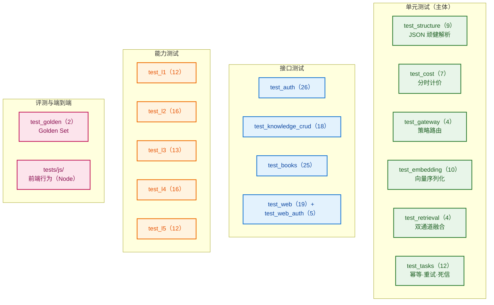
```mermaid
graph TB
    subgraph L1T["单元测试（主体）"]
        U1["test_structure（9）<br/>JSON 顽健解析"]
        U2["test_cost（7）<br/>分时计价"]
        U3["test_gateway（4）<br/>策略路由"]
        U4["test_embedding（10）<br/>向量序列化"]
        U5["test_retrieval（4）<br/>双通道融合"]
        U6["test_tasks（12）<br/>幂等·重试·死信"]
    end
    subgraph L2T["接口测试"]
        A1["test_auth（26）"]
        A2["test_knowledge_crud（18）"]
        A3["test_books（25）"]
        A4["test_web（19）+ test_web_auth（5）"]
    end
    subgraph L3T["能力测试"]
        C1["test_l1（12）"]
        C2["test_l2（16）"]
        C3["test_l3（13）"]
        C4["test_l4（16）"]
        C5["test_l5（12）"]
    end
    subgraph L4T["评测与端到端"]
        G1["test_golden（2）<br/>Golden Set"]
        J1["tests/js/<br/>前端行为（Node）"]
    end

    classDef u fill:#e8f5e9,stroke:#2e7d32,stroke-width:2px,color:#1b5e20
    classDef a fill:#e3f2fd,stroke:#1976d2,stroke-width:2px,color:#0d47a1
    classDef c fill:#fff3e0,stroke:#ef6c00,stroke-width:2px,color:#e65100
    classDef g fill:#fce4ec,stroke:#c2185b,stroke-width:2px,color:#880e4f
    class U1,U2,U3,U4,U5,U6 u
    class A1,A2,A3,A4 a
    class C1,C2,C3,C4,C5 c
    class G1,J1 g
```

### 14.2 测试原则

| 原则 | 说明 |
|---|---|
| **全程 Mock，不触发真实 API** | 网关在无 KEY 时路由到 `MockProvider`，测试确定、零成本、可离线 |
| **测试用独立数据库** | 不污染 `dev.db` |
| **`worker_enabled=false`** | 避免后台线程干扰测试时序 |
| **修 bug 必先写复现测试** | 先让测试红，再改代码让它绿 |
| **失败分支必须覆盖** | 不只测 happy path |
| **前端行为用 Node 测** | `tests/js/`，无需浏览器 |

### 14.3 测试覆盖矩阵

| 模块 | 测试文件 | 用例数 | 覆盖重点 |
|---|---|---|---|
| 认证 | `test_auth.py` | 26 | 注册/登录/刷新/改密/注销/限流/token_version 吊销 |
| 知识 CRUD | `test_knowledge_crud.py` | 18 | 增删改查/分页/搜索/软删 |
| 书籍 | `test_books.py` | 25 | 上传/解析/分章/进度/笔记/图片 |
| Web 页面 | `test_web.py` + `test_web_auth.py` | 24 | 页面可达/静态头/鉴权/`?token=` 兜底 |
| L1 | `test_l1.py` | 12 | 定位/追问分支/复用提醒 |
| L2 | `test_l2.py` + `test_conflict.py` | 20 | 五级漏斗/去重/状态机/误报抑制 |
| L3 | `test_l3.py` | 13 | 简报/提问/降级 |
| L4 | `test_l4.py` | 16 | 目标/计划/偏差/乐观锁 |
| L5 | `test_l5.py` | 12 | 模式识别/推理链/反馈 |
| 任务框架 | `test_tasks.py` + `test_push_schedule.py` | 20 | 幂等/重试/死信/定时幂等键 |
| 模型层 | `test_gateway.py` + `test_structure.py` + `test_cost.py` | 20 | 策略路由/解析退让/分时计价 |
| 检索 | `test_retrieval.py` + `test_embedding.py` | 14 | 双通道/降级/序列化 |
| 其他 | `test_health` `test_events` `test_preferences` `test_push` `test_db` `test_ingestion` `test_chat` `test_golden` | 36 | 健康/埋点/偏好/推送/越权防护/摄取/评测 |
| **合计** | | **254** | |

### 14.4 评测集（Golden Set）

`tests/golden/` 存放**人工标注的评测样本**，用于验证能力的**质量**（而非仅正确性）：

| 用途 | 说明 |
|---|---|
| 回归防护 | 改提示词后，比对能力输出是否退化 |
| 阈值调优 | 调 L2 漏斗阈值时，看是否牺牲了召回率 |
| 提示词 A/B | 用同一评测集比较不同提示词版本 |

> **确定性测试与质量评测是两回事**：254 项 pytest 保证「代码按预期运行」，Golden Set 保证「智能能力真的有用」。前者是 CI 门禁，后者是调优依据。

---

# 第四部分 · 追溯与演进

## 15. 风险与演进路线

### 15.1 技术风险与应对

| # | 风险 | 影响 | 概率 | 应对措施 |
|---|---|---|---|---|
| R1 | **LLM 输出不稳定**（格式/质量波动） | 能力不可靠 | 高 | 顽健解析 + 阈值抑制 + Golden Set 回归 |
| R2 | **成本失控** | 用户放弃使用 | 中 | 策略表关思考 + 漏斗降调用量 + 缓存 + 成本埋点告警 |
| R3 | **SQLite 向量检索变慢** | 检索超时 | 中→高（数据量增长） | 分页召回 + P1 迁 pgvector |
| R4 | **供应商 API 变更/涨价** | 服务中断 | 中 | `LLMProvider` 抽象，替换成本 1 个文件 |
| R5 | **schema 漂移** | 线上炸 | 中 | §5.5 规则 + 全量测试；P1 引入 Alembic 强制迁移 |
| R6 | **单进程单点** | 宕机即全停 | 低（个人工具） | 备份 + 重启脚本 |
| R7 | **静态资源缓存导致「假修复」** | 排查时间浪费 | 中 | 强制 `no-cache`（已实施） |
| R8 | **依赖规则靠人工遵守** | 长期腐化 | 中 | CI 加 `import-linter` / grep 守卫（待办） |

### 15.2 演进路线

| 阶段 | 主题 | 关键事项 | 触发条件 |
|---|---|---|---|
| **P1** | **可维护性加固** | ① Alembic 强制迁移；② CI 加依赖规则守卫；③ 响应体格式统一 | 团队 > 1 人，或开始接外部系统 |
| **P2** | **检索升级** | ① pgvector 替换 pickle 向量；② 向量检索下沉数据库 | 知识条目 > 5000 条 |
| **P3** | **存储解耦** | ① `raw_content` 入对象存储；② `pickle` 换 JSON/float 数组 | 对接外部系统需可读格式 |
| **P4** | **异步框架升级** | ① 需要多实例 → 换 Celery；② `enqueue`/`run_pending` 已是接口边界 | 单机 CPU/内存成为瓶颈 |
| **P5** | **能力扩展** | ① 新增 L6+；② 每加一个能力的改动量应 ≤ 2 个已有文件（§7.2） | 产品需求 |

> **P1 的三项都不做现在的原因**：见记忆中的项目约定——「破坏性/基础设施项暂缓，收益要等对接外部系统或数据量上来才体现，现在做是负收益」。**这是刻意的取舍，不是遗漏。**

### 15.3 已知技术债登记

| # | 债务 | 位置 | 偿还时机 |
|---|---|---|---|
| T1 | 向量存 pickle bytes，跨语言不可读 | `knowledge_items.embedding` | P2/P3 |
| T2 | Schema 靠手工迁移，无 Alembic 脚本 | 全项目 | P1 |
| T3 | 依赖规则无自动化守卫 | `app/` | P1 |
| T4 | 响应体格式未完全统一（各接口结构略异） | `app/api/endpoints/` | P1 |
| T5 | Worker 与 Web 同进程，无资源隔离 | `app/workers/` | P4 |
| T6 | 「最新」记录查询依赖显式排序键（易被误写为 `created_at`） | 仓储层 | 加类型约束 |

---

## 16. 需求追溯矩阵

> 双向覆盖：**需求 → 设计 → 实现 → 测试**。任何一行断链都说明有需求未被落实或未被验证。

| 需求编号 | 需求 | 用例 | 设计章节 | 实现位置 | 测试 |
|---|---|---|---|---|---|
| **功能-L1** | 模糊意图认知挖掘 | UC-L1-01 | §6.4 | `agent/l1_orchestrator.py`<br/>`api/endpoints/l1.py` | `test_l1.py` |
| **功能-L2** | 观点冲突检测 | UC-L2-01~07 | §4.5.2 §6.4 | `agent/l2_orchestrator.py`<br/>`workers/handlers.py` | `test_l2.py`<br/>`test_conflict.py` |
| **功能-L3** | 认知助产 | UC-L3-01/02 | §6.4 | `agent/l3_orchestrator.py` | `test_l3.py` |
| **功能-L4** | 学习路径自我修正 | UC-L4-01~04 | §4.5 §6.4 | `agent/l4_orchestrator.py` | `test_l4.py` |
| **功能-L5** | 认知偏误诊断 | UC-L5-01~03 | §4.5.3 §6.4 | `agent/l5_orchestrator.py` | `test_l5.py` |
| **功能-知识** | 知识管理 | UC-10-01~04 | §5.2 §6.2 | `api/endpoints/knowledge.py`<br/>`ingestion/service.py` | `test_knowledge_crud.py` |
| **功能-书籍** | 书籍阅读 | UC-20-01~04 | §5.2 §6.7 | `books/parser.py`<br/>`api/endpoints/books.py` | `test_books.py` |
| **功能-推送** | 主动推送 | UC-30-01/02 | §6.7 | `agent/push_service.py`<br/>`push/` | `test_push.py`<br/>`test_push_schedule.py` |
| **功能-账号** | 账号与会话 | UC-00-01~05 | §11.5 | `api/endpoints/auth.py`<br/>`core/security.py` | `test_auth.py` |
| **功能-偏好** | 偏好设置 | UC-40-01 | §12.3 | `api/endpoints/preferences.py` | `test_preferences.py` |
| **功能-导出** | 数据导出与备份 | UC-50-01 | §12.4 | `api/endpoints/knowledge.py` | `test_knowledge_crud.py` |
| **安全-1** | 口令安全存储 | — | §6.7 | `core/security.py`（PBKDF2） | `test_auth.py` |
| **安全-2** | 会话安全与吊销 | — | §11.5 | `token_version` + 算法白名单 | `test_auth.py` |
| **安全-3** | 防越权 | — | §7.3 | `BaseRepository._guard()` | `test_db.py` |
| **安全-4** | 登录暴力破解防护 | — | §6.7 | `core/ratelimit.py` | `test_auth.py` |
| **安全-5** | 数据软删与保留期 | — | §5.4 | 实体 `is_deleted` / `deleted_at` | `test_knowledge_crud.py` |
| **可靠-1** | 任务幂等 | — | §6.5.1 | `TaskRun.idempotency_key` | `test_tasks.py` |
| **可靠-2** | 并发写不覆盖 | — | §5.4 | `LearningPlan.version` 乐观锁 | `test_l4.py` |
| **可靠-3** | 失败重试与死信 | — | §4.5.1 | `workers/tasks.py` | `test_tasks.py` |
| **可靠-4** | 外部依赖降级 | — | §6.6 §10.3 | `MockProvider` / 关键词通道 | `test_retrieval.py`<br/>`test_gateway.py` |
| **成本-1** | 成本可追踪 | — | §13.3 | `cost_logs` + 网关埋点 | `test_cost.py` |
| **成本-2** | 分任务类型控成本 | — | §6.3.1 | `STRATEGY_TABLE`（reasoning 开关） | `test_gateway.py` |
| **成本-3** | 分时计价 | — | §6.3.3 | `llm/cost.py` | `test_cost.py` |
| **成本-4** | 上下文缓存利用 | — | §13.3 | `cached_tokens` 埋点 | `test_cost.py` |
| **可维护-1** | 分层解耦 | — | §7.1 | 依赖方向铁律 | 评审 + 待 CI 守卫 |
| **可维护-2** | 代码复用 | — | §8.1 | 16 个复用抽象 | 复用度量 §8.3 |
| **可维护-3** | 可替换性 | — | §7.4 | Provider / Embedding / DB 抽象 | `test_gateway.py` |
| **可维护-4** | 决策与踩坑可追溯 | — | §17 | `dev_logs/` | — |
| **易用-1** | 中文界面的错误提示 | — | §11.4 | `main.py:_validation_message` | `test_web.py` |
| **易用-2** | 会话过期可恢复 | — | §11.5 | 401 统一处理 | `test_web_auth.py` |

---

## 17. 附录

### 附录 A：Mermaid 图表索引

| 图 | 章节 | 类型 |
|---|---|---|
| 顶层用例图 | §3.2 | UML 用例图 |
| L2 用例细化图 | §3.3 | UML 用例图（含 include/extend） |
| 组件图 | §4.1 | UML 组件图 |
| 依赖方向图 | §4.3 | 依赖关系图 |
| 核心抽象类图 | §4.4 | UML 类图 |
| 任务状态机 | §4.5.1 | UML 状态机图 |
| 冲突状态机 | §4.5.2 | UML 状态机图 |
| 诊断状态机 | §4.5.3 | UML 状态机图 |
| **ER 图（16 表）** | §5.1 | ER 图 |
| 复用层次图 | §8.2 | 分层图 |
| 开发工作流 | §9.5 | 流程图 |
| 技术栈图 | §10.1 | 组件图 |
| 会话时序图 | §11.5 | UML 序列图 |
| 部署图 | §12.1 | UML 部署图 |
| 测试分层图 | §14.1 | 分层图 |

### 附录 B：环境变量速查

| 变量 | 用途 | 示例 |
|---|---|---|
| `DEEPSEEK_API_KEY` | 启用真实模型 | `sk-xxxx` |
| `DATABASE_URL` | 数据库连接 | `sqlite:///./dev.db` |
| `JWT_SECRET` | JWT 签名密钥 | 随机长字符串 |
| `EMBEDDING_BACKEND` | 向量后端 | `local` / 空（降级） |
| `HF_ENDPOINT` | 模型下载镜像 | `https://hf-mirror.com` |
| `WORKER_ENABLED` | 是否启用后台任务 | `false`（测试） |
| `DEBUG` | 调试模式 | `true` |

### 附录 C：新手第一个 PR 示例

**任务**：给知识条目列表加「按更新时间倒序」的排序能力。

**Step 1 · 读懂现状**（10 分钟）
- 读 §3.4 找到 `GET /api/v1/knowledge/items` → `api/endpoints/knowledge.py:106`
- 顺着读到 `KnowledgeRepository.list_active()` → 注意 `_filter_conditions()`

**Step 2 · 查可复用项**（5 分钟）
- 按 §8.4：列表查询 → 用 `KnowledgeRepository`，不要自己开 `session.query()`

**Step 3 · 写测试**（15 分钟）
```python
# tests/test_knowledge_crud.py
def test_list_items_sorted_by_updated_desc(client, auth_headers):
    """新增：按 updated_at 倒序时应最后更新的排最前。"""
    ...
```

**Step 4 · 最小实现**（20 分钟）
- `knowledge.py`：加 `sort: str = "updated_desc"` 查询参数
- `knowledge_repository.py`：在 `list_active` 中按 `sort` 加 `.order_by()`
- ⚠️ 注意：**不要用 `created_at` 做「最新」的排序键**——同秒写入会穿（复盘第 3 条）

**Step 5 · 跑测试**
```bash
pytest && node --check web/assets/app.js
```

**Step 6 · 过 DoD（§9.4）**
- 依赖规则 grep（§7.1 D-6：`api` 没有直接操作 Session ✓）
- 没碰 schema，无需重启验证
- `dev_logs/2026-09-XX.md` 加一行「今日完成」
- `git commit -m "feat: 知识列表支持按更新时间排序"`

### 附录 D：反模式清单（本项目踩过或明确禁止）

| # | 反模式 | 教训来源 | 正确做法 |
|---|---|---|---|
| 1 | 新增 ORM 模型但不在 `__init__.py` 注册 | 复盘-1 | 立即注册；表不存在**不报错**，最危险 |
| 2 | 假设 `create_all` 会给已有表加列 | 复盘-2 | 加字段必须手工 `ALTER TABLE` 或重建库（§5.5） |
| 3 | 用 `created_at` 取「最新」记录 | 复盘-3 | 用显式排序键（自增 id / 明确序号），同秒写入会穿 |
| 4 | 主键 default 生成的 id 与 service 层 id 分叉 | 复盘-4 | 主键 id 只在 ORM default 生成一处，service 层不要另造 |
| 5 | 错误提示用框架默认格式（英文 JSON 怼界面） | 复盘-5 | `_validation_message` 统一翻中文（§11.4） |
| 6 | `` 直发请求带不了 Authorization | 复盘-6 | 用 `get_user_id_flexible` 支持 `?token=` 兜底 |
| 7 | 401 被「auth 前缀」白名单排除 → 页面空壳 | 复盘-7 | **任何 401 都必须触发重新登录**，不允许静默失败 |
| 8 | 排查「功能全崩」时忘了确认是不是同一个服务器 | 复盘-8 | 第一步先确认进程与端口归属 |
| 9 | 相信 `--reload` 会干净重启 | 复盘-9 | 僵尸子进程继承 socket → 手动杀干净再启 |
| 10 | 「后端完成」就宣告「功能完成」 | 复盘-10 | 收口前**反查前端引用**（路由/字段/页面是否已接） |
| 11 | 排查「数据没了」时边查边改 | 复盘-11 | **全程只读**；顺序：确认库 → 确认进程 → 确认查询条件 |
| 12 | 分桶聚合拿 key 字符串当排序键 | 复盘-12 | 用数值化的桶序，字符串排序会得到「10 < 2」 |
| 13 | 滚动位置恢复不等布局稳定 | 复盘-13 | 等 DOM 布局稳定后再恢复 scrollTop |
| 14 | 视觉改动不先确认方向就一次叠多层 | 复盘-14 | **先给方案让用户选**，或只做单点微调（用户偏好：不要网格/纹理背景） |

---

## 结语

本文档 V3.0 的核心主张是四句话：

1. **约束写在结构里，不写在文档里。** 越权防护做进 `BaseRepository`、幂等做进数据库唯一约束、模型调用收口进网关——**靠结构让错误写法写不出来**，比靠文档提醒开发者「记得加 user_id」可靠得多。

2. **便宜的手段放前面，贵的放后面。** L2 五级漏斗、`reasoning` 开关、增量扫描标记——所有智能能力的成本都靠"先用规则/数据库筛，再花大钱推理"压下来。

3. **可降级比高性能重要。** 无 KEY → Mock；无向量模型 → 关键词；模型失败 → 重试 + 死信。**每一处外部依赖都有 Plan B**，所以系统在任何环境下都能跑。

4. **加新东西不该改旧东西。** §7.2 的扩展点设计保证新增 L6 只需改 2 个已有文件（`main.py` + `gateway.py` 策略表），且必须改的这两处都是「注册式」而非「侵入式」。**这是检验解耦是否成功的唯一硬指标。**

> **维护说明**：本文档与代码同步演进。任何涉及依赖方向、收口点、复用抽象、schema 结构的改动，**必须同步更新对应章节**；日常进展记入 `dev_logs/`，架构级决策记入 `dev_logs/设计决策与经验.md`，踩坑复盘记入 `dev_logs/复盘与教训.md`。

---

**文档结束** · 版本 V3.0 · 2026-09