# 认知副驾（Cognitive Copilot）系统设计说明书

> **版本**：V3.1（设计评审版）
> **日期**：2026-09
> **文档类别**：软件设计说明书（SDD）
> **参考标准**：IEEE Std 1016-2009《软件设计描述》、GB/T 8567-2006《计算机软件文档编制规范》、ISO/IEC 25010（软件质量模型）、UML 2.5、RFC 2119（需求表述强度）
> **上游文档**：《需求分析文档.md》（需求基线）、《架构设计文档.md》（架构决策记录 ADR-01~15）
> **评审用途**：设计方案评审、架构合理性论证、需求覆盖性核查、验收依据
>
> **V3.1 修订说明**（相对 V3.0）：
> 1. **文档定位调整为设计评审版**：面向设计评审与验收，全篇采用设计说明书的陈述式表述，覆盖「设计目标 → 方案论证 → 结构设计 → 数据设计 → 功能设计 → 接口设计 → 非功能设计 → 验证与追溯」完整链条。
> 2. **第 2 章重构为「设计目标与总体方案」**：改由设计目标、设计约束、设计视图组织、关键决策索引与模块职责构成。
> 3. **第 9 章重构为「工程实现与质量保障」**：由团队开发流程改为代码组织约定、质量标准与评审检查项。
> 4. **V3.0 的图表与论证全部保留**：用例图（§3）、ER 图（§5）、类图（§4.4）、组件图（§4.1）、状态机图（§4.5）、部署图（§12.1）、序列图（§11.5）；技术选型论证（§10）、解耦规则（§7）、复用机制（§8）、需求追溯矩阵（§16）。
> 5. 同步更新实现现状数据（测试用例 262 项）。

---

## 目录

**第一部分 · 设计基础**
1. [文档说明](#1-文档说明)
2. [设计目标与总体方案](#2-设计目标与总体方案)
3. [系统功能视图（用例图）](#3-系统功能视图用例图)

**第二部分 · 结构设计**
4. [系统架构](#4-系统架构)
5. [数据设计（ER 图与数据字典）](#5-数据设计er-图与数据字典)
6. [模块详细设计](#6-模块详细设计)
7. [架构解耦规则](#7-架构解耦规则)
8. [代码复用机制](#8-代码复用机制)

**第三部分 · 实现设计与质量保障**
9. [工程实现与质量保障](#9-工程实现与质量保障)
10. [技术选型与论证](#10-技术选型与论证)
11. [接口设计](#11-接口设计)
12. [非功能性设计与部署](#12-非功能性设计与部署)
13. [出错处理与可观测性](#13-出错处理与可观测性)
14. [测试与验证策略](#14-测试与验证策略)

**第四部分 · 验证与演进**
15. [风险与演进路线](#15-风险与演进路线)
16. [需求追溯矩阵](#16-需求追溯矩阵)
17. [附录](#17-附录)

---

# 第一部分 · 设计基础

## 1. 文档说明

### 1.1 文档目的

本文档在《需求分析文档》需求基线上，给出「认知副驾」系统的**完整设计说明**，作为设计评审与验收的技术依据。具体承担四项职责：

1. **论证设计合理性**：说明系统为何采取当前架构方案、技术选型的依据、关键决策的取舍与代价。
2. **界定系统结构**：自顶向下描述系统的分层结构、模块职责、依赖关系、数据模型与接口契约。
3. **声明设计约束**：明确系统必须遵守的结构性约束（依赖方向、收口点、隔离规则）及其保障机制。
4. **建立可追溯性**：将每条需求关联到设计章节、实现模块与验证方式，实现双向覆盖核查（§16）。

> **本文档的表述原则**：以设计说明书的陈述式表述记录「系统采用什么方案、为什么这样设计、达成何种质量目标」；不重复罗列可直接从代码读取的信息（字段名、函数签名），而重点说明需要跨模块推导才能得到的结论——**设计约束、选型依据、复用结构、边界条件**。文档的价值在于界定「约束」与「理由」，而非复述「实现」。

### 1.2 读者对象与阅读路线

本文档面向设计评审相关方，各类读者可按职责选择关注章节：

| 读者角色 | 评审关注点 | 建议重点章节 |
|---|---|---|
| **设计评审专家 / 指导教师** | 设计的完整性、合理性、规范性 | 1 → 2 → 3 → 4 → 16 |
| **架构评审** | 分层是否合理、耦合是否受控、扩展性 | 4 → 7 → 8 → 10 |
| **数据设计评审** | 数据模型、完整性、隔离策略 | 5 → 7.3 |
| **功能设计评审** | 用例覆盖、流程完备性、异常分支 | 3 → 6 |
| **接口设计评审** | 契约完备性、鉴权与错误处理 | 11 → 13 |
| **测试评审** | 验证策略、覆盖度、可追溯性 | 14 → 16 |
| **运维 / 部署评审** | 部署拓扑、配置项、可靠性设计 | 12 → 13 |
| **产品验收** | 功能范围、演进路线、需求覆盖 | 3 → 15 → 16 |

### 1.3 术语表

| 术语 | 说明 |
|---|---|
| **L1~L5** | 五大能力：L1 模糊意图认知挖掘 / L2 冲突检测 / L3 认知助产 / L4 路径自我修正 / L5 偏误诊断 |
| **ModelGateway** | 统一模型网关，全系统唯一出网调用点，负责策略路由、重试、成本埋点 |
| **Provider** | 单个模型服务封装（DeepSeek / Mock），实现 `LLMProvider` 接口 |
| **Strategy** | 任务类型 → 调用参数（是否开 reasoning、模型名）的映射条目 |
| **Orchestrator** | 编排层，负责单条用例的完整流程编排（L1~L5 各有其一） |
| **Repository** | 仓储，唯一允许访问数据库的层，且强制 `user_id` 过滤 |
| **TaskRun** | 异步任务运行记录，承载幂等键、重试次数、死信现场 |
| **幂等键（idempotency_key）** | 业务语义去重键（如「某用户 2026 年第 37 周的冲突扫描」），以数据库唯一约束兜底 |
| **结构性防越权** | 在仓储基类层面强制过滤，使越权访问在结构上不可表达，而非依赖编码自觉 |
| **收口（choke point）** | 某类操作在全系统中只允许存在一处实现的设计性质 |
| **设计约束（Design Constraint）** | 系统必须遵守的结构性规则，违反即判定设计不合规（见 §7.1） |

### 1.4 参考标准落实方式

| 标准 | 要求内容 | 本文档的落实 |
|---|---|---|
| **IEEE 1016-2009** | 设计描述应包含：设计标识、设计利益相关者、设计关注点、设计视图、设计覆盖 | §1.2 读者与关注点矩阵；§2 设计目标与约束；§4 架构视图；§5 数据视图；§6 模块视图；§16 覆盖追溯 |
| **GB/T 8567-2006** | 软件设计说明应含：程序描述、功能、性能、输入项、输出项、算法、逻辑流程、接口、存储分配、注释、限制条件、测试要点 | §6 各模块统一按「职责/输入/输出/关键算法/依赖约束/测试要点」结构描述 |
| **ISO/IEC 25010** | 功能性、性能效率、兼容性、易用性、可靠性、安全性、可维护性、可移植性 | §12.2 非功能性设计按此八项逐条落地并给出验证方式 |
| **UML 2.5** | 用例图、类图、组件图、状态机图、部署图、序列图 | §3 用例图；§4.1 组件图；§4.4 类图；§4.5 状态机图；§5.1 ER 图；§11.5 序列图；§12.1 部署图 |
| **RFC 2119** | 「必须 / 应当 / 可以」的表述强度区分 | 全文使用：**必须**=强制约束（违反即判定设计不合规）、**应当**=推荐、**可以**=可选 |

### 1.5 实现现状快照

本设计说明书对应**已落地的 P0 骨架实现**，设计条目均可在实现中验证，而非纸面规划。撰写时的事实基线：

| 指标 | 数值 |
|---|---|
| Python 源文件 | 95 个 |
| ORM 实体 | 16 张表 |
| REST 端点模块 | 13 个（41 个路由） |
| 前端页面 | 12 个（原生 HTML，无框架） |
| 测试用例 | 262 项（pytest 全程 Mock，不触发真实 API） |
| 外部运行时依赖 | 9 个（见 §10.1） |
| 数据库 | SQLite 单文件（`dev.db`） |

---

## 2. 设计目标与总体方案

本章给出系统的设计出发点与总体方案框架，说明**设计要达成什么目标、受哪些约束、采用何种总体思路**，并给出关键设计决策索引与系统组成，作为后续各章的论证前提。

### 2.1 设计目标与优先级

系统的设计目标按优先级排序如下。当目标之间发生冲突时，**以序号靠前者为准**——这一优先级顺序是后续所有设计取舍的判据。

| 优先级 | 设计目标 | 具体含义 | 主要落实章节 |
|---|---|---|---|
| **G1** | **数据安全与用户隔离** | 用户数据不可丢失、不可越权访问；隔离由结构保障而非编码约定 | §5.4 §7.3 |
| **G2** | **功能性完备** | 五大能力 L1~L5 全链路闭合，用例无缺口 | §3 §6 |
| **G3** | **成本可控** | 单位用户智能能力成本可预测、可归因、有上限 | §6.3.1 §13.3 |
| **G4** | **可靠性** | 外部依赖失效时可降级或重试，不因单点故障丢失数据 | §13 §10.3 |
| **G5** | **可维护与可扩展** | 分层解耦、复用充分，新增能力不侵入既有代码 | §7 §8 |
| **G6** | **部署轻量** | 零外部中间件，单机可运行 | §10.2 §12.1 |

> **关于优先级的一个典型取舍**：G1 高于 G6。为实现「结构性防越权」，系统在不容许直接使用 ORM 查询的约束下（牺牲部分编码便利、增加一层仓储抽象），换取了越权在结构上不可表达的性质。这类"以抽象换约束"的取舍在 §7.3、§10.2 中反复出现，均遵循本节优先级。

### 2.2 设计约束

设计约束是方案选择的前提条件，分为技术约束与业务约束两类。

**技术约束**（来自运行环境与既有条件）：

| # | 约束 | 对设计的影响 |
|---|---|---|
| C1 | 单机部署，无独立运维条件 | 排除需外部中间件的方案（Celery/Redis/Kafka）→ 采用进程内任务队列（§10.2 ADR-13） |
| C2 | 面向个人用户，数据量级为千级条目 | 允许文件型数据库承载；向量检索暂可内存暴力计算（§15.3 T1） |
| C3 | 模型服务为外部依赖，可用性与价格不可控 | 模型调用必须收口并可降级、可重试、可计费（§6.3） |
| C4 | 前端无构建条件 | 采用原生 HTML/JS/CSS，共享逻辑集中于单一资产文件（§10.2 ADR-15） |
| C5 | 须支持完全离线运行与自动化测试 | 模型层与向量层均须提供可替换的降级实现（§10.3） |

**业务约束**（来自需求与使用场景）：

| # | 约束 | 对设计的影响 |
|---|---|---|
| C6 | 智能能力质量存在不确定性 | 输出须结构化校验、阈值抑制、可反馈纠正（§6.3.2、§4.5.2） |
| C7 | 用户数据敏感 | 软删 + 保留期 + 导出能力；日志不得含正文（§5.4 §12.4） |
| C8 | 推理类操作耗时较长（秒级至分钟级） | 长流程与周期任务须走异步任务框架，不得占用请求线程（§6.5） |
| C9 | 用户使用为长周期持续行为 | 需保留完整行为事件以支撑 L5 归因分析（§5.2 `learning_events`） |

### 2.3 设计视图组织

本文档按 IEEE 1016 的多视图方法组织：同一系统从四个视角分别描述，各视图互补且相互引用。

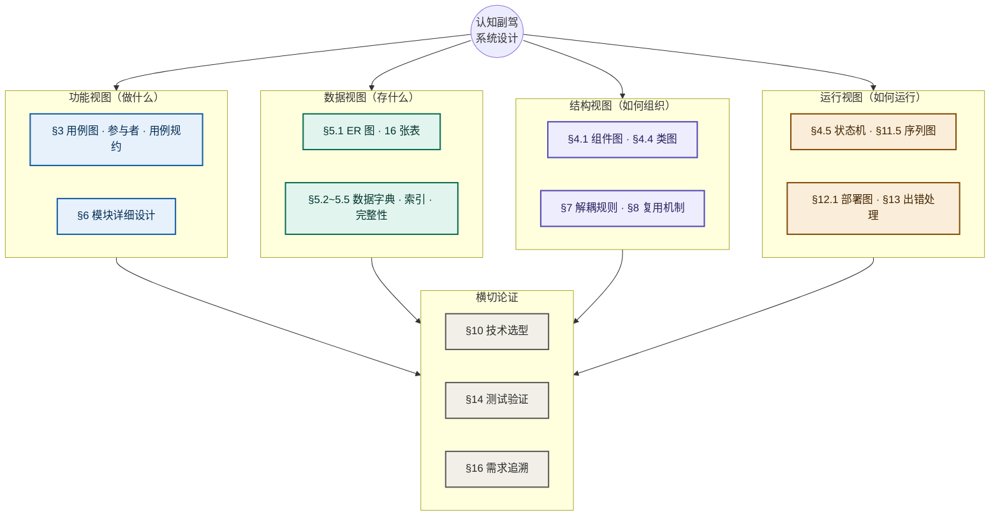
```mermaid
graph TB
    SYS(("认知副驾<br/>系统设计"))

    subgraph V1["功能视图（做什么）"]
        F1["§3 用例图 · 参与者 · 用例规约"]
        F2["§6 模块详细设计"]
    end
    subgraph V2["数据视图（存什么）"]
        D1["§5.1 ER 图 · 16 张表"]
        D2["§5.2~5.5 数据字典 · 索引 · 完整性"]
    end
    subgraph V3["结构视图（如何组织）"]
        A1["§4.1 组件图 · §4.4 类图"]
        A2["§7 解耦规则 · §8 复用机制"]
    end
    subgraph V4["运行视图（如何运行）"]
        R1["§4.5 状态机 · §11.5 序列图"]
        R2["§12.1 部署图 · §13 出错处理"]
    end

    subgraph XC["横切论证"]
        X1["§10 技术选型"]
        X2["§14 测试验证"]
        X3["§16 需求追溯"]
    end

    SYS --> V1
    SYS --> V2
    SYS --> V3
    SYS --> V4
    V1 --> XC
    V2 --> XC
    V3 --> XC
    V4 --> XC

    classDef v1 fill:#E6F1FB,stroke:#185FA5,stroke-width:2px,color:#042C53
    classDef v2 fill:#E1F5EE,stroke:#0F6E56,stroke-width:2px,color:#04342C
    classDef v3 fill:#EEEDFE,stroke:#534AB7,stroke-width:2px,color:#26215C
    classDef v4 fill:#FAEEDA,stroke:#854F0B,stroke-width:2px,color:#412402
    classDef xc fill:#F1EFE8,stroke:#5F5E5A,stroke-width:2px,color:#2C2C2A
    class F1,F2 v1
    class D1,D2 v2
    class A1,A2 v3
    class R1,R2 v4
    class X1,X2,X3 xc
```

四个视图的划分依据：**功能视图**回答「系统能做什么」，**数据视图**回答「系统的信息基础是什么」，**结构视图**回答「代码如何组织以支撑前两者」，**运行视图**回答「系统在时间维度上如何运转」。横切论证则给出选型理由、验证方式与需求覆盖核查。

### 2.4 关键设计决策索引

系统的关键设计决策以 ADR 形式记录于《架构设计文档》，其摘要与本文档对应章节如下。评审时可据此定位决策依据。

| 决策编号 | 决策主题 | 核心取舍 | 详细论证 |
|---|---|---|---|
| ADR-01 | Web 框架选型 | 采用 FastAPI 以获取原生校验与依赖注入，未采纳 Flask / Django | §10.2 |
| ADR-02 | 数据访问方式 | 在 ORM 之上增加仓储层，以抽象换结构性安全约束 | §10.2 §7.3 |
| ADR-03 | 存储选型 | P0 采用 SQLite 换取零部署，接受向量检索与并发写的能力上限 | §10.2 §15.3 |
| ADR-09 | 主张（Claim）实体持久化 | 将原子主张落库，把冲突检测由 O(n²) 全集比对降为近邻检索 | §5.2 §6.4 |
| ADR-11 | 结构化输出策略 | JSON Schema + 多层退让解析，不假设模型输出严格合规 | §6.3.2 §10.2 |
| ADR-13 | 异步任务框架 | 进程内「落库排队 + 轮询」替代 Celery/Redis，以框架无关接口保留替换路径 | §6.5 §10.2 |
| ADR-14 | 模型服务与成本策略 | 单一模型 + 每请求 reasoning 开关 + 集中策略表 | §6.3.1 §10.2 |
| ADR-15 | 前端架构 | 原生三件套，零构建 | §10.2 |

> **决策的记录结构**：所有决策按统一四项式记录——**选型内容 / 选型理由 / 未采纳方案及其原因 / 重新评估条件**。其中「重新评估条件」给出可量化的触发条件，避免决策在前提条件变化后仍被机械沿用（详见 §10.2）。

### 2.5 系统组成与模块职责

系统采用模块化单体（Modular Monolith）组织：单进程部署，内部按职责严格分层切分模块。各模块的职责边界与依赖许可如下。

```
知识学习智能体/
├── app/
│   ├── main.py                  # 应用入口：中间件装配、异常处理、路由挂载、静态资源托管
│   ├── api/                     # 接口层（协议转换，不含业务逻辑）
│   │   ├── deps.py              #   依赖注入：会话、网关、鉴权（唯一鉴权出口）
│   │   └── endpoints/           #   13 个端点模块，按业务域划分
│   ├── agent/                   # 编排层（单条用例的流程编排与降级决策）
│   │   ├── orchestrator.py      #   通用对话编排
│   │   ├── l1_orchestrator.py   #   L1 模糊意图 → 定位判断 / 追问分支
│   │   ├── l2_orchestrator.py   #   L2 五级候选漏斗冲突检测
│   │   ├── l3_orchestrator.py   #   L3 认知简报装配 / 助产式提问生成
│   │   ├── l4_orchestrator.py   #   L4 学习计划生成与偏差检测
│   │   ├── l5_orchestrator.py   #   L5 行为模式识别与归因推理
│   │   └── push_service.py      #   推送内容装配
│   ├── capabilities/            # 能力包隔离声明（约定五大能力互不依赖）
│   ├── domain/                  # 领域层（业务内核，依赖方向最底层）
│   │   ├── models/              #   16 个 ORM 实体定义
│   │   └── repositories/        #   12 个仓储，全系统唯一数据访问点
│   ├── llm/                     # 模型层（全系统唯一外部模型调用出口）
│   │   ├── gateway.py           #   ModelGateway：策略路由 + 重试 + 成本埋点
│   │   ├── provider.py          #   LLMProvider 抽象接口
│   │   ├── deepseek/            #   DeepSeek 实现 / Mock 实现
│   │   ├── prompts.py           #   提示词集中管理与版本号
│   │   ├── structure.py         #   结构化输出多层退让解析
│   │   ├── cost.py              #   分时计价
│   │   └── retry.py             #   指数退避重试
│   ├── workers/                 # 异步任务层
│   │   ├── runner.py            #   守护线程轮询循环
│   │   ├── tasks.py             #   任务注册表 + 幂等入队 + 批量执行
│   │   ├── handlers.py          #   3 个任务处理器
│   │   └── triggers.py          #   触发条件与幂等键构造
│   ├── retrieval/               # 检索层（向量 + 关键词双通道召回）
│   ├── ingestion/               # 知识摄取
│   ├── books/                   # 书籍解析与阅读
│   ├── feedback/                # 行为事件记录
│   ├── push/                    # 推送通道
│   └── core/                    # 横切基础设施：config / security / ratelimit / logging / trace
├── web/                         # 前端：12 个页面 + assets（app.js 共享逻辑、style.css 唯一样式源）
├── tests/                       # 262 项测试 + golden（评测集）+ js（前端行为验证）
├── docs/                        # 需求分析 / 架构设计 / 系统设计 文档
├── dev_logs/                    # 开发日志：每日进展 + 问题复盘 + 决策经验
├── data/books/                  # 书籍文件存储
└── pyproject.toml               # 依赖声明与测试配置
```

| 模块 | 职责 | 依赖许可 | 禁止依赖 |
|---|---|---|---|
| `api/` | HTTP 协议转换、参数校验、鉴权、序列化 | `agent/`、`domain/`、`core/` | 不含业务逻辑；不直接调用 `llm/`；不直接操作数据库会话 |
| `agent/` | 用例流程编排、多步协调、降级决策 | `domain/`、`llm/`、`retrieval/`、`workers/` | 不直接操作数据库会话（须经仓储） |
| `domain/` | 实体定义、持久化、数据完整性 | `core/` | 不依赖 `llm/`、`api/`、`agent/` |
| `llm/` | 模型调用收口、策略路由、重试、计费 | `core/` | 不依赖 `agent/` 及任何业务模块 |
| `retrieval/` | 双通道召回与融合排序 | `core/` | 不依赖 `agent/` |
| `workers/` | 任务注册、调度、执行与容错 | `agent/`、`domain/` | 处理器内不含业务逻辑 |
| `core/` | 配置、安全、限流、日志、链路追踪 | 无 | 不依赖任何上层模块 |

> 上述依赖许可是**强制约束**，其检查方式与违反后果见 §7.1。

---

## 3. 系统功能视图（用例图）

本章以 UML 用例图界定系统的功能边界：识别参与者、列出用例全集、给出用例之间的包含与扩展关系，并对复杂度最高的用例给出完整场景规约（含异常分支）。本章的用例编号是 §16 需求追溯矩阵的左侧索引。

### 3.1 参与者（Actor）识别

| 参与者 | 类型 | 说明 |
|---|---|---|
| **学习者（Learner）** | 主参与者 | 系统的唯一真实用户。所有能力的服务对象 |
| **定时器（Scheduler）** | 系统参与者 | 驱动周期性用例：每周简报、每月健康报告、周度冲突扫描 |
| **摄取触发（Ingest Trigger）** | 系统参与者 | 知识入库后驱动增量冲突扫描 |
| **DeepSeek 模型服务** | 外部系统 | 被 `ModelGateway` 调用，提供推理能力 |
| **本地向量模型（BGE）** | 外部系统 | 被检索层调用，提供语义向量 |

> **设计要点**：本系统是**单用户视角的个人工具**，不存在「管理员」角色。所有数据访问均以 `user_id` 为强制作用域（见 §7.3），因此「越权」在结构中不可能发生，而非靠权限校验拦截。

### 3.2 顶层用例图

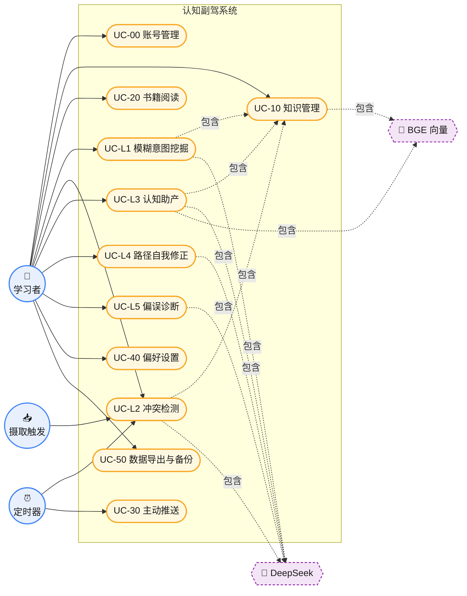
```mermaid
graph LR
    Learner(("👤<br/>学习者"))
    Scheduler(("⏰<br/>定时器"))
    Ingest(("📥<br/>摄取触发"))

    subgraph COPILOT["认知副驾系统"]
        direction TB
        UC00(["UC-00 账号管理"])
        UC10(["UC-10 知识管理"])
        UC20(["UC-20 书籍阅读"])
        UC1(["UC-L1 模糊意图挖掘"])
        UC2(["UC-L2 冲突检测"])
        UC3(["UC-L3 认知助产"])
        UC4(["UC-L4 路径自我修正"])
        UC5(["UC-L5 偏误诊断"])
        UC6(["UC-30 主动推送"])
        UC7(["UC-40 偏好设置"])
        UC8(["UC-50 数据导出与备份"])
    end

    LLM{{"🤖 DeepSeek"}}
    EMB{{"🔢 BGE 向量"}}

    Learner --> UC00
    Learner --> UC10
    Learner --> UC20
    Learner --> UC1
    Learner --> UC2
    Learner --> UC3
    Learner --> UC4
    Learner --> UC5
    Learner --> UC7
    Learner --> UC8

    Scheduler --> UC2
    Scheduler --> UC6
    Ingest --> UC2

    UC1 -.->|包含| UC10
    UC2 -.->|包含| UC10
    UC3 -.->|包含| UC10
    UC2 -.->|包含| LLM
    UC1 -.->|包含| LLM
    UC3 -.->|包含| LLM
    UC4 -.->|包含| LLM
    UC5 -.->|包含| LLM
    UC10 -.->|包含| EMB
    UC3 -.->|包含| EMB

    classDef actor fill:#e8f0fe,stroke:#4285f4,stroke-width:2px,color:#1a1a1a
    classDef uc fill:#fff8e1,stroke:#f9a825,stroke-width:2px,color:#1a1a1a
    classDef ext fill:#f3e5f5,stroke:#8e24aa,stroke-width:1.5px,stroke-dasharray:4 3,color:#1a1a1a
    class Learner,Scheduler,Ingest actor
    class UC00,UC10,UC20,UC1,UC2,UC3,UC4,UC5,UC6,UC7,UC8 uc
    class LLM,EMB ext
```

### 3.3 L2 冲突检测用例细化（含 extend / include）

L2 是全系统用例关系最复杂的能力，单独展开。

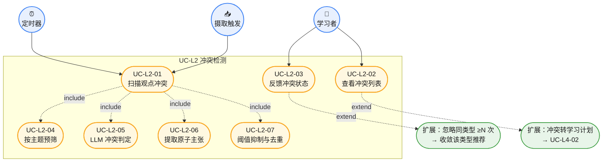
```mermaid
graph TB
    Learner(("👤<br/>学习者"))
    Scheduler(("⏰<br/>定时器"))
    Ingest(("📥<br/>摄取触发"))

    subgraph L2BOX["UC-L2 冲突检测"]
        L201(["UC-L2-01<br/>扫描观点冲突"])
        L202(["UC-L2-02<br/>查看冲突列表"])
        L203(["UC-L2-03<br/>反馈冲突状态"])
        L204(["UC-L2-04<br/>按主题预筛"])
        L205(["UC-L2-05<br/>LLM 冲突判定"])
        L206(["UC-L2-06<br/>提取原子主张"])
        L207(["UC-L2-07<br/>阈值抑制与去重"])
    end

    Ext1(["扩展：忽略同类型 ≥N 次<br/>→ 收敛该类型推荐"])
    Ext2(["扩展：冲突转学习计划<br/>→ UC-L4-02"])

    Learner --> L202
    Learner --> L203
    Scheduler --> L201
    Ingest --> L201

    L201 -.->|include| L206
    L201 -.->|include| L204
    L201 -.->|include| L205
    L201 -.->|include| L207

    L203 -.->|extend| Ext1
    L202 -.->|extend| Ext2

    classDef actor fill:#e8f0fe,stroke:#4285f4,stroke-width:2px,color:#1a1a1a
    classDef uc fill:#fff8e1,stroke:#f9a825,stroke-width:2px,color:#1a1a1a
    classDef ext fill:#e8f5e9,stroke:#43a047,stroke-width:1.5px,color:#1a1a1a
    class Learner,Scheduler,Ingest actor
    class L201,L202,L203,L204,L205,L206,L207 uc
    class Ext1,Ext2 ext
```

### 3.4 用例清单与设计—实现映射

用例清单给出全部 31 条用例，并逐条映射到实现模块与对外接口，作为**功能覆盖性核查**的依据：评审时可据此确认每条用例均有确定的实现承载，不存在「设计有而实现无」的用例。

| 用例编号 | 用例名 | 主参与者 | 实现位置 | 对应接口 |
|---|---|---|---|---|
| UC-00-01 | 注册账号 | 学习者 | `api/endpoints/auth.py:195` | `POST /api/v1/auth/register` |
| UC-00-02 | 登录 | 学习者 | `api/endpoints/auth.py:237` | `POST /api/v1/auth/login` |
| UC-00-03 | 刷新会话 | 系统 | `api/endpoints/auth.py:265` | `POST /api/v1/auth/refresh` |
| UC-00-04 | 修改密码 | 学习者 | `api/endpoints/auth.py:293` | `POST /api/v1/auth/password` |
| UC-00-05 | 注销账号 | 学习者 | `api/endpoints/auth.py:316` | `DELETE /api/v1/auth/account` |
| UC-10-01 | 新增知识条目 | 学习者 | `api/endpoints/knowledge.py:92` + `ingestion/service.py` | `POST /api/v1/knowledge/items` |
| UC-10-02 | 浏览/搜索知识 | 学习者 | `api/endpoints/knowledge.py:106` | `GET /api/v1/knowledge/items` |
| UC-10-03 | 编辑知识 | 学习者 | `api/endpoints/knowledge.py:165` | `PATCH /api/v1/knowledge/items/{id}` |
| UC-10-04 | 删除知识（软删） | 学习者 | `api/endpoints/knowledge.py:201` | `DELETE /api/v1/knowledge/items/{id}` |
| UC-20-01 | 上传书籍 | 学习者 | `api/endpoints/books.py:162` + `books/parser.py` | `POST /api/v1/books` |
| UC-20-02 | 分章阅读 | 学习者 | `api/endpoints/books.py:272` | `GET /api/v1/books/{id}/chapter/{i}` |
| UC-20-03 | 记录阅读进度 | 学习者 | `api/endpoints/books.py:307` | `PATCH /api/v1/books/{id}/progress` |
| UC-20-04 | 写读书笔记 | 学习者 | `api/endpoints/books.py:350` | `POST /api/v1/books/{id}/notes` |
| **UC-L1-01** | 模糊意图挖掘 | 学习者 | `agent/l1_orchestrator.py` | `POST /api/v1/l1/mine` |
| **UC-L2-01** | 扫描观点冲突 | 定时器/摄取 | `agent/l2_orchestrator.py` + `workers/handlers.py` | `POST /api/v1/l2/scan` |
| **UC-L2-02** | 查看冲突列表 | 学习者 | `api/endpoints/l2.py:91` | `GET /api/v1/l2/conflicts` |
| **UC-L2-03** | 反馈冲突状态 | 学习者 | `api/endpoints/l2.py:135` | `PATCH /api/v1/l2/conflicts/{id}/state` |
| **UC-L3-01** | 生成认知简报 | 学习者 | `agent/l3_orchestrator.py` | `POST /api/v1/l3/brief` |
| **UC-L3-02** | 助产式提问 | 学习者 | `agent/l3_orchestrator.py` | `POST /api/v1/l3/question` |
| **UC-L4-01** | 设立学习目标 | 学习者 | `api/endpoints/l4.py:126` | `POST /api/v1/l4/goals` |
| **UC-L4-02** | 生成学习计划 | 学习者 | `agent/l4_orchestrator.py` | `POST /api/v1/l4/goals/{id}/plan` |
| **UC-L4-03** | 检测执行偏差 | 学习者 | `api/endpoints/l4.py:176` | `POST /api/v1/l4/deviation/check` |
| **UC-L4-04** | 采纳/拒绝路径修正 | 学习者 | `api/endpoints/l4.py:212` | `POST /api/v1/l4/deviation/{id}/decision` |
| **UC-L5-01** | 触发偏误诊断 | 学习者 | `agent/l5_orchestrator.py` | `POST /api/v1/l5/diagnosis` |
| **UC-L5-02** | 查看最新诊断 | 学习者 | `api/endpoints/l5.py:87` | `GET /api/v1/l5/diagnosis/latest` |
| **UC-L5-03** | 反馈诊断结论 | 学习者 | `api/endpoints/l5.py:111` | `POST /api/v1/l5/diagnosis/{id}/decision` |
| UC-30-01 | 接收主动推送 | 定时器 | `agent/push_service.py` + `push/` | `GET /api/v1/push/jobs` |
| UC-30-02 | 标记推送已读 | 学习者 | `api/endpoints/push.py:60` | `POST /api/v1/push/jobs/{id}/delivered` |
| UC-40-01 | 设置推送频率 | 学习者 | `api/endpoints/preferences.py` | `PUT /api/v1/preferences` |
| UC-50-01 | 导出知识库 | 学习者 | `api/endpoints/knowledge.py:220` | `GET /api/v1/knowledge/export` |

### 3.5 关键用例的场景描述（用例规约）

按 IEEE 1016 要求，对复杂度最高的两条用例给出完整规约。

#### UC-L2-01 扫描观点冲突

| 项 | 内容 |
|---|---|
| **用例编号** | UC-L2-01 |
| **主参与者** | 定时器（周度） / 摄取触发（增量） |
| **前置条件** | 用户已存在；用户知识库中至少存在 2 条已完成主张提取的条目 |
| **触发条件** | ① 用户手动调用 `POST /api/v1/l2/scan`；② 新知识入库后自动触发；③ 每周定时全量扫描 |
| **主成功场景** | 1. 系统构造幂等键（`l2:realtime:{user}:{YYYYMMDDHH}` 或 `l2:weekly:{user}:{ISO年}-W{ISO周}`）<br/>2. 入队 `TaskRun`，重复入队由数据库唯一约束拦截<br/>3. Worker 取出任务，编排层执行五级漏斗：<br/>&nbsp;&nbsp;&nbsp;L2-1 增量筛选：仅取 `claims_scanned_at IS NULL` 的条目<br/>&nbsp;&nbsp;&nbsp;L2-3 同主题预筛：按 `(user_id, topic)` 索引生成候选对<br/>&nbsp;&nbsp;&nbsp;L2-4 立场强度过滤：保留极性相异且表述强度达标者<br/>&nbsp;&nbsp;&nbsp;L2-5 模型判定：调用 `ModelGateway.chat(task_type="conflict_detection")`<br/>&nbsp;&nbsp;&nbsp;L2-6 阈值抑制：丢弃低于置信度阈值或已忽略同类型的候选<br/>4. 经 `pair_key` 去重后写入 `conflicts` 表<br/>5. 更新条目的 `claims_scanned_at` 扫描标记<br/>6. 记录 `CostLog`（含推理 token 与缓存命中量） |
| **扩展场景** | 3a. 模型返回非法 JSON → 以多层退让解析处理；仍失败则跳过该候选对，不影响本批次其余任务<br/>3b. 模型服务不可用 → 网关执行 3 次指数退避重试；仍失败则任务保留于 `pending` 状态等待下轮重试<br/>3c. 重试次数超上限 → 转入 `dead` 死信状态，保留 `last_error` 现场信息 |
| **后置条件** | 新增冲突记录（`user_state=unseen`）；条目扫描标记已更新；本次调用成本已记录 |
| **业务规则** | BR-1：同一主张对（`pair_key`）不重复入库<br/>BR-2：用户忽略同类型冲突达 N 次后，该类型不再推荐<br/>BR-3：增量扫描必须跳过已处理条目——该规则是成本控制的关键前提 |
| **实现位置** | `agent/l2_orchestrator.py`（漏斗）、`workers/triggers.py`（幂等键）、`workers/handlers.py:l2_scan`（处理器） |

#### UC-L1-01 模糊意图挖掘

| 项 | 内容 |
|---|---|
| **用例编号** | UC-L1-01 |
| **主参与者** | 学习者 |
| **前置条件** | 用户已登录且知识库非空 |
| **触发条件** | 用户输入一段模糊表述，如「我好像在哪看过关于复利的讨论」 |
| **主成功场景** | 1. 接收用户原始表述（不要求结构化）<br/>2. 调用 `POST /api/v1/l1/mine`，编排层构造检索查询<br/>3. 双通道召回：向量通道（BGE 余弦相似度）+ 关键词通道，按权重系数 alpha 加权融合<br/>4. 调用 `ModelGateway.chat(task_type="l1_mining", reasoning=on)` 执行**定位判断**<br/>5. 判定为 `located`：返回 `LocatedItem` 列表（含定位理由与匹配片段）<br/>6. 判定为 `clarify`：返回 `CandidateItem` 列表及**追问问题**<br/>7. 若命中条目已完成阅读（`read_progress >= 1.0`），附加「复用提醒」 |
| **扩展场景** | 3a. 向量模型未启用 → 仅使用关键词通道，融合退化为单通道<br/>3b. 知识库为空 → 直接返回引导用户录入知识的提示，不发起模型调用（避免无效成本） |
| **后置条件** | 用户获得定位结果或一条具体追问；本次调用成本已记录 |
| **业务规则** | BR-1：**不得作出缺乏证据依据的定位判断**——证据不足时必须进入 `clarify` 分支<br/>BR-2：定位结果必须携带可回溯的原文位置（`source_locator`） |
| **实现位置** | `agent/l1_orchestrator.py`、`retrieval/retriever.py` |

---

# 第二部分 · 架构设计

## 4. 系统架构

### 4.1 组件图（Component Diagram）

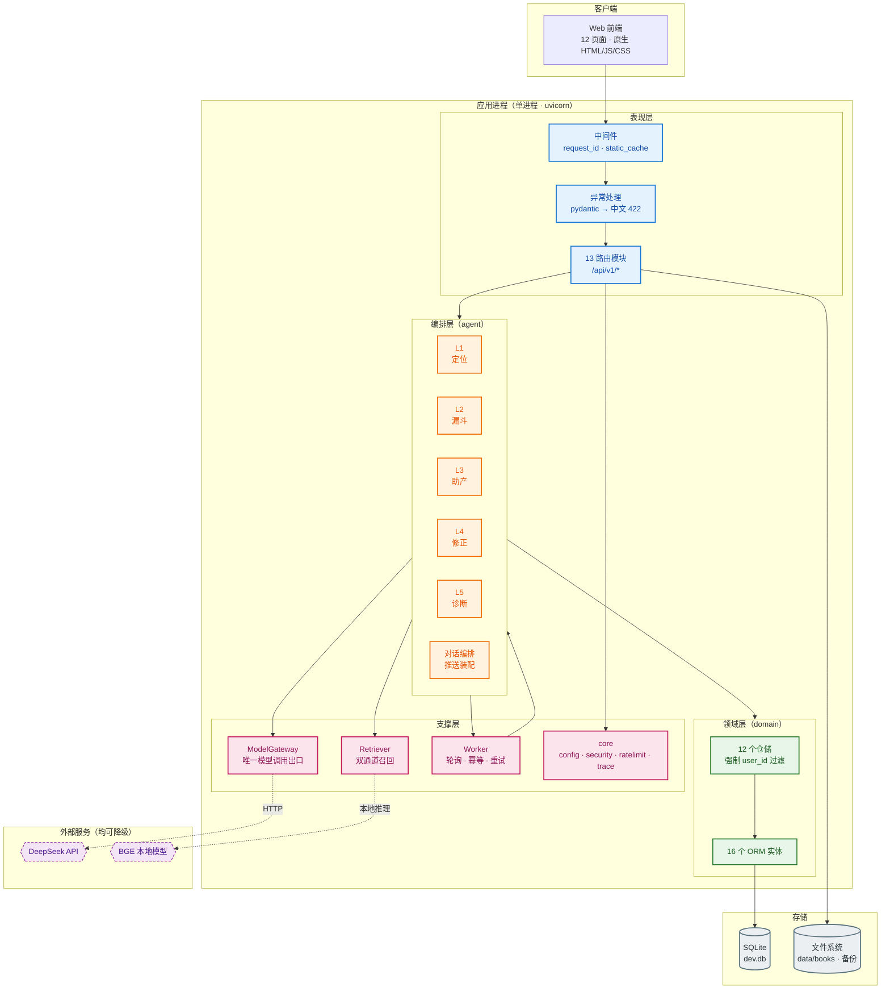
```mermaid
graph TB
    subgraph CLIENT["客户端"]
        WEB["Web 前端<br/>12 页面 · 原生 HTML/JS/CSS"]
    end

    subgraph APP["应用进程（单进程 · uvicorn）"]
        subgraph PRESENT["表现层"]
            MW["中间件<br/>request_id · static_cache"]
            EH["异常处理<br/>pydantic → 中文 422"]
            ROUTES["13 路由模块<br/>/api/v1/*"]
        end
        subgraph ORCH["编排层（agent）"]
            O1["L1<br/>定位"]
            O2["L2<br/>漏斗"]
            O3["L3<br/>助产"]
            O4["L4<br/>修正"]
            O5["L5<br/>诊断"]
            OP["对话编排<br/>推送装配"]
        end
        subgraph DOMAIN["领域层（domain）"]
            REPO["12 个仓储<br/>强制 user_id 过滤"]
            MODELS["16 个 ORM 实体"]
        end
        subgraph INFRA["支撑层"]
            GW["ModelGateway<br/>唯一模型调用出口"]
            RET["Retriever<br/>双通道召回"]
            WRK["Worker<br/>轮询 · 幂等 · 重试"]
            CORE["core<br/>config · security · ratelimit · trace"]
        end
    end

    subgraph STORAGE["存储"]
        DB[("SQLite<br/>dev.db")]
        FS[("文件系统<br/>data/books · 备份")]
    end

    subgraph EXT["外部服务（均可降级）"]
        DS{{"DeepSeek API"}}
        BGE{{"BGE 本地模型"}}
    end

    WEB --> MW
    MW --> EH
    EH --> ROUTES
    ROUTES --> ORCH
    ORCH --> DOMAIN
    ORCH --> GW
    ORCH --> RET
    ORCH --> WRK
    ROUTES --> CORE
    REPO --> MODELS
    MODELS --> DB
    WRK --> ORCH
    GW -.->|HTTP| DS
    RET -.->|本地推理| BGE
    ROUTES --> FS

    classDef present fill:#e3f2fd,stroke:#1976d2,stroke-width:2px,color:#0d47a1
    classDef orch fill:#fff3e0,stroke:#ef6c00,stroke-width:2px,color:#e65100
    classDef dom fill:#e8f5e9,stroke:#2e7d32,stroke-width:2px,color:#1b5e20
    classDef infra fill:#fce4ec,stroke:#c2185b,stroke-width:2px,color:#880e4f
    classDef store fill:#eceff1,stroke:#546e7a,stroke-width:2px,color:#263238
    classDef ext fill:#f3e5f5,stroke:#8e24aa,stroke-width:1.5px,stroke-dasharray:5 3,color:#4a148c
    class MW,EH,ROUTES present
    class O1,O2,O3,O4,O5,OP orch
    class REPO,MODELS dom
    class GW,RET,WRK,CORE infra
    class DB,FS store
    class DS,BGE ext
```

### 4.2 架构风格：分层 + 端口适配 + 收口

本系统采用**三层主体 + 一个横切收口**的结构：

| 层次 | 职责 | 允许依赖 | 禁止依赖 |
|---|---|---|---|
| **表现层** `api/` | HTTP 协议转换、参数校验、鉴权、序列化 | 编排层、领域层、core | 不得包含业务逻辑<br/>不得直接调用 `llm/` |
| **编排层** `agent/` | 单条用例的流程编排、多步协调、降级决策 | 领域层、llm/、retrieval/、workers/ | 不得直接操作数据库会话（须经仓储） |
| **领域层** `domain/` | 实体定义、持久化、数据完整性 | core | 不得依赖 `llm/`、`api/`、`agent/` |
| **支撑层** `llm/ retrieval/ workers/ core/` | 提供被上层调用的基础能力 | core | `llm/` 不得依赖 `agent/` |

**两个关键收口（choke point）**——本架构的核心设计决策：

| 收口 | 含义 | 设计收益 |
|---|---|---|
| **模型调用收口于 `ModelGateway`** | 全系统仅此一处发起模型请求 | 更换供应商仅需修改 1 个文件；成本埋点、重试策略、调用日志集中于一处，不存在遗漏路径 |
| **数据访问收口于 Repository** | 全系统仅仓储层访问数据库会话 | 越权防护于基类集中实现，12 个仓储自动继承，越权访问在结构上不可表达 |

### 4.3 依赖方向约束

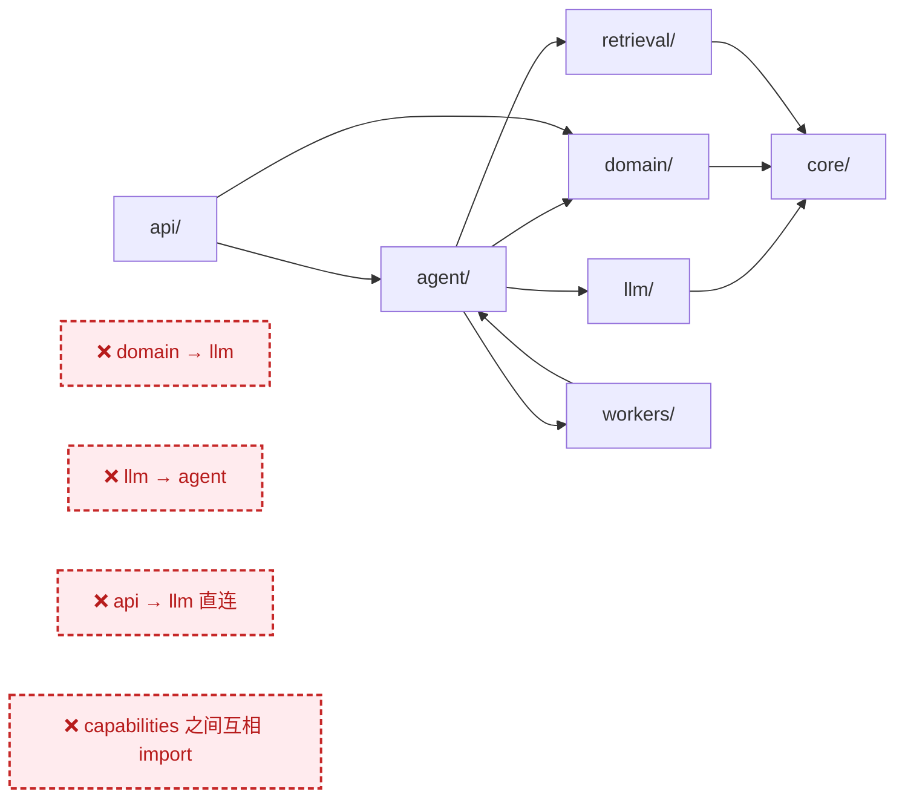
```mermaid
graph LR
    A["api/"] --> B["agent/"]
    B --> C["domain/"]
    B --> D["llm/"]
    B --> E["retrieval/"]
    B --> F["workers/"]
    A --> C
    D --> G["core/"]
    C --> G
    E --> G
    F --> B

    X["❌ domain → llm"]:::bad
    Y["❌ llm → agent"]:::bad
    Z["❌ api → llm 直连"]:::bad
    W["❌ capabilities 之间互相 import"]:::bad

    classDef bad fill:#ffebee,stroke:#c62828,stroke-width:2px,stroke-dasharray:5 3,color:#b71c1c
```

**四条约束**（违反即判定设计不合规）：

1. **依赖必须单向向下**：`api → agent → domain/llm`，反向依赖一律禁止。
2. **`domain/` 必须保持独立**：不得感知模型层的存在。这使领域模型可被任意上层复用，并支持模型层的独立替换。
3. **`llm/` 必须对上层无感知**：网关不感知调用来源，仅依据 `task_type` 决定调用策略。因此新增能力无需修改模型层。
4. **`capabilities/` 各能力之间不得互相引用**：五大能力必须彼此隔离，仅通过领域层共享数据。这使任一能力可被独立重构或移除。

> **第 4 条约束的必要性**：L1~L5 在业务上高度相关（均依赖知识库与模型调用），若不加以约束，极易产生 `l3` 调用 `l2` 内部函数的横向耦合，进而导致「调整 L2 阈值引发 L3 异常」的连锁影响。**共享逻辑必须下沉至 `domain/` 或 `llm/` 层，不得横向互调。**

### 4.4 类图：核心抽象


```mermaid
classDiagram
    class BaseRepository~T~ {
        <<abstract>>
        #_session: Session
        #_user_id: str|None
        +_guard(owner_user_id) void
        +_guard 抛 PermissionError
    }

    class KnowledgeRepository {
        +create(...) KnowledgeItem
        +list_active(...) list
        +get(id) KnowledgeItem
        -_filter_conditions(...) list
    }

    class LLMProvider {
        <<abstract>>
        +chat(model, reasoning, messages, tools, response_format, task_type) dict
    }

    class DeepSeekProvider {
        +chat(...) dict
    }

    class MockProvider {
        +chat(...) dict
    }

    class ModelGateway {
        -_provider: LLMProvider
        +chat(task_type, ...) dict
        -_call_with_retry(...) dict
    }

    class Strategy {
        +name: str
        +reasoning: bool
        +model: str
    }

    class EmbeddingModel {
        <<abstract>>
        +encode(texts) list
        +dumps(vec) bytes
        +loads(blob) list
    }

    class BGEHesEmbedding {
        -_model: lazy
        +encode(texts) list
    }

    class Retriever {
        +retrieve(query, items, top_k) list
        -_vector_scores(...)
        -_keyword_scores(...)
    }

    BaseRepository <|-- KnowledgeRepository
    LLMProvider <|-- DeepSeekProvider
    LLMProvider <|-- MockProvider
    ModelGateway o-- LLMProvider : 持有
    ModelGateway ..> Strategy : 查表
    EmbeddingModel <|-- BGEHesEmbedding
    Retriever o-- EmbeddingModel : 使用
```

**这张图揭示的复用结构**：
- `BaseRepository` 是所有 12 个仓储的**公共父类**——越权防护只写一次。
- `LLMProvider` 让 DeepSeek 与 Mock 成为**可互换的兄弟**——这是「无 KEY 也能跑」的实现基础。
- `EmbeddingModel` 让向量后端**可替换**（当前 BGE，未来可换 API 版）。

### 4.5 状态机设计

系统中有三处显式状态机，它们是「数据一致性」的核心保障。

#### 4.5.1 异步任务状态机（`TaskRun`）

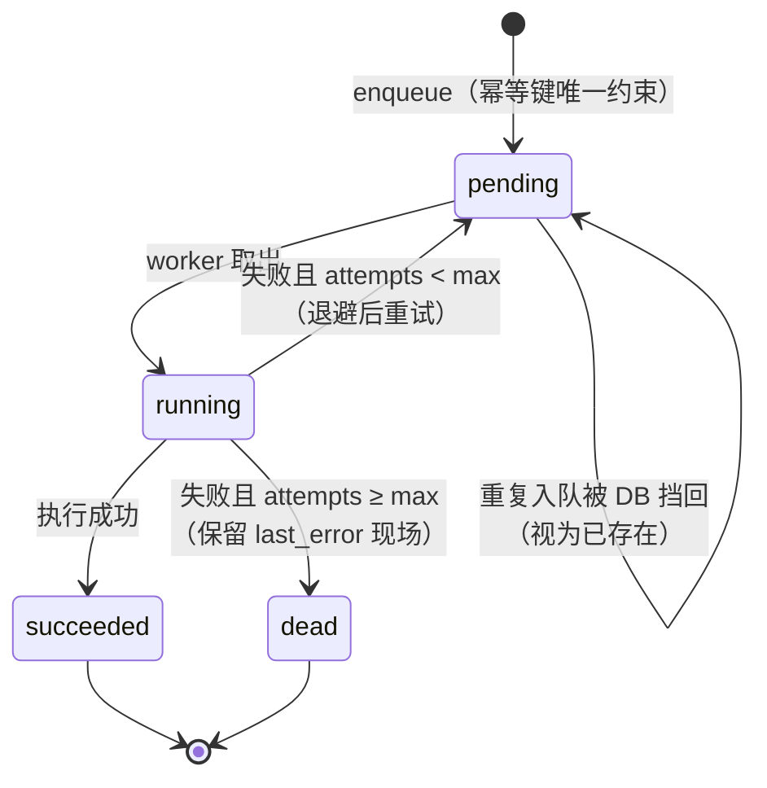
```mermaid
stateDiagram-v2
    [*] --> pending: enqueue（幂等键唯一约束）
    pending --> running: worker 取出
    running --> succeeded: 执行成功
    running --> pending: 失败且 attempts < max<br/>（退避后重试）
    running --> dead: 失败且 attempts ≥ max<br/>（保留 last_error 现场）
    pending --> pending: 重复入队被 DB 挡回<br/>（视为已存在）
    succeeded --> [*]
    dead --> [*]
```

> **失败状态不直接转入死信的设计理由**：任务失败后保留在 `pending` 状态并递增 `attempts`，由下一轮轮询自然重试，以 `updated_at` 作为退避时间锚点（`2^(n-1)` 秒起、上限 60 秒）。该设计使**重试机制无需依赖独立的调度组件**，单一轮询循环即可完成全部调度职责。

#### 4.5.2 冲突用户状态机（`Conflict.user_state`）

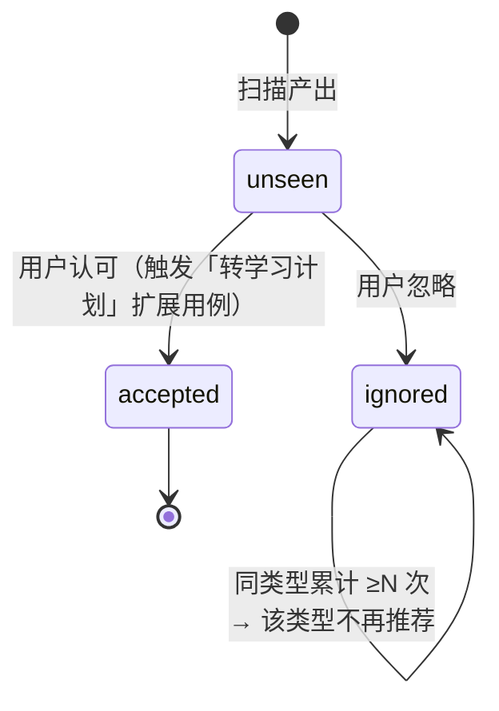
```mermaid
stateDiagram-v2
    [*] --> unseen: 扫描产出
    unseen --> accepted: 用户认可（触发「转学习计划」扩展用例）
    unseen --> ignored: 用户忽略
    ignored --> ignored: 同类型累计 ≥N 次<br/>→ 该类型不再推荐
    accepted --> [*]
```

#### 4.5.3 诊断状态机（`CognitiveDiagnosis.status`）

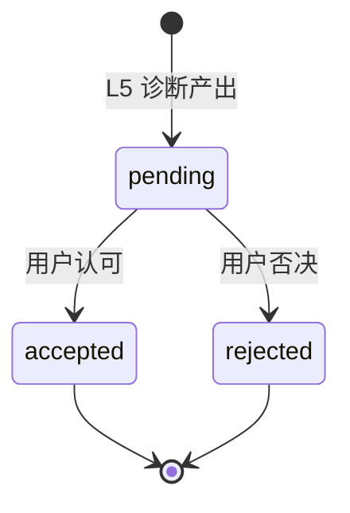
```mermaid
stateDiagram-v2
    [*] --> pending: L5 诊断产出
    pending --> accepted: 用户认可
    pending --> rejected: 用户否决
    accepted --> [*]
    rejected --> [*]
```

> **状态机的设计意图**：这三处状态机的目的不在于「记录状态」，而在于使系统**具备可纠正性**——用户的忽略或认可反馈将反向收敛后续推荐结果（误报抑制），从而使智能能力的输出质量随使用过程持续改善。

### 4.6 运行设计（部署内视图）

单进程内的运行视图：

```
uvicorn 进程
├── 主线程：asyncio 事件循环
│    └── FastAPI 处理 HTTP 请求
│         ├── 中间件链：request_id → static_cache
│         ├── 路由分发 → 编排层 → 领域层
│         └── 静态文件托管（/assets, /xxx.html）
└── 守护线程：Worker 轮询循环（worker_enabled=false 可关）
     └── run_pending() → 取 pending 任务 → 执行处理器 → 更新状态
```

**关键约束**：

| 约束 | 说明 |
|---|---|
| **Worker 与 Web 同进程** | 不引入 Celery/Redis（见 §10.2 ADR-13）。代价是「Web 挂了 Worker 也停」，但单机个人工具可接受 |
| **测试中必须关闭 Worker** | 测试设 `worker_enabled=false`，避免后台线程干扰与不确定的时序 |
| **任务执行是同步的** | Worker 线程内串行执行，不给用户请求造成并发压力 |
| **SQLite 单写者** | 所有写操作串行化，避免 SQLite 写锁竞争 |

---

## 5. 数据设计（ER 图与数据字典）

### 5.1 ER 图（16 张表全量）


```mermaid
erDiagram
    USER ||--o{ KNOWLEDGE_ITEM : "拥有"
    USER ||--o{ BOOK : "拥有"
    USER ||--o{ CONVERSATION : "拥有"
    USER ||--o{ LEARNING_GOAL : "拥有"
    USER ||--o{ LEARNING_EVENT : "产生"
    USER ||--o{ CONFLICT : "拥有"
    USER ||--o{ COGNITIVE_DIAGNOSIS : "拥有"
    USER ||--o{ COST_LOG : "产生"
    USER ||--o{ PUSH_JOB : "接收"
    USER ||--o{ PUSH_LOG : "接收"
    USER ||--o{ TASK_RUN : "触发"

    KNOWLEDGE_ITEM ||--o{ CLAIM : "拆解出"
    CLAIM ||--o{ CONFLICT : "作为比对粒度"

    LEARNING_GOAL ||--o{ LEARNING_PLAN : "制定"
    LEARNING_PLAN ||--o{ PLAN_TASK : "拆为任务"

    USER {
        string id PK
        string username UK "唯一登录名"
        string password_hash "PBKDF2-SHA256"
        string nickname
        string push_frequency "weekly/daily/quiet"
        int token_version "吊销旧 JWT 用"
        datetime deleted_at "软删"
    }

    KNOWLEDGE_ITEM {
        string id PK
        string user_id FK
        string source "notion/obsidian/feishu/bookmark/manual"
        string title
        text raw_content
        json tags
        float read_progress "0..1"
        blob embedding "pickle 序列化向量"
        string embed_status "pending/embedded/embed_failed"
        text note "用户批注"
        json source_locator "来源定位"
        datetime claims_scanned_at "L2 增量扫描标记"
        bool is_deleted
    }

    CLAIM {
        string id PK
        string user_id FK
        string knowledge_item_id FK
        text statement "归一化主张"
        string topic "同主题预筛键"
        int polarity "-1/0/1"
        float strength "0..1"
        float confidence
        blob embedding
    }

    CONFLICT {
        string id PK
        string user_id FK
        string item_a_id FK
        string item_b_id FK
        string claim_a_id FK
        string claim_b_id FK
        string pair_key "无序对去重键"
        string conflict_type
        text detail
        text suggestion
        float confidence
        string user_state "unseen/ignored/accepted"
    }

    BOOK {
        string id PK
        string user_id FK
        string title
        string author
        string format "txt/epub"
        string file_path
        json chapters
        text full_text
        int total_chars
        int current_char "阅读位置偏移"
        float read_progress
        bool is_deleted
    }

    LEARNING_GOAL {
        string id PK
        string user_id FK
        string description
        datetime deadline
        string priority "high/medium/low"
        bool achieved
    }

    LEARNING_PLAN {
        string id PK
        string user_id FK
        string goal_id FK
        json content "结构化计划"
        int version "乐观锁版本号"
    }

    PLAN_TASK {
        string id PK
        string user_id FK
        string plan_id FK
        int week_index
        string subject
        string status "pending/doing/done"
        json related_item_ids
    }

    LEARNING_EVENT {
        string id PK
        string user_id FK
        string event_type "read/collect/ask/complete_plan"
        datetime occurred_at
        json payload "不含正文与敏感字段"
    }

    CONVERSATION {
        string id PK
        string user_id FK
        string state "对话状态机"
        string title
        json messages
    }

    TASK_RUN {
        string id PK
        string task_name
        string user_id FK
        string idempotency_key UK "幂等键"
        string status "pending/running/succeeded/dead"
        int attempts
        int max_attempts
        json payload
        text last_error
        datetime finished_at
    }

    COST_LOG {
        int id PK
        string user_id FK
        string task_type
        string model
        bool reasoning
        string prompt_version
        string request_id
        int prompt_tokens
        int completion_tokens
        int cached_tokens
        float estimated_cost "人民币"
        datetime created_at
    }

    PUSH_JOB {
        string id PK
        string user_id FK
        string push_type "conflict/question/brief/diagnosis"
        string channel "app/email"
        string status
        string title
        string body
        json payload
        string content_hash
        string sent_at
        string last_error
    }

    PUSH_LOG {
        string id PK
        string user_id FK
        string push_type
        string content_hash UK "去重指纹"
        string channel
        datetime sent_at
        string user_feedback "none/ignored/accepted"
    }

    COGNITIVE_DIAGNOSIS {
        string id PK
        string user_id FK
        string pattern "行为模式"
        string root_cause
        float confidence
        string suggested_action
        json reasoning_chain "推理链"
        string status "pending/accepted/rejected"
    }
```

### 5.2 表职责与设计要点

| 表 | 职责 | 设计要点 |
|---|---|---|
| `users` | 账号 | `token_version` 支持**全局吊销**既有 JWT（改密或注销后所有令牌立即失效） |
| `knowledge_items` | 知识基本单位 | `claims_scanned_at` 是 L2 增量扫描的**成本控制关键**；`embed_status` 支持向量化失败时的降级 |
| `claims` | 原子主张 | 主张持久化使冲突检测由 O(n²) 全集比对**降为近邻检索**，是 L2 具备可运行性的根本前提 |
| `conflicts` | 冲突检测产物 | `pair_key`（两主张标识排序拼接）作为去重键，使重复扫描不产生重复记录 |
| `books` | 书籍与阅读进度 | `chapters` 以 JSON 存储章节结构；`current_char` 采用字符偏移而非页码（适配任意排版） |
| `learning_goals` / `learning_plans` / `plan_tasks` | L4 路径修正 | `learning_plans.version` 实现**乐观锁**，防止并发更新覆盖 |
| `learning_events` | 行为事件记录 | **追加写入（append-only）**，是 L5 诊断的唯一数据来源；`payload` **禁止**包含正文与敏感字段 |
| `task_runs` | 异步任务 | `idempotency_key` 唯一约束，由数据库约束而非应用逻辑保证幂等 |
| `cost_logs` | 成本记录 | `cached_tokens` 与 `prompt_version` 使成本优化可归因 |
| `push_jobs` / `push_logs` | 推送 | `push_logs.content_hash` 唯一约束保证相同内容不重复推送 |
| `cognitive_diagnoses` | L5 产出 | `reasoning_chain` 保存完整推理链，使诊断结论可解释、可复核 |

### 5.3 索引设计

索引的设立依据为**实际高频查询**，而非无差别添加。每个索引对应一条确定的查询路径：

| 索引 | 表 | 支撑的查询 |
|---|---|---|
| `(user_id, topic)` | `claims` | L2-3 同主题预筛：以 `topic` 与 `user_id` 生成候选对 |
| `(user_id, user_state)` | `conflicts` | 待推送冲突查询：仅取 `unseen` 状态 |
| `user_id` | 几乎所有表 | 用户作用域强制过滤（结构性防越权的物理基础） |
| `idempotency_key` (UNIQUE) | `task_runs` | 幂等入队的数据库级保障 |
| `content_hash` (UNIQUE) | `push_logs` | 推送内容去重 |
| `event_type` / `occurred_at` | `learning_events` | L5 按事件类型与时间聚合行为模式 |
| `pair_key` | `conflicts` | 冲突记录去重查询 |

### 5.4 数据完整性策略

| 策略 | 实现方式 |
|---|---|
| **软删除** | `knowledge_items.is_deleted` / `books.is_deleted` / `users.deleted_at`；物理清除须待保留期届满 |
| **时间戳** | `TimestampMixin` 统一提供 `created_at` / `updated_at`（含时区） |
| **主键** | 统一采用 `String(36)` 存储 UUID4 字符串，**不使用自增整数**，便于将来的水平扩展与外部系统对账 |
| **乐观锁** | `learning_plans.version`，更新时校验版本号 |
| **外键** | 采用逻辑外键（由 SQLAlchemy 维护关系），未启用数据库级外键约束以简化 SQLite 环境下的迁移 |

> **一项已知的取舍**：`users.push_frequency` 与 `embedding` 字段采用 pickle 序列化存储为二进制。其优势为无额外依赖；代价为**不具备跨语言可读性**，需在与外部系统交换数据时迁移（已登记为 §15.3 T1）。

### 5.5 数据模型演进规则

数据模型的结构性变更须遵守以下规则。这些规则针对 SQLite 的特定语义而设立，**违反将导致结构漂移类缺陷**（详见附录 C 第 1、2 条）：

| 规则 | 依据 |
|---|---|
| **新增实体必须注册至 `app/domain/models/__init__.py`** | `Base.metadata.create_all()` 仅扫描已被导入的模型。未注册时表不会被创建，且**不产生显式错误**，缺陷将延后至该表首次被查询时暴露 |
| **不得假设 `create_all` 会为已有表添加列** | SQLite 的 `CREATE TABLE IF NOT EXISTS` 语义对已存在的表不产生任何操作。新增字段须显式执行 `ALTER TABLE` 或重建表 |
| **模型变更后须重启服务** | 不可依赖热重载；结构缓存与连接池会使旧结构继续生效 |
| **模型变更后须执行全量测试** | 测试使用独立数据库，可最快暴露结构漂移问题 |
| **生产环境变更须使用迁移脚本** | Alembic 依赖已引入（`alembic>=1.13`）。P0 阶段采用手工迁移，进入 P1 阶段后须统一使用迁移脚本（§15.3 T2） |

---

## 6. 模块详细设计

本章按 GB/T 8567 要求，对每个模块统一按 **职责 / 输入 / 输出 / 关键算法 / 依赖约束 / 测试要点** 六项描述。

### 6.1 表现层（`app/api/`）

#### 6.1.1 入口与横切（`app/main.py`）

| 项 | 内容 |
|---|---|
| **职责** | 创建 FastAPI 应用、装配中间件、注册异常处理器、挂载 13 个路由、托管静态资源与 12 个页面 |
| **中间件 1** | `request_id_middleware`：为每个请求生成/透传 `request_id`，写入日志与响应头，让「用户报错 → 日志定位」成为一条链路 |
| **中间件 2** | `static_cache_middleware`：对 `.html/.js/.css` 强制 `Cache-Control: no-cache` |
| **异常处理** | `validation_exception_handler`：把 pydantic 的英文错误经 `_FIELD_LABELS` 映射为**中文提示**，返回 422 |
| **依赖约束** | 只做装配，**不含业务逻辑** |
| **测试要点** | `tests/test_web.py`（19 项）：页面可达性、静态资源头、404 行为 |

> **中间件 2 的必要性**：前端采用零构建方案，静态资源无内容指纹，浏览器可能沿用缓存版本，导致变更验证失真。由于无法依赖文件名版本控制，须通过响应头强制协商校验。该措施以极低代价消除了变更验证偏差的风险。

#### 6.1.2 鉴权出口（`app/api/deps.py`）

| 项 | 内容 |
|---|---|
| **职责** | 依赖注入集中地：`get_session`（数据库会话）、`get_gateway`（模型网关）、鉴权解析 |
| **核心设计** | `_authed_user` 是**唯一鉴权出口**——所有需要用户的接口都经它，不存在第二条鉴权路径 |
| **特殊处理** | `get_user_id_flexible` 支持 `?token=` 兜底 |
| **设计依据** | `` 由浏览器直发请求，**无法携带 Authorization 头**，故该场景需支持查询参数传递令牌（见附录 C 第 6 条） |
| **测试要点** | `tests/test_web_auth.py`（5 项）：未登录访问、token 过期、`?token=` 兜底 |

### 6.2 领域层（`app/domain/`）

#### 6.2.1 仓储基类（`app/domain/repositories/base.py`）

```python
class BaseRepository(Generic[_T]):
    def __init__(self, session: Session, user_id: str | None = None): ...

    def _guard(self, owner_user_id: str) -> None:
        """结构性越权防护：绑定用户后，仅允许访问归属本用户的行。"""
        if self._user_id and owner_user_id != self._user_id:
            raise PermissionError(f"跨用户访问被拒（structural guard）")
```

| 项 | 内容 |
|---|---|
| **职责** | 提供会话管理与**越权防护**，被 12 个仓储继承 |
| **关键设计** | 防护写在**基类**：子类只要正常调用 `_guard`，就自动获得保护。**不是**靠每个开发者记得加 `where user_id = ?` |
| **复用收益** | 新增第 13 个仓储时，越权防护代码量 = 0 行 |
| **测试要点** | `tests/test_db.py`：跨用户访问必须抛 `PermissionError` |

#### 6.2.2 仓储清单

| 仓储 | 对应实体 | 特殊方法 |
|---|---|---|
| `KnowledgeRepository` | KnowledgeItem | `_filter_conditions()` —— **列表与计数共用同一套条件**，避免「分页总数与列表不一致」 |
| `ClaimRepository` | Claim | 按 `topic`/`user_id` 取候选 |
| `ConflictRepository` | Conflict | 按 `pair_key` 去重、按 `user_state` 过滤 |
| `BookRepository` | Book | 阅读进度更新 |
| `LearningPlanRepository` | LearningPlan / PlanTask | 乐观锁版本校验 |
| `LearningEventRepository` | LearningEvent | append-only 写入 |
| `CognitiveDiagnosisRepository` | CognitiveDiagnosis | 取最新（**必须使用显式排序键，不得依赖时间戳字段**——同秒写入无法区分先后，见附录 C 第 3 条） |
| `ConversationRepository` | Conversation | 消息追加 |
| `CostLogRepository` | CostLog | 成本聚合 |
| `PushRepository` | PushJob / PushLog | `content_hash` 去重 |
| `UserRepository` | User | 按用户名查、`token_version` 自增 |
| `BaseRepository` | — | 公共父类 |

### 6.3 模型层（`app/llm/`）

#### 6.3.1 ModelGateway（`app/llm/gateway.py`）—— 全系统唯一出网收口

| 项 | 内容 |
|---|---|
| **职责** | 接收 `task_type`，查策略表决定 `reasoning` 开关，调用 provider，统一重试与成本埋点 |
| **策略表** | 10 个 `task_type` 映射到 `Strategy(name, reasoning, model)` |
| **Provider 选择** | `_build_provider()`：有 KEY → `DeepSeekProvider`；无 KEY → `MockProvider` |
| **重试** | `_call_with_retry()` → `with_retry(attempts=3)`，指数退避 |
| **依赖约束** | **不得反向依赖 `agent/`**；业务代码**不得绕过网关直连 provider** |

策略表全貌：

| `task_type` | reasoning | 用途 |
|---|---|---|
| `default` | off | 兜底 |
| `multi_turn_dialogue` | off | 多轮对话 |
| `deep_reasoning` | **on** | 深度推理 |
| `conflict_detection` | **on** | L2 冲突判定 |
| `plan_generation` | off | L4 计划生成 |
| `causal_reasoning` | **on** | 因果推理 |
| `cognitive_brief` | off | L3 简报 |
| `l1_mining` | **on** | L1 意图定位判断 |
| `batch_extraction` | off | 批量主张提取（成本敏感，关思考） |
| `topic_analysis` | off | 主题分析 |

> **策略表的设计意图**：将「该任务是否需要深度推理」的判定**集中于单一映射表**。该设计使两方面收益同时成立——成本控制（批量类任务关闭推理开关）与策略调优（调整映射关系，而非修改调用代码）均收敛至一处配置点。

#### 6.3.2 结构化输出解析（`app/llm/structure.py`）

| 项 | 内容 |
|---|---|
| **职责** | 把 LLM 的自由文本响应解析为结构化数据 |
| **三层退让策略** | ① 直接 `json.loads`；② 剥掉 markdown 代码围栏（` ```json ... ``` `）后重试；③ 截取最外层 `{...}` 后重试 |
| **失败行为** | 抛 `JsonParseError`，由调用方决定跳过还是降级 |
| **设计依据** | 模型即使被要求「仅输出 JSON」仍可能附加代码围栏或说明文字。设计上不可假定模型输出严格符合格式约定 |

#### 6.3.3 分时计价（`app/llm/cost.py`）

| 项 | 内容 |
|---|---|
| **职责** | 按北京时间判定是否高峰时段，三段计价（普通 / 高峰 / 缓存命中） |
| **时区处理** | 固定 UTC+8，不依赖服务器时区 |
| **高峰时段** | 工作日 `9-12, 14-18`，倍率 2.0（可配） |
| **缓存价** | 命中价约为普通输入价的 1/50 |
| **reasoning token** | 计入输出 token 计费 |

### 6.4 编排层（`app/agent/`）

| 编排器 | 用例 | 关键算法 | 依赖 |
|---|---|---|---|
| `l1_orchestrator.py` | UC-L1-01 | 双通道召回 + 定位/追问二分支判定 | `retrieval/` + `llm/` |
| `l2_orchestrator.py` | UC-L2-01 | **五级候选漏斗**（见下） | `llm/` + `domain/` |
| `l3_orchestrator.py` | UC-L3-01/02 | 认知简报装配 / 助产式提问生成 | `retrieval/` + `llm/` |
| `l4_orchestrator.py` | UC-L4-02/03 | 计划生成 + 偏差检测 | `llm/` + `domain/` |
| `l5_orchestrator.py` | UC-L5-01 | 行为模式识别 + 因果推理链 | `llm/` + `feedback/` |
| `orchestrator.py` | UC-10 对话 | 多轮对话状态管理 | `llm/` |
| `push_service.py` | UC-30 | 推送内容装配与去重 | `push/` |

**L2 五级漏斗**（全系统最核心的算法，成本与准确率的平衡点）：

```
全量知识条目
  │  L2-1 增量筛选：claims_scanned_at IS NULL  → 只处理新增
  ▼
待提取条目
  │  L2-6 主张提取：LLM 批量抽取原子主张（reasoning=off，省钱）
  ▼
主张集合
  │  L2-3 同主题预筛：按 (user_id, topic) 取同主题候选对  → 避免 O(n²)
  ▼
候选对
  │  L2-4 立场强度过滤：极性相异 且 强度达标
  ▼
高潜候选对（数量已降 1~2 个数量级）
  │  L2-5 LLM 判定：reasoning=on 精细判定（只对高潜对花大钱）
  ▼
疑似冲突
  │  L2-6 阈值抑制：置信度阈值 + 已忽略类型收敛 + pair_key 去重
  ▼
入库 conflicts
```

> **漏斗的核心原则**：**低代价筛选前置，高代价推理后置**。L2-1~L2-4 均为纯数据库查询或规则计算（成本可忽略），仅 1~2% 的候选对进入模型判定阶段。这是 L2 具备单机可运行性的关键设计前提。

### 6.5 异步任务层（`app/workers/`）

#### 6.5.1 三条核心机制（`app/workers/tasks.py`）

```python
- **幂等**：TaskRun.idempotency_key 唯一约束。重复入队由数据库挡回
  （IntegrityError → 视为已存在），不依赖应用层「先查再插」那种有竞态的做法。
- **重试**：失败不改状态为 dead，而是留在 pending、attempts+1，下一轮轮询再试；
  退避用 updated_at 作时间锚点，2^(n-1) 起步、上限 60 秒。
- **死信**：attempts ≥ max_attempts 转 dead 保留现场（last_error），不再自动重试。
```

| 项 | 内容 |
|---|---|
| **注册表** | `HANDLERS: dict[str, Handler]` + `@register("name")` 装饰器（重复注册抛 `ValueError`） |
| **入队** | `enqueue()` 返回 `EnqueueResult(created: bool)`——同 key 返回 `created=False` |
| **执行** | `run_pending()` 批量取 pending 任务并执行 |
| **幂等键构造** | `triggers.realtime_key()` / `weekly_key()` |

幂等键实例：

| 场景 | 幂等键格式 | 效果 |
|---|---|---|
| 实时冲突扫描 | `l2:realtime:{user}:{YYYYMMDDHH}` | 1 小时内同一用户仅执行一次，重复触发不产生额外模型调用成本 |
| 周度冲突扫描 | `l2:weekly:{user}:{ISO年}-W{ISO周}` | 一周一次，跨进程重启也不会重跑 |
| 每周简报 | 含 ISO 周 | 定时器重复触发也只推一次 |

> **幂等键的设计价值**：该设计将「去重」这一业务需求，转化为**数据库唯一约束**这一基础设施能力——无需分布式锁、无需额外中间件、无需状态查询，**唯一约束冲突即表示重复入队**。其正确性由数据库层保证，不依赖应用层存在竞态的「先查询后插入」实现。

#### 6.5.2 任务处理器（`app/workers/handlers.py`）

| 处理器 | 任务名 | 职责 |
|---|---|---|
| `l2_scan` | `l2_scan` | 调用 L2 编排器执行冲突扫描 |
| `push_weekly_digest` | 对应 | 装配并推送每周认知简报 |
| `push_monthly_health` | 对应 | 装配并推送每月学习健康报告 |

**处理器的三条设计约定**：

1. 仅执行「取参数 → 调用编排层 → 记录日志」，**不包含业务逻辑**；
2. 失败时**直接抛出异常**交由框架处理重试，**不得在内部捕获并吞没异常**；
3. 必须**可重复执行且无副作用**（幂等），因执行过程可能发生重试。

### 6.6 检索层（`app/retrieval/`）

| 项 | 内容 |
|---|---|
| **入口** | `Retriever`（`retriever.py`） |
| **双通道** | 向量通道（BGE 余弦相似度）+ 关键词通道（`keyword.py`） |
| **融合** | 加权求和，`vec_weight=0.7`（可配） |
| **向量后端** | `BGEHesEmbedding`：`BAAI/bge-small-zh-v1.5`，512 维，**惰性加载** |
| **序列化** | `EmbeddingModel.dumps()` / `loads()`（pickle → bytes 存库） |
| **降级** | 向量模型不可用 → 仅关键词通道，功能不缺失 |
| **测试要点** | `tests/test_retrieval.py`（4 项）+ `test_embedding.py`（10 项） |

> **采用双通道召回的设计依据**：向量召回质量较高但依赖模型加载与计算资源；关键词召回质量较低但**始终可用**。双通道并存使系统在「模型未就绪 / 无网络环境 / 资源受限」等条件下仍具备检索能力。**可降级性的优先级高于峰值检索质量**（对应 §2.1 设计目标 G4）。

### 6.7 支撑模块

| 模块 | 文件 | 职责 | 关键设计 |
|---|---|---|---|
| **配置** | `core/config.py` | pydantic-settings 统一配置 | 全部支持环境变量覆盖；`model_provider` 属性按 KEY 自动判定 |
| **安全** | `core/security.py` | 口令哈希 + JWT | PBKDF2-HMAC-SHA256（`pbkdf2_sha256$iter$salt$hash`）；JWT 算法**白名单**防 alg 混淆攻击 |
| **限流** | `core/ratelimit.py` | `FailureThrottle` 登录失败限流 | 进程内滑动窗口，**账号 + IP 双维度**（IP 维度阈值放宽，避免 NAT 环境下正常用户被连带限制） |
| **日志** | `core/logging.py` | 结构化日志 | 带 `request_id` |
| **链路** | `core/trace.py` | 请求追踪 | `request_id` 生成与透传 |
| **摄取** | `ingestion/service.py` | 知识入库流程 | 落库 → 触发向量化 → 触发 L2 增量扫描 |
| **书籍** | `books/parser.py` + `service.py` | TXT/EPUB 解析、分章、进度 | EPUB 图片提取与 `source_locator` 定位 |
| **埋点** | `feedback/events.py` | `LearningEvent` 记录 | append-only |
| **推送** | `push/` | 推送通道与去重 | `content_hash` 唯一 |

---

## 7. 架构解耦规则

本章给出系统强制遵守的**结构性约束**及其检查方式。每条约束均对应可机械化执行的核查手段，供设计评审与实现合规性检查使用，避免约束的维持依赖主观判断。

### 7.1 依赖方向检查表

| # | 约束 | 检查方式 | 违反后果 |
|---|---|---|---|
| D-1 | `domain/` 不得引用 `llm/`、`agent/`、`api/` | `grep -r "from app.llm\|from app.agent\|from app.api" app/domain/` 应为空 | 领域层与模型层耦合，丧失独立可测性与可复用性 |
| D-2 | `llm/` 不得引用 `agent/` | `grep -r "from app.agent" app/llm/` 应为空 | 网关与具体业务耦合，更换供应商须修改业务代码 |
| D-3 | `api/` 不得直接引用 `llm/` | `grep -r "from app.llm" app/api/` 应为空 | 绕过网关：成本埋点缺失、重试策略失效 |
| D-4 | `api/` 不得直接操作数据库会话 | 须通过 `Depends(get_session)` 交由仓储使用 | 绕过越权防护：数据隔离失效风险 |
| D-5 | `capabilities/` 各能力之间不得互相引用 | `grep -r "from app.capabilities" app/capabilities/` 应为空 | 能力间耦合，变更产生连锁影响 |
| D-6 | `agent/` 不得绕过仓储直接写库 | 仅应出现仓储方法调用 | 绕过越权防护：数据隔离失效 + 事务边界散乱 |

> **约束的自动化保障**：上述 6 条约束均可通过 `grep` 或 `import-linter` 在构建环节自动核查。当前以人工评审配合设计约定保障，已登记为技术债 T3 并列入 §15.2 的 P1 阶段计划。

### 7.2 扩展性验证：新增能力的接入代价

解耦是否有效，可用一个具体场景定量验证：**假设新增「L6 学习风格识别」能力，需要改动多少既有代码？**

| 步骤 | 动作 | 是否改动既有文件 |
|---|---|---|
| 1 | 新建 `agent/l6_orchestrator.py`，实现流程编排（依赖 `domain/` 与 `llm/`） | 否（新建） |
| 2 | 新建 `api/endpoints/l6.py`，定义路由 | 否（新建） |
| 3 | 在 `app/main.py` 增加一行 `include_router(l6.router)` | **是**（注册式，1 行） |
| 4 | 在 `llm/gateway.py` 的 `STRATEGY_TABLE` 增加一条 `task_type` 映射 | **是**（注册式，1 条） |
| 5 | 在 `llm/prompts.py` 增加提示词与版本号 | 追加，不修改既有项 |
| 6 | 如需新实体，在 `domain/models/` 新建并**注册到 `__init__.py`**（见 §5.5） | 追加，不修改既有项 |
| 7 | 在 `tests/` 新建 `test_l6.py` | 否（新建） |

> **扩展性判据**：新增能力时，**不需要修改 L1~L5 的任何代码**；仅有的两处既有文件改动均为「注册式追加」（登记条目），而非「侵入式修改」（改动已有逻辑）。若某次扩展被迫修改了既有能力模块，即表明存在耦合，应将共享逻辑下沉至 `domain/` 或 `llm/` 层。这一判据是本设计解耦效果的量化验收标准。

### 7.3 数据隔离规则

| 规则 | 实现 | 保障级别 |
|---|---|---|
| 所有业务查询必须带 `user_id` | `BaseRepository._guard()` | **结构级**（不是约定级） |
| 跨用户访问抛 `PermissionError` | 基类统一实现 | 无法绕过 |
| JWT 中携带 `user_id` 与 `token_version` | `core/security.py` | 吊销可信 |
| 软删数据默认过滤 | 仓储的 `list_*` 方法 | 默认安全 |

> **结构性保障与约定性保障的差别**：约定性保障要求「所有实现都记得附加 `WHERE user_id = ?`」，其有效性依赖编码自觉，存在遗漏可能。结构性保障则将过滤实现于仓储基类，使**遗漏在结构上不可表达**——上层无法构造出不经过滤的查询。这是本系统数据隔离设计的核心思路，也对应 §2.1 中 G1 目标优先于 G6 的取舍。

### 7.4 可替换性设计

| 可替换项 | 替换方式 | 影响范围 |
|---|---|---|
| **LLM 供应商** | 实现新的 `LLMProvider` 子类 + 改 `_build_provider()` | 1 个文件 |
| **向量模型** | 实现新的 `EmbeddingModel` 子类 + 改配置 | 0 个业务文件 |
| **数据库** | 改 `database_url`（ORM 已抽象） | 1 个配置项（需处理 SQLite 特有语义） |
| **检索策略** | 改 `Retriever` 的融合权重或加通道 | 1 个文件 |
| **异步框架** | `tasks.py` 的 `enqueue`/`run_pending` 是接口边界，可换成 Celery | 1~2 个文件 |

> **ADR-13 的保留意见**：当前不引入 Celery/Redis（见 §10.2）。但 `enqueue()` / `run_pending()` 被设计成**框架无关的接口**，未来若需横向扩展，替换成本被控制在 2 个文件内。

---

## 8. 代码复用机制

本章说明系统的**复用结构**：识别可复用的抽象组件、明确其位置与复用收益、界定复用的适用范围与边界。

### 8.1 复用抽象清单

| # | 抽象 | 位置 | 复用方式 | 复用收益 |
|---|---|---|---|---|
| **R-1** | `BaseRepository` | `domain/repositories/base.py` | 12 个仓储继承 | 越权防护写 1 次；新增仓储 0 行防护代码 |
| **R-2** | `TimestampMixin` | `domain/models/base.py` | 全部实体继承 | `created_at/updated_at` 定义 1 次 |
| **R-3** | `PkStr` | `domain/models/base.py` | 全部实体主键 | UUID 主键策略统一 |
| **R-4** | `LLMProvider` | `llm/provider.py` | DeepSeek / Mock 实现 | 供应商可互换；**Mock 让测试零成本** |
| **R-5** | `ModelGateway` | `llm/gateway.py` | 全部能力调用 | 重试 + 埋点 + 策略**只写一次** |
| **R-6** | `STRATEGY_TABLE` | `llm/gateway.py` | 10 个 task_type 共用 | 策略集中，调优改表 |
| **R-7** | `parse_json` | `llm/structure.py` | 所有需要 JSON 输出的能力 | 顽健解析逻辑不重复实现 |
| **R-8** | `EmbeddingModel` | `retrieval/embedding.py` | 向量后端可替换 | 检索层不感知具体模型 |
| **R-9** | `@register` + `HANDLERS` | `workers/tasks.py` | 3 个任务处理器 | 任务框架统一，新增任务只加装饰器 |
| **R-10** | `enqueue()` | `workers/tasks.py` | 所有异步触发 | 幂等入队逻辑不重复 |
| **R-11** | `FailureThrottle` | `core/ratelimit.py` | 登录 / 注册限流 | 滑动窗口算法复用 |
| **R-12** | `Settings` | `core/config.py` | 全项目配置 | 配置集中 + 环境变量覆盖 |
| **R-13** | `app.js` 请求封装 | `web/assets/app.js` | 12 个页面共用 | **会话管理与请求逻辑只写一次** |
| **R-14** | `style.css` | `web/assets/style.css` | 全站 | 样式改动一处生效全站 |
| **R-15** | `_authed_user` | `api/deps.py` | 所有需鉴权的接口 | 鉴权逻辑唯一出口 |
| **R-16** | `_filter_conditions` | `repositories/knowledge_repository.py` | 列表与计数 | **避免「总数与列表不一致」的经典 bug** |

### 8.2 复用层次图

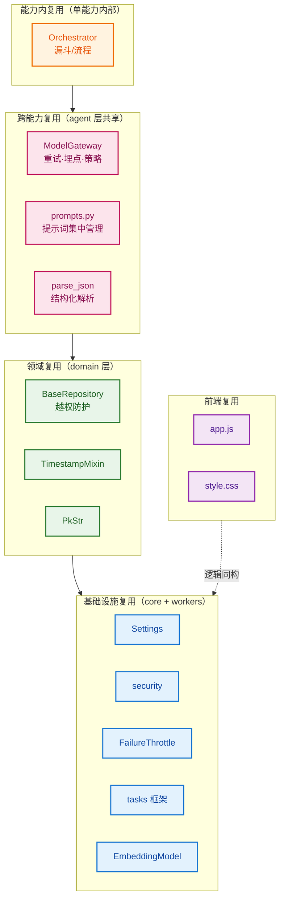
```mermaid
graph TB
    subgraph L4["跨能力复用（agent 层共享）"]
        G["ModelGateway<br/>重试·埋点·策略"]
        P["prompts.py<br/>提示词集中管理"]
        S["parse_json<br/>结构化解析"]
    end
    subgraph L3["能力内复用（单能力内部）"]
        O["Orchestrator<br/>漏斗/流程"]
    end
    subgraph L2["领域复用（domain 层）"]
        BR["BaseRepository<br/>越权防护"]
        TS["TimestampMixin"]
        PK["PkStr"]
    end
    subgraph L1["基础设施复用（core + workers）"]
        CFG["Settings"]
        SEC["security"]
        RL["FailureThrottle"]
        TQ["tasks 框架"]
        EMB["EmbeddingModel"]
    end
    subgraph L0["前端复用"]
        AJ["app.js"]
        CSS["style.css"]
    end

    L4 --> L2
    L3 --> L4
    L2 --> L1
    L0 -.->|逻辑同构| L1

    classDef l4 fill:#fce4ec,stroke:#c2185b,stroke-width:2px,color:#880e4f
    classDef l3 fill:#fff3e0,stroke:#ef6c00,stroke-width:2px,color:#e65100
    classDef l2 fill:#e8f5e9,stroke:#2e7d32,stroke-width:2px,color:#1b5e20
    classDef l1 fill:#e3f2fd,stroke:#1976d2,stroke-width:2px,color:#0d47a1
    classDef l0 fill:#f3e5f5,stroke:#8e24aa,stroke-width:2px,color:#4a148c
    class G,P,S l4
    class O l3
    class BR,TS,PK l2
    class CFG,SEC,RL,TQ,EMB l1
    class AJ,CSS l0
```

### 8.3 复用度量

| 指标 | 数值 | 说明 |
|---|---|---|
| 仓储继承 `BaseRepository` | 12 / 12 | 100% 覆盖，无「漏网」仓储 |
| 实体使用 `TimestampMixin` | 15 / 16 | `CostLog` 因只需 `created_at` 例外 |
| 模型调用经 `ModelGateway` | 100% | 无任何直连 provider 的调用 |
| 前端共享 `app.js` | 12 / 12 页面 | 无内联重复的请求逻辑 |
| 样式单文件 | 1 份 `style.css` | 全站唯一 |

### 8.4 复用约定的落地方式

扩展系统时，下表给出「该需求应复用的既有能力」与「应避免的重复实现」，是 §7.1 依赖约束在复用维度的具体化：

| 需求场景 | 应复用的既有能力 | 应避免的重复实现 |
|---|---|---|
| 访问数据库 | `BaseRepository` 子类 | 直接使用 `session.query()` |
| 调用模型 | `ModelGateway.chat(task_type=...)` | 自行构造 HTTP 请求 |
| 解析模型 JSON 输出 | `parse_json()` | 直接使用 `json.loads` |
| 计算 token 成本 | `cost.py` 的计价函数 | 在业务代码中硬编码价格 |
| 读取配置 | `settings.xxx` | 直接读环境变量 |
| 增加异步任务 | `@register` + `enqueue` | 自行创建线程 |
| 增加限流 | `FailureThrottle` | 自行实现滑动窗口 |
| 模型调用失败重试 | 网关已内置 | 在外层重复包装重试 |

> 该约定的设计意图：**每一类横切关注点在全系统只实现一次**，使「策略调整」只需改动一处，也使「行为审计」（如成本归集、重试计数）不存在遗漏点。

### 8.5 复用边界：不应被复用的部分

复用并非无约束——**过度抽象同样构成设计缺陷**。以下模式在本设计中明确不予采用：

| 不予采用的模式 | 原因 |
|---|---|
| 抽取统一的「万能业务基类」 | 五大能力业务差异显著，强行统一将产生大量能力分支判断，降低内聚性 |
| L1~L5 之间互相调用 | 违反 D-5 约束，将产生改动连锁效应；共享逻辑应下沉至 `domain/` 或 `llm/` |
| 将提示词拼接在业务代码中 | 提示词须集中于 `prompts.py`，否则无法进行版本管理与效果回归 |
| 以通用 `dict` 传递结构化数据 | 应使用 dataclass（如 `L1Route`、`ExtractedClaim`）表达结构，借助类型系统检查 |
| 前后端共享同一份数据模型定义 | 前端无构建工具，强行共享将引入非常规依赖；当前以接口契约（§11）保证一致性 |

---

# 第三部分 · 实现设计与质量保障

## 9. 工程实现与质量保障

本章说明设计的**落地保障机制**：实现所依赖的环境标准、代码组织标准、交付质量标准、配置与变更控制，以及设计合规性的检查方式。其目的是使 §2~§8 的设计约束在实际实现中可核查、可维持。

### 9.1 实现环境标准

| 项 | 标准 | 说明 |
|---|---|---|
| 运行时 | Python ≥ 3.12 | 使用 `Mapped[]` 类型注解等语法特性 |
| 虚拟环境 | 项目内 `.venv` | 不纳入版本控制，保证环境隔离 |
| 依赖声明 | `pyproject.toml` | 依赖变更须同步更新声明文件，作为环境可重建的唯一依据 |
| 数据库 | 运行用 `dev.db`；测试用独立库 | 测试不污染运行数据 |
| 服务端口 | 8000（默认） | 可通过启动参数覆盖 |
| 配置注入 | 环境变量覆盖 | 敏感项（`JWT_SECRET`、`DEEPSEEK_API_KEY`）**必须**经环境变量注入，不得写入代码或版本库 |
| 前端校验 | `node --check` | 前端资产变更须通过语法校验 |

### 9.2 代码组织标准

为维持 §7.1 的依赖约束，实现须遵守以下组织标准：

| 标准 | 内容 |
|---|---|
| **分层归属** | 每个文件必须归属于唯一层次（`api`/`agent`/`domain`/`llm`/`retrieval`/`workers`/`core`），不得跨层混合职责 |
| **按业务域分包** | 接口层按业务域划分端点模块（`l1.py`~`l5.py`、`knowledge.py` 等），不按技术类型划分 |
| **抽象与实现分离** | 可替换组件必须先定义抽象接口（`LLMProvider`、`EmbeddingModel`），实现类置于子包，由配置决定装配 |
| **模型集中注册** | 新增 ORM 实体**必须**在 `app/domain/models/__init__.py` 中注册，否则元数据不生效且不产生显式错误 |
| **提示词集中管理** | 提示词统一置于 `llm/prompts.py` 并携带版本号，以支撑效果回归与变更追溯 |
| **横切能力收口** | 配置、安全、限流、日志、链路追踪统一置于 `core/`，不得在业务模块中重复实现 |

### 9.3 交付质量标准

一项设计条目的实现，须**同时**满足以下全部标准方视为交付完成。该标准是 §14 测试策略与 §16 追溯矩阵的执行落点。

| # | 标准 | 验证方式 |
|---|---|---|
| 1 | 功能实现符合用例规约 | 对照 §3.5 用例规约逐条核查（含异常分支） |
| 2 | 全量测试通过（262 项） | 执行 `pytest`，须全绿 |
| 3 | 前端资产通过语法校验 | 执行 `node --check web/assets/app.js` |
| 4 | 新增能力具备对应测试用例 | 检查测试覆盖是否包含新增分支及其失败分支 |
| 5 | 未违反 §7.1 依赖约束 | 执行 §7.1 所列 6 项检查 |
| 6 | 新增数据模型已注册 | 检查 `app/domain/models/__init__.py` |
| 7 | 数据模型变更后全量测试通过 | 见 §5.5；须重启服务并重跑测试以排除结构漂移 |
| 8 | 模型调用已纳入成本埋点 | 检查 `cost_logs` 存在对应记录 |
| 9 | 设计与实现变更已同步记录 | 更新 `dev_logs/` 当日日志；架构级决策记入 `dev_logs/设计决策与经验.md` |
| 10 | 变更以原子提交记录 | 便于回溯与回退 |

> **标准 9 的必要性**：本项目采用多套工具协同开发，智能体私有目录不具备跨工具可读性。因此**与设计决策、问题复盘相关的记录统一保存在版本库内的 `dev_logs/` 目录**，作为对设计与实现演进过程的权威记录，供后续评审与交接查阅。

### 9.4 配置与变更控制

**版本控制策略**：采用主干开发配合短生命周期特性分支；每次变更对应一个独立的原子提交，使任意设计条目可定位到确定的历史版本。

**提交信息规范**：采用 `<类型>: <说明>` 形式，类型取值 `feat`（功能）、`fix`（修复）、`docs`（文档）、`refactor`（重构）、`test`（测试）、`perf`（性能）、`chore`（杂项）。规范化提交信息使**变更性质可统计、可审计**，例如可通过 `fix` 类提交的分布定位设计的薄弱环节：

```
feat: 知识库列表分页（加载更多）+ 关键词搜索
fix: 会话过期后页面变空壳（记录消失 + 账号不显示 + 退出无效）
docs: 登记知识库分页与搜索完成
fix: 前端静态资源改为「先校验再使用」，避免拿旧 JS 跑新后端
```

**敏感信息控制**：密钥、令牌等敏感配置**必须**经环境变量注入；`dev.db`、`data/`、`backups/` 等运行数据不纳入版本控制，并由备份机制保障（§12.4）。

**数据模型变更控制**：SQLite 的 `CREATE TABLE IF NOT EXISTS` 语义对已存在的表不产生任何效果，因此模型变更**必须**按 §5.5 规则显式执行结构调整，并重启服务、重跑全量测试。

### 9.5 质量保障流程

设计与实现的质量控制按以下流程闭环执行，各环节分别对应 §7（约束检查）、§14（测试验证）、§16（需求追溯）：

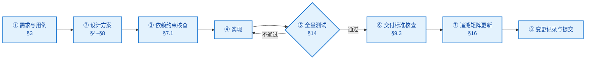
```mermaid
graph LR
    A["① 需求与用例<br/>§3"] --> B["② 设计方案<br/>§4~§8"]
    B --> C["③ 依赖约束核查<br/>§7.1"]
    C --> D["④ 实现"]
    D --> E{"⑤ 全量测试<br/>§14"}
    E -->|不通过| D
    E -->|通过| F["⑥ 交付标准核查<br/>§9.3"]
    F --> G["⑦ 追溯矩阵更新<br/>§16"]
    G --> H["⑧ 变更记录与提交"]

    classDef step fill:#e3f2fd,stroke:#1976d2,stroke-width:2px,color:#0d47a1
    class A,B,C,D,E,F,G,H step
```

### 9.6 设计合规性检查清单

本清单用于设计评审与实现核查，逐项对应本文档的强制约束。**任一「否」均构成设计不合规**：

- [ ] 依赖方向符合 §7.1 的六条约束（D-1~D-6）
- [ ] 模型调用未绕过 `ModelGateway` 直连 provider
- [ ] 数据访问未绕过 Repository 直接操作会话
- [ ] 接口层未包含业务逻辑
- [ ] 编排层未直接写入数据库（未经仓储）
- [ ] 新增 ORM 实体已在 `__init__.py` 注册
- [ ] 提示词集中于 `prompts.py` 且版本号已更新
- [ ] 用户数据访问均受 `user_id` 强制过滤
- [ ] 测试覆盖新增分支及其失败分支
- [ ] 面向用户的错误信息为中文且可理解
- [ ] 设计与实现变更已同步至 `dev_logs/`

---

## 10. 技术选型与论证

本章逐项论证系统的技术选型，每项按下述四项结构记录：**选型内容 / 选型理由 / 未采纳方案及其原因 / 重新评估条件**。各选型对应一条架构决策记录（ADR）。

### 10.1 技术栈总览

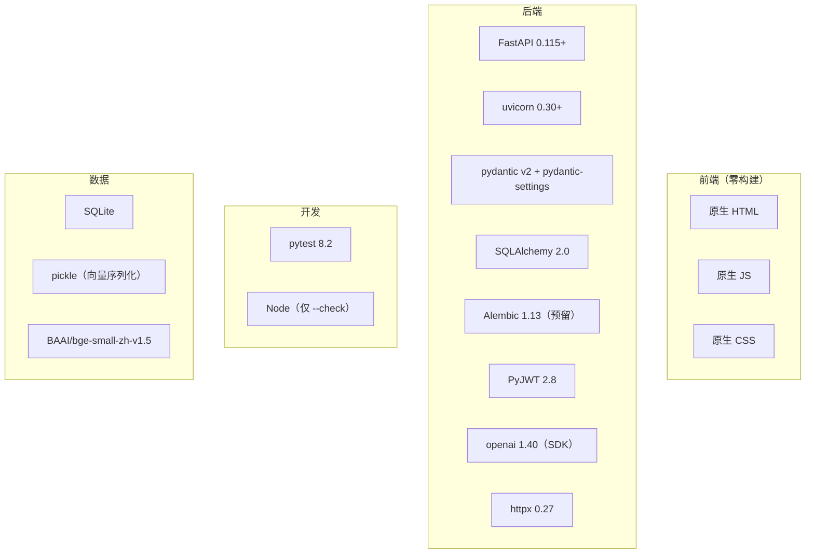
```mermaid
graph TB
    subgraph FE["前端（零构建）"]
        H["原生 HTML"]
        J["原生 JS"]
        C["原生 CSS"]
    end
    subgraph BE["后端"]
        F["FastAPI 0.115+"]
        U["uvicorn 0.30+"]
        P["pydantic v2 + pydantic-settings"]
        S["SQLAlchemy 2.0"]
        A["Alembic 1.13（预留）"]
        JWT["PyJWT 2.8"]
        OAI["openai 1.40（SDK）"]
        HX["httpx 0.27"]
    end
    subgraph DE["开发"]
        PT["pytest 8.2"]
        ND["Node（仅 --check）"]
    end
    subgraph DATA["数据"]
        SQ["SQLite"]
        PK["pickle（向量序列化）"]
        BGE["BAAI/bge-small-zh-v1.5"]
    end
```

| 层 | 选型 | 版本 |
|---|---|---|
| Web 框架 | FastAPI | ≥0.115 |
| ASGI 服务器 | uvicorn | ≥0.30 |
| 数据校验 / 配置 | pydantic + pydantic-settings | ≥2.7 / ≥2.3 |
| ORM | SQLAlchemy | ≥2.0 |
| 迁移（预留） | Alembic | ≥1.13 |
| 模型 SDK | openai（OpenAI 兼容协议） | ≥1.40 |
| HTTP 客户端 | httpx | ≥0.27 |
| 认证 | PyJWT | ≥2.8 |
| 数据库 | SQLite | 内置 |
| 向量模型 | BAAI/bge-small-zh-v1.5 | 512 维 |
| 前端 | 原生 HTML/JS/CSS | 无框架 |
| 测试 | pytest | ≥8.2 |

### 10.2 关键选型论证

各决策按下述四项结构记录：**选型内容 / 选型理由 / 未采纳方案及其原因 / 重新评估条件**。

#### ADR-01：Web 框架选型（FastAPI）

| 项 | 内容 |
|---|---|
| **选型内容** | FastAPI |
| **选型理由** | ① 与 pydantic 原生集成，请求与响应校验无需额外实现，并支持将校验错误统一转换为中文提示（§6.1.1）；② 提供依赖注入机制，使会话、网关与鉴权成为可组合的声明式依赖，鉴权出口天然唯一（§6.1.2）；③ 自动生成 OpenAPI 契约文档，降低接口协作成本；④ 原生异步支持，为流式接口预留实现空间 |
| **未采纳方案** | Flask（缺少原生校验与依赖注入机制）；Django（对单机应用而言过重，其 ORM 组织方式与本设计「薄领域层 + 重仓储层」的结构不匹配） |
| **重新评估条件** | 基本无需变更；仅在迁移至 Serverless 环境且框架冷启动成为瓶颈时评估 |

#### ADR-02：数据访问方式选型（SQLAlchemy 2.0 + 仓储层）

| 项 | 内容 |
|---|---|
| **选型内容** | SQLAlchemy 2.0（声明式 + `Mapped[]` 类型注解），在其上自建仓储层 |
| **选型理由** | ① `Mapped[]` 注解使字段类型对 IDE 与类型检查器可见，配合 `__table_args__` 声明索引，使模型定义同时充当数据结构文档；② 业务层不直接使用 ORM 查询，而经仓储层封装——这是**结构性防越权得以成立的前提**（§7.3）；③ 仓储层同时消除了「列表查询与计数查询条件不一致」一类缺陷（复用点 R-16） |
| **选型代价** | 每张实体表需额外实现一个仓储类。该代价为**有意承担**——所换取的是数据隔离保障级别由「编码约定」提升至「结构约束」 |
| **未采纳方案** | 原生 SQL（缺少类型安全）；Django ORM（与 FastAPI 技术栈不匹配） |
| **重新评估条件** | 数据规模达亿级或需复杂分析型查询时，考虑引入专用查询层 |

#### ADR-03：存储选型（SQLite）

| 项 | 内容 |
|---|---|
| **选型内容** | SQLite 单文件数据库（`dev.db`） |
| **选型理由** | ① **零部署成本**——本系统为个人应用，获取代码后即可运行，无需安装独立数据库服务；② 备份操作等价于复制单个文件（已提供一键备份脚本）；③ 单用户场景下无并发写压力，SQLite 的单写者模型不构成瓶颈 |
| **未采纳方案** | PostgreSQL（部署成本较高，其收益需在数据规模增长后方能体现） |
| **已知能力边界** | ① 无 pgvector 支持，向量以 pickle 存储并由应用层计算相似度，**数据量增长后将成为性能瓶颈**；② `create_all` 不为已存在的表添加列（§5.5）；③ 不支持并发写入 |
| **重新评估条件** | 出现「向量检索性能下降」或「需多实例部署」时。由于 ORM 层已作抽象，主要变更为数据库连接配置与向量存储方案 |

#### ADR-11：结构化输出策略选型（JSON Schema + 多层退让解析）

| 项 | 内容 |
|---|---|
| **选型内容** | 要求模型输出 JSON，并以 `parse_json` 实现多层退让解析 |
| **选型理由** | ① 模型输出本质为自由文本，**设计上不可假定其严格符合格式约定**；② `response_format` 参数可提高合规率但不构成保证；③ 三层退让策略（直接解析 → 剥离代码围栏 → 截取最外层花括号）可覆盖实测中的绝大多数异常输出 |
| **未采纳方案** | 正则表达式提取（鲁棒性不足）；要求模型输出 XML / YAML（模型训练语料较少，合规率更低） |
| **重新评估条件** | 若模型服务支持严格的约束解码（constrained decoding），可减轻解析复杂度，但**不应移除兜底解析逻辑** |

#### ADR-13：异步任务框架选型（进程内任务队列）

| 项 | 内容 |
|---|---|
| **选型内容** | 单进程内「任务落库排队 + 轮询执行」模式 |
| **选型理由** | ① 引入 Celery 需配套 Redis / RabbitMQ 等中间件，与「零部署」目标（ADR-03）冲突；② 本系统任务量小（每周数次扫描与推送），轮询机制足以满足；③ **数据库唯一约束天然提供幂等保障**（幂等键设计），无需分布式锁；④ 单进程模型简化调试路径，无需追踪跨进程状态 |
| **未采纳方案** | Celery（引入额外中间件依赖）；APScheduler（其任务状态持久化需求已由 `TaskRun` 表满足） |
| **关键设计** | `enqueue()` 与 `run_pending()` 被设计为**与框架无关的接口**，替换实现仅需修改这两个函数 |
| **重新评估条件** | 出现下述情形之一时：需多实例横向扩展、任务量显著增长、任务需独立资源隔离。**替换代价已控制在 2 个文件范围内** |

#### ADR-14：模型服务与成本策略选型（单一模型 + reasoning 开关）

| 项 | 内容 |
|---|---|
| **选型内容** | 单一模型 `deepseek-flash`，配合每请求 `reasoning` 开关 |
| **选型理由** | ① 服务可稳定访问且单价较低；② 采用 OpenAI 兼容协议，更换供应商仅需修改 1 个文件；③ 以 `reasoning` 开关替代「多模型档位」设计，**业务层仅需声明「该任务是否需要深度推理」，无需感知模型细节**；④ 服务端提供自动上下文缓存，重复前缀（系统提示词）部分的成本可降至约 1/50 |
| **未采纳方案** | 多模型路由方案（早期 Claude 方案已废弃）；自建推理服务 |
| **成本控制措施** | 策略表将批量提取类任务设为 `reasoning=off`（可降低约 3~5 倍成本），仅冲突判定、因果推理、L1 意图定位三类任务开启推理 |
| **重新评估条件** | 需要更强推理能力、更低成本，或需要多模态支持时 |

#### ADR-15：前端架构选型（零构建方案）

| 项 | 内容 |
|---|---|
| **选型内容** | 原生 HTML / JS / CSS，不使用框架与打包工具 |
| **选型理由** | ① 零构建即零配置，不引入依赖管理复杂度，获取代码即可运行；② 本系统为 12 个页面的单机应用，**不需要组件化与状态管理机制**；③ 前端资产仅 2 个文件：`app.js` 承载全部共享逻辑（复用点 R-13），`style.css` 为唯一样式来源（R-14） |
| **未采纳方案** | React / Vue（引入构建链与包管理依赖，相对收益不足） |
| **选型代价** | 缺少组件复用与类型检查能力，需手工管理 DOM。该代价以**页面数量有限**为前提被接受，换取零维护的构建环节 |
| **配套措施** | ① 对 `.html / .js / .css` 设置协商缓存响应头（§6.1.1），避免静态资源缓存导致变更未生效；② 以 `node --check` 进行语法校验；③ 前端行为纳入 Node 环境自动化验证（`tests/js/`） |

### 10.3 Mock 实现的设计价值

`MockProvider` 的作用不限于「未配置密钥时的降级路径」，其同时是**测试策略的基础设施**：

| 设计收益 | 说明 |
|---|---|
| **测试确定性** | 262 项测试全部在 Mock 下运行，不依赖网络、不产生费用、结果可重复 |
| **环境无关性** | 未配置密钥即可完成全链路运行，便于部署验证与功能演示 |
| **离线可用性** | 无网络环境下可完成全部运行与开发工作 |
| **测试成本为零** | 自动化测试不产生模型调用费用 |
| **异常场景可控** | 可精确构造「模型返回非法 JSON」「模型超时」等异常输入，用于验证降级路径 |

> **设计要点**：将 `LLMProvider` 抽象为接口后，Mock 实现成为**与真实实现地位对等的可替换组件**，而非事后补充的测试替身。这使系统的可靠性设计（降级、重试、异常处理）能够被确定性地验证，而不仅依赖真实服务的偶然异常。这一性质是本设计可测试性的基础。

### 10.4 依赖管理原则

| 原则 | 说明 |
|---|---|
| **运行时依赖最小化** | 当前仅 9 个。每增加一个依赖都会提高环境重建成本与供应链风险 |
| **既有能力可解决时不引入库** | 例：限流功能以约 40 行实现 `FailureThrottle`，不引入额外限流库 |
| **重依赖须可降级** | 向量模型为可选依赖，缺失时自动降级为关键词检索，功能不缺失 |
| **引入依赖须说明理由** | 需论证「为何现有能力无法解决」，并评估其降级方案 |

---

## 11. 接口设计

### 11.1 接口总览与约定

| 项 | 约定 |
|---|---|
| **前缀** | 业务接口统一 `/api/v1/*`；健康检查无前缀 |
| **认证** | `Authorization: Bearer <access_token>` |
| **错误格式** | 统一 JSON，**中文提示**（见 §11.4） |
| **分页** | 游标式或 `limit/offset`，返回 `total` |
| **时间** | ISO 8601 带时区 |
| **命名** | 资源用复数名词（`/items`、`/goals`、`/conflicts`） |

### 11.2 端点清单（按模块）

| 模块 | 前缀 | 路由数 | 端点 |
|---|---|---|---|
| **health** | — | 1 | `GET /health` |
| **auth** | `/api/v1/auth` | 6 | `POST /register` `POST /login` `POST /refresh` `POST /password` `DELETE /account` `GET /me` |
| **knowledge** | `/api/v1/knowledge` | 6 | `POST /items` `GET /items` `GET /items/{id}` `PATCH /items/{id}` `DELETE /items/{id}` `GET /export` |
| **books** | `/api/v1/books` | 10 | `POST ""` `GET ""` `GET /reading-log` `GET /{id}` `GET /{id}/images/{name}` `GET /{id}/chapter/{i}` `PATCH /{id}/progress` `DELETE /{id}` `POST /{id}/notes` `GET /{id}/notes` |
| **chat** | `/api/v1` | 1 | `POST /chat` |
| **events** | `/api/v1/events` | 1 | `GET ""` |
| **l1** | `/api/v1/l1` | 1 | `POST /mine` |
| **l2** | `/api/v1/l2` | 3 | `POST /scan` `GET /conflicts` `PATCH /conflicts/{id}/state` |
| **l3** | `/api/v1/l3` | 2 | `POST /brief` `POST /question` |
| **l4** | `/api/v1/l4` | 6 | `POST /goals` `GET /goals` `POST /goals/{id}/plan` `GET /plan` `POST /deviation/check` `POST /deviation/{plan_id}/decision` |
| **l5** | `/api/v1/l5` | 3 | `POST /diagnosis` `GET /diagnosis/latest` `POST /diagnosis/{id}/decision` |
| **preferences** | `/api/v1/preferences` | 2 | `GET ""` `PUT ""` |
| **push** | `/api/v1/push` | 2 | `GET /jobs` `POST /jobs/{id}/delivered` |

**合计 41 个路由**（含 12 个页面路由）。

### 11.3 关键接口契约示例

#### `POST /api/v1/l1/mine` —— L1 模糊意图挖掘

**请求**
```json
{ "query": "我好像在哪看过关于复利的讨论" }
```

**响应（定位成功 `decision=located`）**
```json
{
  "decision": "located",
  "items": [
    {
      "id": "uuid",
      "title": "《穷查理宝典》笔记",
      "snippet": "复利效应是……",
      "reason": "标题与内容均命中「复利」主题，且表述与查询意图一致",
      "is_readable": true,
      "source_locator": { "chapter_index": 3, "char_start": 1200, "char_end": 1500 }
    }
  ],
  "cost": { "prompt_tokens": 812, "completion_tokens": 96, "estimated_cost": 0.0021 }
}
```

**响应（需追问 `decision=clarify`）**
```json
{
  "decision": "clarify",
  "candidates": [
    { "id": "uuid", "title": "《穷查理宝典》笔记", "snippet": "……" }
  ],
  "question": "你是指「复利」这个概念的定义，还是某个具体场景下的复利应用？"
}
```

> **契约设计要点**：`decision` 采用**判别式字段**设计，客户端据此分支渲染。相较返回两个互为可选、可能同时为空的结果字段，该设计语义更明确，同时也是「证据不足时不作出定位判断」这一业务规则在接口层面的体现。

#### `PATCH /api/v1/l2/conflicts/{id}/state` —— 冲突反馈

**请求**
```json
{ "user_state": "ignored" }
```

**响应**
```json
{ "id": "uuid", "user_state": "ignored", "suppressed_type": false }
```

> `suppressed_type=true` 表示「同类型忽略次数已达阈值，该类型后续不再推荐」。该字段使**误报抑制机制的作用结果对用户显式可见**，而非静默生效。

### 11.4 错误响应契约

错误响应采用统一结构，**提示信息为中文且面向用户可理解**。框架默认的错误格式为英文结构化输出，不适合直接呈现给用户，因此须经统一转换（见附录 C 第 5 条）：

```json
{
  "detail": "字段「截止日期」格式不正确，应为 ISO 8601 时间"
}
```

| 状态码 | 语义 | 示例场景 |
|---|---|---|
| 400 | 请求语义错误 | 参数组合非法 |
| 401 | 未认证 / 会话过期 | Token 失效、过期 |
| 403 | 已认证但无权 | 跨用户访问（`PermissionError`） |
| 404 | 资源不存在 | 条目已被删除 |
| 409 | 冲突 | 用户名已存在 |
| 422 | 校验失败 | pydantic 校验不通过（**中文提示**） |
| 429 | 限流 | 登录失败次数超限 |
| 500 | 服务端错误 | 未预期异常（含 `request_id` 便于定位） |

### 11.5 会话与鉴权流程

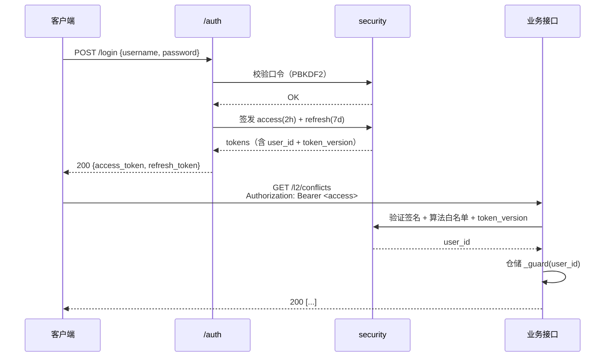
```mermaid
sequenceDiagram
    participant C as 客户端
    participant A as /auth
    participant S as security
    participant API as 业务接口

    C->>A: POST /login {username, password}
    A->>S: 校验口令（PBKDF2）
    S-->>A: OK
    A->>S: 签发 access(2h) + refresh(7d)
    S-->>A: tokens（含 user_id + token_version）
    A-->>C: 200 {access_token, refresh_token}

    C->>API: GET /l2/conflicts<br/>Authorization: Bearer <access>
    API->>S: 验证签名 + 算法白名单 + token_version
    S-->>API: user_id
    API->>API: 仓储 _guard(user_id)
    API-->>C: 200 [...]
```

| 机制 | 设计 |
|---|---|
| **Access Token** | 2 小时 |
| **Refresh Token** | 7 天 |
| **算法白名单** | 防 alg 混淆攻击（不允许 `alg=none`） |
| **token_version** | 改密/注销后自增 → **所有旧 token 立即失效**（无需黑名单） |
| **`?token=` 兜底** | 仅用于 `` 场景（浏览器直发请求无法带头） |

> **会话失效必须可恢复**：401 响应需区分两类语义——「凭证错误」（应直接向用户报错）与「会话过期」（应触发重新认证）。若将二者等同处理，会话过期后界面将停留在无效状态而无法恢复（见附录 C 第 7 条）。**因此任何标识会话过期的 401 都必须触发重新认证流程，不得静默失败。**

---

## 12. 非功能性设计与部署

### 12.1 部署图

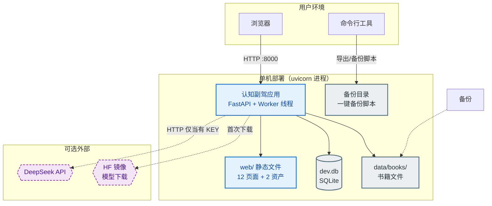
```mermaid
graph TB
    subgraph USER["用户环境"]
        BR["浏览器"]
        CLI["命令行工具"]
    end

    subgraph HOST["单机部署（uvicorn 进程）"]
        APP["认知副驾应用<br/>FastAPI + Worker 线程"]
        WEBF["web/ 静态文件<br/>12 页面 + 2 资产"]
        DBF[("dev.db<br/>SQLite")]
        BK["data/books/<br/>书籍文件"]
        BKD["备份目录<br/>一键备份脚本"]
    end

    subgraph OPT["可选外部"]
        DS{{"DeepSeek API"}}
        HF{{"HF 镜像<br/>模型下载"}}
    end

    BR -->|HTTP :8000| APP
    CLI -->|导出/备份脚本| BKD
    APP --> WEBF
    APP --> DBF
    APP --> BK
    APB["备份"] -.-> BK
    APP -.->|HTTP 仅当有 KEY| DS
    APP -.->|首次下载| HF

    classDef host fill:#e3f2fd,stroke:#1976d2,stroke-width:2px,color:#0d47a1
    classDef store fill:#eceff1,stroke:#546e7a,stroke-width:2px,color:#263238
    classDef ext fill:#f3e5f5,stroke:#8e24aa,stroke-width:1.5px,stroke-dasharray:5 3,color:#4a148c
    class APP,WEBF host
    class DBF,BK,BKD store
    class DS,HF ext
```

**部署特征**：**单机、单进程、零外部中间件**。这是刻意的极简——降低运维成本到「重启一个进程」。

### 12.2 按 ISO/IEC 25010 的非功能设计

| 质量属性 | 设计措施 | 验证方式 |
|---|---|---|
| **功能性** | 五大能力 + 账号 / 知识 / 书籍 / 推送全链路覆盖；用例逐条映射至实现（§3.4） | 262 项测试 + 用例覆盖走查（§16） |
| **性能效率** | L2 五级候选漏斗将模型调用量降至 1~2%；L1 双通道召回；索引按实际查询模式设计（§5.3） | 成本日志与耗时日志 |
| **兼容性** | 模型侧采用 OpenAI 兼容协议；前端无框架依赖，主流浏览器均可运行 | 跨环境验证 |
| **易用性** | 全站中文界面；会话过期自动续期；错误信息面向用户可理解 | `tests/test_web.py` |
| **可靠性** | 任务重试与死信机制；网关重试；向量与模型均可降级；数据软删 | `tests/test_tasks.py` + 异常注入验证 |
| **安全性** | 结构性防越权；PBKDF2 口令哈希；JWT 算法白名单；`token_version` 全局吊销；登录限流（账号 + IP 双维度） | `tests/test_auth.py`（26 项） |
| **可维护性** | 分层解耦（§7）；复用抽象（§8）；设计与决策记录于 `dev_logs/` | §7.1 所列 6 项依赖检查 |
| **可移植性** | 无平台特有依赖；配置全部支持环境变量注入；数据库连接可替换 | 变更环境后重跑测试 |

### 12.3 配置项清单（`app/core/config.py`）

| 分组 | 关键配置 | 默认值 |
|---|---|---|
| **应用** | `app_name` / `debug` | 认知副驾 / False |
| **数据库** | `database_url` | `sqlite:///./dev.db` |
| **模型** | `deepseek_api_key` / `deepseek_base_url` / `deepseek_model` / `deepseek_timeout_seconds` | "" / api.deepseek.com / deepseek-flash / 60 |
| **计费** | `deepseek_peak_multiplier` / `deepseek_peak_hours` | 2.0 / `9-12,14-18` |
| **向量** | `embedding_backend` / `embedding_model` / `embedding_dim` / `embedding_local_dir` | local / bge-small-zh-v1.5 / 512 / models/... |
| **书籍** | `books_dir` | `data/books` |
| **镜像** | `hf_endpoint` / `hf_hub_disable_xet` | "" / False |
| **JWT** | `jwt_secret` / `jwt_algorithm` / `access_token_minutes` / `refresh_token_days` | "" / HS256 / 120 / 7 |
| **限流** | `login_throttle_enabled` / `login_max_attempts` / `login_ip_max_attempts` / `login_window_seconds` / `login_lock_seconds` | True / 5 / 20 / 300 / 300 |
| **Worker** | `worker_enabled` / `worker_poll_seconds` / `task_max_attempts` / `task_retry_backoff_seconds` | True / 15.0 / 3 / 1.0 |
| **定时推送** | `push_schedule_enabled` | True |

**派生属性**：`model_provider` —— 有 `deepseek_api_key` 则 `"deepseek"`，否则 `"mock"`。

### 12.4 运维设计

#### 12.4.1 安装与启动

系统的部署与启动流程如下，**无需外部服务与密钥即可完成完整功能验证**（未配置模型密钥时自动路由至 Mock 实现，见 §10.3）：

```bash
# 1. 建立运行环境（Python ≥ 3.12）
python -m venv .venv
source .venv/bin/activate        # Windows: .venv\Scripts\activate

# 2. 安装依赖
pip install -e ".[dev]"

# 3. 启动服务
uvicorn app.main:app --reload --port 8000
```

启动后访问 `http://127.0.0.1:8000/` 即进入登录页。可选增强配置：

| 可选项 | 配置方式 | 未配置时的行为 |
|---|---|---|
| 启用真实模型服务 | 设置 `DEEPSEEK_API_KEY` | 自动路由至 `MockProvider`（确定性、零成本） |
| 启用向量语义检索 | `EMBEDDING_BACKEND=local`（首次需下载约 100MB 模型，可配 `HF_ENDPOINT` 镜像） | 检索自动降级为关键词通道，功能完整、召回质量下降 |

#### 12.4.2 运维操作要点

| 场景 | 操作要点 |
|---|---|
| **服务重启** | 须确认原进程完全退出后再启动。`--reload` 模式下的子进程可能继承监听端口，导致新配置未生效（见附录 D 运行环境类条目） |
| **数据备份** | 执行一键备份脚本（备份 `dev.db` 与 `data/` 目录），或通过 `GET /api/v1/knowledge/export` 导出知识数据 |
| **数据模型变更** | 停服 → 执行结构调整（`ALTER TABLE` 或重建库，见 §5.5）→ 重启 → 执行全量测试 |
| **功能异常定位** | 按「数据层 → 服务层 → 前端」顺序分层排查：先确认数据完整性与服务可用性，再检查前端运行状态 |
| **数据异常排查** | 全程只读操作，避免排查过程引入二次变更（用户数据敏感） |
| **成本异常定位** | 查询 `cost_logs`，按 `task_type` 聚合定位成本来源（见 §13.3） |

> **关于排查顺序的说明**：系统曾出现「页面数据为空」的现象，其可能成因包括数据缺失、服务不可用、会话失效三类，且三者表象相同。设计中明确了分层排查顺序——**数据层（数据是否存在）→ 服务层（接口是否正常）→ 前端层（会话与渲染状态）**，前两层可通过只读查询与接口探测快速排除，从而将问题范围精确收敛。该排查路径已作为运维规范固化。

---

## 13. 出错处理与可观测性

### 13.1 出错处理策略（分层）

| 层 | 错误类型 | 处理策略 |
|---|---|---|
| **接口层** | 参数校验失败 | pydantic → 422 + 中文提示 |
| **接口层** | 未认证 | 401，前端统一跳转登录 |
| **仓储层** | 跨用户访问 | 抛 `PermissionError` → 403 |
| **编排层** | LLM 返回非法 JSON | `parse_json` 三层退让；仍失败则跳过该候选，不中断整批 |
| **编排层** | LLM 服务不可用 | 网关重试 3 次指数退避；仍失败则向上抛 |
| **编排层** | 向量模型不可用 | 降级为关键词检索 |
| **任务层** | 处理器异常 | 留在 pending，`attempts+1`，退避重试 |
| **任务层** | 重试超上限 | 转 `dead`，保留 `last_error` 现场 |
| **推送层** | 重复内容 | `content_hash` 唯一约束挡回 |
| **全局** | 未预期异常 | 500 + `request_id`，服务端记完整堆栈 |

### 13.2 可观测性三支柱

| 支柱 | 实现 | 设计用途 |
|---|---|---|
| **日志** | `core/logging.py` + `request_id` 全链路贯穿 | 支持从用户反馈定位到具体请求的完整执行记录 |
| **成本埋点** | `cost_logs` 表：`task_type` / `model` / `reasoning` / `prompt_version` / `cached_tokens` / `estimated_cost` | 成本归因分析与异常成本发现 |
| **业务事件** | `learning_events`（append-only）：`event_type` + `occurred_at` + `payload` | L5 归因分析的事实依据与行为统计基础 |

### 13.3 成本可观测性设计

`cost_logs` 的字段设置以**支持具体成本归因问题**为目的，每个字段对应一类可回答的问题：

| 字段 | 可回答的问题 |
|---|---|
| `task_type` | 成本主要来源于哪一能力 |
| `reasoning` | 开启推理的任务占成本比例（用于验证 §6.3.1 策略表配置合理性） |
| `model` | 模型切换前后的成本对比 |
| `prompt_version` | 提示词变更是否引起 token 用量增长 |
| `cached_tokens` | 上下文缓存命中情况（命中单价约为普通输入的 1/50，是主要成本优化点） |
| `request_id` | 该次调用归属的用户请求 |
| `estimated_cost` | 分时计价后的实际成本（人民币） |

> **成本埋点置于网关层的设计理由**：这是模型调用「唯一收口」的直接收益——由于全系统仅网关一处发起模型调用，**不存在遗漏埋点的调用路径**，成本数据的完整性由结构保证。

### 13.4 已知的可靠性边界

以下为当前设计中**明确接受的能力边界**，其取舍依据见 §2.1 设计目标优先级与 §10.2 选型论证：

| 场景 | 当前行为 | 影响 | 设计考量 |
|---|---|---|---|
| Web 进程停止 | Worker 线程随之停止 | 任务积压，重启后自动继续 | 单进程部署的固有取舍（§10.2 ADR-13），对单机应用可接受 |
| SQLite 文件损坏 | 服务无法启动 | 需从备份恢复 | 依赖备份机制（§12.4），已提供一键备份与导出能力 |
| 向量模型未就绪 | 降级为关键词检索 | 召回质量下降 | 功能不缺失，符合 §10.3 可降级设计原则 |
| 未配置模型密钥 | 路由至 Mock 实现 | 无真实智能输出 | 为环境无关验证与自动化测试所必需（§10.3） |
| 存储空间耗尽 | 写库失败 | 任务转入死信状态 | 需外部监控配合，已列入 §15.1 风险项 |

---

## 14. 测试与验证策略

### 14.1 测试分层

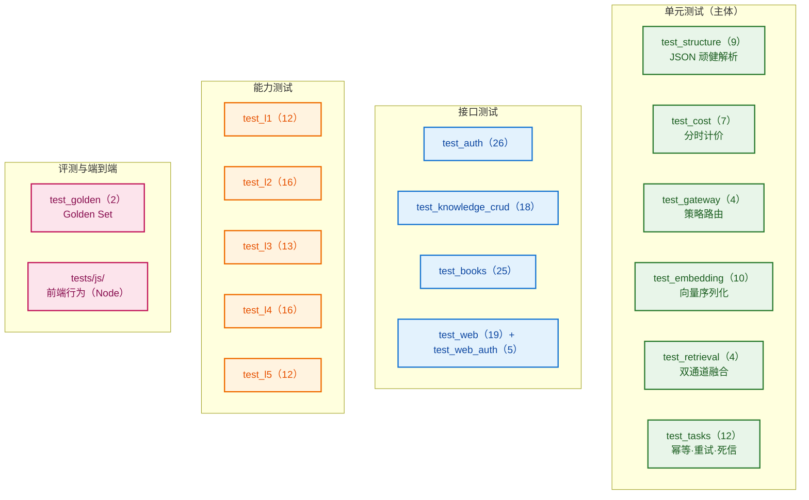
```mermaid
graph TB
    subgraph L1T["单元测试（主体）"]
        U1["test_structure（9）<br/>JSON 顽健解析"]
        U2["test_cost（7）<br/>分时计价"]
        U3["test_gateway（4）<br/>策略路由"]
        U4["test_embedding（10）<br/>向量序列化"]
        U5["test_retrieval（4）<br/>双通道融合"]
        U6["test_tasks（12）<br/>幂等·重试·死信"]
    end
    subgraph L2T["接口测试"]
        A1["test_auth（26）"]
        A2["test_knowledge_crud（18）"]
        A3["test_books（25）"]
        A4["test_web（19）+ test_web_auth（5）"]
    end
    subgraph L3T["能力测试"]
        C1["test_l1（12）"]
        C2["test_l2（16）"]
        C3["test_l3（13）"]
        C4["test_l4（16）"]
        C5["test_l5（12）"]
    end
    subgraph L4T["评测与端到端"]
        G1["test_golden（2）<br/>Golden Set"]
        J1["tests/js/<br/>前端行为（Node）"]
    end

    classDef u fill:#e8f5e9,stroke:#2e7d32,stroke-width:2px,color:#1b5e20
    classDef a fill:#e3f2fd,stroke:#1976d2,stroke-width:2px,color:#0d47a1
    classDef c fill:#fff3e0,stroke:#ef6c00,stroke-width:2px,color:#e65100
    classDef g fill:#fce4ec,stroke:#c2185b,stroke-width:2px,color:#880e4f
    class U1,U2,U3,U4,U5,U6 u
    class A1,A2,A3,A4 a
    class C1,C2,C3,C4,C5 c
    class G1,J1 g
```

### 14.2 测试设计原则

| 原则 | 设计理由 |
|---|---|
| **全流程 Mock，不触发真实模型调用** | 网关在无密钥时路由至 `MockProvider`，使测试具备确定性、零成本、可离线三项性质（§10.3） |
| **测试使用独立数据库** | 与运行数据隔离，避免测试污染 |
| **测试期关闭后台任务（`worker_enabled=false`）** | 消除后台线程对测试时序的干扰，任务执行时机由测试显式控制 |
| **缺陷修复须附复现测试** | 先构造可复现缺陷的测试，再实施修复，使缺陷具备永久回归防护 |
| **须覆盖异常分支** | 除正常路径外，须验证降级、重试、校验失败等异常分支 |
| **前端行为纳入自动化验证** | 通过 Node 环境执行真实前端脚本并断言运行时行为（`tests/js/`） |

### 14.3 测试覆盖矩阵

| 模块 | 测试文件 | 用例数 | 覆盖重点 |
|---|---|---|---|
| 认证 | `test_auth.py` | 26 | 注册 / 登录 / 刷新 / 改密 / 注销 / 限流 / `token_version` 吊销 |
| 知识 CRUD | `test_knowledge_crud.py` | 18 | 增删改查 / 分页 / 搜索 / 软删 |
| 书籍 | `test_books.py` | 25 | 上传 / 解析 / 分章 / 进度 / 笔记 / 插图 |
| Web 页面 | `test_web.py` + `test_web_auth.py` | 24 | 页面可达性 / 静态资源响应头 / 鉴权 / 会话兜底 |
| L1 | `test_l1.py` | 12 | 定位判断 / 追问分支 / 复用提醒 |
| L2 | `test_l2.py` + `test_conflict.py` | 20 | 五级漏斗 / 去重 / 状态机 / 误报抑制 |
| L3 | `test_l3.py` | 13 | 简报生成 / 助产提问 / 降级 |
| L4 | `test_l4.py` | 16 | 目标 / 计划 / 偏差检测 / 乐观锁 |
| L5 | `test_l5.py` | 12 | 模式识别 / 推理链 / 反馈闭环 |
| 任务框架 | `test_tasks.py` + `test_push_schedule.py` | 20 | 幂等 / 重试 / 死信 / 定时幂等键 |
| 模型层 | `test_gateway.py` + `test_structure.py` + `test_cost.py` | 20 | 策略路由 / 解析退让 / 分时计价 |
| 检索 | `test_retrieval.py` + `test_embedding.py` | 14 | 双通道融合 / 降级 / 序列化 |
| 其他 | `test_health` `test_events` `test_preferences` `test_push` `test_db` `test_ingestion` `test_chat` `test_golden` | 36 | 健康检查 / 事件记录 / 偏好 / 推送 / 越权防护 / 摄取 / 评测 |
| **合计** | | **254 个测试函数** | pytest 实际收集 **262 项**（含参数化展开） |

### 14.4 质量评测集（Golden Set）

`tests/golden/` 保存**人工标注的评测样本**，用于验证智能能力的**输出质量**，区别于功能正确性验证：

| 用途 | 说明 |
|---|---|
| 回归防护 | 提示词变更后比对能力输出，检测质量退化 |
| 阈值调优 | 调整 L2 漏斗阈值时评估召回率损失 |
| 提示词版本对比 | 以同一评测集比较不同提示词版本的效果差异 |

> **功能性测试与质量评测的作用区分**：262 项自动化测试验证「实现是否符合设计预期」（即功能正确性与异常处理），具有确定性，可作为交付门禁；Golden Set 验证「智能能力输出是否有效」，具有统计性，作为调优与回归评估依据。二者不可相互替代——前者保证系统可靠运行，后者保证设计目标 G2（功能性完备）在语义层面达成。

---

# 第四部分 · 追溯与演进

## 15. 风险与演进路线

### 15.1 技术风险与应对

| # | 风险 | 影响 | 概率 | 应对措施 | 触发条件 |
|---|---|---|---|---|---|
| R1 | 模型输出不稳定（格式或质量波动） | 能力输出不可靠 | 高 | 多层退让解析 + 阈值抑制 + Golden Set 回归（§6.3.2、§14.4） | 解析失败率上升 |
| R2 | 成本超出预期 | 可用性受损 | 中 | 策略表控制推理开关 + 漏斗降低调用量 + 缓存 + 成本埋点告警（§6.3、§13.3） | 单位用户成本超阈值 |
| R3 | 向量检索性能随数据量下降 | 检索响应超时 | 中 → 高 | 分批召回；P2 阶段迁移至 pgvector（§15.2） | 知识条目 > 5000 条 |
| R4 | 模型供应商接口变更或调价 | 服务中断 | 中 | `LLMProvider` 抽象隔离，替换范围为 1 个文件（§7.4） | 供应商公告变更 |
| R5 | 数据模型漂移 | 运行期异常 | 中 | §5.5 演进规则 + 全量测试；P1 引入 Alembic 强制迁移 | 出现结构不一致告警 |
| R6 | 单进程部署的单点风险 | 服务整体不可用 | 低 | 备份机制 + 可重复启动流程（§12.4） | 服务异常退出 |
| R7 | 静态资源缓存导致变更未生效 | 变更验证失真 | 中 | 强制协商缓存响应头（已实施，§6.1.1） | — |
| R8 | 依赖约束依赖人工核查 | 长期一致性下降 | 中 | 列入技术债 T3，计划在构建环节引入自动检查 | 团队规模扩大 |

### 15.2 演进路线

| 阶段 | 主题 | 关键事项 | 触发条件 |
|---|---|---|---|
| **P1** | 可维护性加固 | ① 引入 Alembic 强制迁移；② 引入依赖约束自动检查；③ 统一响应体结构 | 团队规模 > 1 人，或开始对接外部系统 |
| **P2** | 检索能力升级 | ① 以 pgvector 替代 pickle 向量存储；② 向量检索下沉至数据库 | 知识条目 > 5000 条 |
| **P3** | 存储解耦 | ① `raw_content` 迁移至对象存储；② 向量序列化格式改为可读形式 | 需与外部系统交换数据 |
| **P4** | 异步框架升级 | ① 引入分布式任务队列支持多实例；② 现有 `enqueue` / `run_pending` 已构成接口边界 | 单机资源成为瓶颈或需横向扩展 |
| **P5** | 能力扩展 | 新增能力模块；扩展代价判据见 §7.2（改动既有文件 ≤ 2 处） | 需求驱动 |

> **P1 阶段项目的实施时机说明**：该阶段三项均为基础设施类改造，其收益需在团队规模扩大或对接外部系统后方能体现。在当前单人开发、无外部消费方的条件下实施，将引入一次性的破坏性变更成本（涉及全部端点、前端与测试），而收益尚未产生。因此列为待触发事项，**属于基于收益时机的刻意取舍，非设计遗漏**。相关条目已在 §15.3 登记。

### 15.3 已知技术债登记

以下为设计评审中已识别、并明确安排偿还时机的技术债。

| # | 技术债 | 位置 | 影响 | 计划阶段 |
|---|---|---|---|---|
| T1 | 向量以 pickle 序列化存储，不具备跨语言可读性 | `knowledge_items.embedding` | 阻碍外部系统数据交换 | P2 / P3 |
| T2 | 数据模型变更依赖手工迁移，无迁移脚本 | 全项目 | 变更过程易出错 | P1 |
| T3 | 依赖约束无自动化检查 | `app/` | 约束维持依赖人工评审 | P1 |
| T4 | 响应体结构未完全统一 | `app/api/endpoints/` | 接口一致性不足 | P1 |
| T5 | 任务执行与 Web 服务同进程，无资源隔离 | `app/workers/` | 无法独立扩缩容 | P4 |
| T6 | 「最新记录」查询依赖显式排序键，存在被误写为时间戳排序的风险 | 仓储层 | 极端并发下取数错误 | 待引入类型约束 |

---

## 16. 需求追溯矩阵

本矩阵建立**需求 — 用例 — 设计章节 — 实现模块 — 验证方式**之间的双向映射关系，用于两个方向的覆盖性核查：

- **正向核查**：每条需求均可定位到确定的设计章节、实现模块与验证手段，确认需求已被完整设计覆盖；
- **反向核查**：每项设计与实现均可回溯到需求来源，确认不存在无需求依据的设计（即无「无源设计」）。

| 需求编号 | 需求 | 用例 | 设计章节 | 实现位置 | 验证方式 |
|---|---|---|---|---|---|
| **功能-L1** | 模糊意图认知挖掘 | UC-L1-01 | §6.4 | `agent/l1_orchestrator.py`<br/>`api/endpoints/l1.py` | `test_l1.py` |
| **功能-L2** | 观点冲突检测 | UC-L2-01~07 | §4.5.2 §6.4 | `agent/l2_orchestrator.py`<br/>`workers/handlers.py` | `test_l2.py`<br/>`test_conflict.py` |
| **功能-L3** | 认知助产 | UC-L3-01/02 | §6.4 | `agent/l3_orchestrator.py` | `test_l3.py` |
| **功能-L4** | 学习路径自我修正 | UC-L4-01~04 | §4.5 §6.4 | `agent/l4_orchestrator.py` | `test_l4.py` |
| **功能-L5** | 认知偏误诊断 | UC-L5-01~03 | §4.5.3 §6.4 | `agent/l5_orchestrator.py` | `test_l5.py` |
| **功能-知识** | 知识管理 | UC-10-01~04 | §5.2 §6.2 | `api/endpoints/knowledge.py`<br/>`ingestion/service.py` | `test_knowledge_crud.py` |
| **功能-书籍** | 书籍阅读 | UC-20-01~04 | §5.2 §6.7 | `books/parser.py`<br/>`api/endpoints/books.py` | `test_books.py` |
| **功能-推送** | 主动推送 | UC-30-01/02 | §6.7 | `agent/push_service.py`<br/>`push/` | `test_push.py`<br/>`test_push_schedule.py` |
| **功能-账号** | 账号与会话 | UC-00-01~05 | §11.5 | `api/endpoints/auth.py`<br/>`core/security.py` | `test_auth.py` |
| **功能-偏好** | 偏好设置 | UC-40-01 | §12.3 | `api/endpoints/preferences.py` | `test_preferences.py` |
| **功能-导出** | 数据导出与备份 | UC-50-01 | §12.4 | `api/endpoints/knowledge.py` | `test_knowledge_crud.py` |
| **安全-1** | 口令安全存储 | — | §6.7 | `core/security.py`（PBKDF2） | `test_auth.py` |
| **安全-2** | 会话安全与吊销 | — | §11.5 | `token_version` + 算法白名单 | `test_auth.py` |
| **安全-3** | 防越权 | — | §7.3 | `BaseRepository._guard()` | `test_db.py` |
| **安全-4** | 登录暴力破解防护 | — | §6.7 | `core/ratelimit.py` | `test_auth.py` |
| **安全-5** | 数据软删与保留期 | — | §5.4 | 实体 `is_deleted` / `deleted_at` | `test_knowledge_crud.py` |
| **可靠-1** | 任务幂等 | — | §6.5.1 | `TaskRun.idempotency_key` | `test_tasks.py` |
| **可靠-2** | 并发写不覆盖 | — | §5.4 | `LearningPlan.version` 乐观锁 | `test_l4.py` |
| **可靠-3** | 失败重试与死信 | — | §4.5.1 | `workers/tasks.py` | `test_tasks.py` |
| **可靠-4** | 外部依赖降级 | — | §6.6 §10.3 | `MockProvider` / 关键词通道 | `test_retrieval.py`<br/>`test_gateway.py` |
| **成本-1** | 成本可追踪 | — | §13.3 | `cost_logs` + 网关埋点 | `test_cost.py` |
| **成本-2** | 分任务类型控成本 | — | §6.3.1 | `STRATEGY_TABLE`（reasoning 开关） | `test_gateway.py` |
| **成本-3** | 分时计价 | — | §6.3.3 | `llm/cost.py` | `test_cost.py` |
| **成本-4** | 上下文缓存利用 | — | §13.3 | `cached_tokens` 埋点 | `test_cost.py` |
| **可维护-1** | 分层解耦 | — | §7.1 | 依赖方向约束 D-1~D-6 | §9.6 合规性检查清单 |
| **可维护-2** | 代码复用 | — | §8.1 | 16 项复用抽象 | §8.3 复用度量 |
| **可维护-3** | 可替换性 | — | §7.4 | Provider / Embedding / DB 抽象 | `test_gateway.py` |
| **可维护-4** | 设计与决策可追溯 | — | §9.3 | 变更记录机制 | `dev_logs/` 记录完整性 |
| **易用-1** | 界面错误提示为中文 | — | §11.4 | `main.py:_validation_message` | `test_web.py` |
| **易用-2** | 会话过期可恢复 | — | §11.5 | 401 统一处理策略 | `test_web_auth.py` |

> **覆盖性结论**：功能需求与用例一一对应（31 条用例全覆盖）；非功能需求按安全、可靠性、成本、可维护性、易用性五类分别落至具体设计条目与验证手段；矩阵中不存在仅有需求而无设计落点、或有设计而无需求依据的行。

---

## 17. 附录

### 附录 A：设计图表索引

本文档共含 16 张设计图表，按 UML 2.5 视图分类如下：

| 图 | 章节 | UML 视图类型 | 图类型 |
|---|---|---|---|
| 顶层用例图 | §3.2 | 用例视图 | 用例图 |
| L2 用例细化图（含 include / extend） | §3.3 | 用例视图 | 用例图 |
| 组件图 | §4.1 | 结构视图 | 组件图 |
| 依赖方向图 | §4.3 | 结构视图 | 依赖关系图 |
| 核心抽象类图 | §4.4 | 结构视图 | 类图 |
| 任务状态机 | §4.5.1 | 行为视图 | 状态机图 |
| 冲突状态机 | §4.5.2 | 行为视图 | 状态机图 |
| 诊断状态机 | §4.5.3 | 行为视图 | 状态机图 |
| **实体关系图（ER）** | §5.1 | 数据视图 | ER 图（16 实体全量） |
| 复用层次图 | §8.2 | 结构视图 | 分层图 |
| 设计视图组织图 | §2.3 | 视图索引 | 结构图 |
| 技术栈组成图 | §10.1 | 结构视图 | 组件图 |
| 会话与鉴权时序图 | §11.5 | 行为视图 | 序列图 |
| 部署图 | §12.1 | 部署视图 | 部署图 |
| 质量保障流程图 | §9.5 | 行为视图 | 活动图 |
| 测试分层图 | §14.1 | 结构视图 | 分层图 |

### 附录 B：配置项与环境变量对照

系统的配置通过 `app/core/config.py` 统一声明（详见 §12.3），全部支持环境变量注入。常用环境变量如下：

| 环境变量 | 对应配置项 | 用途 | 示例 |
|---|---|---|---|
| `DEEPSEEK_API_KEY` | `deepseek_api_key` | 启用真实模型服务 | `sk-xxxx` |
| `DATABASE_URL` | `database_url` | 数据库连接 | `sqlite:///./dev.db` |
| `JWT_SECRET` | `jwt_secret` | JWT 签名密钥（**必须**经环境变量注入） | 随机长字符串 |
| `EMBEDDING_BACKEND` | `embedding_backend` | 向量后端选择 | `local` / 空（降级关键词检索） |
| `HF_ENDPOINT` | `hf_endpoint` | 模型下载镜像 | `https://hf-mirror.com` |
| `WORKER_ENABLED` | `worker_enabled` | 是否启用后台任务线程 | `false`（测试环境） |
| `DEBUG` | `debug` | 调试模式 | `true` |

### 附录 C：设计禁忌与需规避的实现方式

下表列出本设计在实现过程中**明确要求规避**的做法。这些条目源于实现阶段已识别的典型缺陷模式，其对应约束已在正文中确立，此处集中列出以便核查。

| # | 需规避的实现方式 | 依据 | 正确做法 |
|---|---|---|---|
| 1 | 新增 ORM 实体但未在 `__init__.py` 注册 | §5.5、§9.2 | 必须注册；未注册时不产生显式错误，缺陷具有隐蔽性 |
| 2 | 假设 `create_all` 会为已存在的表添加列 | §5.5 | 显式执行结构调整（`ALTER TABLE` 或重建） |
| 3 | 以时间戳字段作为「最新记录」的排序依据 | §15.3 T6 | 使用显式排序键；同秒写入时时间戳无法区分先后 |
| 4 | 主键标识在 ORM 默认值与业务层分别生成 | §5.4 | 标识生成集中一处，避免双来源分叉 |
| 5 | 直接抛出框架默认格式的错误响应 | §11.4 | 统一经 `_validation_message` 转换为面向用户的中文提示 |
| 6 | 以 `` 等浏览器直发请求访问受保护资源 | §6.1.2 | 此类请求无法携带认证头，须采用支持令牌传递的接口形式 |
| 7 | 将会话失效的 401 响应排除于重认证流程之外 | §11.5 | 须区分「凭证错误」与「会话过期」两类语义，后者必须触发重新认证 |
| 8 | 依赖热重载完成服务重启 | §12.4 | 须确认原进程完全退出；子进程可能继承监听端口 |
| 9 | 以后端模块完成作为功能完成判据 | §3.4 | 须核查前端引用链路，确认功能端到端可用 |
| 10 | 在数据异常排查过程中实施写操作 | §12.4 | 排查全程只读，避免引入二次变更 |
| 11 | 分桶聚合以键的字符串形式作为排序依据 | §5.3 | 使用数值化桶序，字符串排序不符合数值语义 |
| 12 | 界面变更未确认方向即叠加多层视觉元素 | §2.1 G1 | 界面设计变更须先确认方向，避免引入不可逆的体验退化 |

---

## 结语

本设计说明书的核心设计主张可归纳为四条：

1. **约束以结构保障，不以约定保障。** 越权防护实现于仓储基类、任务幂等由数据库唯一约束保障、模型调用收口于单一网关——**通过结构使违规实现方式不可表达**，其可靠性高于依赖编码规范的约束方式（§7.3）。

2. **低成本筛选前置，高成本推理后置。** L2 五级候选漏斗、按任务类型的推理开关、增量扫描标记——所有智能能力的成本控制均遵循「先以规则与数据库筛选，再对少量高价值候选执行模型推理」的原则（§6.4）。

3. **可降级性优先于峰值性能。** 未配置密钥时降级至 Mock 实现、向量模型未就绪时降级至关键词检索、调用失败时执行重试与死信处理——**每一处外部依赖均有降级路径**，保证系统在各类环境条件下均能运行（§10.3）。

4. **扩展以追加方式实现，不以修改方式实现。** §7.2 的扩展性验证表明，新增能力仅需修改 2 处既有文件（且均为注册式追加）。**任何被迫修改既有能力模块的扩展，均表明存在需下沉的耦合**——这是本设计解耦有效性的量化判据。

> **文档维护约定**：本文档与实现同步演进。凡涉及依赖方向、收口点、复用抽象、数据模型的变更，**必须**同步更新对应章节；日常变更记录于 `dev_logs/` 当日日志，架构级决策记录于 `dev_logs/设计决策与经验.md`，缺陷复盘记录于 `dev_logs/复盘与教训.md`。

---

**文档结束** · 版本 V3.1（设计评审版） · 2026-09
